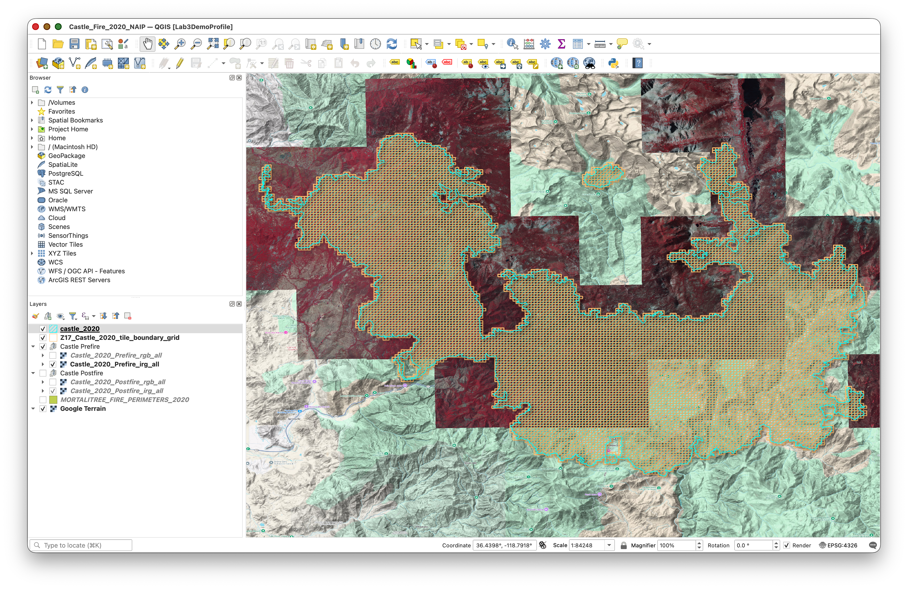
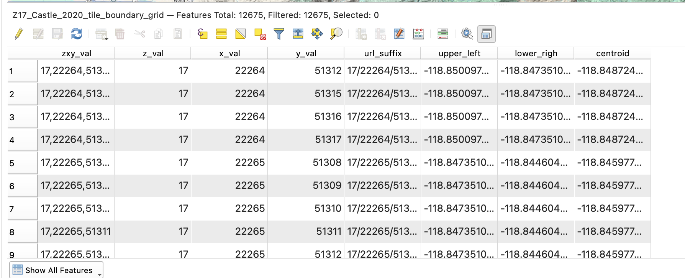
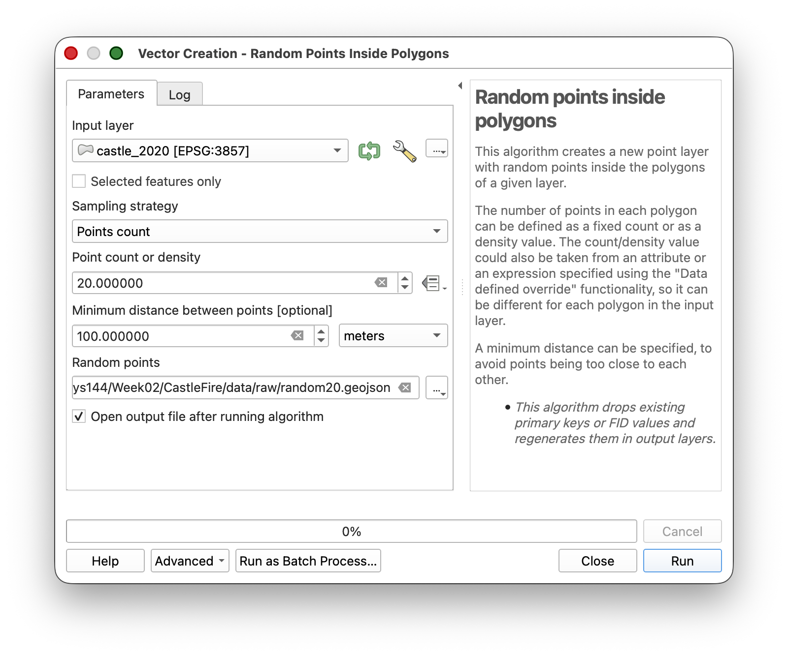
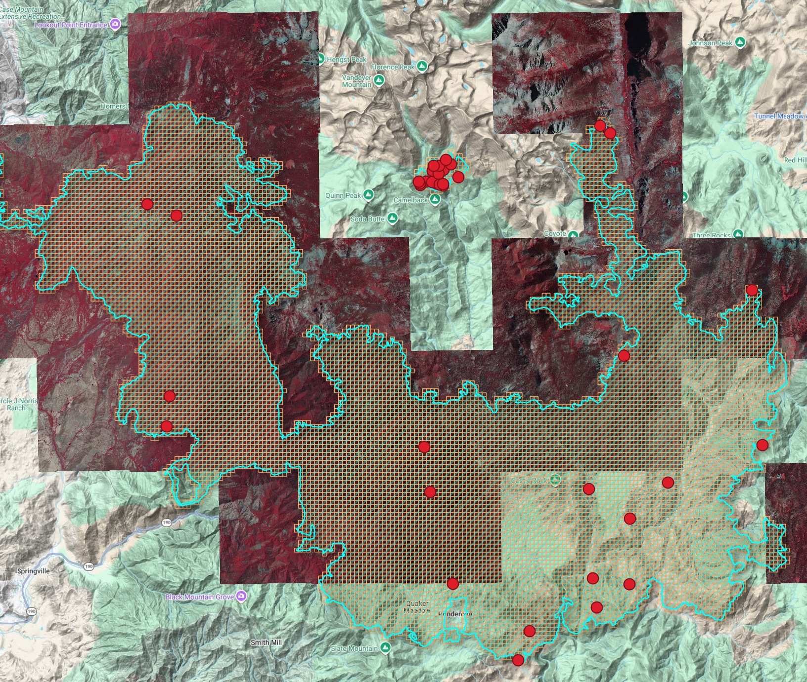
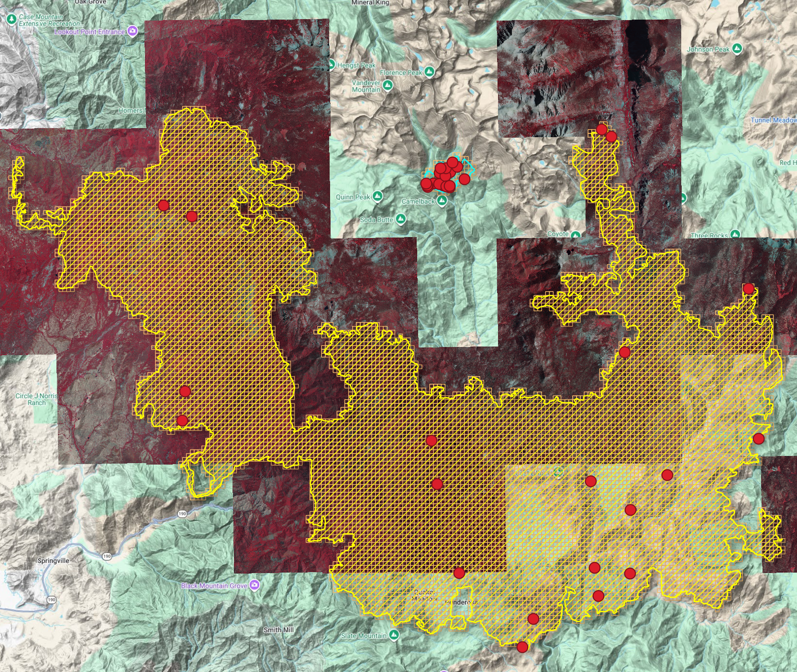
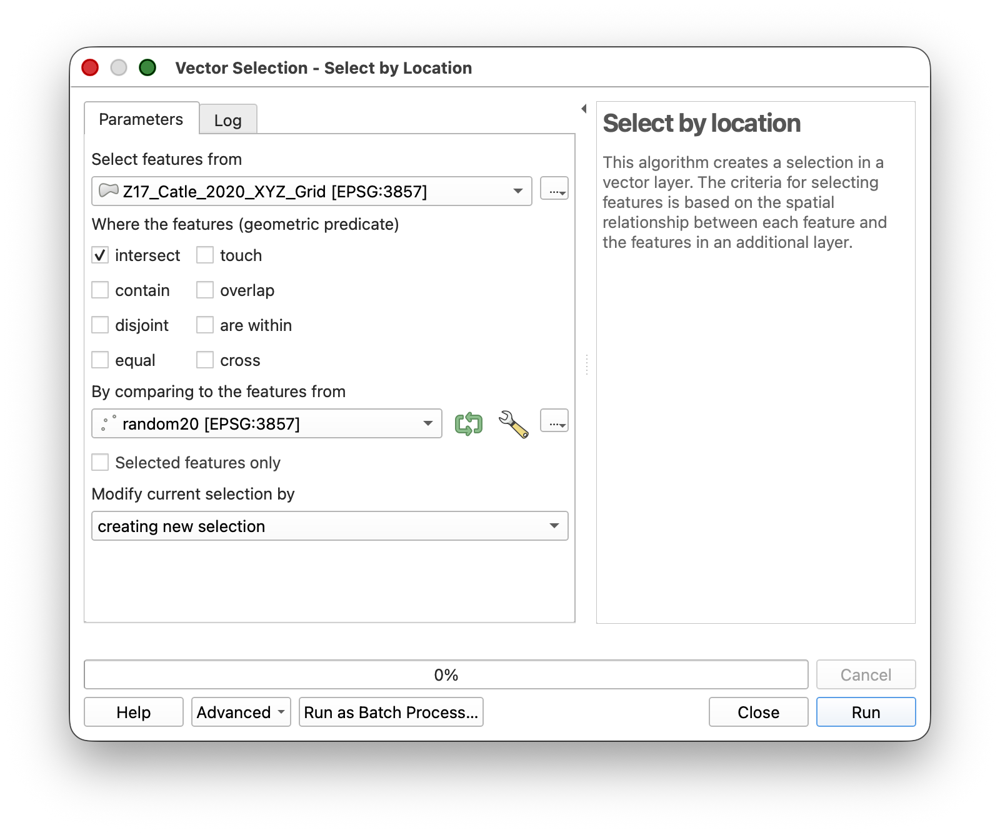
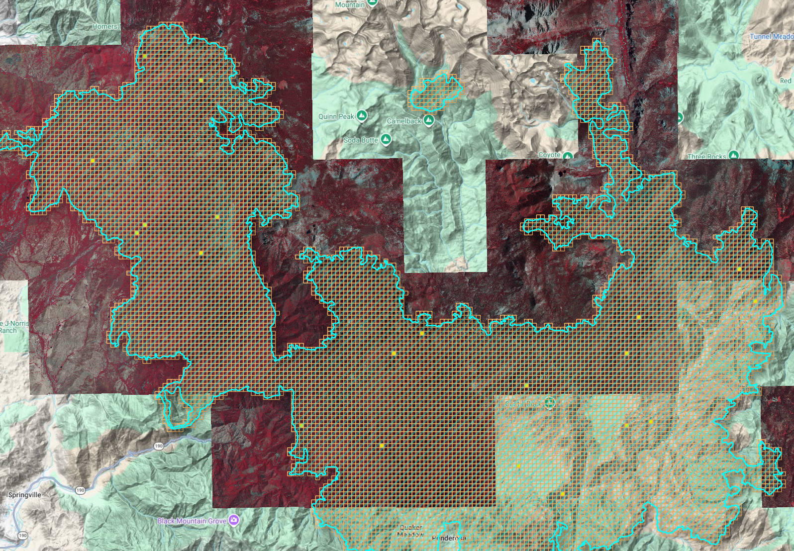
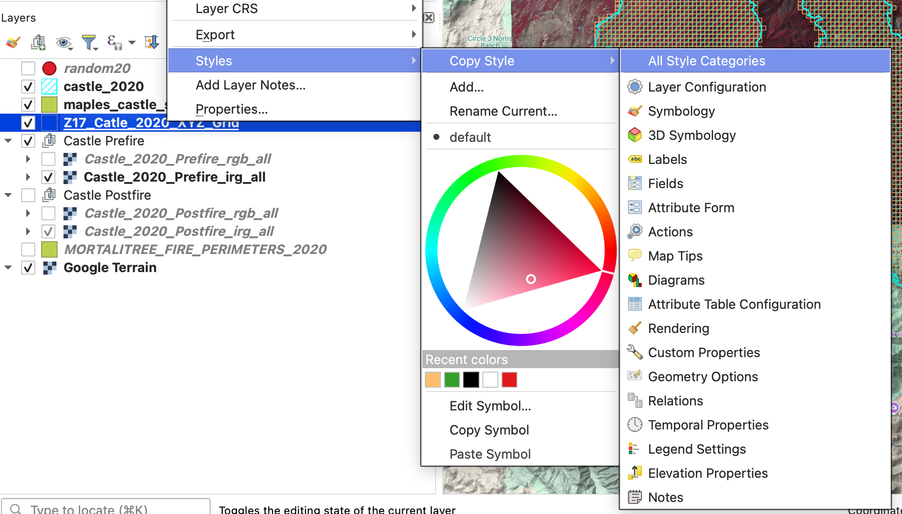
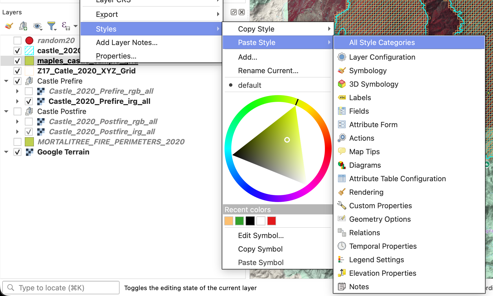
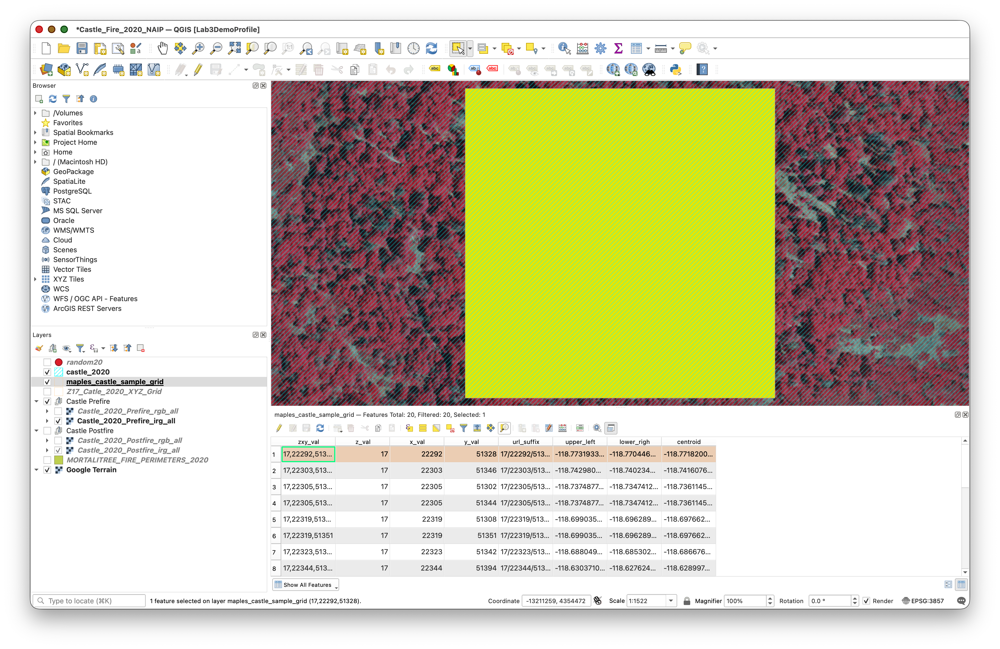

# Introduction to QGIS: Labelling Tree Data with QGIS (DRAFT)

> **Note:** To make sure you are viewing the most recent version of this lab guide, hold **Shift** and click the browser refresh button.

## Introduction

Now that you have QGIS installed and configured, it's time to put it to work! This lab introduces you to the QGIS interface through a hands-on tree crown annotation project. You'll learn essential QGIS skills while creating valuable training data by digitizing individual tree crowns from high-resolution aerial imagery.

**What you'll be doing:**
You'll work with a QGIS project that contains high-resolution NAIP (National Agriculture Imagery Program) imagery from before and after the Castle Fire. Your task is to generate random sample locations, use them to select a subset of grid cells, and label trees in both postfire and prefire imagery so the results can support machine learning validation work.

**Why this matters:**
The data you create will be used to train machine learning models for automated tree detection and counting. Accurate tree crown delineation is fundamental to forest inventory, wildfire risk assessment, and ecosystem monitoring. This workflow teaches you core GIS skills while contributing to real research applications.

## Learning Objectives

By the end of this lab, you will be able to:

- Navigate the QGIS interface and use essential navigation tools
- Work with layers, including reordering, toggling visibility, and exploring metadata
- Query attribute tables and select features based on attributes and location
- Use geoprocessing tools to create random points within a study area
- Create and edit shapefile layers for new spatial labels
- Use a docked attribute table to move systematically through sampled grid cells
- Digitize rectangular tree labels from aerial imagery
- Export spatial data in GeoJSON format with proper naming conventions



---

## Getting Started

### Download and Extract the Project Package

Download the `CastleFire.zip` file using this direct download link:

[Download CastleFire.zip](https://github.com/mapninja/Earthsys144/raw/refs/heads/master/data/CastleFire.zip)

This package contains everything you need to get started, with **best-practice folder structure and naming conventions already set up for you**.

**What's included in the .zip file:**

- Pre-configured QGIS project file: `Castle_Fire_2020_NAIP.qgz`
- Raw data layers and imagery references, including:
  - `castle_2020`(Fi re Perimeter)
  - `Z17_Castle_2020_tile_boundary_grid` (XYZ Tile Grid)
  - `Castle Prefire`
    - `Castle_2020_Prefire_rgb_all`
    - `Castle_2020_Prefire_irg_all`
  - `Castle Postfire`
    - `Castle_2020_Postfire_rgb_all`
    - `Castle_2020_Postfire_irg_all`
  - `MORTALITREE_FIRE_PERIMETERS_2020`
  - `Google Terrain basemap`
- Pre-built folder structure following GIS best practices
- Empty directories ready for your work
- Map layout template

**Extract the .zip file:**

1. Download `CastleFire.zip`
2. Extract it to your Documents folder (or another location you can easily access)

### What's in the Raw Data Folder

Inside `data/raw/` you'll find:

- **Tile boundary grid:** `Z17_Castle_2020_tile_boundary_grid`
- **Study area outline:** `castle_2020`
- **Pre-fire imagery group:** `Castle Prefire`
- **Post-fire imagery group:** `Castle Postfire`
- **Fire perimeter layer:** `MORTALITREE_FIRE_PERIMETERS_2020`
- **Terrain basemap:** `Google Terrain`

**Important:** Never modify or delete files in the `raw/` folder. These are your originals. All your work will be saved to the `processed/` and `outputs/` folders.

---

## Part 1: Open and Explore the Project

### Step 1: Open the Project File

Now that you've extracted the project package, let's open the pre-configured QGIS project:

1. Launch QGIS
2. Go to **Project > Open** (or press `Ctrl+O` / `Cmd+O`)
3. Navigate to your extracted `CastleFire` folder
4. Select the QGIS project file `Castle_Fire_2020_NAIP.qgz`
   - Example path: `~/Documents/CastleFire/Castle_Fire_2020_NAIP.qgz`
5. Click **Open**

The project should load with the tile boundary grid, the study area outline, pre-fire and post-fire imagery groups, the 2020 fire perimeter layer, and the Google Terrain basemap visible in the Layers Panel. Everything is pre-configured and ready to use!

**Try this:**

- Use your mouse wheel to zoom in and out
- Use **Zoom to Layer** on the grid layer to see all tile boundaries again
- Hold spacebar and drag to pan around the imagery
- Notice how the NAIP imagery refreshes as you navigate and change scales.

### Step 2: Explore the Layers Panel

The Layers Panel (usually on the left side) shows all layers in your project. Let's explore how it works:

**Layer Management:**

1. **To Reorder Layers:** Click and drag layers up or down

   - Layers higher in the list appear on top in the map
   - Try moving the grid layer above and below the imagery layer
   - See how this affects visibility
2. **To Toggle Layer Visibility:** Click the checkbox next to each layer name

   - Turn the grid layer off and on
   - Notice how you can see the imagery without the grid overlay
3. **Layer Properties:** Right-click any layer and select **Properties**

   - Explore the different tabs (Source, Symbology, etc.)
   - Don't make changes yet—just observe what's available

### Step 3: Explore Layer Metadata

Metadata tells you important information about your spatial data:

1. Right-click the **grid layer** and select **Properties**
2. Navigate to the **Information** tab
3. Review the metadata including:

   - **CRS (Coordinate Reference System):** Should be WGS84 (EPSG:4326)
   - **Extent:** The bounding box coordinates
   - **Feature count:** How many grid cells exist
   - **Geometry type:** Should be "Polygon"
4. Repeat for the NAIP imagery layer

   - Note the source URL for the XYZ tiles
   - Check the CRS (should be EPSG:26911 NAD83/UTM zone 11N)

**Why this matters:** Understanding your data's coordinate system, extent, and properties is essential before any spatial analysis. Mismatched coordinate systems are one of the most common GIS errors.

---

## Part 2: Working with Attributes and Selections

### Step 4: Open and Explore the Attribute Table

Every vector layer has an attribute table containing information about each feature:

1. Right-click the `Z17_Castle_2020_tile_boundary_grid` in the Layers Panel
2. Select **Open Attribute Table**
3. Examine the table structure:
   - Each row represents one grid cell
   - Columns contain attributes like tile coordinates (X, Y, Z)



**Understanding the Grid:**

- **Z:** Zoom level (should be 18)
- **X:** Tile column number
- **Y:** Tile row number
- These Z/X/Y values follow the Web Mercator tiling scheme used by web maps

## Part 3: Geoprocessing and Random Selection

### Step 5: Create 20 Random Points Inside the Castle Fire Boundary

Now you will create a set of random sample locations that will guide your labeling work.

1. Go to **Processing > Toolbox**.
2. In the Processing Toolbox search bar, type `random points inside polygons`.
3. Open **Random points inside polygons (fixed)**.
4. Configure the tool:
   - **Input layer:** `castle_2020`
   - **Sampling strategy:** `Points count`
   - **Point count:** `20`
   - **Minimum distance between points:** `100`
   - **Random points:** Save as `random20.geojson` in your `data/` folder
5. Click **Run**.



You should now see 20 random points inside the `castle_2020` boundary.



Notice that there may be a cluster of points in an area where there is no imagery. If this is the case, do the following:

1. Use the **Select Features** tool in the main QGIS toolbar.
2. With the `castle_2020` layer selected in the Layers Panel, click the large `castle_2020` polygon that covers the area where imagery is actually available.
3. Confirm that the correct polygon is selected.

   
4. Open **Random points inside polygons (fixed)** again.
5. Use the same settings as before, but this time enable the **Selected features only** option.
6. Run the tool again and save the output.
7. Check the new random points layer and confirm that the points now fall within the part of the fire area where imagery is available for labeling.
8. If the layer display does not update right away, click the **Refresh** button.


> **Why do this?** Random points help spread the work across the study area, and the 100 meter spacing reduces clustering.

### Step 6: Use the Random Points to Select a Sample of Grid Cells

Next, use the random points to select a subset of the grid cells.

1. Select the `Z17_Castle_2020_tile_boundary_grid` layer in the Layers Panel.
2. Go to **Vector > Research Tools > Select by Location**.
3. Configure the tool:
   - **Select features from:** `Z17_Castle_2020_tile_boundary_grid`
   - **Where the features:** `intersect`
   - **By comparing to features from:** your `random20` points layer
4. Click **Run**.



You should now have a set of selected grid cells. You may need to turn off the `random20` layer to see the selected polygons more clearly.



### Step 7: Export the Selected Grid Cells to a New Layer

Now export those selected grid cells to a new working layer.

1. Right-click `Z17_Castle_2020_tile_boundary_grid`.
2. Choose **Export > Save Selected Features As...**
3. Make sure the **Save only selected features** option is enabled.
4. Save the layer to `CastleFire/data/processed/` as:

   ```
   sunetid_castle_sample_grid.shp
   ```
5. Leave the default CRS unless QGIS prompts you to choose otherwise.
6. Click **OK**.

   

**Tip & Trick:** Copy the style from the original grid layer and paste it to the new one, then turn off the old grid layer.

1. Right-click the original grid layer and choose **Styles > Copy Style**.

   
2. Right-click `sunetid_castle_sample_grid` and choose **Styles > Paste Style**.

   
3. Turn off the original grid layer.

### Step 8: Dock the Attribute Table Below the Map and Use It to Navigate

You will use the exported sample grid as your working unit layer.

1. Open the attribute table for `sunetid_castle_sample_grid`.
2. If it opens in a separate window, dock it below the map panel by dragging it by the title bar until it snaps into the interface.

   
3. Use the attribute table tools to:
   - select a feature
   - zoom to the selected feature
   - move to the next feature




This lets you work through the sampled grid cells systematically instead of hunting around visually.

---

## Part 4: Create and Edit the Label Layers

### Step 9: Create the Postfire Label Layer

Create a new empty shapefile for your first set of labels.

1. Go to **Layer > Create Layer > New Shapefile Layer**.
2. Configure the layer:
   - **File name:** `sunetid_castle_postfire_labels.shp`
   - **Geometry type:** Polygon
   - **CRS:** `WGS 84 (EPSG:4326)`
3. Click **OK**.


### Step 10: Get Ready to Edit

Before you start drawing labels, adjust the digitizing settings so QGIS uses the rectangle tool you need for this exercise.

1. Go to **QGIS > Settings** on Mac, or **Settings** on Windows.
2. Open **Options**.
3. In the Options dialog, go to **Map Tools > Digitizing**.
4. Enable **Suppress attribute form pop-up after feature creation**.
5. Click **Advanced** at the bottom of the Options panel.
6. Click **I will be careful**.
7. Expand `digitizing > shape-map-tools > current`.
8. Copy this text:

   ```
   rectangle-from-center-and-a-point
   ```

9. Paste that text into the **Value** box for the `current` setting.


10. Click **OK** to save the setting.

> **Why do this?** This tells QGIS to use a rectangle-based polygon drawing workflow, which makes your tree labels faster and more consistent.

### Step 11: Start Editing the Postfire Label Layer

1. Make sure the **Castle Postfire** imagery group is visible.
2. Toggle between the RGB and IRG versions of the postfire imagery to decide which one is easier to interpret. You can switch between them while labeling if that helps.
3. Select `sunetid_castle_postfire_labels` in the Layers Panel.
4. Open the layer's styling and set:
   - **Fill:** Transparent
   - **Stroke:** a color that contrasts clearly with the imagery you are using
5. Click **Toggle Editing**.

### Step 12: Label Trees in the Postfire Imagery

Now begin the main labeling task.

1. In the docked attribute table for `sunetid_castle_sample_grid`, select a grid cell and zoom to it.
2. Inspect that cell in the **postfire** imagery.
3. Only choose grid cells that meet all of the following conditions:
   - It should have trees in it.
   - It should have no buildings, because we are interested in the behavior of raw forests.
   - It should have no roads.
   - It should have NAIP imagery available. Some images are currently missing, but they may appear later.
4. If the cell meets those conditions, label the trees by drawing rectangles around them using **Add Polygon Feature**.
5. Save your edits periodically.
6. When you finish one grid cell, select another sampled grid cell and repeat.
7. Continue until you have labeled trees in **3 grid cells**.

**Labeling guidance:**

- Keep the rectangles simple and consistent.
- Work one tree at a time.
- If a sampled cell has no trees, move on to another sampled cell.
- Save often.

> **Important concept:** In this exercise, your rectangles are labels for tree locations, not precise canopy outlines.

### Step 13: Save Your Work Frequently

While digitizing:

1. Click **Save Layer Edits** regularly.
2. Do not wait until the end of the session to save.

### Step 14: Create the Prefire Label Layer by Copying the Postfire Layer

Once you have finished labeling 3 grid cells in the postfire imagery:

1. Right-click `sunetid_castle_postfire_labels`.
2. Choose **Save Features As...**
3. Save a copy as:

   ```
   sunetid_castle_prefire_labels.shp
   ```
4. Add the new layer to the project if QGIS does not do this automatically.

This copied layer gives you a starting point for the prefire labels, since trees visible after the fire were also present before the fire.

### Step 15: Finish the Prefire Tree Labels

Now switch to the prefire imagery and finish the second label layer.

1. Turn on the **prefire** imagery.
2. Start editing `sunetid_castle_prefire_labels`.
3. Return to the same 3 sampled grid cells you already worked on.
4. Keep the copied tree labels that already match visible trees.
5. Add rectangles for any additional trees visible in the prefire imagery.
6. Save edits regularly.
7. When finished, stop editing and save the layer.

### Step 16: Export Both Label Layers to GeoJSON

When both shapefiles are complete, export each one to GeoJSON.

1. Right-click `sunetid_castle_postfire_labels`.
2. Choose **Export > Save Features As...**
3. Set:

   - **Format:** `GeoJSON`
   - **File name:** `sunetid_castle_postfire_labels.geojson`
   - **CRS:** `EPSG:4326`
4. Save it in `CastleFire/data/outputs/`.
5. Repeat the same process for `sunetid_castle_prefire_labels`, exporting it as:

   ```
   sunetid_castle_prefire_labels.geojson
   ```

---

## Part 5: Final Submission

### What to Submit

When you are done:

1. Confirm that both files exist in `CastleFire/data/outputs/`:
   - `sunetid_castle_postfire_labels.geojson`
   - `sunetid_castle_prefire_labels.geojson`
2. Compress those two GeoJSON files into a single `.zip` file.
3. Upload that `.zip` file to the assignment on Canvas.

### Final Checklist

- [ ] You created 20 random points inside `castle_2020`
- [ ] The points were at least 100 meters apart
- [ ] You used those points to select a subset of grid cells
- [ ] You exported the selected grid cells to `sunetid_castle_sample_grid.shp`
- [ ] You used the docked attribute table to move through the grid cells
- [ ] You created `sunetid_castle_postfire_labels.shp` in `EPSG:4326`
- [ ] You labeled trees in 3 sampled grid cells in the postfire imagery
- [ ] You copied that work to `sunetid_castle_prefire_labels.shp`
- [ ] You finished the prefire labels using the prefire imagery
- [ ] You exported both final layers to GeoJSON
- [ ] You zipped the two GeoJSON files and uploaded them to Canvas

### Validation Notes

Your labels will be reviewed as part of a machine learning validation workflow. The goal is consistency and completeness within the 3 grid cells you worked on.

---

## Conclusion

Through this lab, you used QGIS 3.44.7 to:

- generate random sample locations
- select a working subset of grid cells
- navigate spatial work systematically with the attribute table
- create and edit shapefile-based label layers
- label trees in both postfire and prefire imagery
- export final training labels to GeoJSON for submission

These are foundational GIS data creation skills and an important introduction to how image interpretation becomes structured training data.

### Next Steps

- Keep your QGIS project file and working layers
- Review any feedback on label consistency when the assignment is graded
- Practice this workflow, since we will keep building on spatial data creation skills

### Troubleshooting Common Issues

**Selection tools not working:**

- Make sure you selected the correct input and comparison layers
- Confirm that the random points actually fall inside the fire boundary

**Can't edit/digitize:**

- Make sure **Toggle Editing** is on
- Confirm you are editing the label layer, not the sample grid layer

**Need to delete a rectangle:**

- Select the feature
- Press `Delete`
- Save your edits

**Unsure which imagery to use:**

- Use the **postfire** imagery for `sunetid_castle_postfire_labels`
- Use the **prefire** imagery for `sunetid_castle_prefire_labels`

---

## Additional Resources

- QGIS Documentation: [docs.qgis.org](https://docs.qgis.org)
- NAIP Imagery Information: [USDA NAIP Program](https://www.fsa.usda.gov/programs-and-services/aerial-photography/imagery-programs/naip-imagery/)
- GeoJSON Specification: [geojson.org](https://geojson.org)
- Web Mercator Tile Scheme: [Slippy Map Tilenames](https://wiki.openstreetmap.org/wiki/Slippy_map_tilenames)

If you encounter issues not covered in the troubleshooting section, consult the course forum or office hours!
