# Basic Table Structures & Operations in QGIS (Ready to Review)

## Overview

This lab begins with one of the most useful ideas in GIS: spatial data does not have to store every piece of information directly inside the feature layer itself.

Very often, you already have a layer of mapped features such as parcels, census units, soil polygons, school locations, or sampling sites. The geometry is already there. What you need to add is more information about those features, and that information often lives in a separate table.

Being able to join tabular data to preexisting spatial features is powerful because it lets you:

- Keep spatial data and descriptive data organized separately when that makes sense
- Avoid storing the same descriptive information over and over again
- Enrich an existing layer without redrawing or recreating the geometry
- Reuse the same boundary or feature dataset with many different kinds of attribute information
- Build new maps and analyses from data that may not have started as "GIS data" at all

In other words, a lot of GIS work involves connecting geometry to attributes that come from somewhere else.

## Conceptual Focus

This section is not just about clicking through a join in QGIS. It is about understanding how tabular structure shapes what you can do with spatial data.

The central ideas are:

- A GIS layer is both a map and a table
- A separate non-spatial table can still become geographically useful if it can be connected to mapped features
- Shared fields, often called key fields, make those connections possible
- Different table relationships imply different kinds of joins and different analytic possibilities
- Careful field design and matching data types are part of spatial analysis, not just clerical cleanup

## Learning Objectives

By the end of this section, you should be able to:

- Explain why joining a table to an existing spatial layer is often more efficient than manually adding attributes feature by feature
- Explain what a key field is and why it matters in GIS
- Distinguish between primary keys and foreign keys
- Describe common table relationships, including one-to-one, one-to-many, many-to-one, and many-to-many
- Explain why many GIS joins are many-to-one from the perspective of the feature layer
- Recognize why field type, formatting, and consistency matter before attempting a join
- Use QGIS to inspect a layer's fields and think critically about whether a join is likely to work

## Why Joins Matter in GIS

Imagine that you already have a polygon layer of soils for a county. Each polygon represents a mapped soil area, but the layer may only store a short code such as `SOIL_TYPE`. That code is useful, but by itself it is not very informative.

Now imagine you also have a separate table listing what each soil code means, along with properties such as:

- soil name
- drainage characteristics
- crop suitability
- engineering behavior
- moisture or erosion characteristics

If you can connect that table to the polygon layer, then every soil polygon can be symbolized, queried, and analyzed using those richer descriptive attributes.

That is the practical value of a join: it lets you attach useful descriptive information to mapped features without remaking the map layer itself.

This is extremely common in GIS. The spatial layer is often the stable geographic framework, while the joined table holds the thematic information you care about for a particular question.

## Key Fields: The Bridge Between Tables

A join works because both datasets contain a field with values that can be matched.

That shared field is often called a **key field**.

In this lab's soil example, the shared value is `SOIL_TYPE`.

### Primary keys

A **primary key** is a field whose values uniquely identify records in a table.

For example, in a soil properties table, each soil type code may appear only once. If so, `SOIL_TYPE` can function as a primary key for that table because each row represents one unique soil category.

### Foreign keys

A **foreign key** is a field in another table that stores values referring back to that primary key.

In the soils polygon layer, many polygons may share the same `SOIL_TYPE` code. That means `SOIL_TYPE` in the polygon layer behaves like a foreign key: it points to the matching soil type record in the soil properties table.

> **Concept note:** A foreign key does not have to be called anything special. What matters is its role. If a field in one table refers to the unique identifier in another table, it is functioning as a foreign key.

## Common Relationship Types

When two tables are connected by keys, the pattern of that relationship matters.

### One-to-one

Each record in Table A matches exactly one record in Table B, and vice versa.

This is less common in introductory GIS because if the records always line up perfectly, the information could often be stored in a single table. Still, one-to-one relationships can be useful when data is being managed in separate systems.

### One-to-many

One record in Table A can match many records in Table B.

For example, one soil type in a lookup table may correspond to many soil polygons on the map.

### Many-to-one

Many records in Table A match one record in Table B.

This is the same relationship viewed from the opposite side. From the perspective of the spatial layer in this lab, many polygons match one soil-properties record. That means this join is usefully described as **many-to-one** from the feature layer to the lookup table.

This is one of the most common join patterns in GIS:

- many parcels to one zoning code description
- many census polygons to one county name table
- many observation points to one species table
- many soil polygons to one soil properties row

### Many-to-many

Many records in Table A match many records in Table B.

These relationships are more complex and usually require an intermediate table, sometimes called a **bridge table** or **junction table**.

For example, if one environmental site could be associated with many chemicals, and one chemical could occur at many sites, the relationship is many-to-many. In practice, that relationship is often stored through a third table listing each site-chemical pairing.

> **Concept note:** Many-to-many relationships are common in real data, but direct joins in beginner GIS workflows are often easiest when you are working with lookup-style tables that behave as one-to-many or many-to-one.

## What Kind of Join Is This Lab Using?

In the soil example adapted from the older course materials:

- the **soil properties table** has one row per soil type
- the **soils polygon layer** has many polygons for each soil type

So the relationship is:

- **one-to-many** from the soil properties table to the polygons
- **many-to-one** from the polygons to the soil properties table

Both descriptions are correct. They simply describe the same relationship from different directions.

In practice, when students perform this join in QGIS, they often experience it as:

1. start with the spatial layer
2. join in a lookup table
3. gain extra fields for mapping and analysis

Because of that workflow, it is often especially helpful to say: **many spatial features are joining to one descriptive table record.**

## Why This Is So Useful

This kind of join is worth learning well because it appears everywhere in GIS.

You will often begin with a preexisting spatial dataset and then attach:

- demographic summaries
- land use classes
- field observations
- administrative labels
- environmental measurements
- lookup descriptions for coded values

That means joins are not a side topic. They are one of the main ways GIS becomes flexible and reusable.

Instead of remaking geometry every time your question changes, you can keep the geometry and change the attributes you connect to it.

## Preparing for a Join in QGIS

Before you actually perform a join, it is good practice to inspect the fields carefully.

In particular, ask:

- Do both tables contain the field needed for the join?
- Do those fields represent the same thing conceptually?
- Are the values formatted consistently?
- Are the field types compatible, such as integer to integer rather than integer to text?
- Is one table acting like a lookup table with unique key values?

QGIS can sometimes be forgiving, but that does not mean mismatched fields are harmless. Good join habits reduce subtle errors and make your work easier to explain, debug, and share.

## In This Section

In the next part of the lab, you will work through a concrete example in QGIS by:

1. loading a soils layer and a separate soil properties table
2. examining the proposed key fields
3. checking whether the key fields match in type and meaning
4. joining the tabular data to the spatial layer
5. confirming that the joined attributes behave as expected

By the end, the important idea should be clear: a table does not need geometry to become useful in GIS, as long as it can be connected to features that do.

## Hands-On: Joining a Soil Properties Table to a Soil Polygon Layer

This exercise gives you a concrete example of the ideas above. You will start with a spatial layer of soil polygons and then join in a separate CSV table containing descriptions and properties for each soil type.

By the end of the workflow, you will have enriched a preexisting spatial dataset with new tabular attributes that can be used for mapping, analysis, and layout design.

## Data for This Exercise

You will need:

- the `soils.shp` layer from the previous lab materials
- the `Soil Properties.csv` table linked in this lab

> **Concept note:** This is a classic lookup-table workflow. The polygons already exist. The new table supplies additional meaning for the coded values already stored in the layer.

## Part 1: Open the Soils Layer and Inspect Its Key Field

1. Open a new blank QGIS project.
2. Save it in the same folder as the soils data if possible.
3. Add the `soils.shp` layer.
4. Right-click the `soils` layer and choose **Layer CRS > Set Project CRS from Layer**.

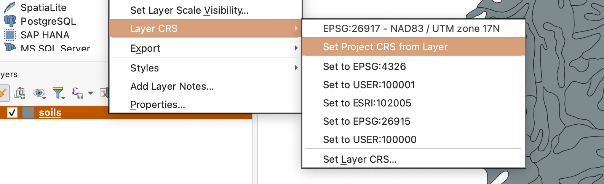

5. Open the **Layer Properties** for `soils`.
6. Go to the **Fields** tab and locate `SOIL_TYPE`.

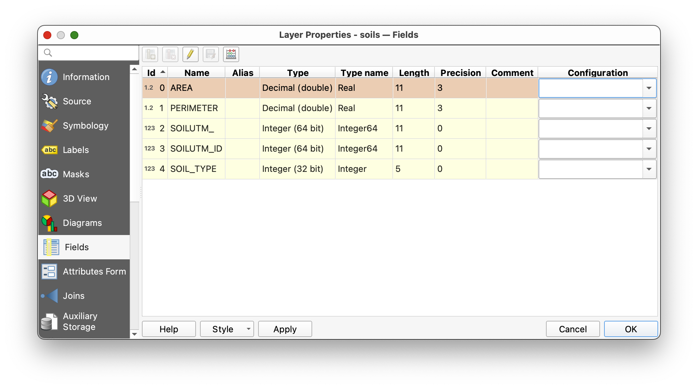

This `SOIL_TYPE` field is the key field already present in the spatial data. It stores a short code for each polygon.

> **Concept note:** At this stage, the polygons know their soil type code, but they do not yet contain the descriptive information that code refers to. That descriptive information will come from a separate table.

## Part 2: Symbolize the Existing Layer

1. Open the **Symbology** tab for the `soils` layer.
2. Set the renderer to **Categorized**.
3. Use `SOIL_TYPE` as the value field.
4. Click **Classify**.

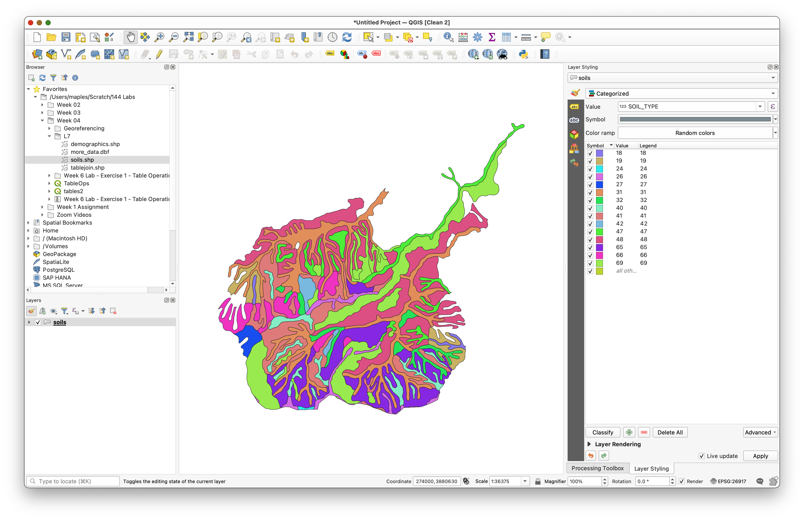

You should now see multiple soil classes on the map.

> **Why do this now?** It helps you see that many polygons share the same `SOIL_TYPE` value. That is your visual clue that the spatial layer contains repeated foreign-key values rather than one unique record per soil type.

## Part 3: Download and Add the Soil Properties Table

Download the CSV table here:

- [Soil Properties Google Sheet](https://docs.google.com/spreadsheets/d/1iD5DjOD3nREz_jGUGGMMLikyvq23z9LrmB6zJWiJBjM/edit?usp=sharing)

1. Open the Google Sheet.
2. Use **File > Download > Comma-separated values (.csv)**.

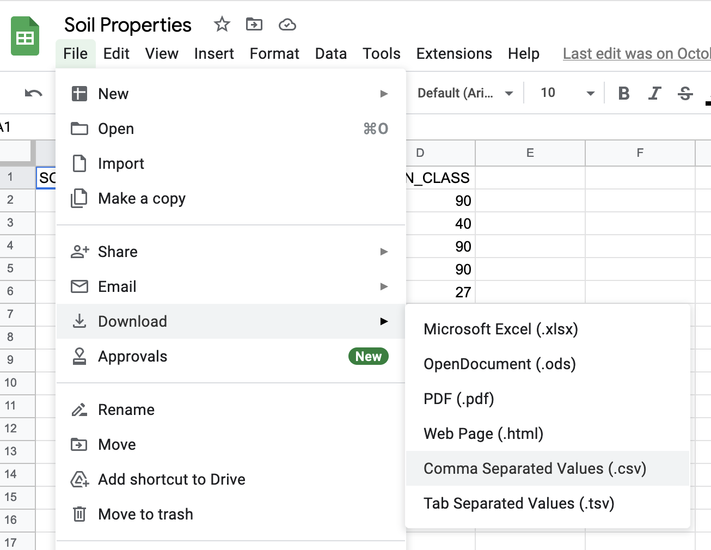

3. Save the downloaded CSV in the same folder as your soils data.
4. In QGIS, use the **Browser** panel to find that CSV.
5. Right-click it and choose **Add Layer to Project**.
6. Open the table and inspect its fields and rows.

> **Concept note:** This table has no geometry, but it still matters spatially because it is designed to connect to mapped features through a shared code.

## Part 4: Check Whether the Join Fields Match

Now compare the join field in both datasets.

1. Open the `Soil Properties.csv` table.
2. Notice that the values are left-justified.

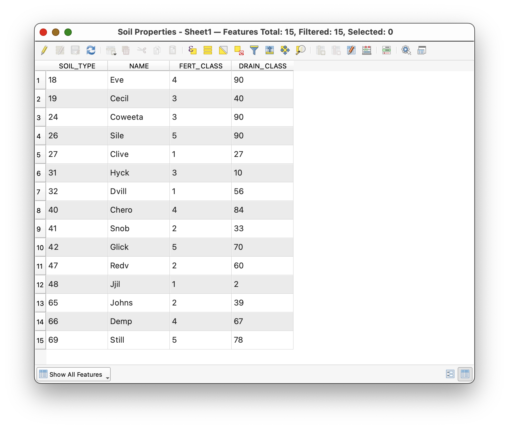

That is a clue that QGIS is reading them as text.

3. Open the **Properties** of the CSV table.
4. Go to the **Fields** tab.

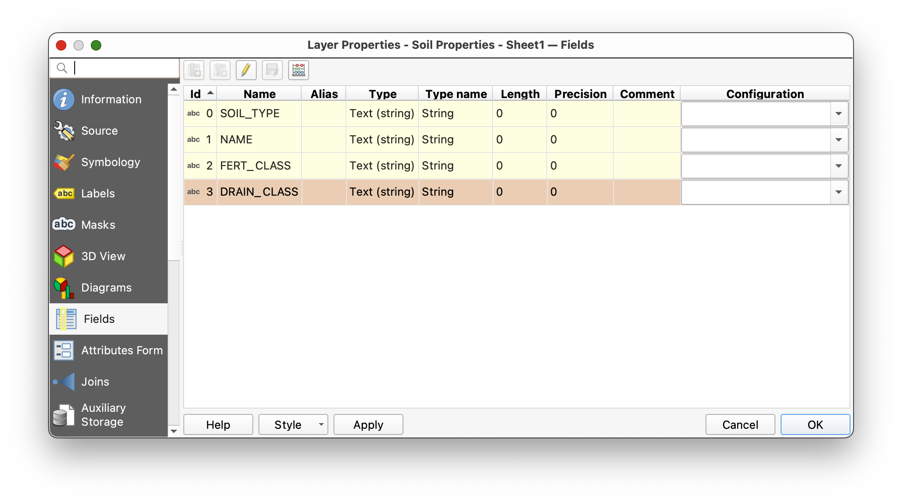

5. Compare the type of the CSV's `SOIL_TYPE` field to the type of `SOIL_TYPE` in the `soils` layer.

> **Why this matters:** A join is not only about matching names. The fields should also match in type and formatting. Integer-to-integer is much safer than integer-to-text.

## Part 5: Create a Matching Integer Key Field

Because CSV files often import fields as text, you will create a new integer version of the key field.

1. Open the CSV table's attribute table.
2. Toggle editing on if needed.
3. Open the **Field Calculator**.
4. Choose **Create a new field**.
5. Name the field `SOIL_TYPE_INT`.
6. Search for the `to_int` function.
7. Build this expression:

```qgis
to_int( SOIL_TYPE )
```

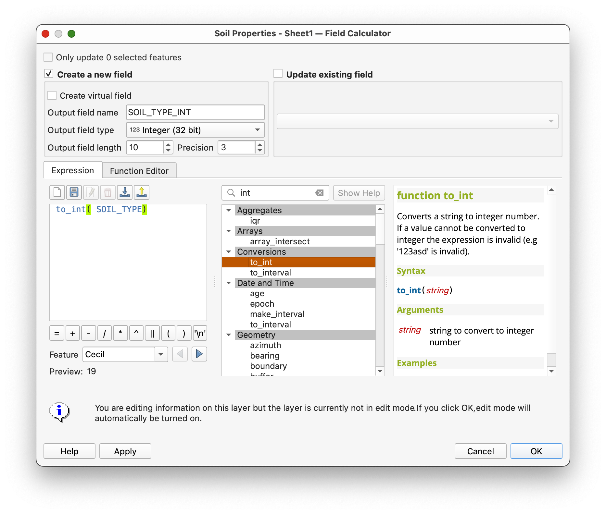

8. Confirm that the preview looks correct.
9. Click **OK** to create the new field.
10. Save your edits and toggle editing off.

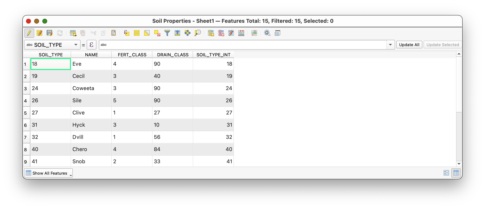

11. Reopen the table properties and confirm that `SOIL_TYPE_INT` is now a numeric field.

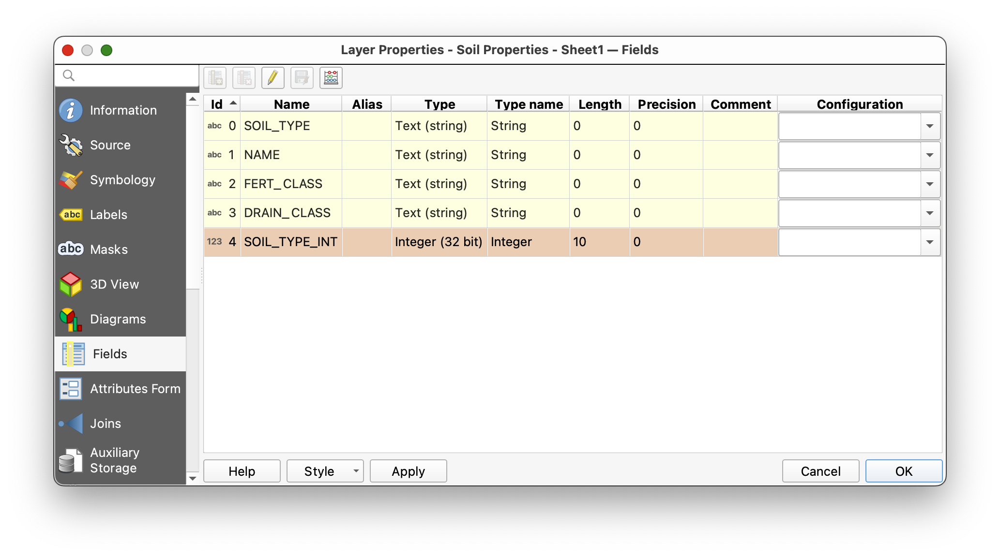

> **Concept note:** This kind of cleanup is sometimes called data carpentry. It may feel small, but it is part of good GIS practice. Clean keys make joins more reliable, and reliable joins make your analysis easier to trust.

## Part 6: Join the Table to the Spatial Layer

Now you are ready to connect the lookup table to the polygon layer.

1. Open the **Properties** for the `soils` layer.
2. Go to the **Joins** tab.
3. Add a new join.
4. Join the CSV table to `soils`.
5. Use the matching soil-type fields as the join fields.
   If needed, use `SOIL_TYPE` from the soils layer and `SOIL_TYPE_INT` from the CSV table.

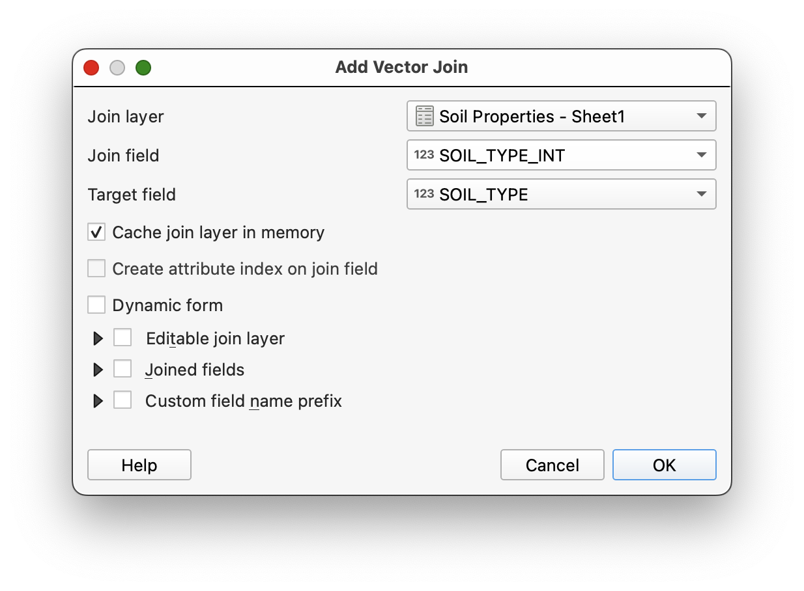

6. Apply the join and close the dialog.
7. Open the attribute table for the `soils` layer.
8. Scroll to confirm that the new soil-property fields have been added.

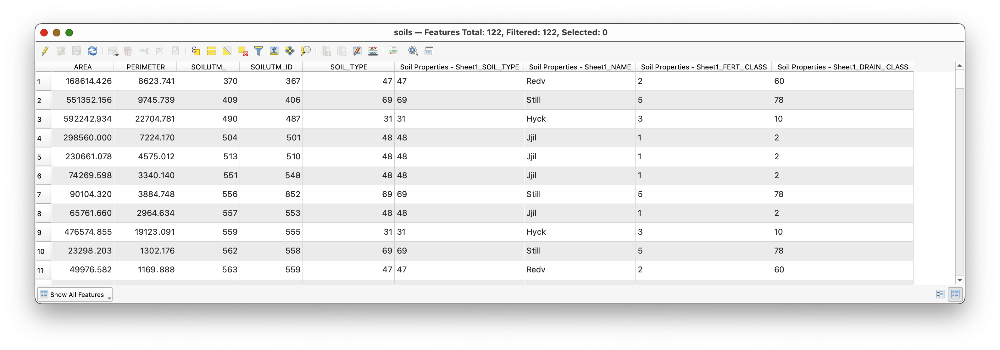

> **What kind of join is this?** Many polygons in the `soils` layer are matching to one row in the soil-properties table for each soil type. From the perspective of the feature layer, this is a **many-to-one join**.

> **What is happening conceptually?** QGIS is not redrawing your polygons. It is enriching them by connecting each polygon's foreign key to a lookup record whose primary key defines the soil type.

## Part 7: Make the Join Useful

Once the join is in place, you can use the added fields for mapping.

1. Open the symbology for the `soils` layer again.
2. Create a **Categorized** map using the joined `NAME` field from the soil-properties table instead of the numeric `SOIL_TYPE` code.

This is one of the main reasons to perform a join: coded data becomes more human-readable and more useful for communication.

## Part 8: Turn the Joined Data into a Map

After you have completed the join, create a map layout as a PDF.

Your map should:

- display the soils layer categorized by the joined `NAME` field
- include the joined soil properties table in the layout
- include standard map elements such as title, name, CRS, scale, and basemap where appropriate

To insert the tabular information:

1. Open a new QGIS layout.
2. Use the **Add Attribute Table** tool  to place the soil properties table in the layout.
3. Use the table's **Item Properties** to clean up field names and formatting.

For the legend:

1. Uncheck **Auto update** if needed.
2. Click individual legend items to edit or remove them.
3. Use the edit control  if you want to improve labels.

The final result should look something like this:

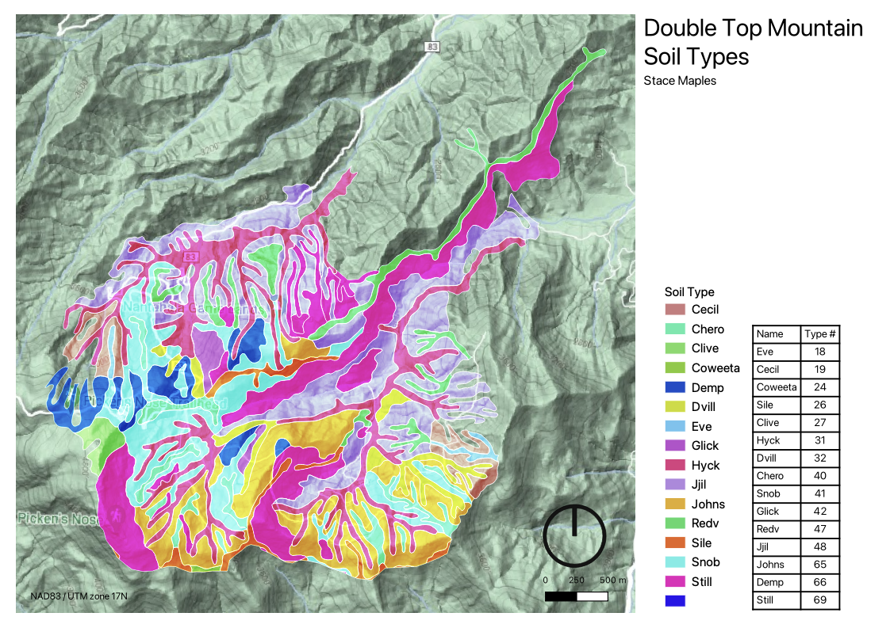

## Why This Workflow Matters

I want to stress the usefulness of what you have just done.

In GIS, you will often start with a preexisting boundary or feature layer and then join new tabular data to it. That joined data may represent:

- properties
- measurements
- classifications
- survey results
- administrative labels
- demographic summaries

Once joined, those attributes can be symbolized, filtered, summarized, and laid out on maps. This makes a single spatial dataset far more flexible than it would be on its own.

That is why table joins are such a foundational GIS skill: they are one of the main ways that the spatial dimensions of the things we are interested in become explicit, and analytically and communicatively useful.
