# Basic Table Joins and Calculations in QGIS

## Overview

This lab focuses on a two-layer join and calculation workflow.

You will compare California county median household income for `2000` and `2020`, join the two county layers through a shared identifier, calculate both absolute and percent change, and then symbolize the result as a choropleth map.

## Data

Download the lab data from:

- [https://github.com/mapninja/Earthsys144/raw/master/data/TableBasics.zip](https://github.com/mapninja/Earthsys144/raw/master/data/TableBasics.zip)

After downloading:

- Unzip `TableBasics.zip`
- Keep the shapefiles and their related files together in the same folder
- Add the layers from the unzipped folder into QGIS

This lab uses two county polygon layers:

- `ca_county_2000_mhhinc`
- `ca_county_2020_mhhinc`

Each layer contains California counties and one median household income field:

- `MHHINC2000` in the 2000 layer
- `MHHINC2020` in the 2020 layer

Both layers also contain shared identifier fields including:

- `spatial_id`
- `name`

## Part 1: Add the Layers and Inspect the Fields

1. Open QGIS and start a new project.
2. Use the **Browser** panel to locate the lab data folder.
3. Add both layers to the project:
   - `ca_county_2000_mhhinc.shp`
   - `ca_county_2020_mhhinc.shp`
4. Make sure both layers appear in the **Layers** panel.
5. Turn both layers on so you can confirm they cover the same set of California counties.

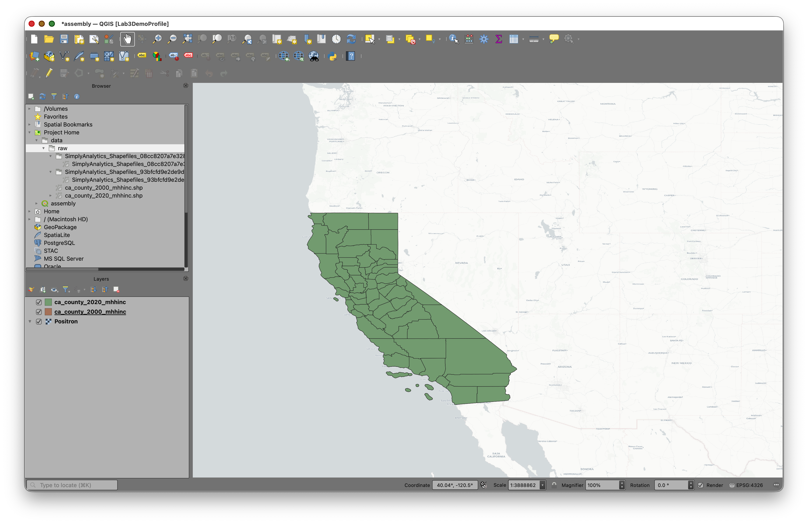

### Inspect the 2000 layer fields

1. Right-click `ca_county_2000_mhhinc`.
2. Choose **Properties**.
3. Click the **Fields** tab.

You should see fields including `spatial_id`, `name`, and `MHHINC2000`.


Notice that:

- `spatial_id` is stored as **Text (string)**
- `name` is stored as **Text (string)**
- `MHHINC2000` is stored as **Decimal (double)**

This tells you that the income field is numeric, which means it can be used in calculations.

### Inspect the 2020 layer fields

1. Close the first properties window.
2. Right-click `ca_county_2020_mhhinc`.
3. Choose **Properties**.
4. Click the **Fields** tab.

You should see a similar structure, but with `MHHINC2020` instead of `MHHINC2000`.

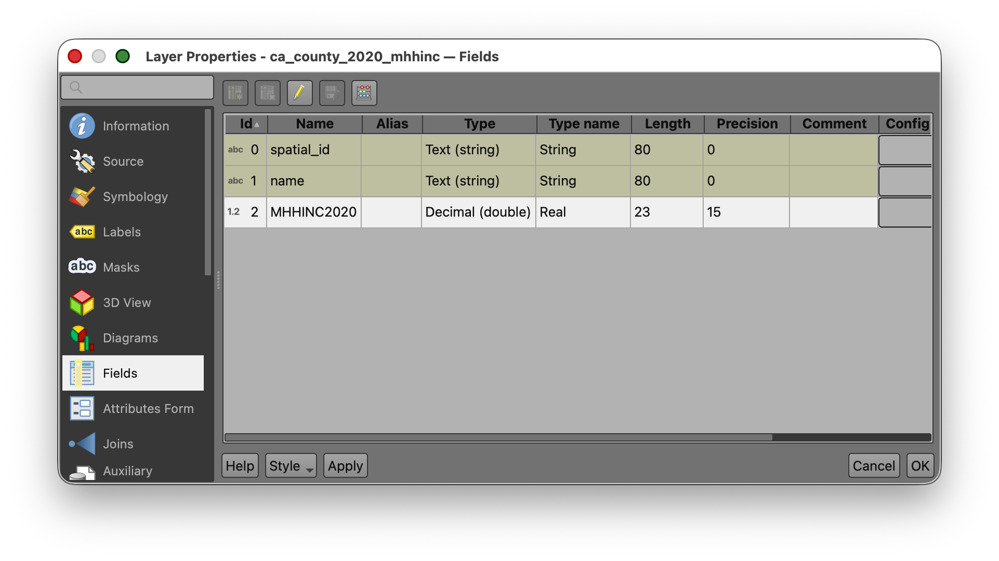

Pause here and compare the two tables:

- Both have `spatial_id`
- Both have `name`
- Each has one year-specific income field

That is exactly what makes a join possible.

## Part 2: Explore the Attribute Tables

1. Open the **Attribute Table** for `ca_county_2020_mhhinc`.
2. Scroll through the rows and columns.
3. Find the `MHHINC2020` field.
4. Note that the values vary substantially across counties.

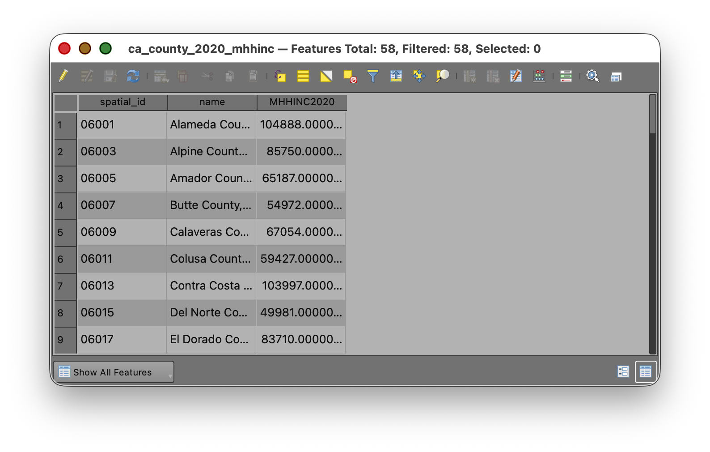

For this dataset:

- `MHHINC2020` ranges from `41780` to `130890`

Now repeat the same process for `ca_county_2000_mhhinc`.

For that dataset:

- `MHHINC2000` ranges from `27522` to `74335`

### Why this matters

Before doing a join or a calculation, it is worth simply looking at the tables.

This helps you answer questions like:

- What are the field names?
- Which fields are numeric?
- Do the likely join fields match?
- What is the rough range of the values?

These are small checks, but they prevent many common GIS mistakes.

## Part 3: Run Basic Statistics for Fields

Before making the join, use one of QGIS' summary tools to confirm the distribution of values in each year.

1. Open the **Processing Toolbox**.
2. Search for **Basic statistics for fields**.
3. Run the tool for `ca_county_2020_mhhinc` using the field `MHHINC2020` as the Field to calculate statistics on.
4. Review the output in the **Results Viewer**.
5. Use the `[Create temporary layer}` option to create an output that will not persist after you close the project.

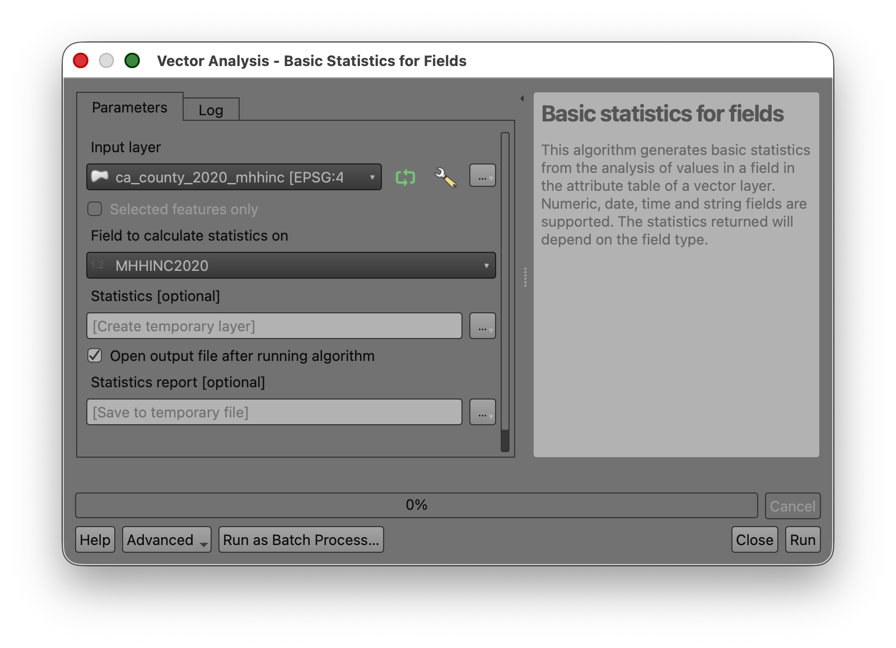

You should get values close to the following:

```
- COUNT: 58
- UNIQUE: 58
- EMPTY: 0
- FILLED: 58
- MIN: 41780
- MAX: 130890
- CV: 0.297786098407827
- SUM: 4124349
- MEAN: 71109.46551724138
- RANGE: 89110
- MEDIAN: 65055.5
- MINORITY: 41780
- MAJORITY: 41780
- STD_DEV: 21175.41029624522
- FIRSTQUARTILE: 54972
- THIRDQUARTILE: 84638
- IQR: 29666
```

Now repeat the tool for `ca_county_2000_mhhinc` using the field `MHHINC2000`.

You should get values close to the following:

```
- COUNT: 58
- UNIQUE: 58
- EMPTY: 0
- FILLED: 58
- MIN: 27522
- MAX: 74335
- CV: 0.2653085128734548
- SUM: 2487970.4000000004
- MEAN: 42896.04137931035
- RANGE: 46813
- MEDIAN: 40895.5
- MINORITY: 27522
- MAJORITY: 27522
- STD_DEV: 11380.68494650301
- FIRSTQUARTILE: 34725
- THIRDQUARTILE: 51484
- IQR: 16759
```

### Why this matters

This tool gives you a quick numerical summary of the field you are about to analyze.
It helps you verify that:

- The field is numeric
- The layer has the expected number of records
- There are no empty values
- The spread of values looks reasonable

It also gives you a stronger basis for deciding how to classify the map later.

## Part 4: Select the Lowest-Income County in Each Layer

This section is designed to help you connect the table to the map.

### Find the lowest value in the 2020 layer

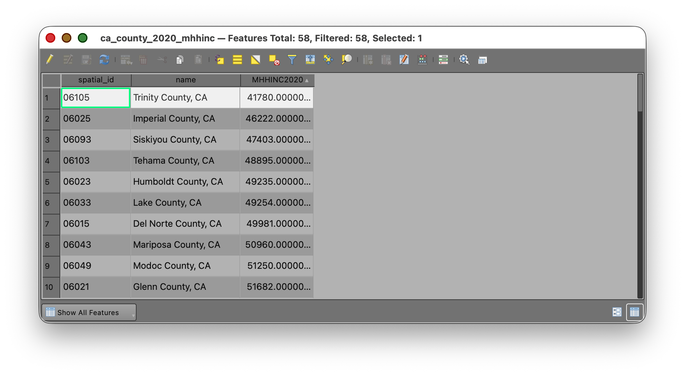

1. Open the `ca_county_2020_mhhinc` attribute table.
2. Locate the `MHHINC2020` field.
3. Click on the Field Header to **Sort** the field in ascending order so the smallest value appears first.
4. Select the row with the lowest `MHHINC2020` value.
5. Use the **Zoom map to selected rows** tool  in the attribute table.
6. Use the Deselect all features button  to deselect your features, when you are done.

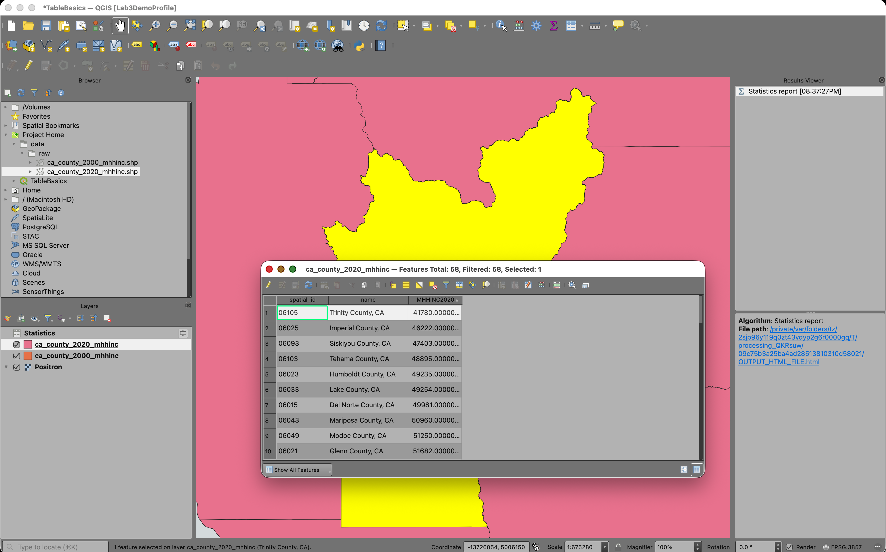

### Find the lowest value in the 2000 layer

1. Open the `ca_county_2000_mhhinc` attribute table.
2. Locate the `MHHINC2000` field.
3. Sort the field in ascending order.
4. Select the row with the lowest `MHHINC2000` value.
5. Use the **Zoom map to selected rows** tool again.
6. Use the Deselect all features button  to deselect your features, when you are done.

### Reflect on what you see

The county with the lowest value in 2000 may not be the same county as the one with the lowest value in 2020.
That is one reason it is useful to bring both years into one joined layer and calculate change directly. Once both values are in the same table, you can compare them row by row rather than trying to mentally compare two separate layers.

## Part 5: Join the 2000 Table to the 2020 Layer

In this lab, you will use the `ca_county_2020_mhhinc` layer as the target layer and join the 2000 table to it.

That means the geometry will remain the counties from the 2020 layer, but the table will temporarily gain fields from the 2000 layer.

1. Right-click `ca_county_2020_mhhinc`.
2. Choose **Properties**.
3. Click the **Joins** tab.
4. Click the **Add Join** button.
5. Set the **Join layer** to `ca_county_2000_mhhinc`.
6. Set the **Join field** to `spatial_id`.
7. Set the **Target field** to `spatial_id`.
8. Check the option to use a `Custom field name prefix` and set it to the value `2000_`

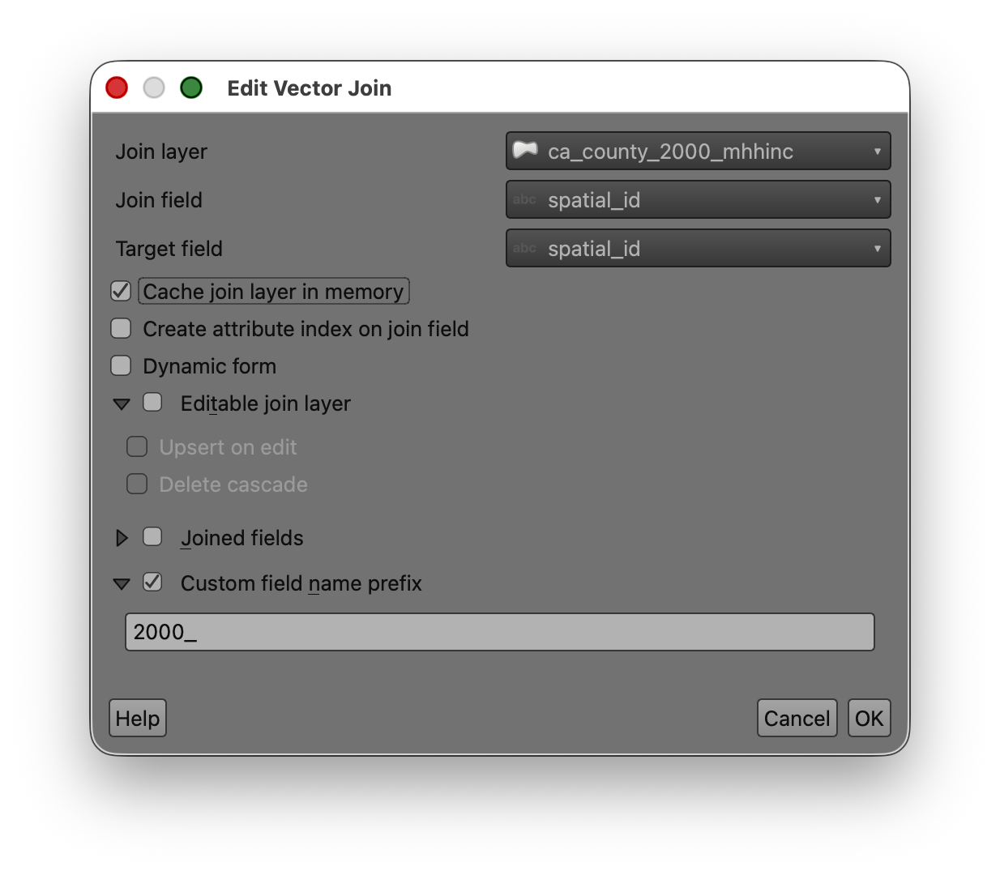

1. Click **OK**.
2. Click **OK** again to close **Layer Properties**.

### Concept note

Although both inputs are shapefiles, the join is still a table operation.
QGIS compares the values in the target layer's `spatial_id` field to the values in the join layer's `spatial_id` field. Wherever they match, it temporarily appends the joined attributes.

### Verify the join

1. Open the attribute table for `ca_county_2020_mhhinc`.
2. Scroll to the right.
3. Confirm that you can now see the joined 2000 fields, including `MHHINC2000`.

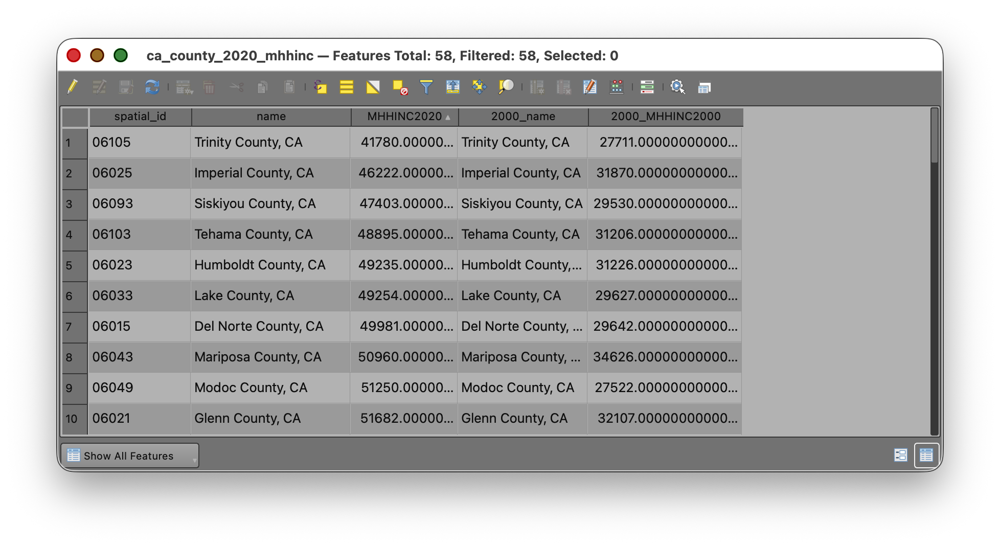

At this point, one table should contain:

- The 2020 income field
- The 2000 income field
- The shared ID field used to connect them

## Part 6: Calculate Absolute Change

Now that both year values are in the same table, you can calculate the difference.

1. Open the attribute table for `ca_county_2020_mhhinc`.
2. Open the **Field Calculator**. 
3. Choose **Create a new field**.
4. Name the field `mhhinc_diff`.
5. Set the output field type to **Decimal number(real)**.
6. Use an output field length and precision that can hold the results, such as length `20` and precision `2`.
7. Enter this expression:

```qgis
"MHHINC2020" - "MHHINC2000"
```

9. Check the preview.
10. Click **OK**.

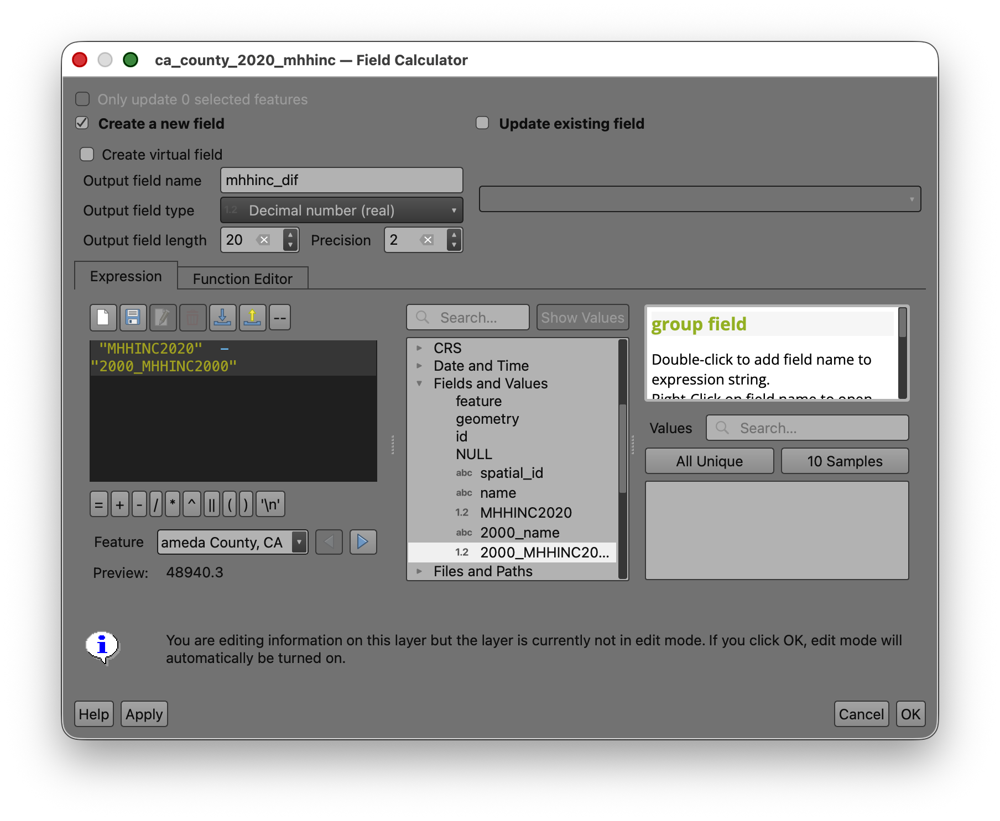

### What this means

This calculation subtracts the 2000 median household income from the 2020 median household income for each county.

- Positive values mean income increased.
- Negative values mean income decreased.
- Values near zero mean very little change.

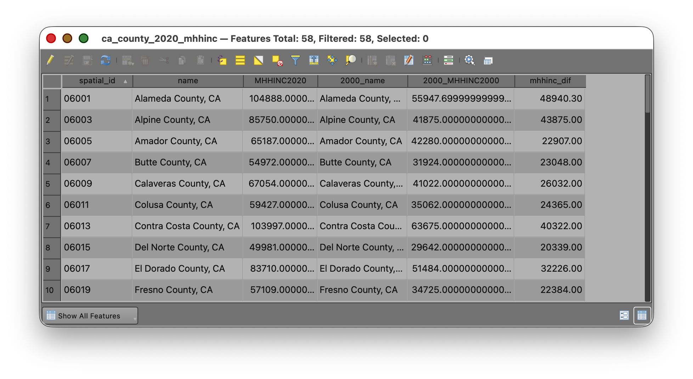

## Part 7: Calculate Percent Change

Absolute change is useful, but percent change often tells a clearer story because it scales the change relative to the starting value.

1. Open the **Field Calculator** again.
2. Choose **Create a new field**.
3. Name the field `pct_change`.
4. Set the output field type to **Decimal (double)**.
5. Use a reasonable length and precision, such as length `20` and precision `2`.
6. In the Field Calculator window, look for the list of available items in the **middle panel**.
7. Open the **Fields and Values** section if needed.
8. Find `MHHINC2020` and **double-click** it to place the field name into the **Expression** window, instead of typing it by hand.
9. Repeat the same process for `MHHINC2000`.
10. Add the operators and parentheses needed to build this expression:

```qgis
(("MHHINC2020" - "MHHINC2000") / "MHHINC2000") * 100
```

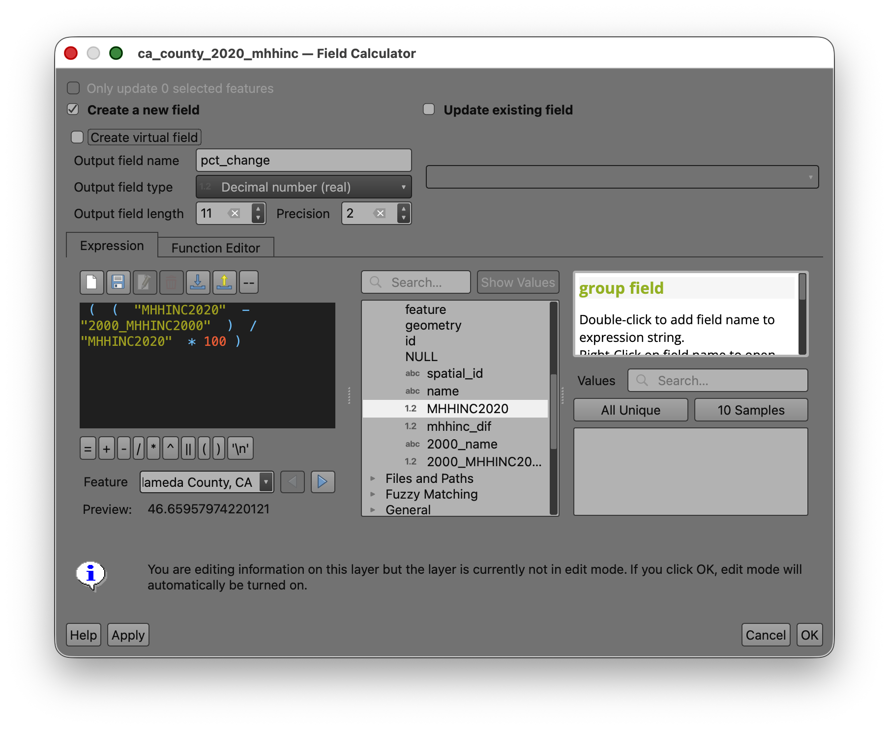

11. Check the preview.
12. Click **OK**.
13. Save your edits.
14. Toggle editing off.

> **Why double-click fields from the panel?** This helps you avoid spelling mistakes, missing underscores, or accidentally typing the wrong capitalization. Letting QGIS insert the field names for you is safer than typing them manually.

## Part 8: Map the Change

Now create a choropleth map from `pct_change`, because it allows comparison across counties with different starting values.

1. Open the **Layer Styling** panel for `ca_county_2020_mhhinc`.
2. Change the symbology from **Single Symbol** to **Graduated**.
3. Set the **Value** field to `pct_change`.
4. Choose a color ramp that makes change easy to interpret.

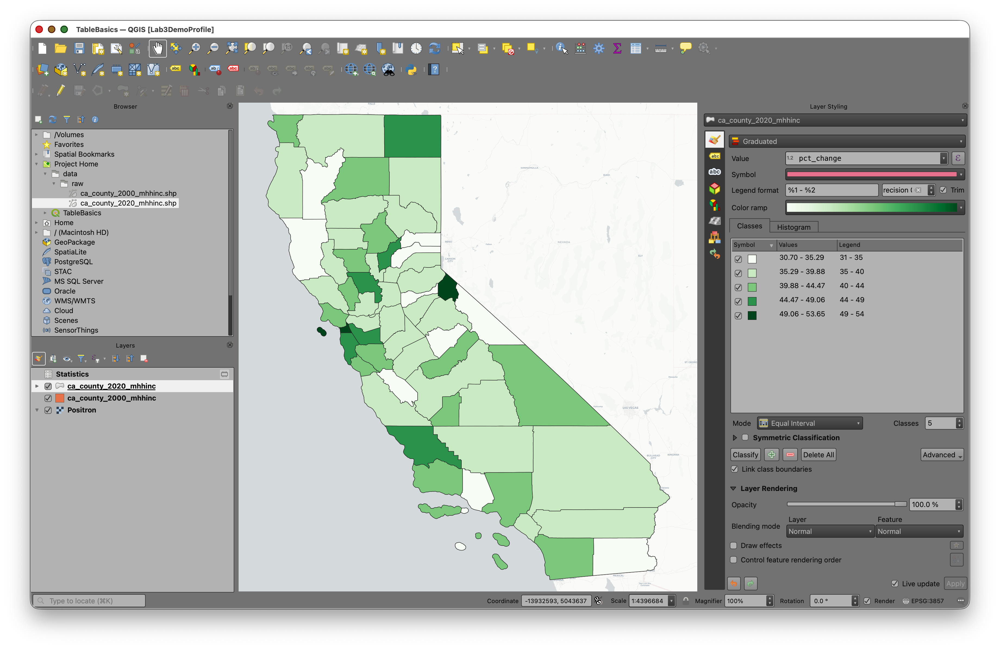

> Note: If your data include both positive and negative values, a diverging ramp is often appropriate because it visually separates decreases from increases.

Return to John Nelson's essay: [Telling Truth with Choropleth Maps](https://web.archive.org/web/20241226082540/http://uxblog.idvsolutions.com/2011/10/telling-truth.html) and review his recommendations for selecting classification methods.

6. Experiment with classification methods such as:
   - **Quantile**
   - **Natural Breaks (Jenks)**
   - **Equal Interval**
7. Try several class counts, such as `5`, `6`, or `7`.
8. Compare how the mapped pattern changes.

### Classification reflection

There is no universally *correct* classification for every choropleth map. Different methods emphasize different aspects of the distribution.

As you test classifications, ask:

- Does this map exaggerate differences?
- Does it hide important variation?
- Are the class breaks understandable?
- Does the map help a reader see a meaningful pattern?

This is the central design question in choropleth mapping.

## To Turn In

Create a map layout showing county-level change in median household income in California.

Your map should include the necessary elements, such as Title, Legend, Author Name, Date, CRS, Scale, etc...

Export to PDF and submit on Canvas.
