# SQL Operations in QGIS

> **Turn-in for grading:** This lab includes material that must be turned in for grading. Complete the required deliverables and submit them as instructed by the course.

## Overview

This lab introduces **SQL inside QGIS** through the **DB Manager** and **Virtual Layers** tools.

The main task is to use saved and edited SQL queries to investigate a relational dataset of toxic release sites and chemicals, then turn those results into a final QGIS map layout.

## Data

Download the lab package from:

- [https://github.com/mapninja/Earthsys144/raw/master/data/Tox2SchoolsLab.zip](https://github.com/mapninja/Earthsys144/raw/master/data/Tox2SchoolsLab.zip)

The project includes:

- `toxic_sites_stateplane`
- `chemicals`
- `schools_stateplane`
- A QGIS project file with saved SQL queries for the lab

## Before You Start

- Unzip the lab package somewhere on your local hard drive.
- Keep the project file and data together.
- Expect to move between the QGIS main window and the DB Manager window.

> **Important idea:** In this lab, QGIS is acting a bit like a database client. You are not writing SQL against a remote PostgreSQL server or a full external database. You are using QGIS' **Virtual Layers** system to query project layers as though they were database tables.

## Part 1: Open the Project and Examine the Data

### Open the project

1. Open the `relates.qgz` QGIS project file from the unzipped lab folder.

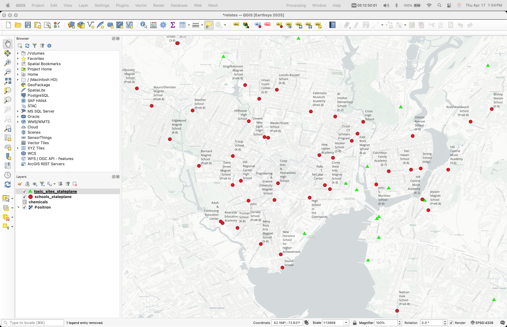

2. Right-click on the `toxic_sites_stateplane` layer and choose **Zoom to Layer**.

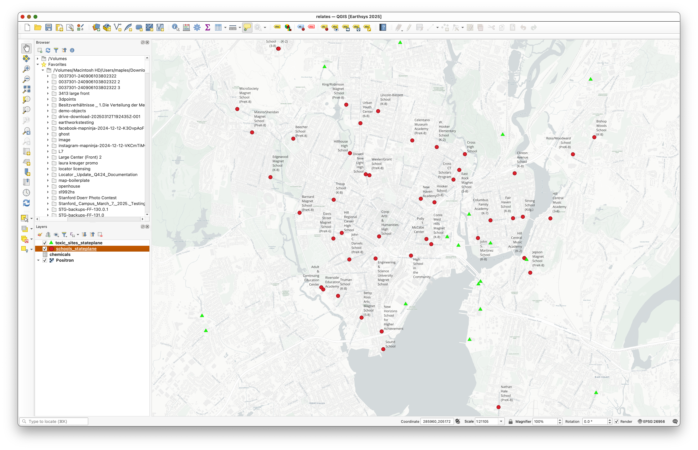

### Examine the source data

1. Open the **Layer Properties** for the layers in the project.
2. Examine their CRS and their source paths.

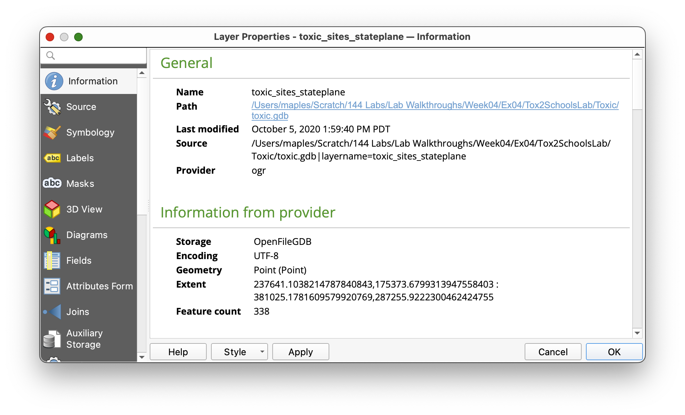

You should notice that the data is stored in a **File Geodatabase**.

> **Concept note:** A File Geodatabase is an Esri format. QGIS can read it, which is useful, but read access is not the same thing as full editing support. This is a good reminder that GIS software often works across many file formats, but not every format is equally flexible in every program.

## Part 2: Open DB Manager and the SQL Window

### Why DB Manager matters

The **DB Manager** gives QGIS a database-like interface for working with project layers and spatial tables. In this lab, you will use it as the place where SQL queries are written, saved, run, and optionally loaded back into the project.

### Open the DB Manager

1. In the main menu, go to **Database > DB Manager**.

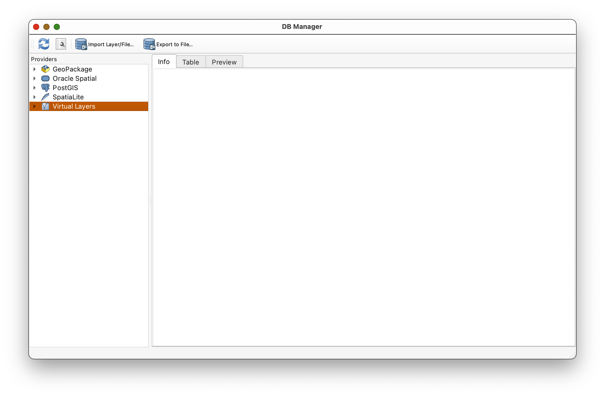

2. In the DB Manager window, expand the **Virtual Layers** section in the left panel.

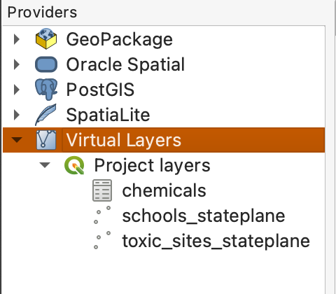

3. Select your project layers in the Virtual Layers area.
4. Click the **SQL Window** button 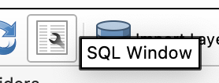, or press `Ctrl+Q`, to open the SQL window.

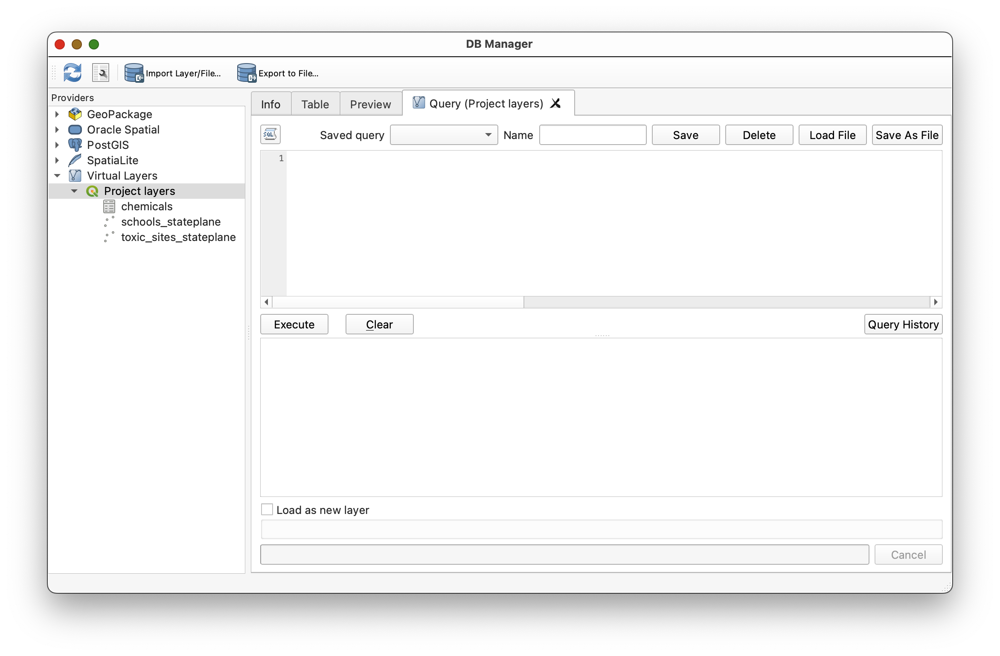

> **Why use Virtual Layers?** Virtual Layers let QGIS treat layers already in your project as if they were database tables. That means you can use SQL without first exporting everything to an external database.

## Part 3: Load the Saved Queries

QGIS allows saved queries to be stored in DB Manager. In this lab, you will use prepared SQL queries as examples, then alter some of them to see how the results change.

> **Important workflow note:** When you save a modified version of a query, give it a unique name. Otherwise you may overwrite the original saved query provided for the lab.

1. In the SQL window, look at the **Saved query** dropdown.
2. Load queries from that dropdown as directed below.
3. Pay attention to the query names. QGIS does not always sort them in a helpful order.

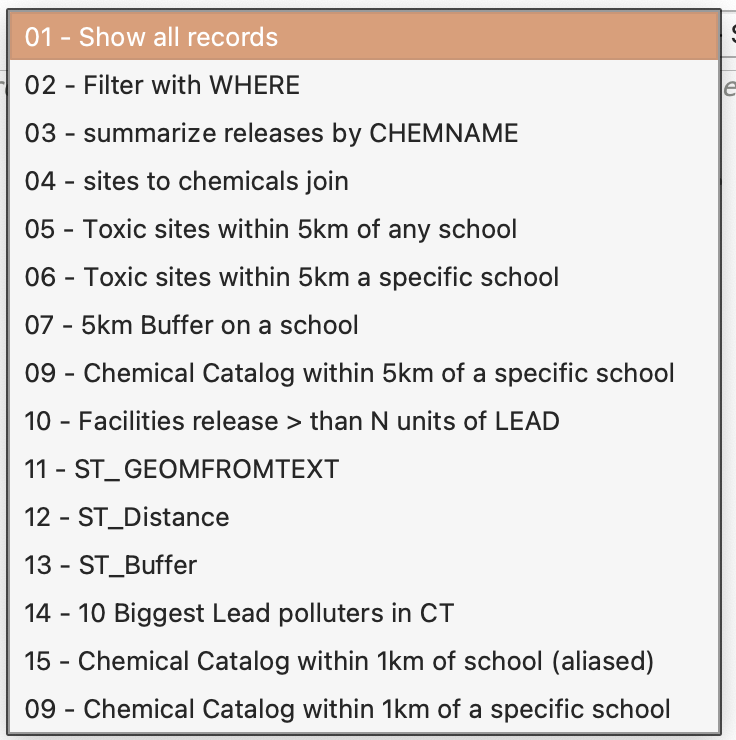

## Part 4: Start with `SELECT`

### What `SELECT` does

The `SELECT` statement is the core of SQL. It tells the database what data you want returned.

Load the query:

- `01 - Show all records`

```sql
SELECT *
FROM chemicals;
```

This query returns all columns and all rows from the `chemicals` table.

1. Load `01 - Show all records`.
2. Click **Execute**.
3. Review the output table.

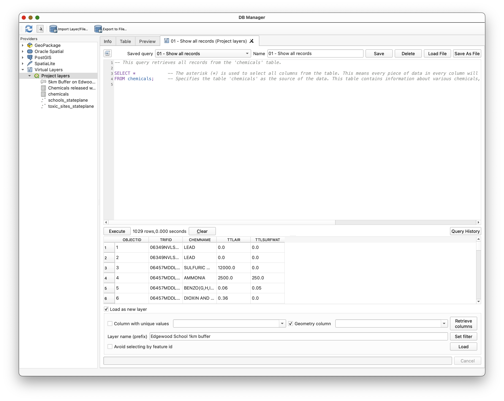

> **Concept note:** `SELECT *` is useful for exploration, but it is usually not the most thoughtful long-term query. As your work becomes more precise, you will usually choose only the columns you actually need.

## Part 5: Use `WHERE` to Filter Rows

### What `WHERE` does

The `WHERE` clause limits what `SELECT` returns. It filters rows based on a condition.

Load the query:

- `02 - Filter with WHERE`

```sql
SELECT *
FROM toxic_sites_stateplane
WHERE FCITY = 'NEW HAVEN';
```

1. Load `02 - Filter with WHERE`.
2. Execute the query.
3. Notice that the result now includes only facilities in New Haven.

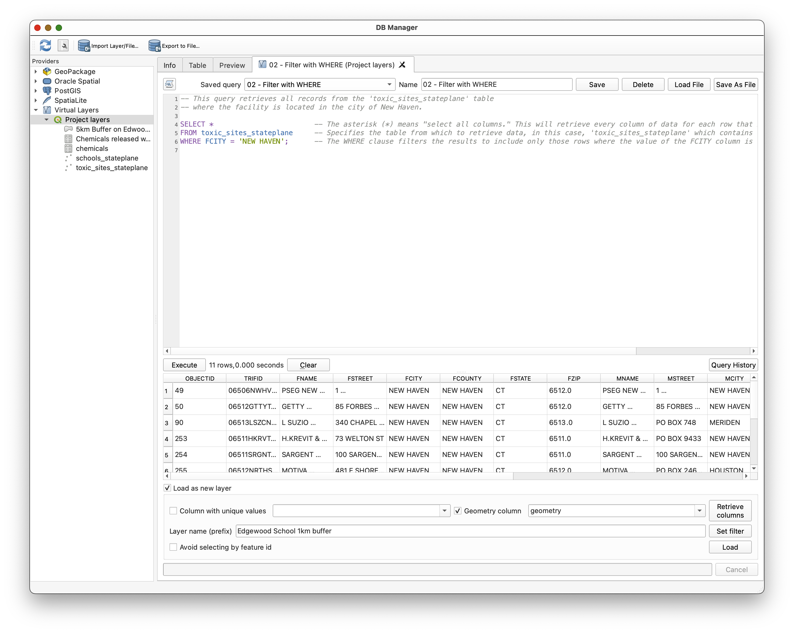

> **Concept note:** `WHERE` is the bridge between "show me the table" and "show me only the part of the table that matters to my question."

## Part 6: Use `GROUP BY` and Aggregate Functions

### Why summarize data?

Sometimes you do not want every individual row. Sometimes you want a summary. That is where aggregate functions such as `SUM()` become useful.

Load the query:

- `03 - summarize releases by CHEMNAME`

```sql
SELECT 
    CHEMNAME,
    SUM(TTLAIR) AS TotalAirRelease,
    SUM(TTLSURFWAT) AS TotalSurfaceWaterRelease
FROM chemicals
GROUP BY CHEMNAME;
```

1. Load `03 - summarize releases by CHEMNAME`.
2. Execute the query.
3. Review the output.

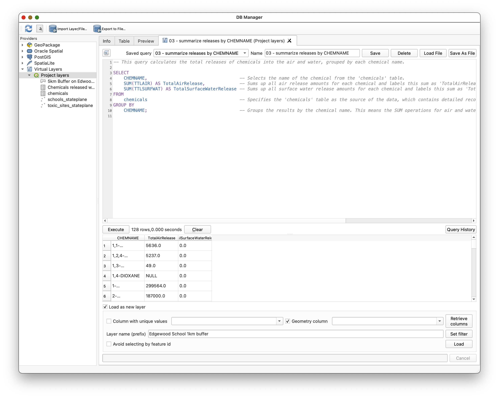

> **Concept note:** `GROUP BY` changes the level of analysis. Instead of looking at each individual release record, you are now summarizing rows into one result per chemical name.

## Part 7: Join Tables

### Why join?

The `toxic_sites_stateplane` table has the facility geometry and site information. The `chemicals` table has release information. Neither table alone fully answers our question. We need to combine them.

Load the query:

- `04 - sites to chemicals join`

```sql
SELECT 
    toxic_sites_stateplane.FNAME,
    chemicals.CHEMNAME,
    chemicals.TTLAIR,
    chemicals.TTLSURFWAT
FROM toxic_sites_stateplane
JOIN chemicals
ON toxic_sites_stateplane.TRIFID = chemicals.TRIFID;
```

1. Load `04 - sites to chemicals join`.
2. Execute the query.
3. Review the result.

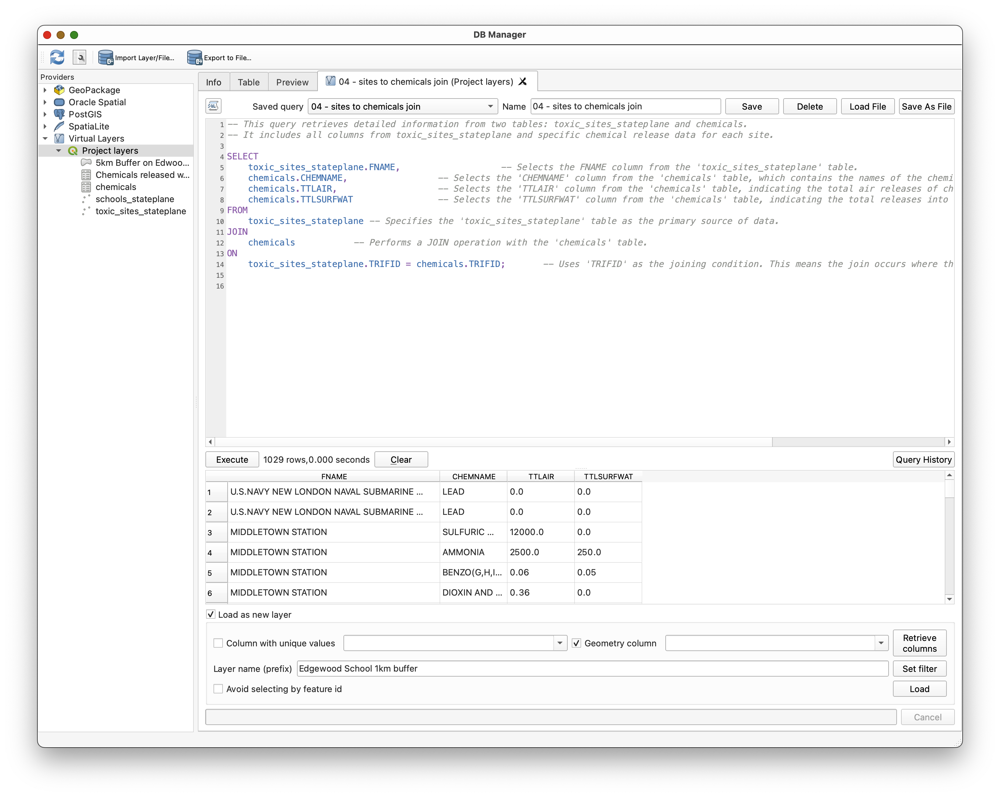

> **Concept note:** A join does not magically "merge everything forever." It creates a result set by matching rows from two tables based on a key field. Here, `TRIFID` is the key that allows those tables to relate to one another.

Because one site can have multiple chemical records, a single site may appear multiple times in the joined result.

## Part 8: Ask a Spatial Question with `ST_Distance()`

### Why use spatial SQL?

So far the SQL has treated the data as tables. Spatial SQL lets us treat geometry as something that can also be queried mathematically.

Load the query:

- `05 - Toxic sites within 5km of a school`

```sql
SELECT DISTINCT
    toxic_sites_stateplane.*
FROM 
    toxic_sites_stateplane,
    schools_stateplane
WHERE 
    ST_Distance(toxic_sites_stateplane.Geometry, schools_stateplane.Geometry) <= 5000;
```

1. Load `05 - Toxic sites within 5km of a school`.
2. Execute the query.
3. Review the result set.

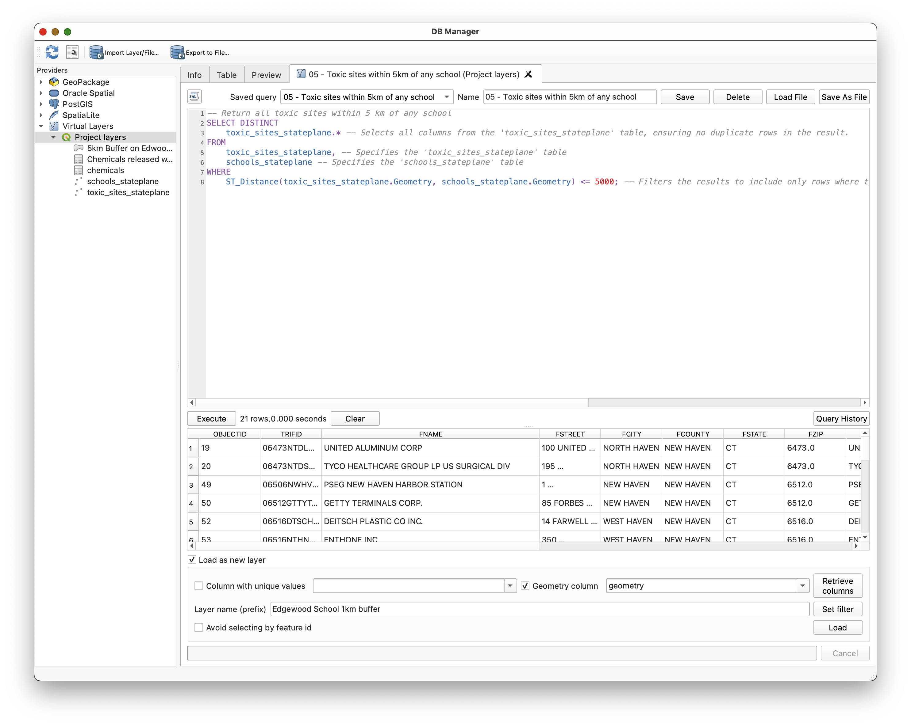

> **Concept note:** `ST_Distance()` is doing the same kind of proximity reasoning you might do with a buffering tool or a spatial selection tool, but here you are expressing it directly in SQL.

## Part 9: Create and Load a Buffer with `ST_Buffer()`

### Why load SQL results as layers?

Some SQL queries return ordinary tables. Others return geometry. When a query returns geometry, QGIS can load that result as a new layer.

Load the query:

- `07 - 5km Buffer on a school`

```sql
SELECT
    schools_stateplane.NAME,
    ST_Buffer(schools_stateplane.geometry, 5000) AS geometry
FROM schools_stateplane
WHERE schools_stateplane.NAME = 'Edgewood Magnet School (K-8) ';
```

1. Load `07 - 5km Buffer on a school`.
2. Review the query.
3. Check **Load as new layer**.
4. Name the result something meaningful, such as `Edgewood_5km_Buffer`.
5. Click **Load**.

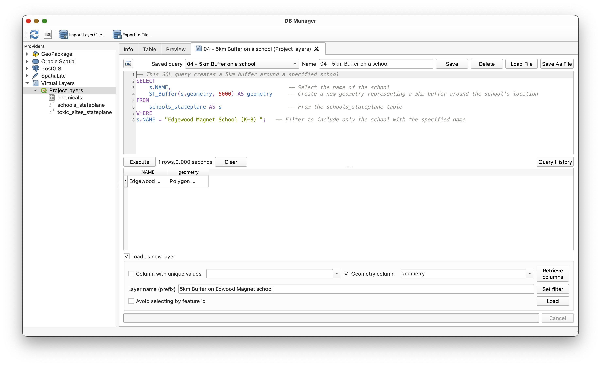

### Style the buffer layer

1. Return to the main QGIS window.
2. Select the new buffer layer.
3. Open the **Layer Styling** panel using the button 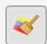.
4. Style the buffer with a transparent red fill and a visible outline.
5. Drag the buffer layer below `schools_stateplane` so the school remains visible on top.

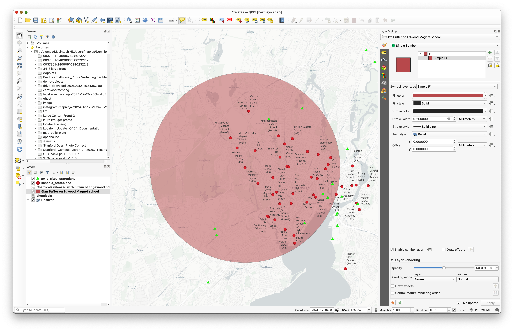

> **Concept note:** SQL results do not have to stay trapped in a table. In QGIS, a spatial SQL query can become a real map layer that you can symbolize and analyze further.

## Part 10: Build a Chemical Catalog Near a School

Now you will move from example queries toward the main analytic task.

Load the query:

- `09 - Chemical Catalog within 1km of school`

This query:

1. Identifies toxic sites within 1 km of a specific school
2. Joins those sites to the chemicals table
3. Summarizes total air and water releases by chemical

1. Load `09 - Chemical Catalog within 1km of school`.
2. Review the query.
3. Execute it to see the initial results.
4. Uncomment:

   ```sql
   -- ORDER BY TotalAirRelease DESC;
   ```

5. Execute the query again and notice how the result changes.
6. Then comment that line back out and instead uncomment:

   ```sql
   -- ORDER BY TotalSurfaceWaterRelease DESC;
   ```

7. Execute the query again and compare the ranking.
8. Use **Load as new layer** to add the result table to your QGIS project.

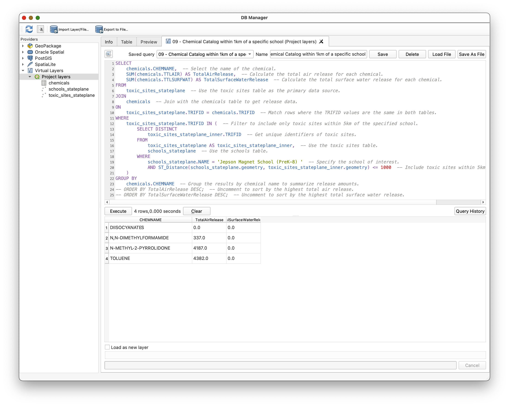

> **Concept note:** The same data can support multiple interpretations depending on how you sort and summarize it. "Largest air release" and "largest water release" are related questions, but they are not identical questions.

## Part 11: Create the Final Map Layout

Use the SQL results to build a final map layout showing the school, its 1 km context, and the summarized chemical catalog.

### Build the layers you need

1. Make only the school you queried visible in the map.
   Hint: Use the `02 - Filter with WHERE` query as a model to create a `SELECT` statement on `schools_stateplane` for the school you analyzed.
2. Load that school as a new layer.
3. Create a 1 km buffer for that school by adapting the earlier buffer query.
4. Make sure the toxic sites within that buffer are visible.
5. Add a basemap that supports the operational layers clearly.

### Add the chemical catalog table to the layout

1. Open the QGIS Layout window.
2. Insert the chemical catalog table using the **Add Attribute Table** tool.
3. Arrange the layout so the map and table support one another.

### Include standard layout elements

Be sure your map includes:

- Title
- Scale
- CRS
- Your name
- Date
- A readable legend if useful

### Export

Export the final layout as a PDF for submission.

## Turn-In Guidance

Your final submission should include:

- A map focused on the school you analyzed
- A 1 km buffer around that school
- The relevant toxic sites in that buffer
- The summarized chemical catalog table in the map layout
- Standard cartographic elements, including your name and date

## Conclusion

In this lab, you used SQL in QGIS not just to view data, but to ask structured questions of it. You:

- Explored project layers through the DB Manager
- Used `SELECT` and `WHERE` to retrieve and filter rows
- Used `GROUP BY` and `SUM()` to summarize data
- Used `JOIN` to connect related tables through a shared key
- Used `ST_Distance()` and `ST_Buffer()` to ask spatial questions in SQL
- Loaded query results back into QGIS as layers and tables
- Built a final map from SQL-driven analysis

This is an important step in GIS fluency. Once you understand that spatial layers are also tables, and that those tables can be queried with SQL, you gain a much more flexible way to explore, summarize, and analyze data.
