# Buffering & Overlay Analysis in QGIS: California Replacement

> **Turn-in for grading:** This lab includes material that must be turned in for grading. Complete the required deliverables and submit them as instructed by the course.

## Overview

This lab introduces a California-based buffering and overlay workflow in QGIS.

The overall task is **site selection for potential expanded State camping facilities**. You will use a set of spatial criteria to identify places that may be suitable for future campground expansion, then narrow those areas to parcels that can become the basis for a final site-selection map.

You will use four California datasets:

1. `California_Lakes`
2. `SHN_Lines`, the California State Highway Network lines
3. `CDFW_Public_Access_Lands_[ds3077]`, which you will repair and save as `CA_Public_Access_Lands.shp`
4. `CA_PARCELS_STATEWIDE` from `Parcels_CA_2014.gdb`

In this lab, you will:

1. create a fixed-distance buffer around transportation features
2. create a variable-distance buffer around lakes based on size class
3. combine those buffered layers with overlay tools
4. remove public-access lands from the final candidate areas
5. use the resulting candidate areas to identify a smaller parcel subset for final site-selection mapping

The California lakes dataset does not already contain a `SIZE_CLS` field, so you will create that classification yourself in QGIS using the `sfc_acres` field.

> **Concept note:** Buffering turns distance rules such as "near a highway" or "near a lake" into polygon layers that can be analyzed. Overlay analysis becomes useful when you need several spatial conditions to be true at the same time.

## Getting Ready

You will need:

- `California_Lakes` from [data.ca.gov](https://data.ca.gov/dataset/california-lakes)
- `SHN_Lines` from [State Highway Network Lines](https://data.ca.gov/dataset/state-highway-network-lines/resource/583d7297-a76f-4286-9c5c-a0d6defa98fe)
- `CDFW_Public_Access_Lands_[ds3077]` from [California GIS Open Data](https://gis.data.ca.gov/datasets/b3b6dd29b34247dbb2dd773ea17cc82d_0/explore?location=37.304465%2C-119.405679%2C6)

Create a new project folder for this lab and save a new QGIS project there as `buffering_overlay_ca.qgz`.

## Data for This Exercise

The suitability logic in this lab is:

1. candidate areas must be within `300 meters` of a state highway
2. candidate areas must also be within a lake buffer whose distance depends on lake size
3. final candidate areas must exclude public-access lands

Use these lake-buffer distances:

- `50 meters` for lakes with `SIZE_CLS = 1`
- `150 meters` for lakes with `SIZE_CLS = 2`
- `500 meters` for lakes with `SIZE_CLS = 3`

## Part 1: Create a Manageable California Study Area

Because these datasets cover all of California, start by creating a smaller study area before buffering and overlay.

The objective of this step is to prepare a workable set of inputs for the rest of the lab. This is necessary because statewide layers are too large and too messy to use directly in a beginner overlay workflow. The main tools here are **Fix geometries**, which repairs invalid polygon shapes, and **Clip by extent**, which trims all three layers to the same study area so the later analysis is faster and spatially aligned.

1. Add `California_Lakes`, `SHN_Lines`, and `CDFW_Public_Access_Lands_[ds3077]` to QGIS.
2. Before clipping anything, repair the public-access lands geometry:
   Open the **Processing Toolbox**, search for **Fix geometries**, and run it on `CDFW_Public_Access_Lands_[ds3077]`.
3. Save the repaired output as `CA_Public_Access_Lands.shp`.

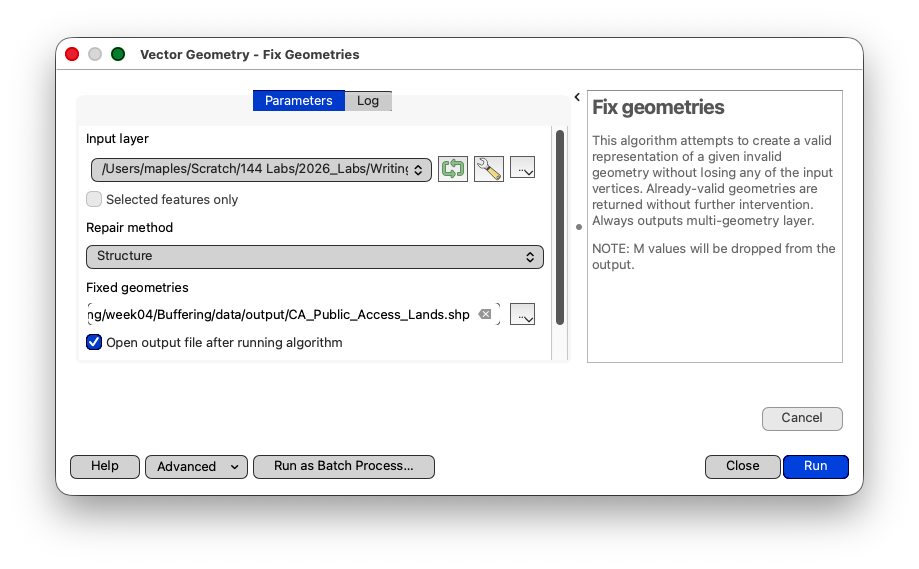

1. Add `CA_Public_Access_Lands.shp` to the project if QGIS does not add it automatically.
2. Reproject the project to a projected CRS suitable for statewide California work, such as `NAD83 / California Albers` (`EPSG:3310`), so area and distance measurements use meters.
3. Zoom to a coarse region such as Northern California or Southern California that you want to analyze.
4. Open **Clip by extent** from the **Processing Toolbox**.
5. Instead of running it once, click **Run as Batch Process...**
6. In the batch table, add three rows if they are not already present.
7. In the **Input layer** column, set one row each to:

- `California_Lakes`
- `SHN_Lines`
- `CA_Public_Access_Lands`

11. In the **Clipping extent** column, use the same map-canvas extent for all three rows.
12. To do that, click the extent cell for the first row, choose the option to use the **current map canvas extent**, and then copy or fill that same extent into the other two rows.
13. In the **Clipped** output column, save the three outputs with full valid output paths, not just filenames, using names such as:

- `CA_Lakes_subset.shp`
- `CA_Highways_subset.shp`
- `CA_Public_Access_subset.shp`

14. Run the batch process.
15. Add the three subset outputs to the project if QGIS does not add them automatically.

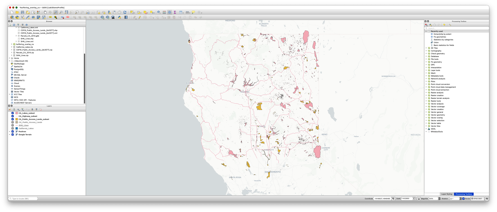

From this point forward, use the subset layers rather than the statewide originals.

> **Concept note:** This is a practical preprocessing step.

> **Workflow note:** The batch interface is useful here because all three layers need to be clipped to the same study-area extent. Running them together helps keep the subsets spatially aligned.

> **Concept note:** Vector geometries are the actual points, lines, and polygon boundaries stored in a GIS layer. Sometimes downloaded data contains geometry errors such as self-intersections, broken polygon rings, or other invalid shapes. Many overlay tools will fail, return incomplete output, or produce confusing errors when they encounter invalid geometry. The **Fix geometries** tool creates a cleaned copy of the layer so later steps such as clipping, buffering, difference, and union are more reliable.

## Part 2: Create a Fixed-Distance Buffer Around State Highways

The goal of this step is to turn the idea of "near a highway" into an actual polygon layer that can be combined with other criteria later. This is necessary because overlay tools work on geometry, not on verbal rules. The main tool here is **Buffer**, which creates a zone around line features at a specified distance.

1. Add `CA_Highways_subset.shp` if it is not already in the project.
2. Open the **Processing Toolbox**.
3. Search for **Buffer** and open **Vector geometry > Buffer**.
4. Set:

- **Input layer:** `CA_Highways_subset`
- **Distance:** `300`
- **Dissolve result:** checked

5. Save the output as `HighwayBuffer300m.shp`.

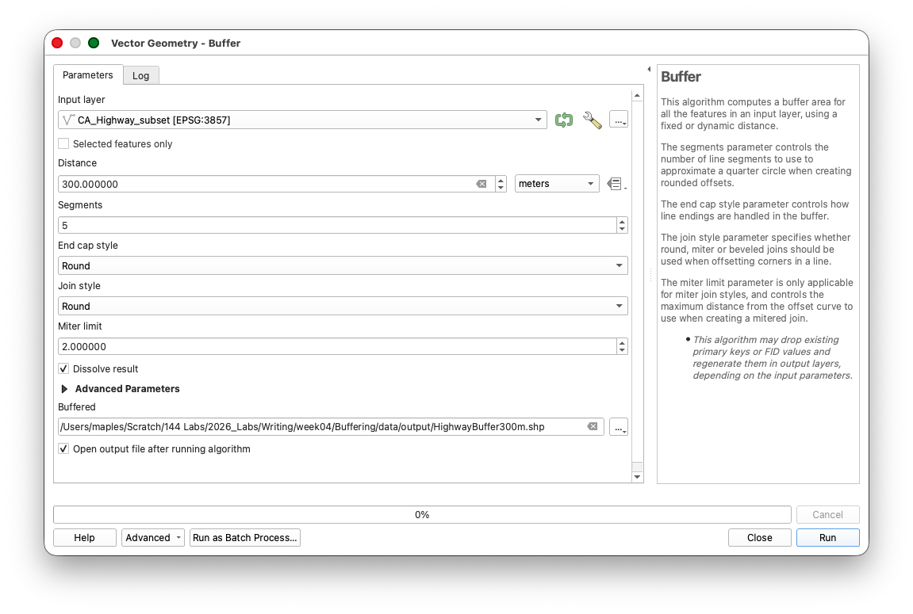

7. Run the tool.

The dissolved highway buffer represents all land within 300 meters of a California state highway in your study area.

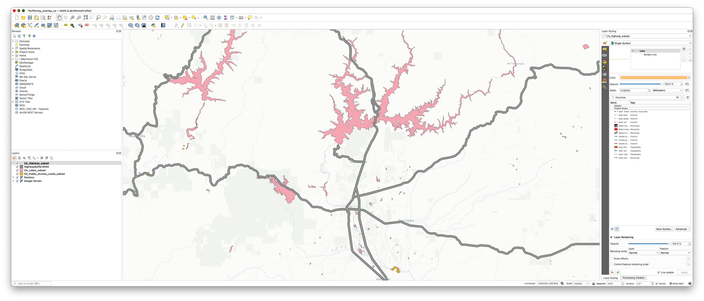

### Compare dissolved and undissolved results

Repeat the highway buffer once more, but:

1. keep the distance at `300`
2. leave **Dissolve result** unchecked
3. save as a temporary layer

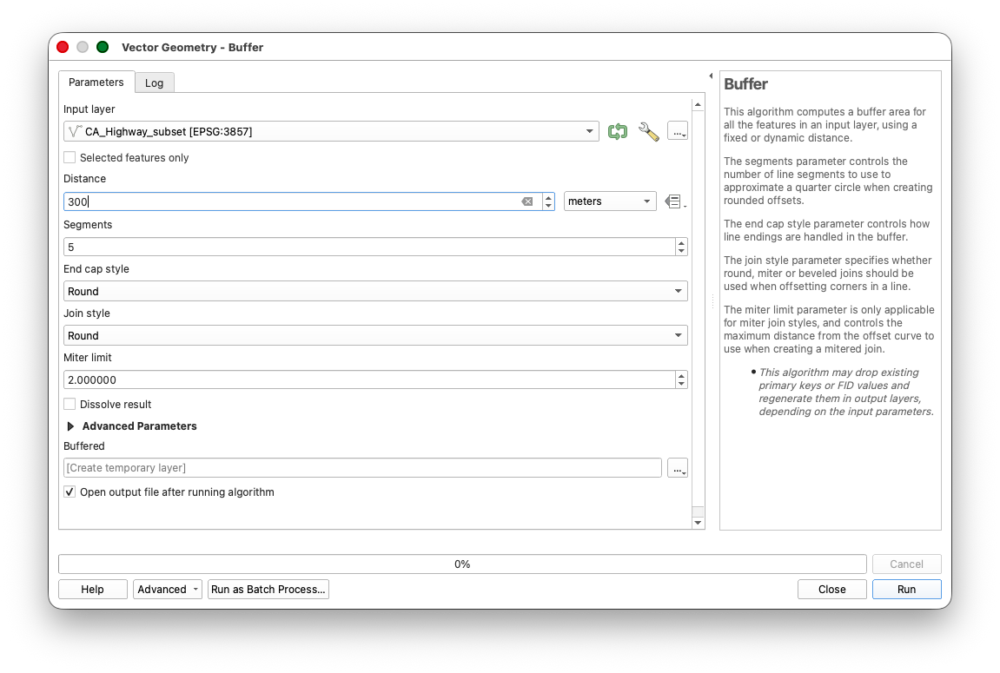

Open the attribute tables for both outputs and compare them.

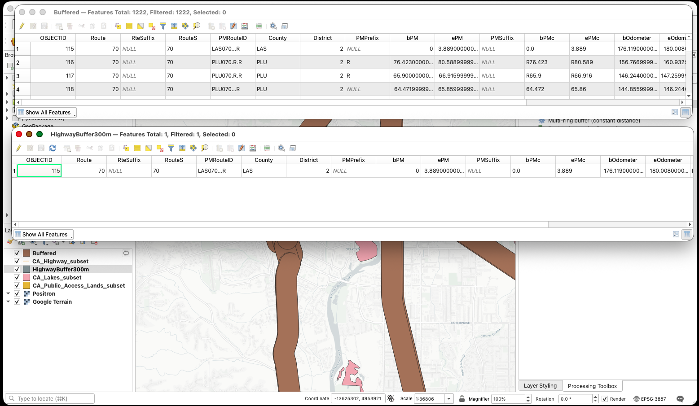

Ask yourself:

- how does the geometry differ
- how does the number of rows differ
- when would that difference matter later in the workflow

After you inspect the difference, remove the undissolved test layer.

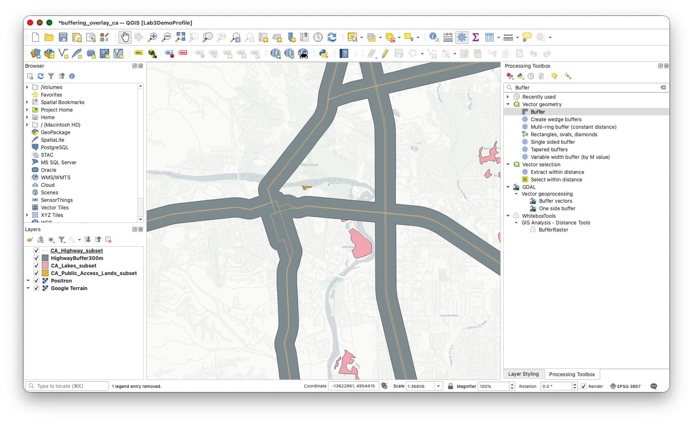

> **Workflow note:** Dissolving is helpful here because the analysis is about being inside or outside the highway-proximity zone, not about which individual highway segment created the buffer.

## Part 3: Classify the California Lakes by Size

Before classifying lake size, first reduce the lakes layer to the features that fit the logic of this lab.

The purpose of this part is to prepare the lakes layer so it can support a variable-distance buffer. This is necessary because the California lakes dataset is broader than the analysis needs and does not already contain the size classes required for this workflow. The main tools here are the layer **Filter** in properties, which acts like a definition query, and **Graduated** symbology, which helps you discover useful class breaks in the `sfc_acres` values.

### Subset the lakes to perennial named lakes

1. Right-click `CA_Lakes_subset` and open **Properties**.
2. Open the **Source** tab.
3. Find the **Filter** or **Query Builder** section for the layer.
4. Use this expression as a layer filter:

```qgis
"TYPE" = 'perennial' AND "NAME" IS NOT NULL
```

5. Apply the filter and return to the map.
6. Confirm that the remaining displayed features are perennial lakes with names.

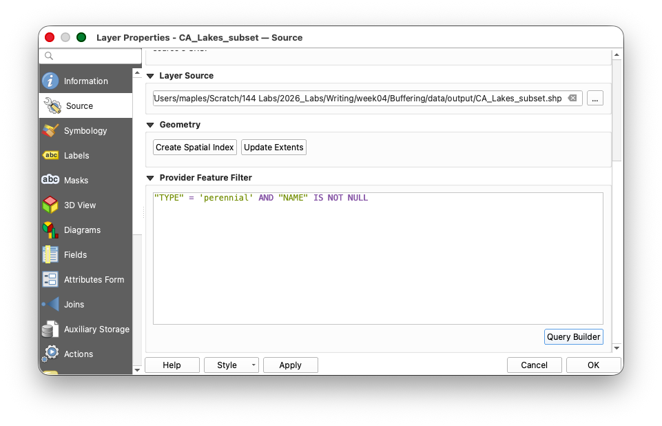

From this point forward, keep that filter in place and use the filtered `CA_Lakes_subset` layer for the lake classification and buffering workflow.

> **Concept note:** A layer filter works like a definition query. It does not create a new file. Instead, it tells QGIS to work only with the subset of features that match the expression.

> **Concept note:** This kind of filtering step is a way of defining the population of features that actually matters to the analysis. Instead of carrying every lake polygon forward, you are narrowing the layer to the subset that matches the intended study logic.

For the California lakes dataset we will calculate a `SIZE_CLS` field to base the buffers upon, from the `sfc_acres` field.

### Why use a custom classification

After filtering to perennial named lakes, use QGIS symbology to inspect the size distribution and identify the quantile breakpoints for `sfc_acres`.

1. Open **Layer Styling** for the filtered `CA_Lakes_subset` layer.
2. Change the symbology to **Graduated**.
3. Use `sfc_acres` as the value field.
4. Set the classification mode to **Equal Count (Quantile)**.
5. Change the Classes to `3`
6. Click **Classify**.
7. The class breaks shown in the styling panel should be approximately:

- `0.037 - 2.514`
- `2.514 - 24.718`
- `24.718 - 123136.384`

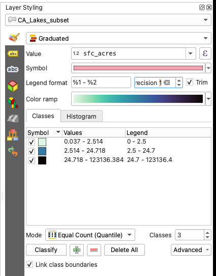

For the field-calculation step, the important break values are:

- first break: `2.514`
- second break: `24.718`

The `sfc_acres` values are strongly right-skewed, so quantiles are a practical way to build three usable lake-size groups without letting a few extremely large lakes dominate the classification.

Because the largest lakes are so much bigger than the typical lake, an equal-interval classification would place most features into the smallest class. For this lab, use the quantile break values from the styling panel to create three practical size classes.

The `SIZE_CLS` logic for this lab is:

- `SIZE_CLS = 1` for `sfc_acres <= 2.514`
- `SIZE_CLS = 2` for `sfc_acres > 2.514 AND sfc_acres <= 24.718`
- `SIZE_CLS = 3` for `sfc_acres > 24.718`

> **Concept note:** These breaks are not meant to represent "natural" lake types. They are a simple analytical classification that creates three useful buffer groups from a very uneven size distribution.

### Create the `SIZE_CLS` field

1. Open the attribute table for the filtered `CA_Lakes_subset` layer.
2. Start editing.
3. Open the **Field Calculator**.
4. Create a new whole-number field named `SIZE_CLS`.
5. Use this expression:

```qgis
CASE
    WHEN "sfc_acres" <= 2.514 THEN 1
    WHEN "sfc_acres" <= 24.718 THEN 2
    ELSE 3
END
```

7. Run the calculation.
8. Save your edits.

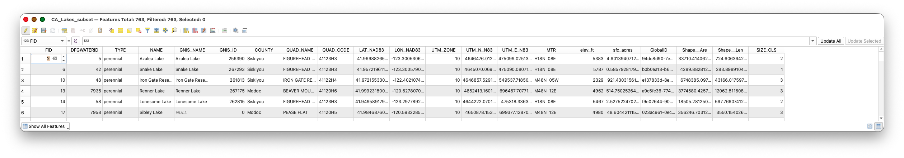

## Part 4: Create the Lake Buffer-Distance Field

Now assign the actual lake-buffer distances to the new lake size classes.

The objective of this step is to translate the size classes into the actual buffer distances the geometry tool will use. This is necessary because the buffer tool needs a numeric distance field if different lakes are going to receive different proximity zones. The main tool here is the **Field Calculator**, which lets you create a new attribute from logical rules.

1. Open the attribute table for the filtered `CA_Lakes_subset` layer.
2. Start editing if needed.
3. Open the **Field Calculator**.
4. Create a new whole-number field named `buffdist`.
5. Use this expression:

```qgis
CASE
    WHEN "SIZE_CLS" = 1 THEN 50
    WHEN "SIZE_CLS" = 2 THEN 150
    ELSE 500
END
```

6. Run the calculation.
7. Save edits and stop editing.

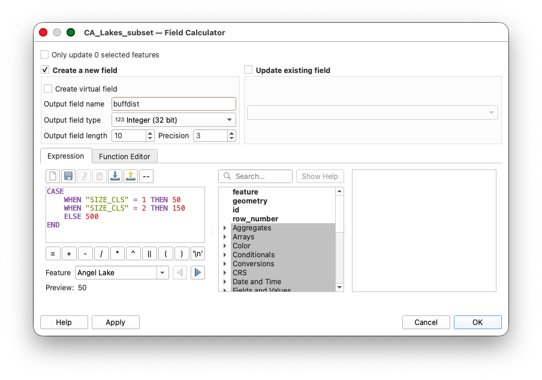

Check that the `buffdist` field and `SIZE_CLS` field vary together as expected.

> **Concept note:** This is a common GIS workflow pattern. One field stores an analytical classification, and a second field turns that classification into a geometry rule the buffer tool can use.

## Part 5: Create a Variable-Distance Buffer Around Lakes

This step creates the second major analytical criterion in the lab: land near lakes. It is necessary because the workflow eventually needs two compatible polygon criteria, one from highways and one from lakes, before they can be overlaid. The main tool here is **Buffer** again, but this time with a data-defined distance so each feature can use its own `buffdist` value.

1. Open the **Buffer** tool again.
2. Set **Input layer** to the filtered `CA_Lakes_subset` layer.
3. Open the data-defined button to the right of the **Distance** parameter.

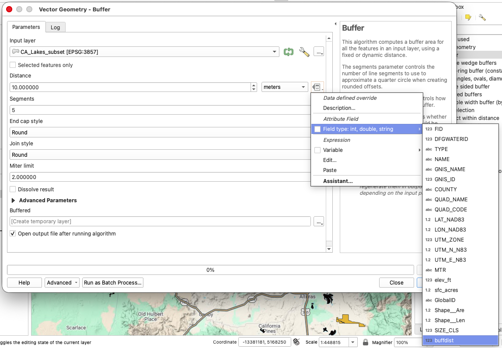

1. Choose the `buffdist` field as the distance source.
2. Check **Dissolve result**.
3. Save the output as `VarBuffLakes_CA.shp`.
4. Run the tool.

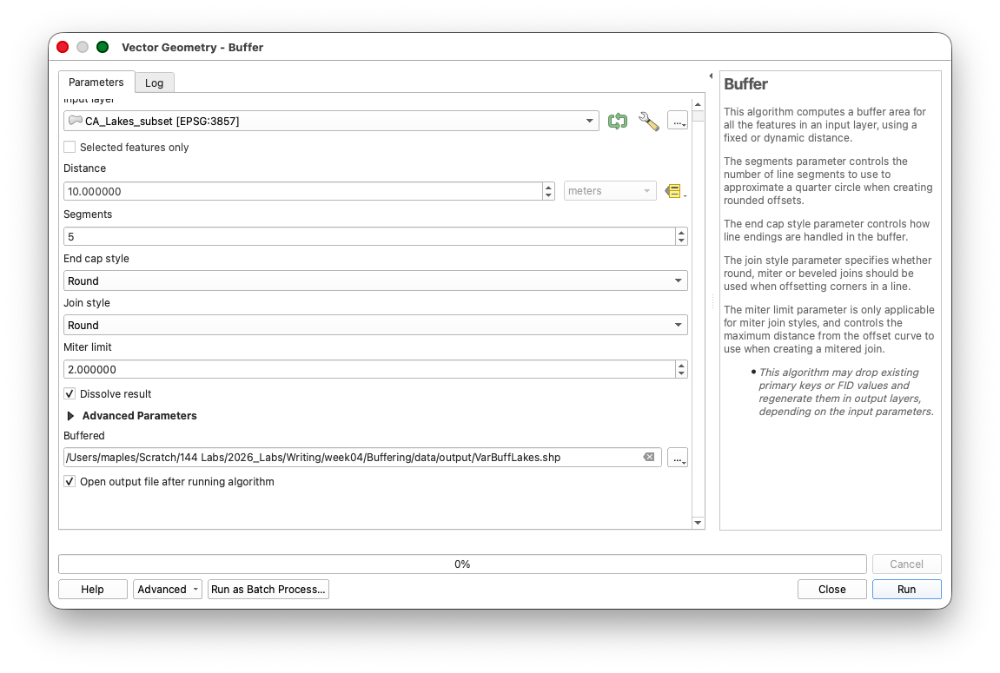

Arrange the highways, highway buffer, lakes, and lake buffer layers so you can compare the two proximity criteria visually.

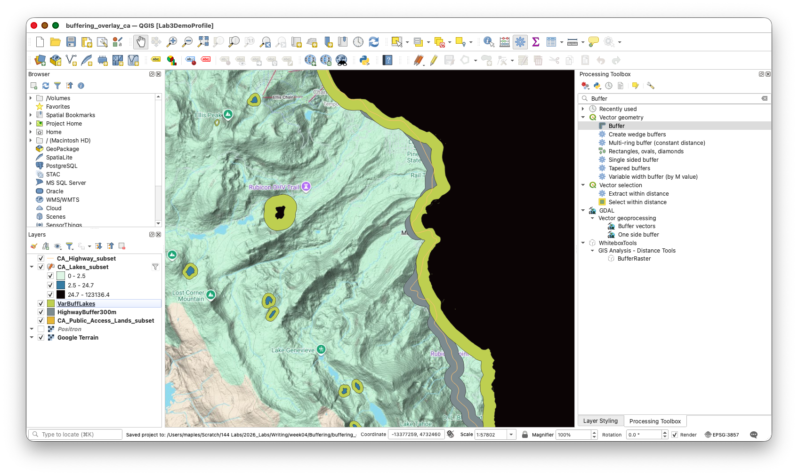

## Part 6: Prepare the Buffer Layers for Overlay

Now prepare the dissolved buffer layers so the overlay result is easier to interpret.

The purpose of this part is to clean the buffer outputs so the overlay results will make sense in the attribute table. This is necessary because dissolved buffers often create multipart geometries and inherited attributes that are awkward or misleading in later analysis. The main tools here are **Multipart to singleparts** and the **Field Calculator**, along with simple table editing to remove fields that no longer describe the new geometry well.

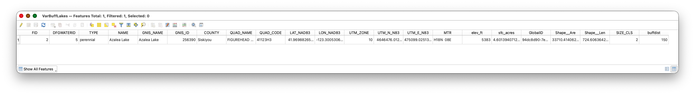

### Convert multipart buffers to singlepart features

1. Run **Multipart to singleparts** on `VarBuffLakes_CA`.
2. Save the output as `SingleLakeBuffers_CA.shp`.

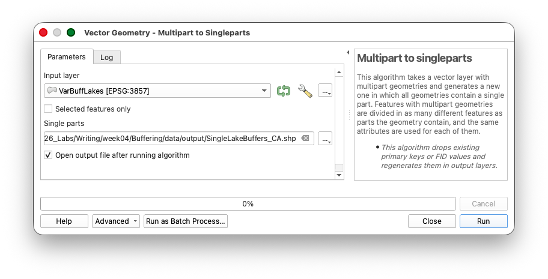

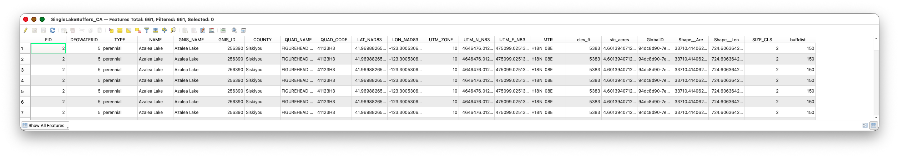

1. Run **Multipart to singleparts** on `HighwayBuffer300m`.
2. Save the output as `SingleHighwayBuffers_CA.shp`.

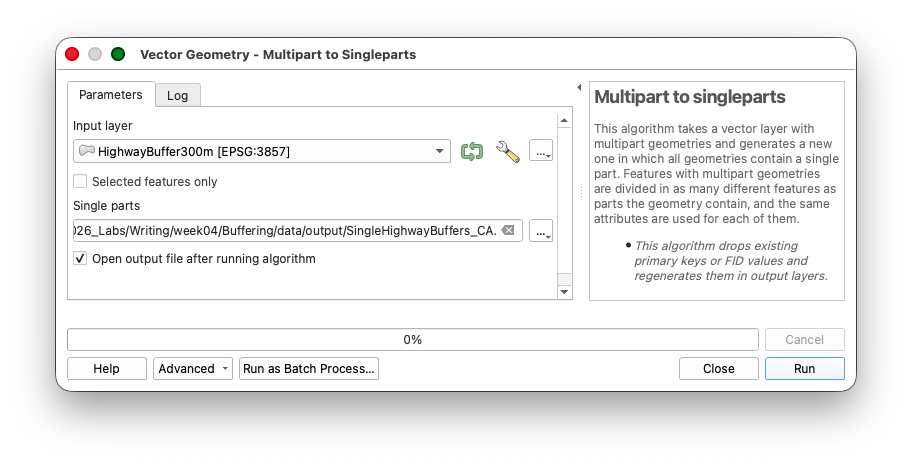

Open the resulting attribute tables and confirm that each polygon now has its own row.

After running the singlepart tool on the highway buffer, you may still see only a single row in the output. That is expected here. In this case there are no disconnected parts of the dissolved state highway buffer, which means there is actually only one continuous buffer polygon for QGIS to carry forward.

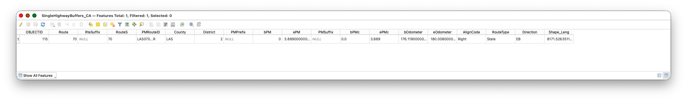

> **Concept note:** Multipart features can be awkward in overlay analysis because one row can represent several separate polygons. Singlepart output makes later selection and interpretation more direct.

### Clean the attributes and create inside-buffer flags

For `SingleLakeBuffers_CA`:

1. Open the attribute table.
2. Start editing. 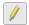
3. Delete all fields (since they are no longer useful for the overlay result), using the **Delete Field** tool 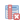
4. Create a new whole-number field named `inlakebuff`, using the **Field Calculator**.

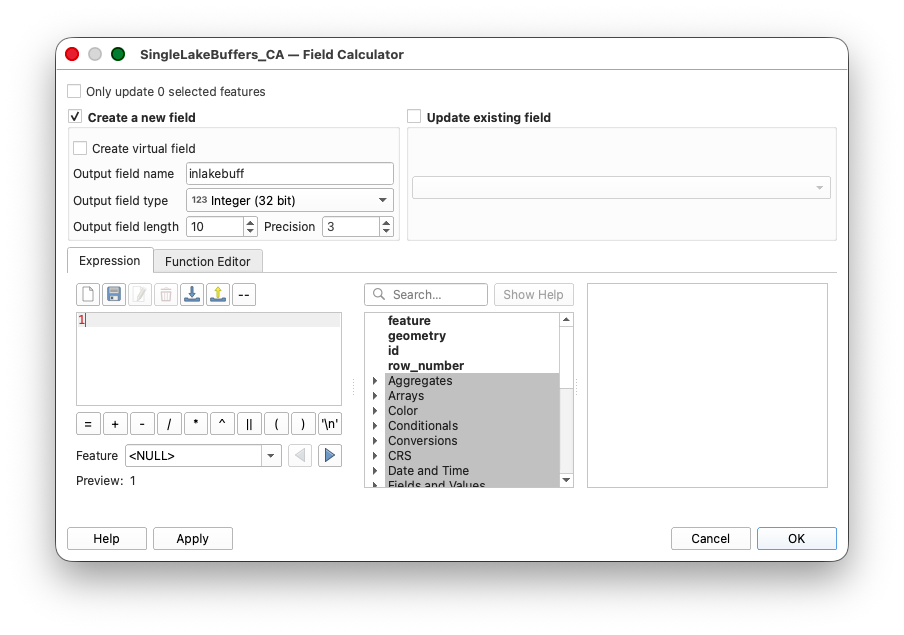

1. Assign a value of:

```qgis
1
```

to every row.
6. Save edits.

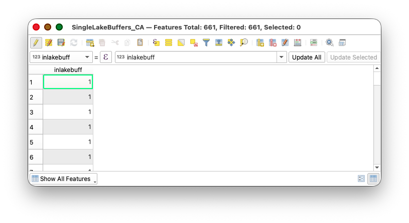

For `SingleHighwayBuffers_CA`:

1. Repeat the same process.
2. Create a field named `inhwybuff`.
3. Assign a value of:

```qgis
1
```

to every row.
4. Save edits and stop editing.

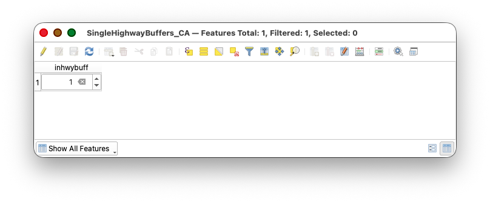

## Part 7: Remove Lake Interiors from the Lake Buffer

The lake buffer still includes the lake polygons themselves, but candidate sites should be on land near lakes, not in the water.

The goal of this step is to make the lake-proximity layer match the real meaning of the criterion. This is necessary because "near a lake" should refer to land adjacent to water, not water polygons themselves. The main tool here is **Difference**, which subtracts one layer from another and is broadly useful whenever you need to erase unwanted areas from a polygon layer.

1. Open **Difference** from the **Processing Toolbox**.
2. Set:

- **Input layer:** `SingleLakeBuffers_CA`
- **Overlay layer:** `CA_Lakes_subset`

3. Save the output as `LakeBuffersOnly_CA.shp`.

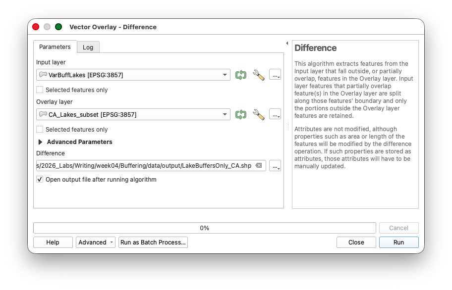

5. Run the tool.

Verify that the result contains the buffer land around lakes but not the lake interiors.

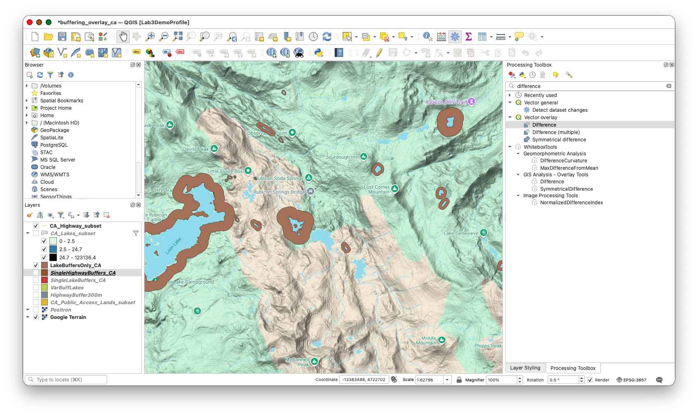

> **Concept note:** This is an interpretation step as much as a geometry step. "Near a lake" should match the actual land area students are treating as potentially usable.

## Part 8: Use Union to Combine the Lake and Highway Criteria

This step brings the two proximity rules into one layer so they can be compared feature by feature. It is necessary because the final candidate areas depend on both conditions being true at the same time. The main tool here is **Union**, which preserves the geometry and attributes from both inputs and creates the smaller polygons needed for combined selection logic.

1. Open **Union**.
2. Set:

- **Input layer:** `LakeBuffersOnly_CA`
- **Overlay layer:** `SingleHighwayBuffers_CA`

3. Save the output as `BufferUnion_CA.shp`.
4. Run the tool.

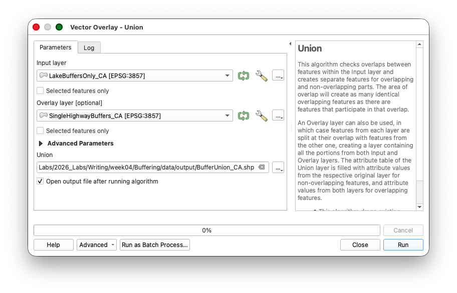

Open the attribute table and inspect the `inlakebuff` and `inhwybuff` fields.\

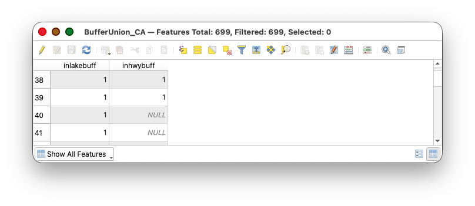

You are looking for polygons where both equal `1`.

## Part 9: Select and Export Candidate Areas

The objective here is to isolate only the polygons that satisfy both of the criteria created in the previous step. This is necessary because the union layer contains all combinations of overlap, not just the suitable ones. The main tools are **Select by expression**, which filters features using attribute logic, and **Export > Save Selected Features As...**, which turns the selected subset into its own layer for the final exclusion step.

1. In the `BufferUnion_CA` attribute table, open **Select features by expression**.
2. Use:

```qgis
"inlakebuff" = 1 AND "inhwybuff" = 1
```

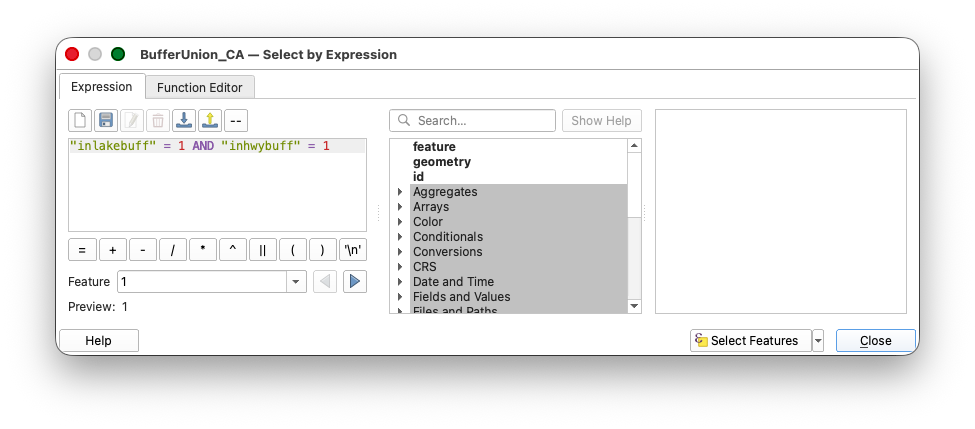

4. Apply the selection.
5. Inspect the selected polygons on the map.
6. Right-click `BufferUnion_CA` and choose **Export > Save Selected Features As...**
7. Save the result as `Candidates_CA.shp`.

The `Candidates_CA` layer should represent places that are both:

- near lakes, based on lake size
- near California state highways

> **Concept note:** This is the central suitability-analysis move. The candidate polygons are the places where both spatial criteria are true at once.

## Part 10: Remove Public-Access Lands from the Candidate Areas

The final criterion is that these candidate areas should exclude the public-access lands layer.

The purpose of this final analytical step is to remove land that fails the ownership or access criterion, leaving only the candidate areas that meet all three rules in the workflow. This is necessary because the selected overlap polygons are still only "near highways and lakes" until the public-access lands are subtracted. The main tool here is **Difference**, which is useful whenever one polygon layer should be carved out of another.

1. Add `CA_Public_Access_subset.shp` if needed.
2. Open **Difference** again.
3. Set:

- **Input layer:** `Candidates_CA`
- **Overlay layer:** `CA_Public_Access_subset`

4. Save the output as `FinalCandidates_CA.shp`.

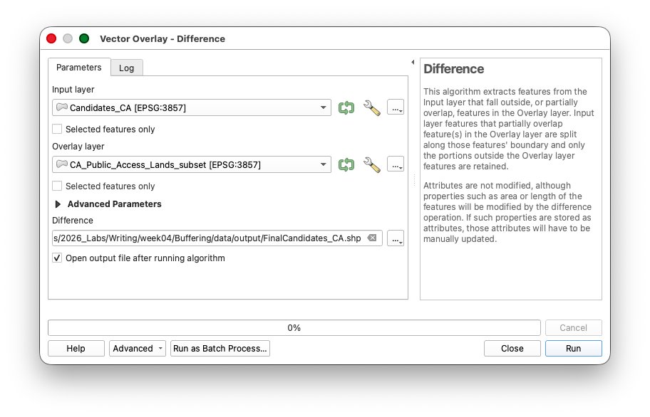

6. Run the tool.

Inspect the result and confirm that candidate polygons overlapping the public-access lands layer have been removed.

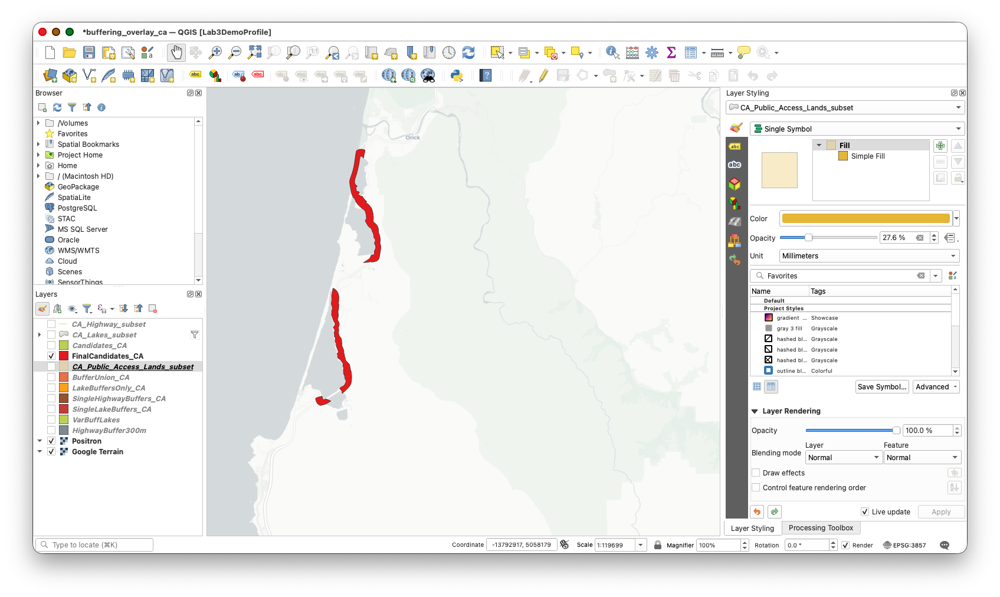

## Part 11: Select Candidate Parcels with Select by Location

This final step narrows the analysis from a regional suitability surface to one specific site-selection story. This is necessary because the `FinalCandidates_CA` layer may still contain many suitable areas spread across your study region. For the final map, you will choose one lake with candidate areas nearby, isolate just those candidate polygons, and then use them to select parcels from the statewide parcel layer. The main tools here are the interactive **Select Features** tools and **Select by Location**, which lets one layer select features from another based on spatial overlap.

1. In the `raw` folder, locate `Parcels_CA_2014.gdb`.
2. In the QGIS **Browser** panel, expand the geodatabase and add the `CA_PARCELS_STATEWIDE` layer to the project.

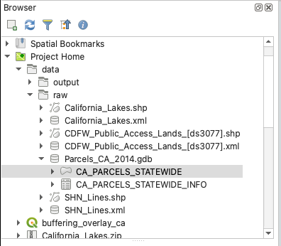

3. Turn off the visibility of `CA_PARCELS_STATEWIDE` after it loads. It is a very large parcel layer, and leaving it visible can make the project hard to read and slower to draw.
4. Turn on `FinalCandidates_CA` and the lakes layer.
5. Choose one lake that has several candidate areas nearby and zoom in to that location.
6. With the `FinalCandidates_CA` selected in the Layers Panel, Use the interactive **Select Features** tool to select only the candidate polygons associated with that one lake.

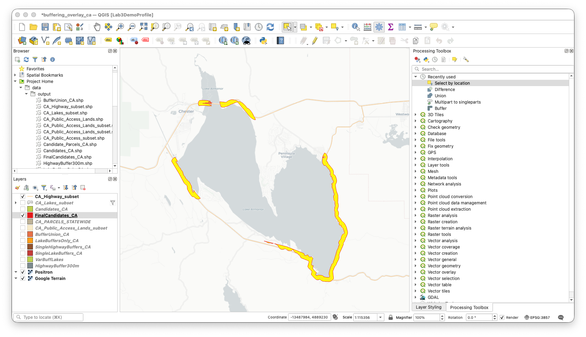

8. After selecting those polygons, Open **Select by Location** from the **Processing Toolbox**.
9. Set:

- **Select features from:** `CA_PARCELS_STATEWIDE`
- **Where the features:** `intersect`
- **By comparing to the features from:** `Lake_Candidates_CA`

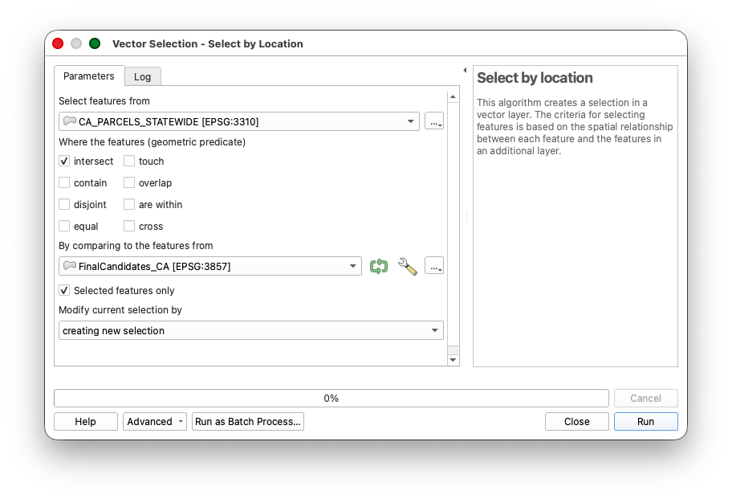

13. Run the tool.
14. After the parcels are selected, right-click `CA_PARCELS_STATEWIDE`.
15. Choose **Export > Save Selected Features As...**
16. Save the result as a small parcel subset such as `Candidate_Parcels_CA.shp`.

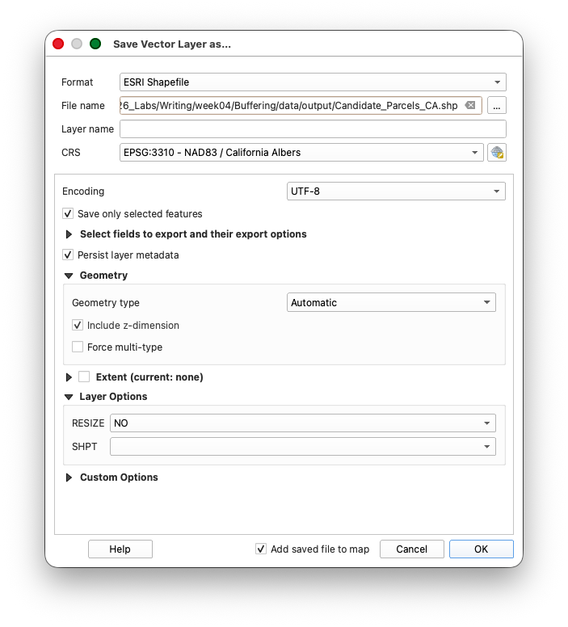

17. Add the exported parcel subset back into the project if QGIS does not add it automatically.
18. Turn on `Candidate_Parcels_CA` and inspect how the parcel boundaries compare to `Lake_Candidates_CA`.

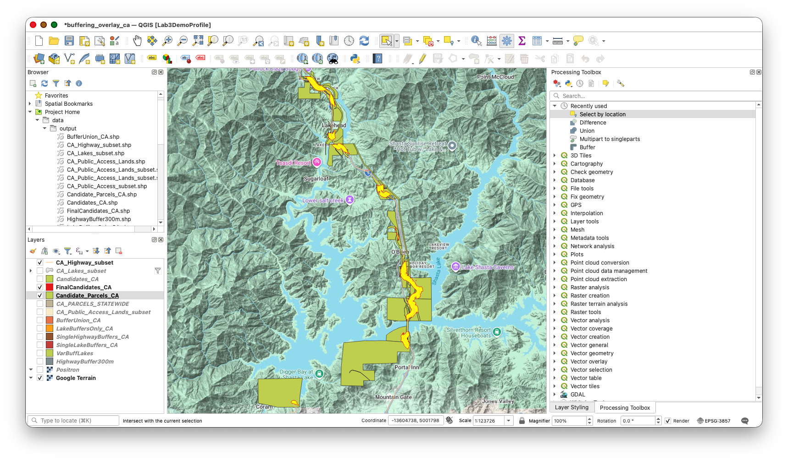

> **Concept note:** Interactive selection tools are useful when the next stage of the workflow should focus on one especially relevant local case rather than every suitable area in the study region. This makes the final map more readable and more intentional.

> **Concept note:** `Select by Location` is a standard GIS selection tool that uses spatial relationships such as intersect, within, or contain. It is useful when you want to move from a broader analysis surface, such as a suitability polygon, to a more concrete layer such as parcels, buildings, or administrative units.

> **Workflow note:** A parcel may intersect a candidate area without falling entirely inside it. That means this step is best understood as finding parcels that touch the suitable zones, not proving that every part of the parcel is suitable.

## To Turn In

Create and export a final layout that uses your cartographic judgment to communicate a focused site-selection story clearly.


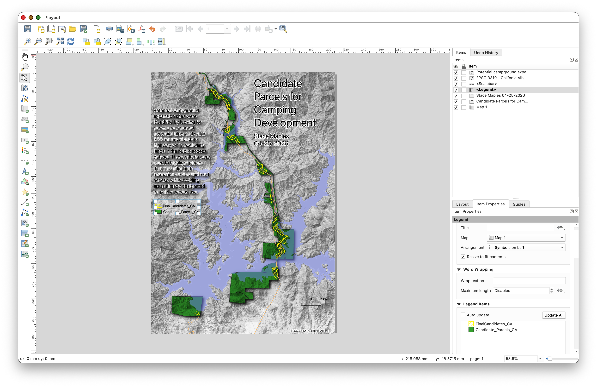

Use your creativity to:

- choose an appropriate basemap that supports the story of the analysis without overpowering the main layers
- identify one particular lake that has several candidate areas nearby
- focus the map extent on that lake, the selected candidate areas, and the subset of intersecting parcels
- use the layout to provide a short narrative of the site-selection criteria

Your final map should communicate that the selected parcels were identified because they are:

- near a state highway
- near a named perennial lake
- outside the public-access lands layer
- part of the parcel subset selected from the candidate areas around your chosen lake

Include the usual cartographic elements:

- a title that reflects the specific site-selection story you are telling
- your name
- the date
- a scale bar
- a legend
- labels or annotation if they help identify the lake or candidate parcels
- a short narrative text block or caption describing the selection criteria
- the candidate parcel subset and, if useful, the selected candidate-area subset used to derive it

## What You Should Understand After This Lab

By the end of this exercise, you should be able to explain:

- why a statewide dataset often needs to be subset before local analysis
- why the California lakes layer needed a derived `SIZE_CLS` field before variable buffering
- how a field such as `buffdist` can drive a data-defined buffer distance
- why `Difference` was needed before and after the overlay step
- how `Union` plus attribute selection produces a suitability-analysis result
