# Areal Interpolation with QGIS: Santa Clara County Population by Fire Hazard Risk Level

## Overview

In this lab, you will use **areal interpolation** to estimate how many people live in each **Fire Hazard Severity Zone** risk class in Santa Clara County.

This lab is about **manipulating geography to estimate a measurement that is not directly available to us**.

In GIS, we are often interested in demographic values for units of area that are not based on Census geography. Fire hazard zones are a good example. They are meaningful analytical zones, but they are not the polygons the Census or SimplyAnalytics used to report population.

That creates a common problem: the population data and the geography we care about do not use the same boundaries.

In this exercise:

1. the **Fire Hazard Severity Zone** polygons represent the hazard-risk geography
2. the **2025 Santa Clara County block group population** polygons represent the demographic reporting geography

Because those boundaries do not line up perfectly, we cannot just use a simple attribute join. Instead, we will use a simplified version of a very common GIS solution. We will split the source polygons where they intersect the target geography, calculate overlap-based weights, and use those weights to estimate population for the hazard zones.

In this lab, we will:

1. calculate the original area of each block group
2. split block groups where they cross Fire Hazard Severity Zone boundaries
3. calculate the area of each resulting overlap polygon
4. use an area-based weight to estimate how much of each block group's population belongs in each hazard polygon
5. summarize the weighted population totals by hazard risk level

> **Concept note:** Areal interpolation is a way of transferring attribute values from one set of polygons to another when their boundaries do not match. In this lab, we are using a simple area-weighting method, which assumes that population is distributed evenly within each block group.

> **Concept note:** A more advanced and often more accurate method is to build the weight from the **linear length of streets** in the overlapping areas, rather than from polygon area alone. Street infrastructure often correlates more closely with population density, which helps reduce distortion from large but lightly populated spaces such as golf courses, industrial parks, or other land-extensive features.

## Getting Ready

You will need:

- the Stanford EarthWorks Fire Hazard Severity Zone dataset: [stanford-jr312mr8879](https://earthworks.stanford.edu/catalog/stanford-jr312mr8879)
- `santa_clara_pop_2025.shp`, a **2025 Santa Clara County block group** shapefile exported from SimplyAnalytics

Create a new project folder for this lab and save a new QGIS project there as `areal_interpolation_fire_hazard.qgz`.

## Data for This Exercise

### Fire Hazard Severity Zones

Download the Fire Hazard Severity Zone dataset from EarthWorks and add the polygon layer to QGIS. In the EarthWorks download, the layer used in the screenshot is named `fhszs06_3_43`.

This dataset provides the target zones for your final summary. These are the polygons you want your estimated population totals to match.

From the attribute table shown in the screenshot, the key fields are:

- `HAZ_CLASS` for the hazard-risk class labels such as `Moderate`
- `HAZ_CODE` for the coded version of the class
- `SRA` for the State Responsibility Area designation

### 2025 Santa Clara County Block Groups

Add `santa_clara_pop_2025.shp`, the block group shapefile exported from SimplyAnalytics.

This layer should contain:

- one polygon for each block group
- a field named `VALUE0`, which stores `# Total Population, 2025`

> **Concept note:** In this workflow, the block groups are the **source zones** because they hold the original population values, and the Fire Hazard Severity Zones are the **target zones** because they are the geography you want to report results for.

Before continuing:

1. confirm that both layers draw in the same place
2. confirm that both layers are polygon layers
3. confirm that the population field in the block group layer is `VALUE0`
4. confirm that the hazard class field in the Fire Hazard Severity Zone layer is `HAZ_CLASS`
5. note that `HAZ_CODE` is available if you want to compare coded and text labels

If the two layers have different projected coordinate systems, reproject one so both layers use the same projected CRS before calculating area.

> **Concept note:** Area-based calculations depend on the map units of the layer CRS. A projected CRS is important because it lets QGIS measure polygon area in consistent linear units such as feet or meters.

## Part 1: Add the Layers and Inspect the Attributes

1. Start a new QGIS project.
2. Add the Fire Hazard Severity Zone layer from the EarthWorks download, such as `fhszs06_3_43`.
3. Add `santa_clara_pop_2025.shp`.
4. Move the Fire Hazard Severity Zone layer above the block group layer if needed.

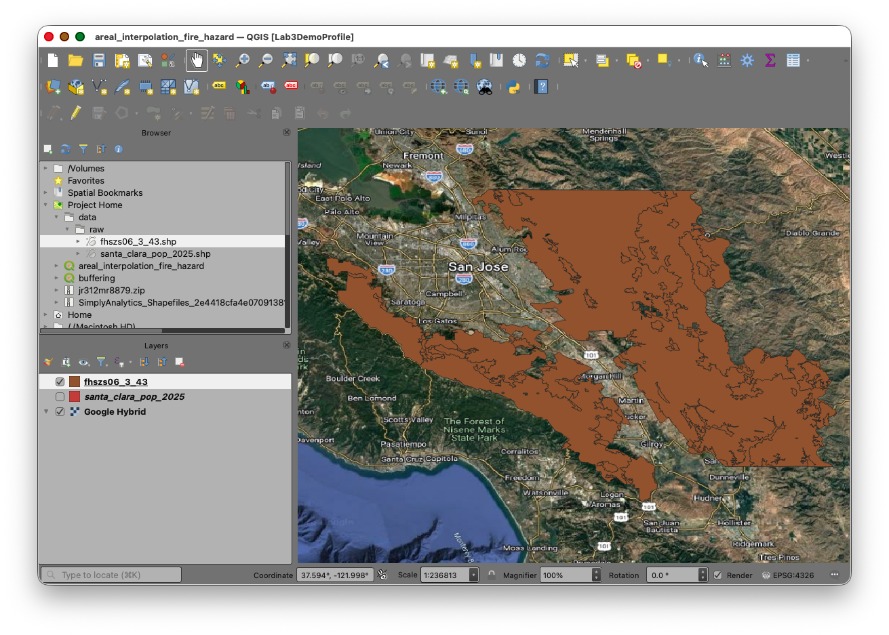

1. Use the **Layer Styling** panel to make one of the polygon fills transparent so you can see both boundary systems at once.

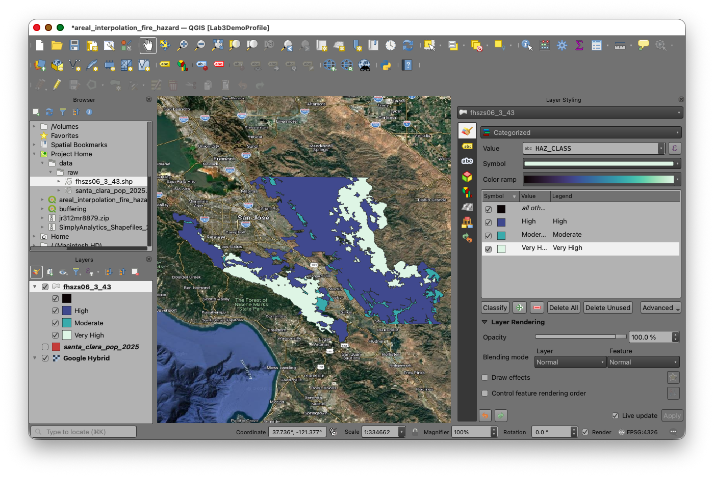

Take a moment to inspect the attribute tables of both layers.

You should identify:

- the block group unique identifier field
- the total population field for 2025: `VALUE0`
- the Fire Hazard Severity Zone category field: `HAZ_CLASS`
- the optional coded hazard field: `HAZ_CODE`

## Part 2: Calculate the Parent Area of Each Block Group

We first need the original area of each intact block group polygon. This gives us the denominator for the weighting step later.

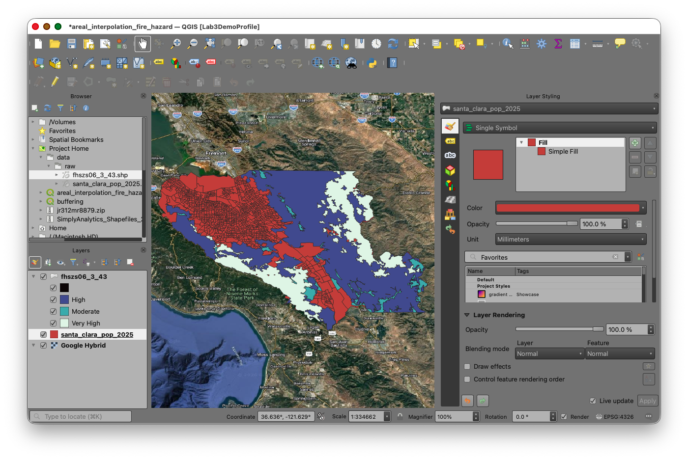

1. Open the attribute table for the block group layer.
2. Open the **Field Calculator**.
3. Create a new field named `P_AREA`.
4. Set the output field type to **Decimal number (real)**.
5. Use the expression:

```qgis
$area
```

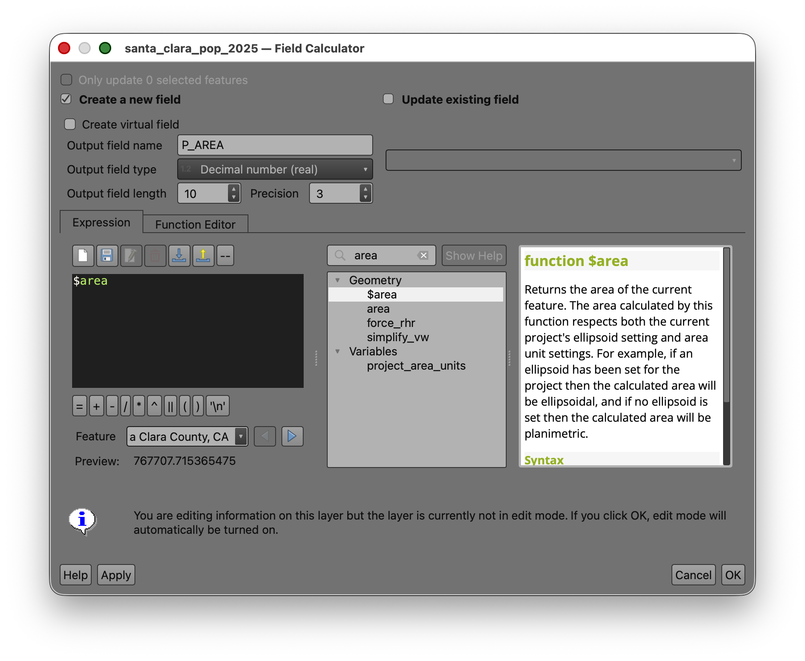

7. Run the calculation.

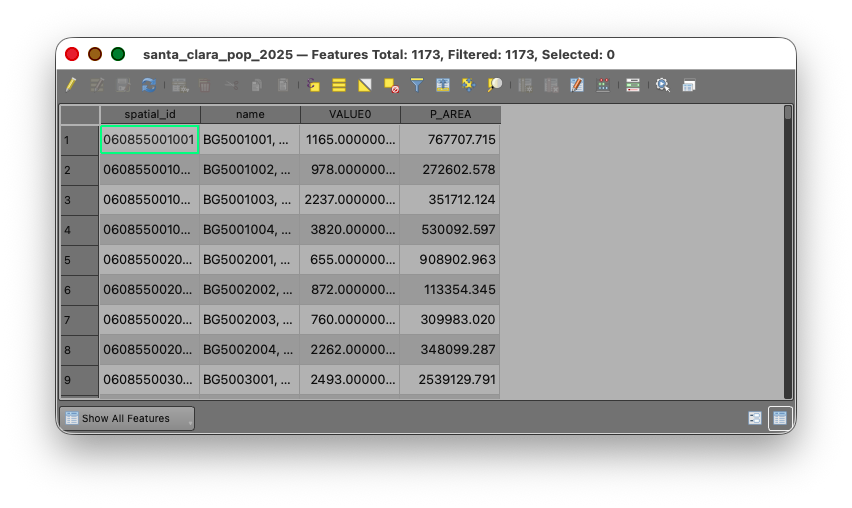

7. Toggle of editing and Save your edits.

> **Concept note:** `P_AREA` stands for **parent area**, meaning the area of the original unsplit source polygon before any overlay operation happens.

If your population field contains whole-number totals, leave that field unchanged. The weighted population field later in the workflow should be stored as a decimal number.

## Part 3: Use Union to Split Block Groups by Fire Hazard Severity Zone

Now create the overlap geometry that makes the interpolation possible.

1. Open the **Processing Toolbox**.
2. Search for **Union**.
3. Use the **Fire Hazard Severity Zone** layer as the **Input layer**.
4. Use the **block group population** layer as the **Overlay layer**.
5. Save the output as `fhsz_union.shp`.
6. Run the tool.

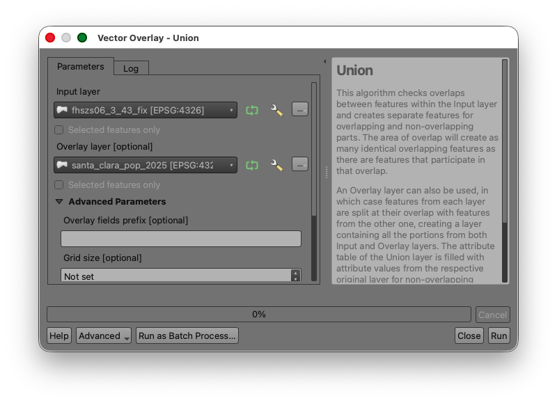

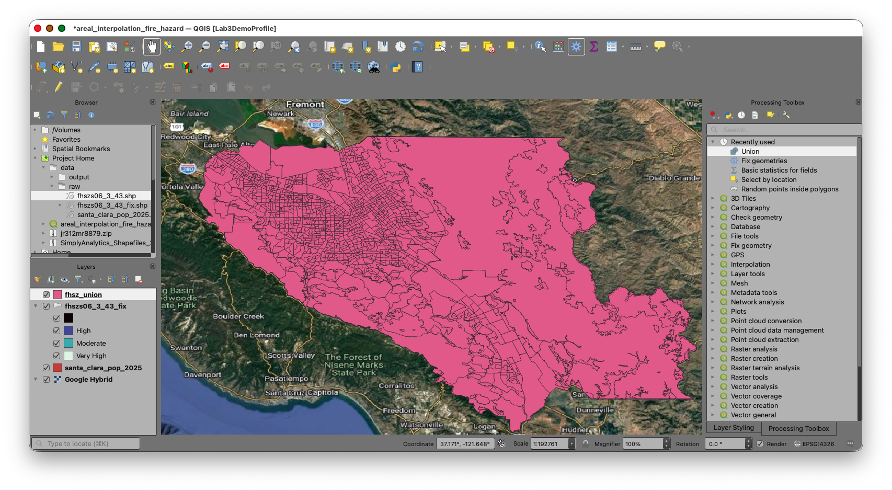

The result should be a new polygon layer containing:

- the Fire Hazard Severity Zone attributes
- the block group attributes
- one feature for each area created where the two boundary systems intersect

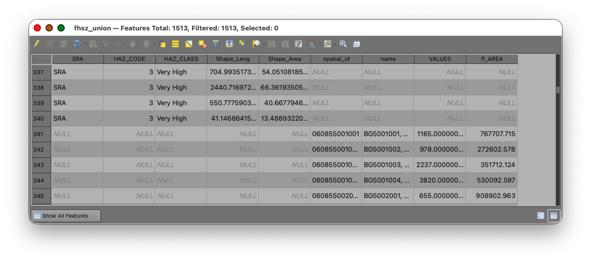

> **Concept note:** The union step creates the new analytical units used in the interpolation. Any block group that crosses a hazard boundary will be divided into smaller child polygons.

## Part 4: Calculate the Child Area of the Overlap Polygons

Now calculate the area of each new polygon in the union layer.

1. Open the attribute table for `fhsz_union`.
2. Open the **Field Calculator**.
3. Create a new field named `CH_AREA`.
4. Set the output field type to **Decimal number (real)**.
5. Use the expression:

```qgis
$area
```

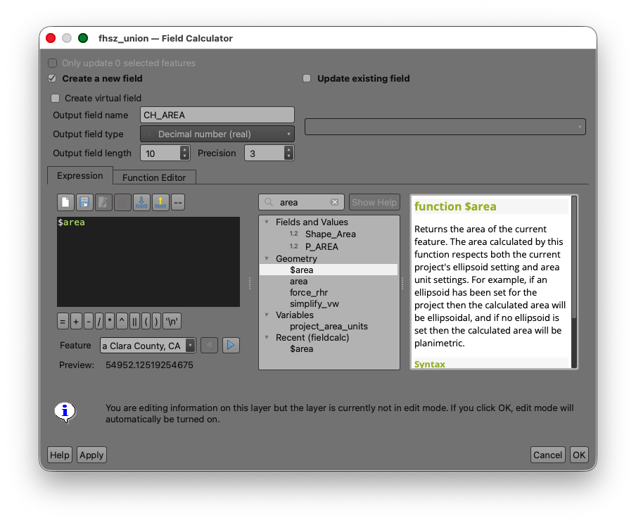

7. Run the calculation.

> **Concept note:** `CH_AREA` stands for **child area**, meaning the area of each smaller overlap polygon created after the source block groups were split.

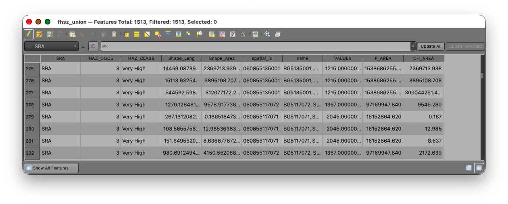

## Part 5: Exclude Records with Null Parent Area

As in the Week 04 watershed interpolation lab, some polygons in the union result may not represent valid source block-group pieces for the weighting step.

1. In the `fhsz_union` attribute table, open **Select features using an expression**.
2. Use:

```qgis
"P_AREA" IS NULL
```

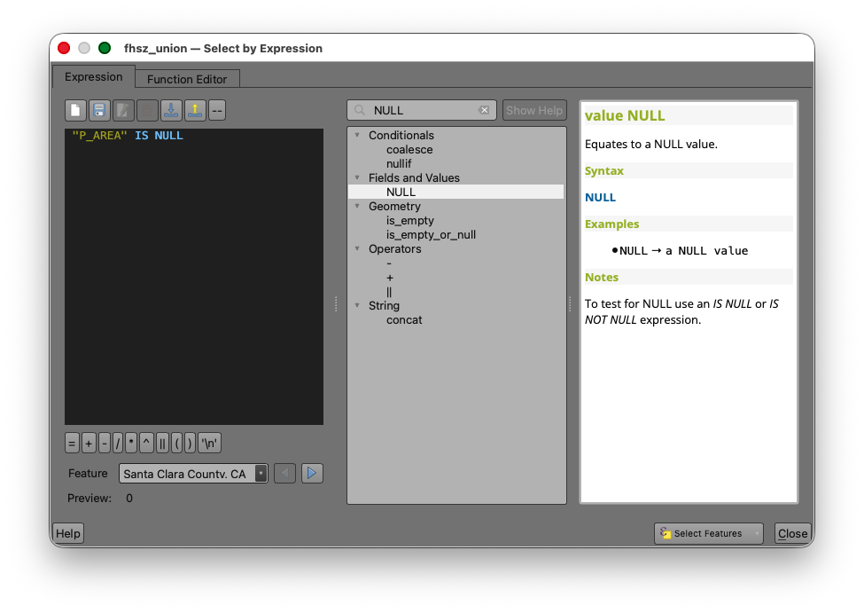

4. Apply the selection.
5. Inspect the selected features on the map.
6. Invert the selection  so that the selected records are the polygons where `P_AREA` **IS NOT** NULL.

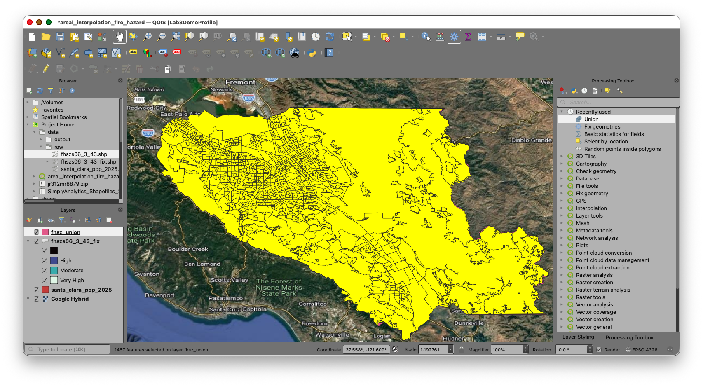

> **Concept note:** This step protects the weighting calculation from null parent-area values. If a record does not have a valid original block-group area, it should not be used in the area-share calculation.

## Part 6: Calculate the Area Weight

Now calculate the proportion of each child polygon relative to its original parent block group.

1. With the non-null records still selected, open the **Field Calculator**  for the union layer.
2. Create a new field named `WEIGHT`.
3. Set the output field type to **Decimal number (real)**.
4. Set a precision that will preserve several decimal places.
5. Use the expression:

```qgis
"CH_AREA" / "P_AREA"
```

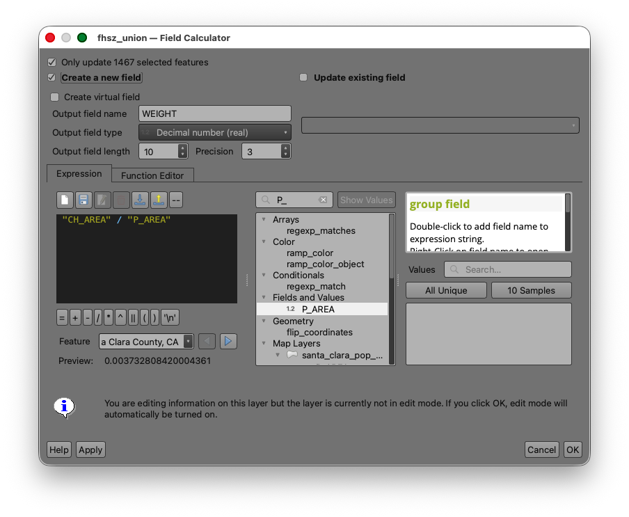

7. Confirm **Only update selected features** is checked.
8. Run the calculation.
9. Toggle off editing.

Inspect several records after the calculation:

- values close to `1` usually indicate a block group piece that stayed mostly intact within a single hazard zone
- smaller values indicate that the original block group has been split across multiple zones

> **Concept note:** The weight is the fraction of the original block group area represented by each overlap polygon. The workflow uses that fraction as a proxy for the fraction of the block group's population assigned to that overlap area.

## Part 7: Calculate Weighted Population

Now apply the area weight to the 2025 block group population values.

1. Open the **Field Calculator** for the union layer.
2. Create a new field named `WT_POP`.
3. Set the output field type to **Decimal number (real)**.
4. Use the expression:

```qgis
"WEIGHT" * "VALUE0"
```

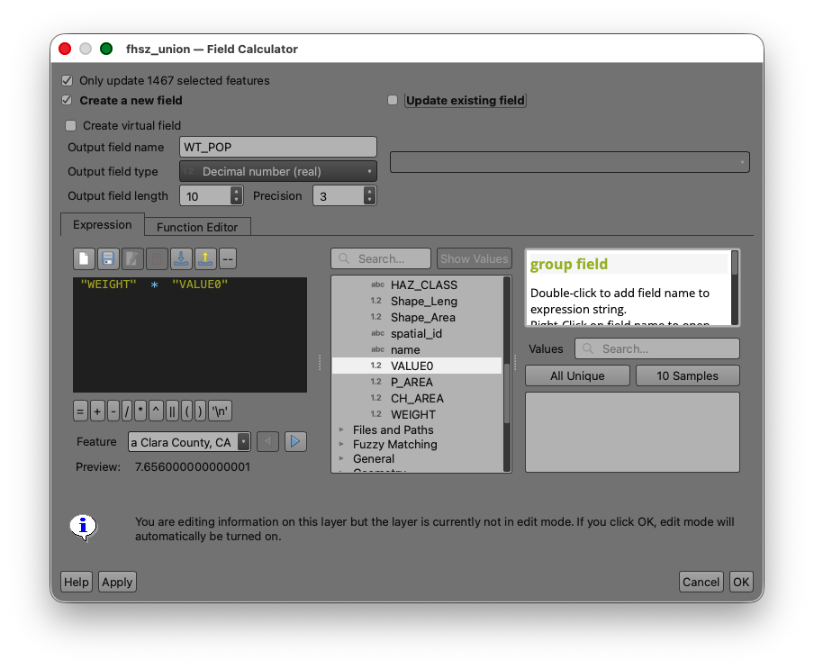

6. Run the calculation.
7. Toggle off editing and save your edits.

> **Concept note:** `WT_POP` is the estimated share of the original block group population assigned to each overlap polygon. When all overlap polygons from one original block group are added together, the result should be approximately that block group's original population total.

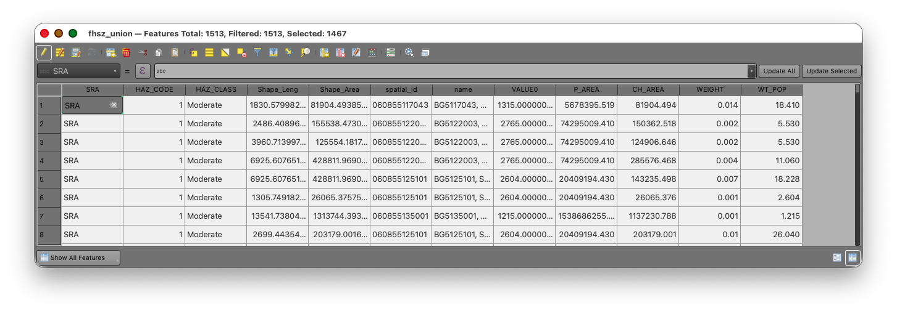

## Part 8: Summarize Population by Fire Hazard Risk Level

Now that each overlap polygon has an estimated population, summarize those weighted values by Fire Hazard Severity Zone risk class.

### Statistics by Categories

1. Search for **Statistics by categories** in the **Processing Toolbox**.
2. Use the union layer as the input table.
3. Use `WT_POP` as the field to calculate statistics on.
4. Use `HAZ_CLASS` and `HAZ_CODE` as the category fields.

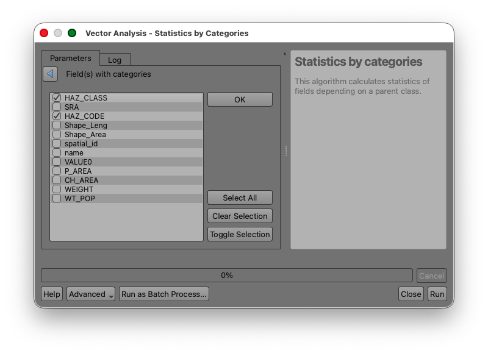

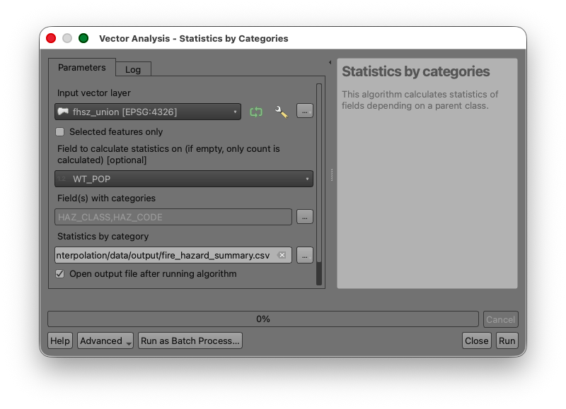

1. Run the tool.

Your output table should show an estimated total population for each hazard risk class, such as `Moderate`, `High`, and `Very High`, under the `SUM` column.

> **Concept note:** This final table is where the interpolation becomes useful. The intermediate polygons are only a method. The real goal is the summarized estimate by the target geography.

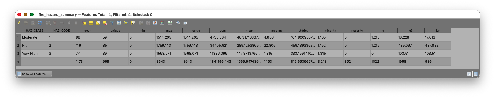

## Deliverable

Prepare and submit:

1. a screenshot of your final summary table showing estimated population by Fire Hazard Severity Zone risk level
2. a short written response identifying which `HAZ_CLASS` contains the largest estimated population
3. a short written response explaining, in one or two sentences, why areal interpolation was necessary for this analysis

If your instructor requests a map, create a simple layout that includes:

- the Fire Hazard Severity Zone polygons
- the block group boundaries or the union layer
- a title
- your name
- the date

## What You Should Understand After This Lab

By the end of this exercise, you should be able to explain:

- why a simple attribute join does not work when polygon boundaries do not match
- how area-based weighting is used to estimate transferred values
- why the summary by target zone happens only after the overlap polygons are created and weighted
