# TURN IN: Network Analysis with QGIS

> **Turn-in for grading:** This lab includes material that must be turned in for grading. Complete the required deliverables and submit them as instructed by the course.

> **Attribution note:** This exercise is adapted from Ujaval Gandhi's tutorial on basic network visualization and routing in QGIS.

## Overview

This lab introduces **network analysis** in QGIS using a street dataset from San Francisco.

In GIS, a network is a connected system of lines and nodes that can model movement. Roads are one of the most common examples. Once a street layer is treated as a network, QGIS can do more than display it. It can use attributes such as one-way direction to calculate legal routes.

In this exercise, you will:

1. load and inspect a street-network dataset
2. symbolize one-way streets with directional arrows
3. use the shortest-path tool to calculate a route between two points
4. create a final layout showing the route

> **Concept note:** A road network is not just a line map. It is an analytical structure where geometry and movement rules both matter.

## Getting Ready

You will need:

- [Streets Active and Retired.zip](../data/Streets%20Active%20and%20Retired.zip)

### Download and unpack the data

1. Download [Streets Active and Retired.zip](../data/Streets%20Active%20and%20Retired.zip).
2. Unzip it somewhere stable on your computer.
3. Create a new project folder for this lab.
4. Save a new QGIS project in that folder as `network_analysis.qgz`.

## Part 1: Add and Inspect the Street Network

The source data comes from DataSF.

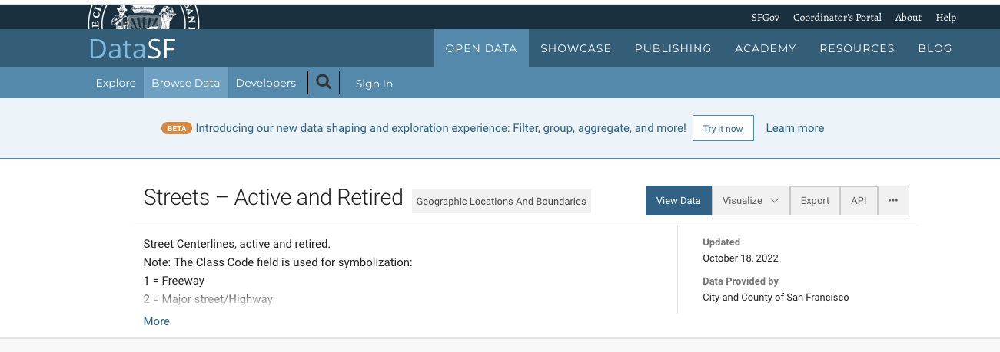

1. In the **Browser** panel, browse to the unzipped **Streets Active and Retired** folder.
2. Add the street shapefile to the map canvas.

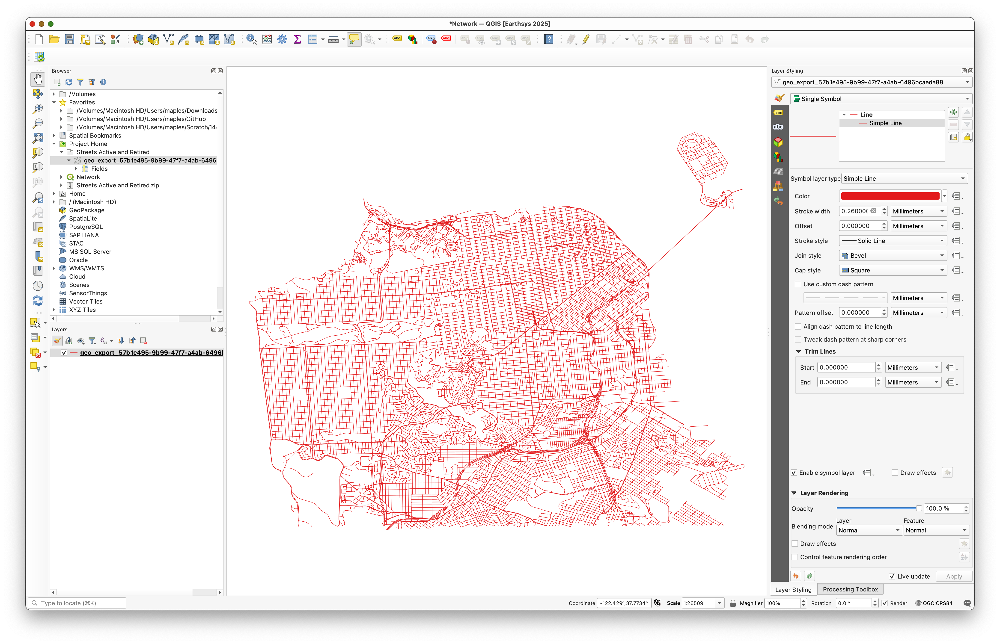

3. Use the **Identify Features** tool and click several road segments.


Pay special attention to the `oneway` field.

Its important values are:

- `F` for one-way in the forward direction
- `T` for one-way in the reverse direction
- `B` for travel allowed in both directions
- `NULL`, which you can treat here as two-way

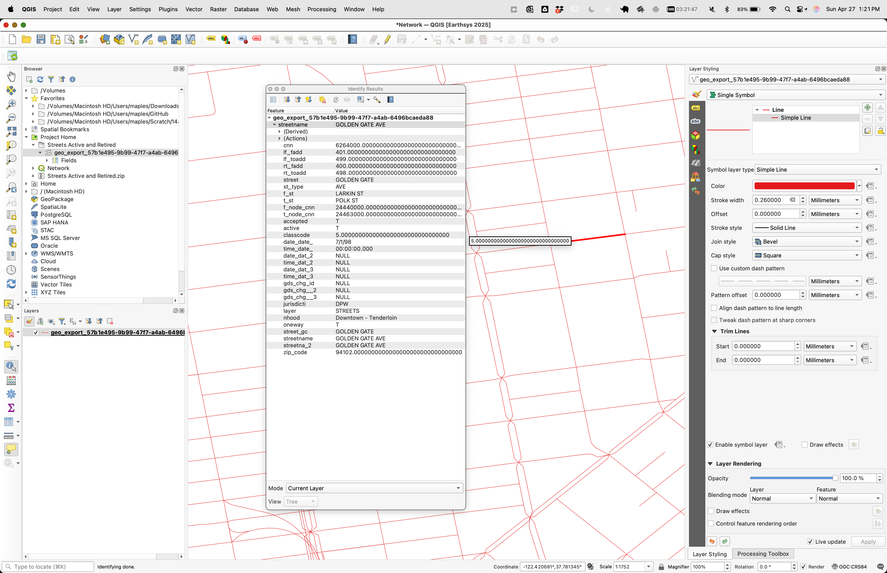

> **Concept note:** Network analysis depends on movement rules stored in attributes. Without fields such as `oneway`, the software cannot tell a legal route from an impossible one.

## Part 2: Symbolize One-Way Streets with Rule-Based Styling

Before doing analysis, make the directionality of the network visible.

1. Open the **Layer Styling** panel.


2. Change the renderer to **Rule-based**.

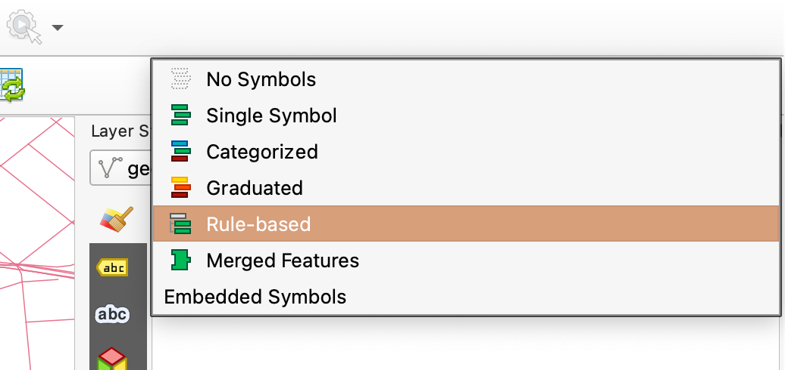

3. Add a new rule.


4. Open the expression builder.


5. Use this expression:

```qgis
"oneway" IN ('F', 'T')
```

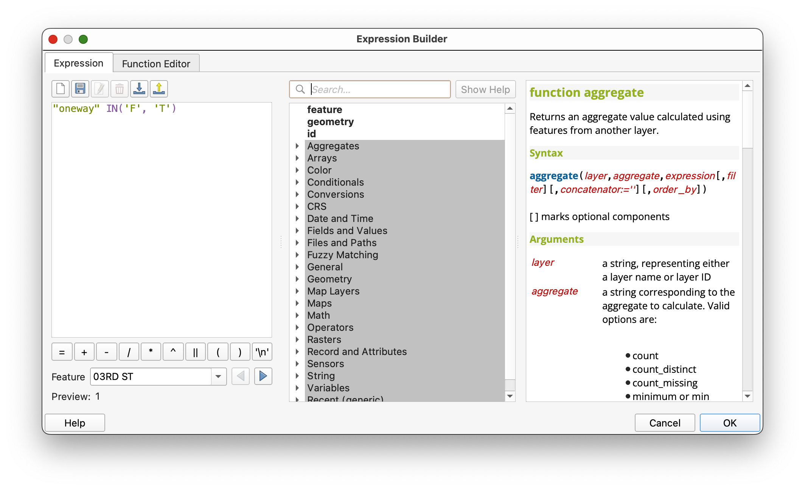

This selects only the one-way street segments.

### Add arrow markers

1. In the symbol settings for that rule, change the symbol layer type to **Marker line**.

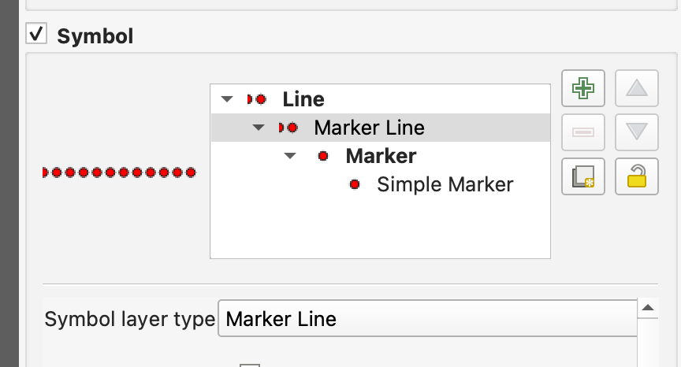

2. Uncheck **With interval**.
3. Set **Marker placement** to **On central point**.

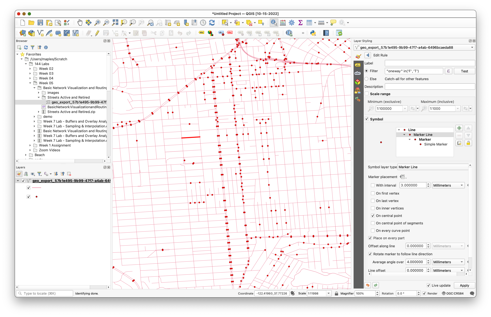

4. Choose a marker such as a filled arrowhead.

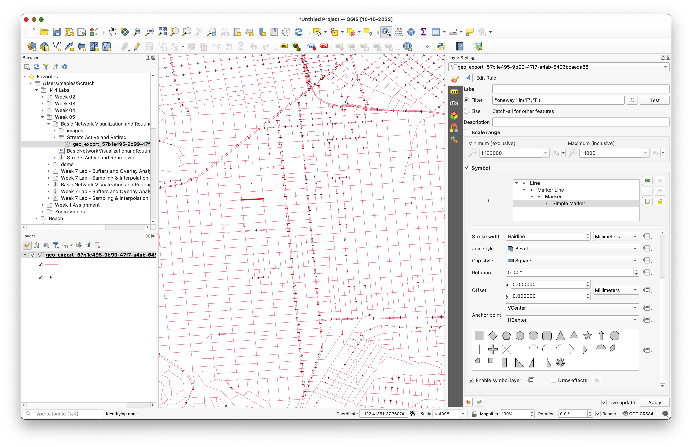

At this point, all arrows may point in the same direction. That is not yet correct.

### Use a data-defined override for rotation

1. Find the **Rotation** option.
2. Open the data-defined override menu.

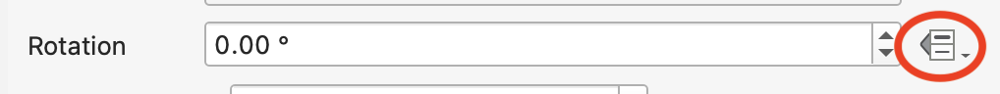

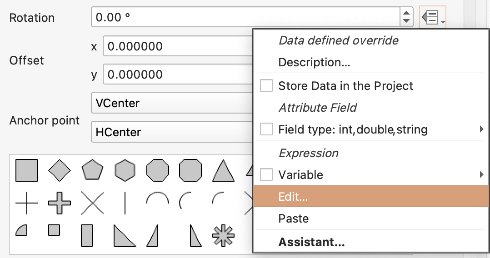

3. Use this expression:

```qgis
if("oneway" = 'T', 180, 0)
```

4. Apply the expression.

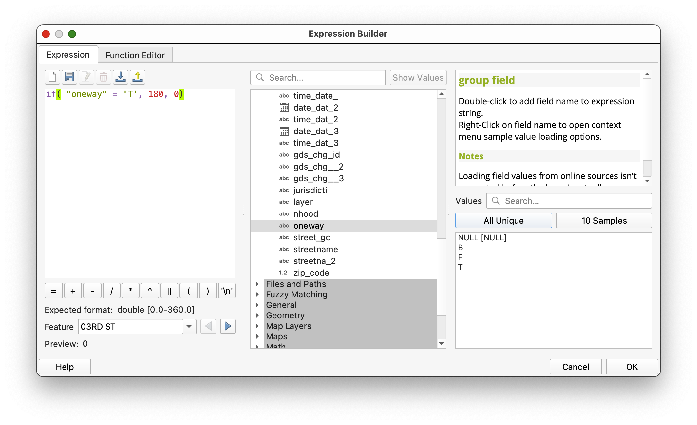

The arrows should now align with the stored traffic direction.

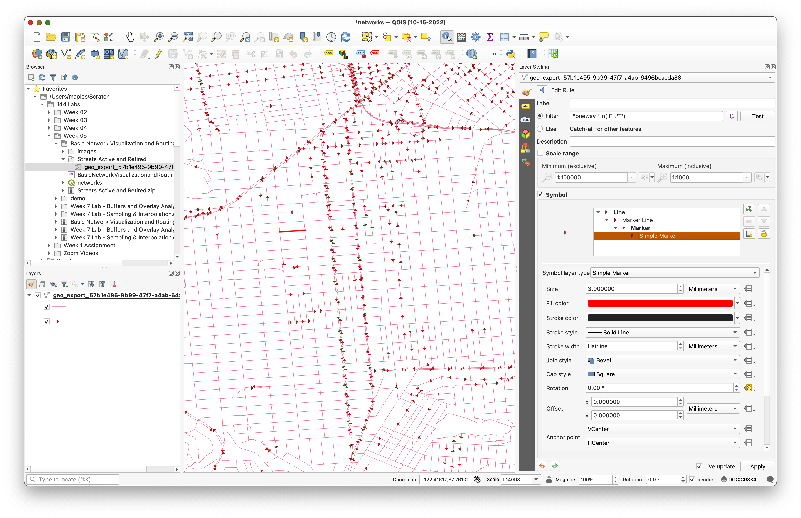

> **Concept note:** This is a good example of cartography supporting analysis. The data is not changing, but the styling is making the movement rules visible.

## Part 3: Calculate a Shortest Path

Now use the network for routing.

1. Open **Processing > Toolbox**.
2. Search for **Shortest path (point to point)**.
3. Open the tool.
4. Set:

- **Vector layer representing network:** the San Francisco streets layer
- **Path type:** `Shortest`

If you want to reproduce the example route, use:

- **Start point:** `-122.422227,37.768156`
- **End point:** `-122.429083,37.750797`

You can type those coordinates directly or use the map picker.


5. Expand the advanced parameters.
6. Set:

- **Direction field:** `oneway`
- **Value for forward direction:** `F`
- **Value for backward direction:** `T`

7. Save the output as `ShortestPath.shp`.
8. Run the tool.

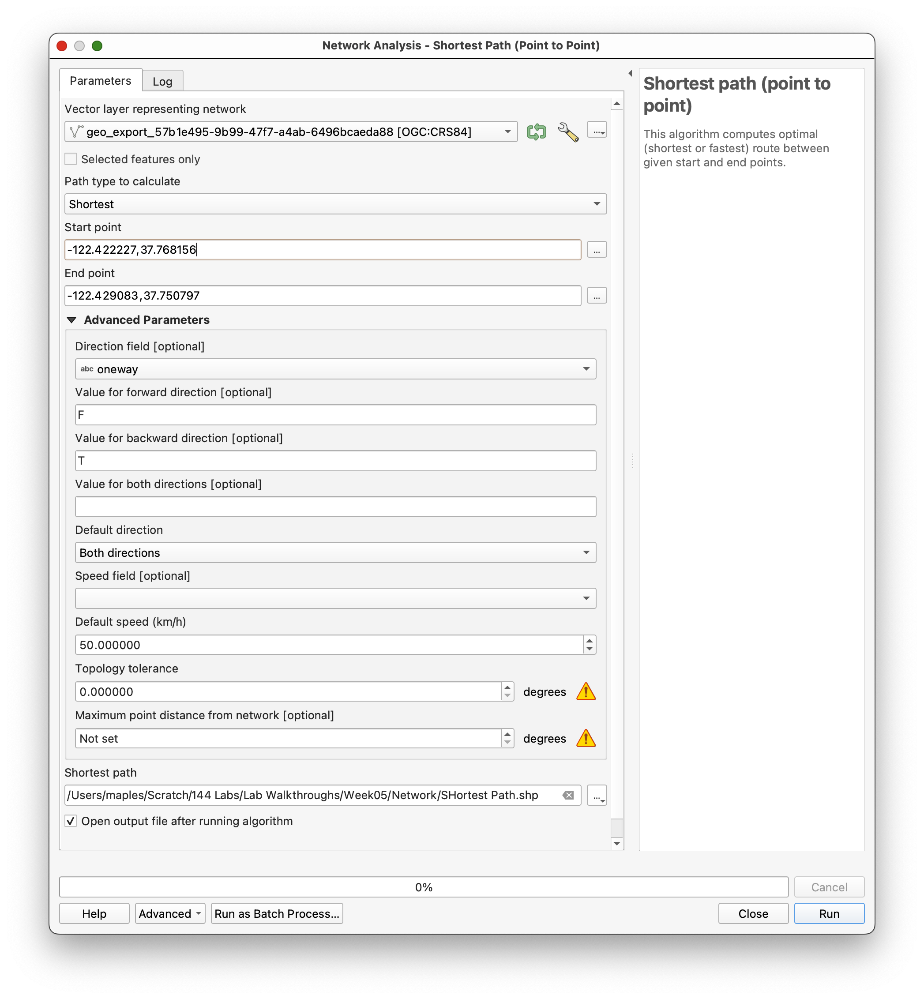

> **Concept note:** The shortest-path tool builds a network graph from the line geometry and the movement rules. The route is shortest only among paths that are valid under those rules.

## Part 4: Inspect and Style the Result

When the tool finishes, QGIS will add the route result as a new layer.

1. Select the `ShortestPath` layer.
2. Style it so it stands out clearly from the street network.

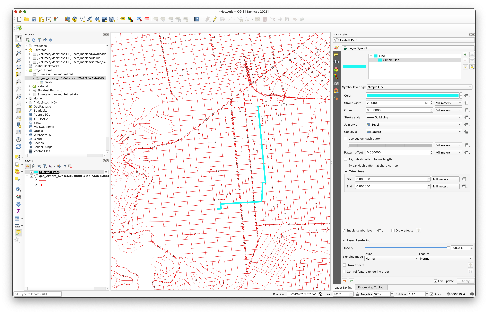

As you inspect the route, think about why it follows that specific path. There may appear to be many visual alternatives, but the shortest legal route still has to respect the one-way constraints stored in the network.

## Deliverable

Create and export a map layout centered on your chosen origin and destination pair.

Include:

- the street network as context
- the shortest path clearly highlighted
- a title
- your name
- the date
- a scale bar
- a legend if it helps interpretation

Choose a basemap or background style that stays visually subordinate to the route.

## What You Should Understand After This Lab

By the end of this exercise, you should be able to explain:

- why a street dataset can be treated as a network
- how the `oneway` field changes both visualization and routing
- why data-defined overrides are useful for network cartography
- how the shortest-path tool uses network geometry and direction rules together
