# Terrain Data Preparation and DEM Merging with QGIS

> **Turn-in for grading:** This lab includes material that must be turned in for grading. Complete the required deliverables and submit them as instructed by the course.

## Overview

This lab introduces a basic raster workflow for preparing and combining elevation data.

You will work with two digital elevation models of the same Minnesota landscape:

- a higher-resolution `3 meter` DEM that covers only the valley bottom
- a lower-resolution `9 meter` DEM that covers the larger surrounding area

The goal is to combine them into one merged DEM that preserves the finer detail where it exists while still covering the full landscape.

To do that, you will:

1. inspect the two DEMs and compare their coverage
2. create hillshades to compare detail visually
3. replace `NoData` cells in the high-resolution DEM
4. resample the coarser DEM to match the finer grid
5. merge the two DEMs using a conditional evaluation
6. style the final terrain surface for map output

> **Concept note:** Raster analysis often depends on matching cell size, extent, and valid-data coverage before layers can be combined meaningfully. A merge workflow is not just about stacking files together. It is about making their grids compatible.

## Getting Ready

You will need:

- [TerrainLabData01.zip](../data/TerrainLabData01.zip)
- WhiteboxTools installed in QGIS

### Install WhiteboxTools if needed

This workflow uses both native QGIS raster tools and **WhiteboxTools**.

1. Confirm that **WhiteboxTools** is installed and available in the **Processing Toolbox**.
2. If you are on macOS and WhiteboxTools is blocked the first time it runs, you may need to allow it in **System Settings > Privacy & Security**.

> **Workflow note:** WhiteboxTools is especially useful in this course because it offers a broader and often clearer set of terrain-analysis tools than QGIS alone.

### Download and unpack the data

1. Download [TerrainLabData01.zip](../data/TerrainLabData01.zip).
2. Unzip it somewhere stable on your computer.
3. Create a project folder for this lab.
4. Save a new QGIS project in that folder as `terrain_merge.qgz`.

## Data for This Exercise

The main raster layers are:

- `valley3.tif`
- `valley9.tif`

Both are DEMs of the same general area, but they differ in resolution and coverage.

All elevation values are in meters, and both rasters are in the same projected coordinate system. The important difference is their cell size and spatial extent.

## Part 1: Add the DEMs and Compare Their Extent

1. Add `valley3.tif` and `valley9.tif` to QGIS.
2. If QGIS prompts you about coordinate transformations, accept the default.
3. Arrange the layers so `valley3` is on top.
4. Toggle the layers on and off to compare their extents.
5. Turn off `valley9` temporarily and inspect the footprint of `valley3`.
6. Use **Identify Features** on the `valley3` raster.
7. Click both inside and outside the visible valley area to compare valid elevation cells with `NoData` cells.

> **Concept note:** The higher-resolution DEM does not cover the whole study area. That incomplete coverage is why the merge is needed.

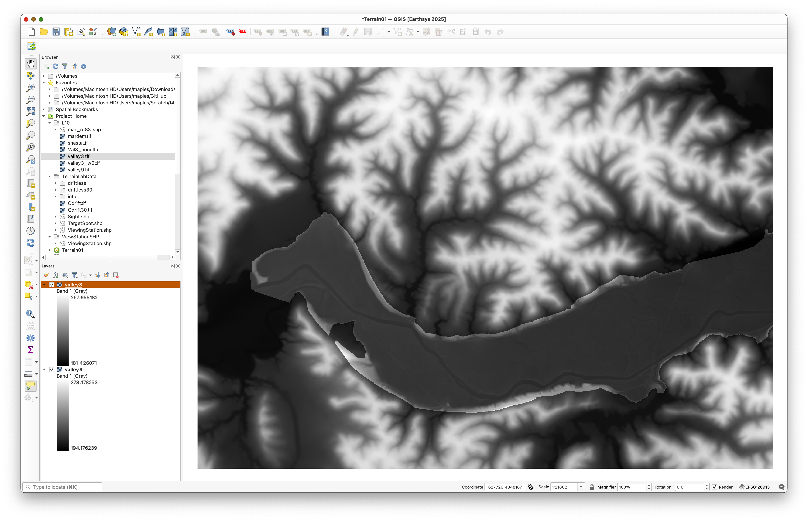

With `valley9` turned off, the `valley3` footprint should appear as a more limited, winding patch of higher-resolution terrain:

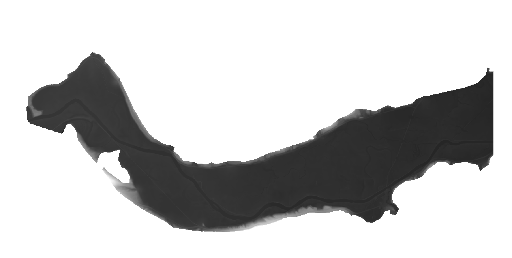

When you use the identify tool, cells outside the real `valley3` coverage should report `NoData`:

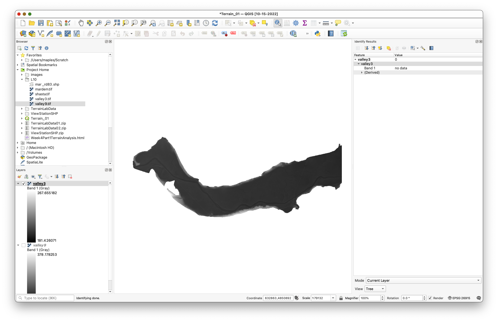

## Part 2: Create Hillshades to Compare Detail

Hillshades make differences in terrain detail easier to see.

1. Open the **Processing Toolbox** and search for **Hillshade**.
2. Run the hillshade tool for `valley3` with:
   - **Azimuth:** `315`
   - **Vertical angle:** `25`
   - **Z factor:** `1`
3. Save the output as `hillshade3.tif`.
4. Repeat the same process for `valley9`.
5. Save the second output as `hillshade9.tif`.
6. Place `hillshade3` above `hillshade9` and compare the terrain detail at different scales.

> **Concept note:** Hillshade is a visualization derived from elevation, not a new measurement of terrain. It is useful here because it makes the resolution difference between the two DEMs easier to interpret visually.

Use settings like these for `valley3`:

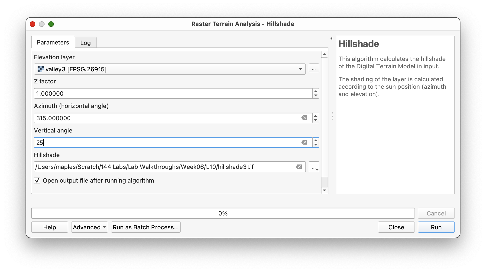

Then repeat for `valley9`:

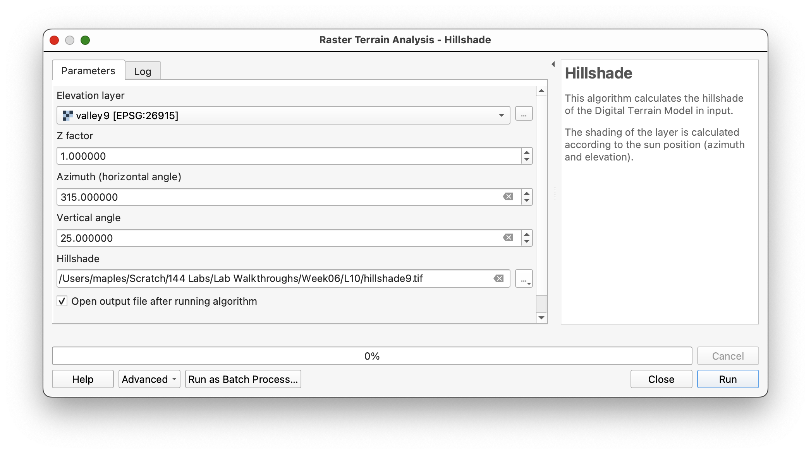

Place `hillshade3` above `hillshade9`:

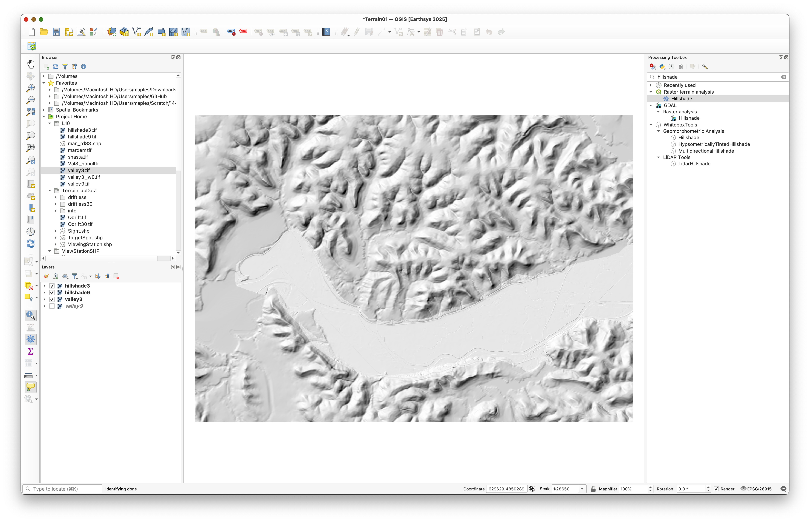

As you zoom in and out, you should be able to see the finer terrain detail preserved in the higher-resolution layer:

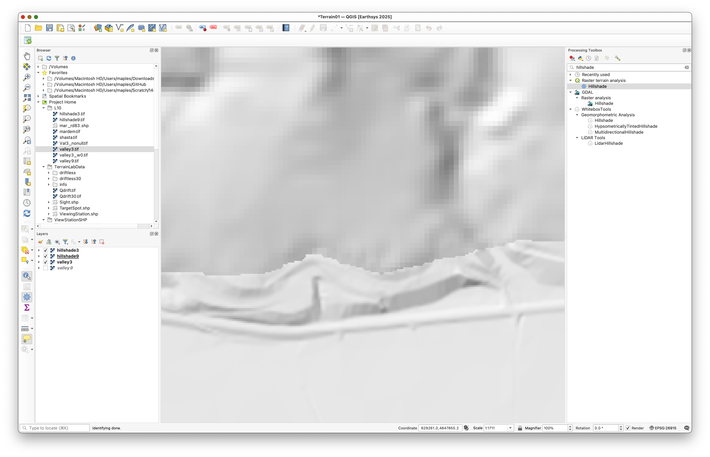

## Part 3: Replace NoData in the High-Resolution DEM

Before combining the DEMs, convert the `NoData` cells in the high-resolution raster to zeros.

1. In the **Processing Toolbox**, search for a **NoData** filling tool.
2. Use **Fill NoData cells** or the closest equivalent available in your QGIS installation.
3. Use `valley3` as the input raster.
4. Set the fill value to `0`.
5. Save the output as `valley3nonull.tif`.

Inspect the output and confirm that the previously transparent `NoData` area is now filled with `0`.

> **Concept note:** Many raster operations return `NoData` whenever any input cell is `NoData`. Converting the missing area to a known placeholder value lets you use a conditional rule later to decide where the high-resolution raster should and should not be used.

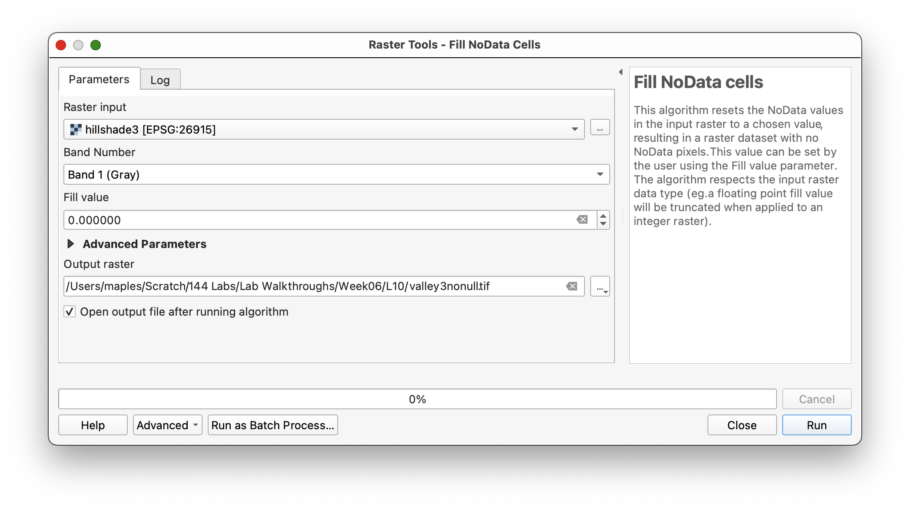

The output should look different from the original because the background that used to be transparent is now filled with `0` values:

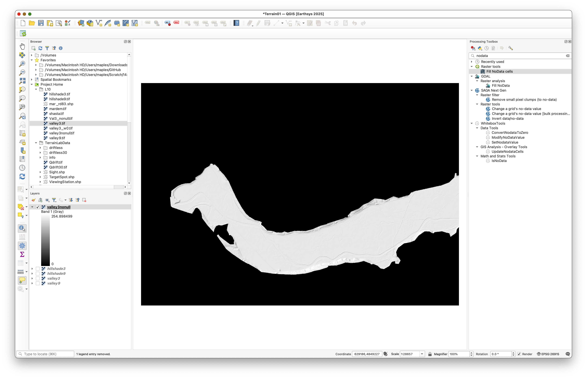

## Part 4: Resample the Coarser DEM to Match the Finer Grid

Now make the `9 meter` DEM match the cell size of the `3 meter` DEM.

1. In the **Processing Toolbox**, search for **Resample** under **WhiteboxTools**.
2. Use `valley9` as the input raster.
3. Use `valley3nonull` as the **base raster** or template layer.
4. Choose **Nearest Neighbor** as the resampling method.
5. Save the output as `valley9_3m.tif`.
6. Run the tool.
7. Open **Layer Properties > Information** for the new raster and verify that the pixel size is `3` by `3` meters.

> **Concept note:** Nearest-neighbor resampling preserves the original elevation values from the coarse DEM. It does not invent smoother intermediate values; it simply fits the original values into a finer grid structure.

When selecting the input file in WhiteboxTools, use the file picker to choose `valley9`:

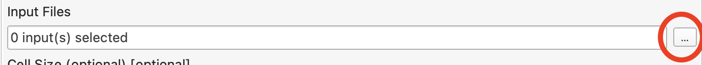

Use `valley3nonull` as the base raster and `nn` for the resample method:

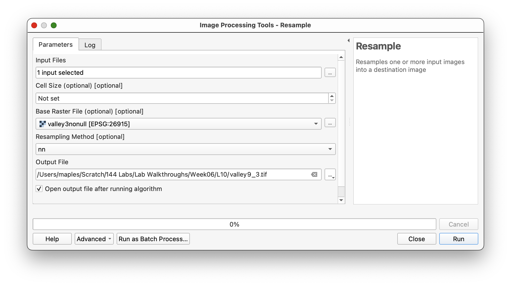

Then check the output layer information to confirm the new pixel size:

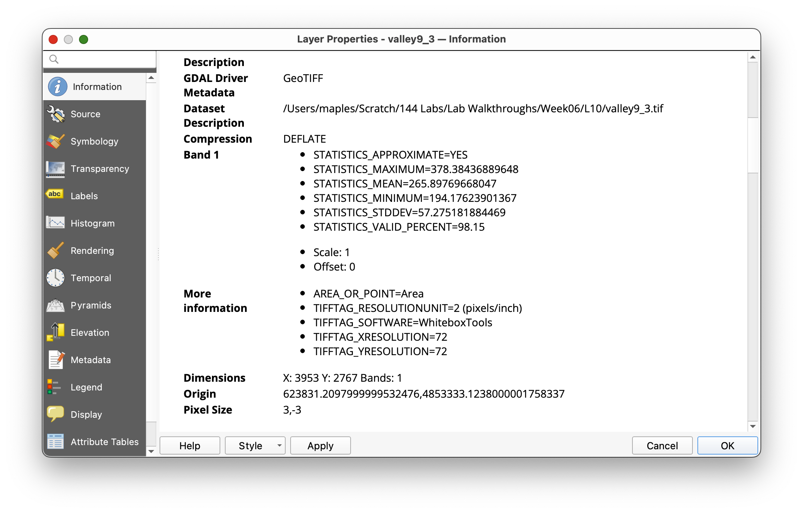

## Part 5: Merge the DEMs with Conditional Evaluation

Now combine the two rasters so the fine DEM is used where it has real data, and the resampled coarse DEM is used everywhere else.

> **Mac note:** In the WhiteboxTools suite, **ConditionalEvaluation** runs as a separate executable. On macOS, the first time this specific tool runs, macOS may block it and QGIS may report an error. If that happens, open **System Settings > Privacy & Security**, as you did in the Week 00 setup, find the blocked WhiteboxTools message, click **Allow Anyway**, and then run **ConditionalEvaluation** again.

1. Search for **ConditionalEvaluation** in **WhiteboxTools**.
2. Set:
   - **Input raster:** `valley3nonull`
   - **Conditional statement:** `value != 0`
   - **Value where TRUE:** `valley3`
   - **Value where FALSE:** `valley9_3m`
3. Save the output as `valley_merged.tif`.
4. Run the tool.

This logic means:

- if the high-resolution raster has a real elevation value, keep it
- if it has `0` from the filled background area, use the resampled coarse DEM instead

> **Concept note:** This is a simple raster map-algebra decision rule. It uses the raster cell value itself to determine which source raster contributes to the final merged DEM.

Use settings like these:

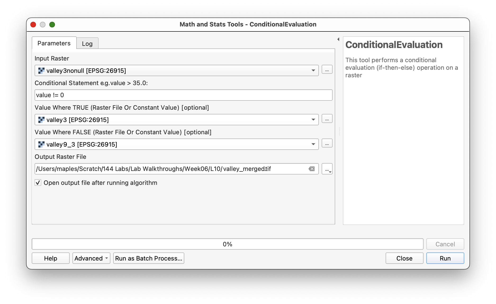

## Part 6: Create and Inspect a Hillshade of the Merged DEM

1. Run the **Hillshade** tool again using `valley_merged` as the elevation layer.
2. Save the output as `hillshade_merged.tif`.
3. Compare the merged hillshade to the earlier hillshades.

You should see:

- finer terrain detail in the valley bottom
- coarser detail in the surrounding uplands
- possibly a visible seam where the two datasets meet

> **Workflow note:** Some checkerboard-like visual patterning may appear depending on zoom scale and display resampling. That is partly a display issue and partly a reminder that the merged DEM contains information from rasters with different original resolutions.

You should see a merged terrain surface with finer detail in the valley bottom and coarser detail in the uplands:

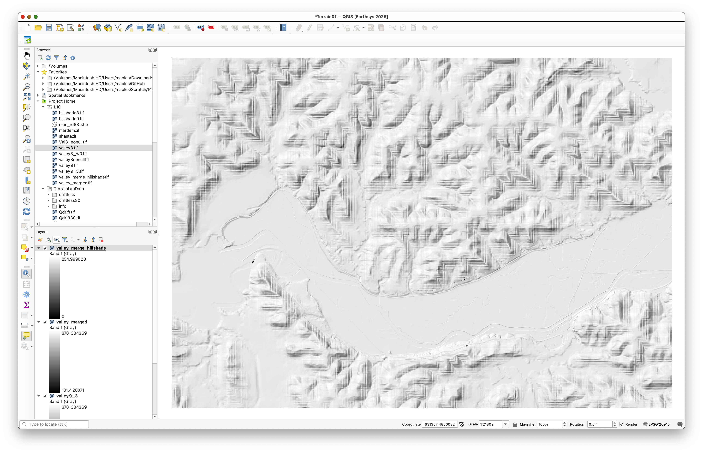

If checkerboard patterning is distracting, adjust the display resampling in layer properties or styling:

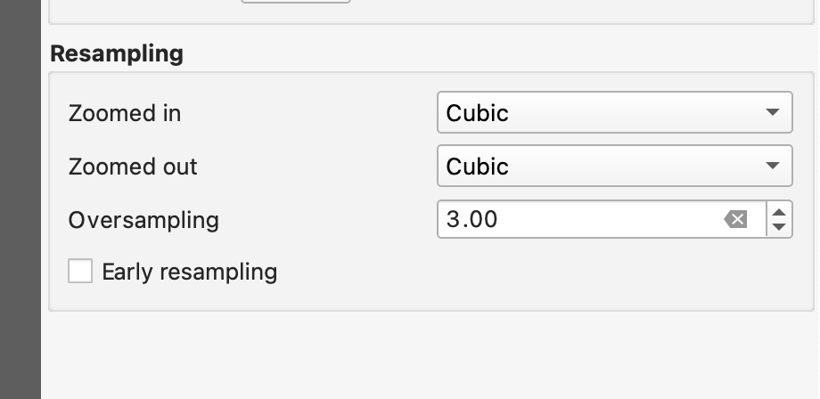

## Part 7: Style the Final DEM for Terrain Visualization

1. Place `valley_merged` above its hillshade layer.
2. Open the **Layer Styling** panel for `valley_merged`.
3. Use:
   - **Singleband pseudocolor**
   - **Linear interpolation**
   - a continuous color ramp of your choice
4. Click **Classify** if needed.
5. Set the DEM layer's **Blending mode** to `Multiply`.

This should allow the hillshade beneath the DEM to contribute subtle topographic shadows while the DEM color ramp provides elevation values.

> **Concept note:** A colored DEM and a hillshade often work well together because the color communicates elevation categories while the hillshade communicates shape and relief.

Use settings similar to these as a starting point:

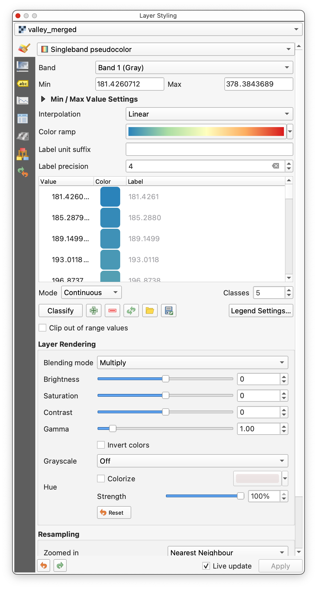

The result should allow the hillshade to enrich the colored DEM:

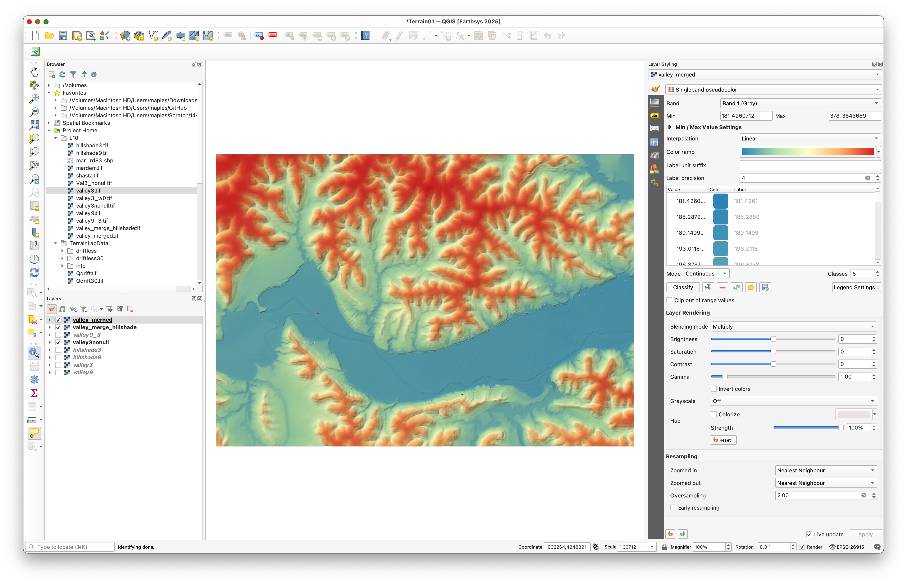

## Deliverable

Create and export a final layout of the merged terrain surface.

Include:

- a title
- the date
- your name
- a scale bar
- a legend
- the CRS name and EPSG code somewhere in the layout

The old exercise expected a full cartographic layout, not just a screenshot of the map canvas. If you want a model for the level of finish expected, aim for something like this:

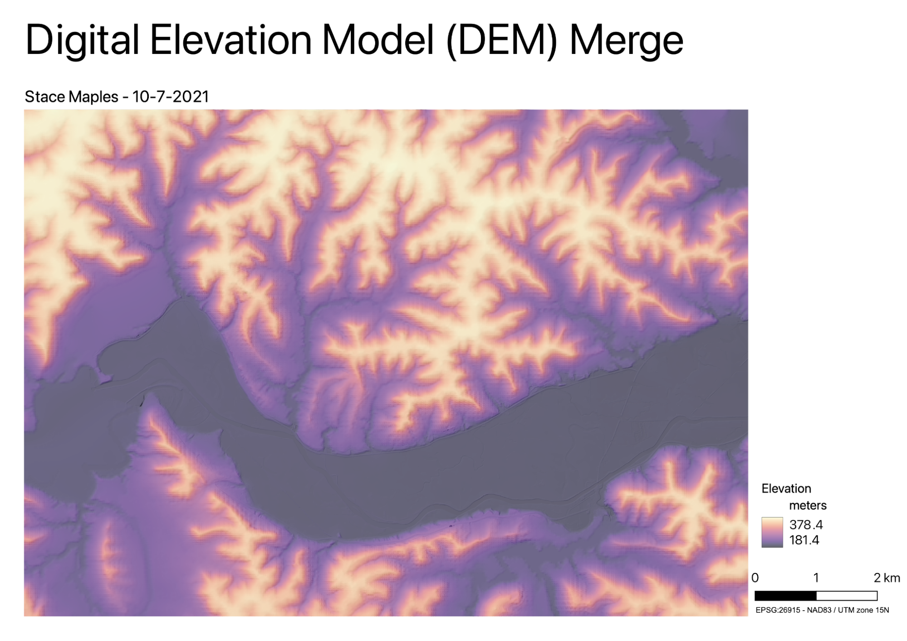

## What You Should Understand After This Lab

By the end of this exercise, you should be able to explain:

- why rasters must often be aligned before they can be merged
- why `NoData` handling matters in raster analysis
- why resampling was required before the conditional merge
- how conditional evaluation can be used to combine two DEMs with different coverage
