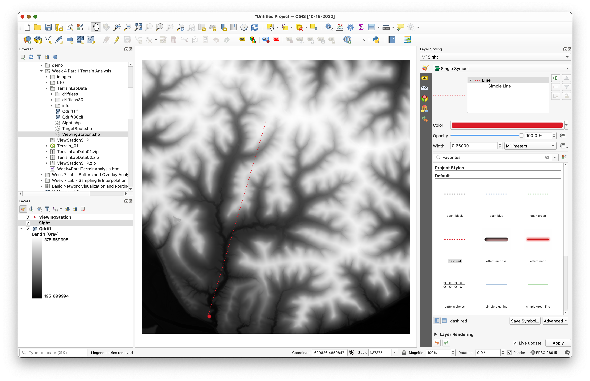
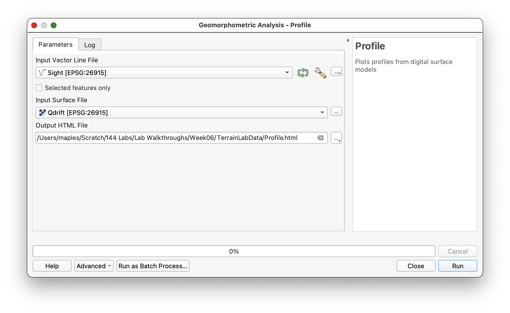
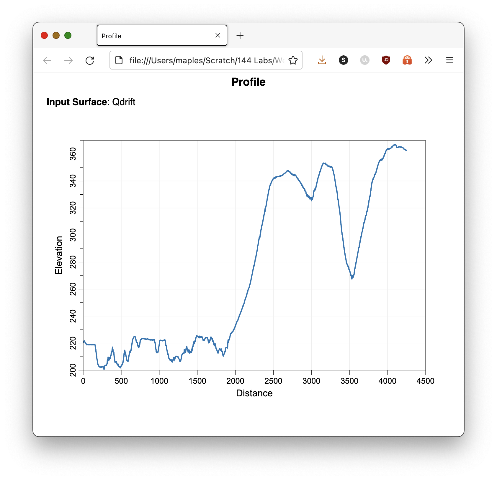
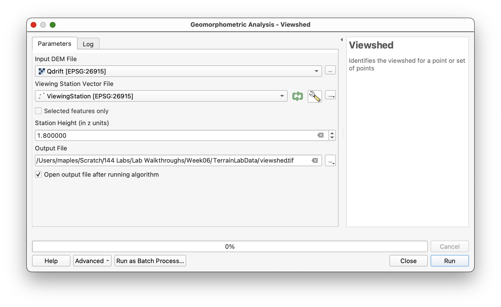
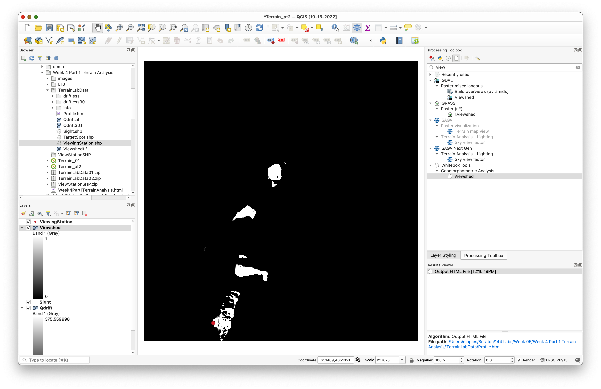
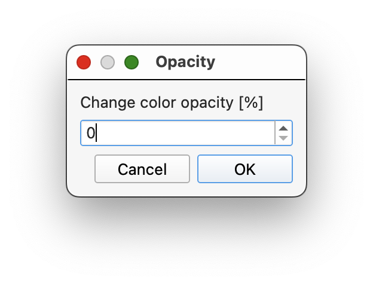
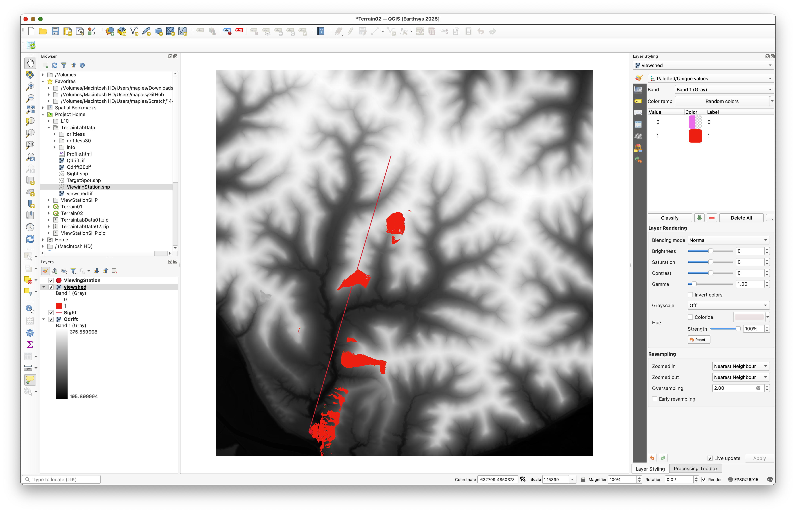

# Visibility Analysis with QGIS

> **Turn-in for grading:** This lab includes material that must be turned in for grading. Complete the required deliverables and submit them as instructed by the course.

## Overview

This lab introduces two related terrain-analysis workflows:

1. generating an elevation profile along a line of sight
2. calculating a viewshed from an observation point

Both workflows use a DEM to ask questions about what the terrain allows someone to see.

You will:

1. load a terrain model and line-of-sight features
2. create a terrain profile along a specified line
3. run a viewshed from a viewing station
4. style the results for interpretation and map output

> **Concept note:** Visibility analysis depends on both the elevation surface and the observer location. A DEM is not just a background image here; it is the mathematical surface used to test whether terrain blocks or allows visibility.

## What You Should Understand After This Lab

By the end of this exercise, you should be able to explain:

- how a terrain profile differs from a viewshed
- why observer location and observer height matter in visibility analysis
- how DEM-based visibility analysis uses the terrain surface to evaluate line of sight

## Getting Ready

You will need:

- [Visibility_Analysis.zip](../data/Visibility_Analysis.zip), which includes the updated viewing-station shapefile
- WhiteboxTools installed in QGIS. If needed, see [Installing Whitebox Tools](../week00/11_installing_whitebox_tools.md).

### Download and unpack the data

1. Download [Visibility_Analysis.zip](../data/Visibility_Analysis.zip).
2. Unzip the file somewhere stable on your computer.
3. Create a project folder for this lab.
4. Save a new QGIS project in that folder as `visibility_analysis.qgz`.

## Data for This Exercise

The main files are:

- `Qdrift.tif`
- `ViewingStation.shp`
- `sight.shp`

All are in `NAD83 UTM Zone 15` with elevation values in meters.

## Part 1: Set Up the Visibility Project

1. Start a new QGIS project.
2. Add `Qdrift.tif`, `ViewingStation.shp`, and `sight.shp`.
3. Move the shapefiles above the DEM if needed.
4. Use the **Layer Styling** panel to make the viewing station and line of sight easier to see.

> **Concept note:** The point layer identifies the observer location. The line layer identifies a specific directional slice through the terrain that will be used for the elevation profile.

Your starting map should look something like this, with the viewing station and sight line visible over the DEM:

## Part 2: Create a Terrain Profile

Use the profile tool to examine how elevation changes along the line of sight.

1. Open the **Processing Toolbox**.
2. Search for **Profile** in **WhiteboxTools**.
3. Set:
   - **Input surface file:** `Qdrift`
   - **Input vector line file:** `sight.shp`
4. Save the HTML output to your project folder.
5. Run the tool.

The tool should open a browser page or HTML output showing the terrain profile along the line.

Take a screenshot of that profile for later use in your final layout.

> **Concept note:** A terrain profile reduces the 3D terrain surface to a 2D cross-section along one line. It is useful for seeing ridges, depressions, and potential sight obstructions along a chosen path.

Use settings like these:

The output should open as an HTML page in your browser:

## Part 3: Create a Viewshed

Now calculate which parts of the DEM are visible from the viewing station.

1. In the **Processing Toolbox**, search for **Viewshed** under **WhiteboxTools**.
2. Set:
   - **Input DEM:** `Qdrift`
   - **Input viewing station file:** `ViewingStation`
   - **Station height:** `1.8`
3. Save the output as `viewshed.tif`.
4. Run the tool.

The output should show visible and not-visible areas as raster values.

> **Concept note:** The station height represents the observer's eye height above the ground. Changing it changes the visibility result because the line of sight begins from a different elevation above the terrain surface.

Use settings like these:

The raw output will usually look something like this before you restyle it:

## Part 4: Style the Viewshed for Interpretation

The default grayscale output is not especially useful, so restyle it.

1. Select the `viewshed` layer.
2. Open the **Layer Styling** panel.
3. Change the render type from **Singleband gray** to **Paletted/Unique values**.
4. Click **Classify**.
5. For the class representing non-visible cells, change the opacity to `0`.
6. For the class representing visible cells, choose a clear color of your choice.

This should allow the visible area to display on top of the DEM while leaving the non-visible area transparent.

> **Concept note:** Making the invisible areas transparent helps the visibility result function as an analytical overlay rather than as a separate raster competing visually with the terrain beneath it.

The old workflow specifically used the palette classification step and then changed the classes manually:

Your styled result should allow the visible area to stand out clearly over the DEM:

## Deliverable

Create and export a final layout that includes:

- the DEM as terrain context
- the viewing station
- the styled viewshed result
- the line of sight
- a screenshot of the profile result placed in the layout
- a title
- your name
- the date
- a scale bar
- a legend if it helps interpretation

Take and save the profile screenshot before you close the browser output, since it is part of the expected final layout from the original workflow.
