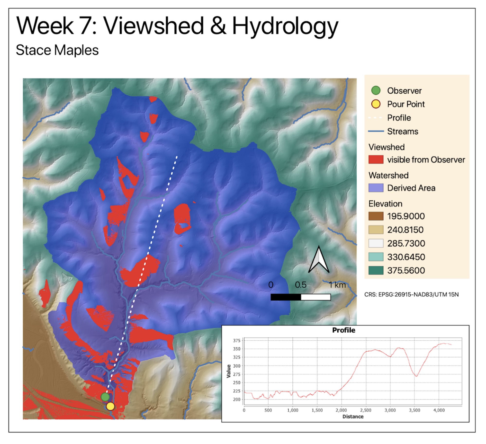

# Watershed with QGIS & WhiteBox Tools

> **Turn-in for grading:** This lab includes material that must be turned in for grading. Complete the required deliverables and submit them as instructed by the course.

## Overview

This lab introduces a basic **watershed modeling** workflow using a digital elevation model and **WhiteboxTools** inside QGIS.

You will use elevation data to derive:

1. a filled DEM
2. a flow-direction raster
3. a flow-accumulation raster
4. a reclassified stream raster
5. a snapped pour point
6. a watershed boundary
7. a vector stream network

The main idea is that a DEM can be treated as a surface across which water flows. Once flow direction and flow accumulation are derived, they can be used to estimate stream locations and delineate the area draining to a chosen outlet point.

> **Concept note:** A watershed is the area of land where water drains to a common outlet. In raster hydrology, that outlet is often represented by a **pour point** placed on a modeled stream cell.

## Getting Ready

You will need:

- [L12.zip](../data/L12.zip)
- WhiteboxTools installed in QGIS

### Download and unpack the data

1. Download [L12.zip](../data/L12.zip).
2. Unzip it somewhere stable on your computer.
3. Create a project folder for this lab.
4. Save a new QGIS project in that folder as `watershed_modeling.qgz`.

## Data for This Exercise

The key input is the DEM:

- `Qdrift.tif`

You may also reuse supporting layers from the visibility lab if they are included in your local copy of the data.

All data are in a projected coordinate system with horizontal units in meters and elevation values in meters.

## Part 1: Run the Flow Accumulation Full Workflow

Start by generating the core hydrologic rasters from the DEM.

1. Add `Qdrift.tif` to QGIS.
2. Open the **Processing Toolbox**.
3. Expand **WhiteboxTools > Hydrological Analysis** if you want to browse the available tools before running the workflow.
4. Search for **FlowAccumulationFullWorkflow** in **WhiteboxTools**.
5. Set:
   - **Input DEM file:** `Qdrift`
   - **Output type:** `Cells`
6. Save the outputs as:
   - `filled.tif`
   - `flowdirection.tif`
   - `flowaccumulation.tif`
7. Run the tool.

After it finishes, inspect the new layers and turn off all but `flowaccumulation`.

> **Concept note:** This single workflow tool bundles several foundational hydrologic steps. It fills pits in the DEM, computes flow direction, and accumulates upstream contributing cells downslope.

You should see the Whitebox hydrological toolset available in the Processing Toolbox:

Use settings like these for the full workflow:

After running the tool, the flow accumulation layer may look faint at first:

## Part 2: Inspect the Flow Accumulation Raster

The default display may not show the actual value range clearly.

1. Open the **Layer Styling** panel for `flowaccumulation`.
2. Expand the **Min / Max Value Settings** section.
3. Change the accuracy setting to **Actual (slower)**.

This should update the displayed maximum value to something closer to the real range of the raster.

> **Concept note:** Flow accumulation values count or estimate how many upstream cells drain through each cell. High values usually indicate likely stream channels or major drainage paths.

Use the actual-value option here:

## Part 3: Reclassify Flow Accumulation to Approximate a Stream Network

Now turn the flow-accumulation raster into a simple stream raster by thresholding the values.

1. Search for **Reclassify by table** in the QGIS raster-analysis tools.
2. Use `flowaccumulation` as the input raster.
3. In the advanced parameters, check **Use no data when no range matches value**.
4. Open the reclassification table editor and add:

- Row 1:
  - **Minimum:** leave blank
  - **Maximum:** `29999`
  - **Value:** `0`
- Row 2:
  - **Minimum:** `30000`
  - **Maximum:** leave blank
  - **Value:** `1`

5. Save the output as `Streams.tif`.
6. Run the tool.

This should create a raster where cells meeting the threshold are classified as part of the modeled stream network.

> **Concept note:** The threshold is a modeling choice. A lower threshold will create more stream cells; a higher threshold will create a smaller, more selective stream network.

Open the reclassification table dialog like this:

And enter the threshold table like this:

The resulting stream raster should contain only the modeled stream cells:

## Part 4: Create a Pour Point

Before delineating the watershed, create an outlet point on the modeled stream.

1. Use **Layer > Create Layer > New Shapefile Layer**.
2. Create a new **point** shapefile named `PourPoint.shp`.
3. Use the same CRS as the rest of the project.
4. Place the `Streams` layer so it is visible beneath the new pour-point layer.
5. Start editing `PourPoint`.
6. Digitize a single point on or as close as possible to a stream cell in the lower part of the drainage network.
7. Save the edit and stop editing.

> **Concept note:** The watershed result depends strongly on outlet placement. If the point is not actually on the drainage network, the modeled watershed may not correspond to the stream system you intended.

Create the new point shapefile like this:

Then zoom to the lower-left drainage area and place the point on the stream network:

The old lab emphasized placing the point as close to on top of a stream pixel as possible:

You will need to toggle editing and use the Add Point Feature tool:

## Part 5: Snap the Pour Point to the Stream Network

To make sure the outlet is aligned correctly with the modeled drainage, snap it to the nearest high-flow cell.

1. Search for **SnapPourPoints** in **WhiteboxTools**.
2. Set:
   - **Input outlets file:** `PourPoint.shp`
   - **Flow accumulation raster:** `flowaccumulation`
   - **Snap distance:** `9`
3. Save the output as `SnappedPoint.shp`.
4. Run the tool.

Zoom in and compare the original pour point with the snapped point.

> **Concept note:** Snapping adjusts the outlet so it aligns with the modeled drainage pattern. This is important because a watershed is only meaningful if the outlet sits on the flow network the model has actually derived from the DEM.

Use settings like these:

Then compare the original point and the snapped point:

## Part 6: Delineate the Watershed

Now create the watershed draining to the snapped outlet.

1. Search for **Watershed** in **WhiteboxTools**.
2. Set:
   - **D8 pointer file:** `flowdirection`
   - **Input pour points:** `SnappedPoint.shp`
3. Save the output as `watershed.tif`.
4. Run the tool.

Use settings like these:

## Part 7: Style the Watershed Raster

The default grayscale styling is not especially helpful, so restyle the watershed similarly to the viewshed workflow.

1. Select the `watershed` layer.
2. Open the **Layer Styling** panel.
3. Change the render type to **Paletted/Unique values**.
4. Click **Classify**.
5. Change the watershed class to a color you can read clearly over the terrain.
6. Reduce its opacity so the DEM remains visible underneath.

> **Concept note:** Semi-transparent styling works well here because the watershed is an analytical overlay. You usually want to see both the watershed extent and the terrain context beneath it.

Your styled watershed should look something like this:

## Part 8: Convert the Stream Raster to Vector Lines

Now convert the reclassified stream raster into a vector stream network.

1. Search for **RasterStreamsToVector** in **WhiteboxTools**.
2. Set:
   - **Input streams file:** `Streams.tif`
   - **D8 pointer file:** `flowdirection`
3. Save the output as `StreamNet.shp`.
4. Run the tool.

Style the resulting vector streams so they are visible on top of the DEM and watershed.

> **Concept note:** Raster hydrology often produces raster intermediate outputs, but vector conversion can make the final stream network easier to symbolize and combine with other GIS layers.

Use settings like these:

The vector stream output should appear as line features:

## Deliverable

Create and export a final layout showing:

- `Qdrift.tif` with hillshade or other useful terrain styling
- `watershed.tif` with transparency
- `SnappedPoint.shp`
- `StreamNet.shp`

If you want to build a richer layout, you may also include the visibility-analysis layers from the previous lab.

Include:

- a title
- your name
- the date
- a scale bar
- a legend if it helps interpretation

The original Week 05 watershed workflow expected a richer final layout, and students were encouraged to reuse the viewshed and profile outputs from the previous visibility lab. If you want to build a fuller terrain-analysis composition, include:

- `ViewingStation.shp`
- `sight.shp`
- the styled `viewshed.tif`
- the saved profile screenshot from the visibility lab

An example of the level of layering and composition expected is shown here:

## What You Should Understand After This Lab

By the end of this exercise, you should be able to explain:

- why flow accumulation can be used to approximate stream channels
- why a pour point needs to be placed and snapped carefully
- how a flow-direction raster supports watershed delineation
- why stream extraction from a DEM depends on a threshold choice
