# Watershed with QGIS and WhiteboxTools

> **Turn-in for grading:** This lab includes material that must be turned in for grading. Complete the required deliverables and submit them as instructed by the course.

## Overview

This lab introduces a basic **watershed modeling** workflow using a digital elevation model, or DEM, and **WhiteboxTools** inside QGIS.

You will use elevation data to derive:

1. a filled DEM
2. a flow-direction raster
3. a flow-accumulation raster
4. a reclassified stream raster
5. a snapped pour point
6. a watershed raster
7. a vector stream network

The main idea is that a DEM can be treated as a surface across which water flows. Once flow direction and flow accumulation are derived from the elevation surface, they can be used to estimate stream locations and delineate the area draining to a chosen outlet point.

> **Concept note:** A watershed is the area of land where water drains to a common outlet. In raster hydrology, that outlet is often represented by a **pour point** placed on a modeled stream cell.

## What You Should Understand After This Lab

By the end of this exercise, you should be able to explain:

- why flow accumulation can be used to approximate stream channels
- why a pour point needs to be placed and snapped carefully
- how a flow-direction raster supports watershed delineation
- why stream extraction from a DEM depends on a threshold choice

## Getting Ready

You will need:

- [WatershedDelineation.zip](../data/WatershedDelineation.zip)
- WhiteboxTools installed in QGIS. If you have not installed or configured it yet, use the Week 00 guidance for [installing QGIS and WhiteboxTools](../week00/07_installing_qgis_and_plugins.md#whiteboxtools-plugin).

### Download and unpack the data

1. Download [WatershedDelineation.zip](../data/WatershedDelineation.zip).
2. Unzip it somewhere stable on your computer.
3. Create a project folder for this lab.
4. Save a new QGIS project in that folder as `watershed_modeling.qgz`.

## Data for This Exercise

The key input is the DEM:

- `Qdrift.tif`

This file is included in `WatershedDelineation.zip`.

All data are in a projected coordinate system with horizontal units in meters. The DEM elevation values are also in meters.

## Part 1: Run the Flow Accumulation Full Workflow

Start by generating the core hydrologic rasters from the DEM. These layers are the foundation for the rest of the workflow, so it is worth understanding what each output represents before moving on.

1. Add `Qdrift.tif` to QGIS.
2. Open the **Processing Toolbox**.
3. Expand **WhiteboxTools > Hydrological Analysis** if you want to browse the available tools before running the workflow.
4. Search for **FlowAccumulationFullWorkflow** in **WhiteboxTools**.
5. Set:
   - **Input DEM file:** `Qdrift`
   - **Output type:** `Cells`
6. Save the outputs as:
   - `filled.tif`
   - `flowdirection.tif`
   - `flowaccumulation.tif`
7. Run the tool.

After it finishes, inspect the new layers and turn off all but `flowaccumulation`.

> **Concept note:** This single workflow tool bundles several foundational hydrologic steps. It fills pits in the DEM, computes flow direction, and accumulates upstream contributing cells downslope.
>
> The **filled DEM** is a corrected elevation surface. Small artificial pits or depressions in a DEM can trap modeled water and interrupt flow paths, even when those pits are caused by data noise rather than real landforms. Filling the DEM creates a surface that allows water to continue moving downslope.
>
> The **flow-direction raster** stores the direction water would leave each cell. In this lab, the tool uses a D8 flow model, which means water from each cell is routed to one of its eight neighboring cells. This raster is not usually a final map product, but it is essential because later tools need to know how cells are connected downslope.
>
> The **flow-accumulation raster** counts how many upstream cells drain through each cell. Low values usually occur on ridges or hillslopes. High values occur where many upslope cells converge, which is why flow accumulation is useful for estimating likely stream channels.

You should see the Whitebox hydrological toolset available in the Processing Toolbox:

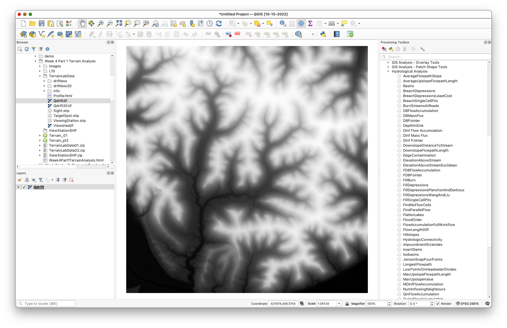

Use settings like these for the full workflow:

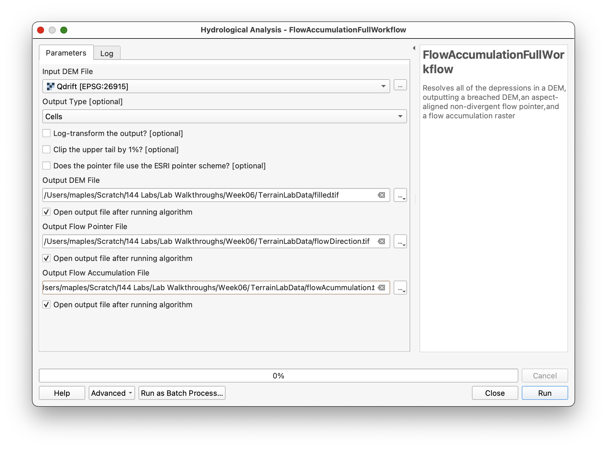

After running the tool, the flow accumulation layer may look faint at first:

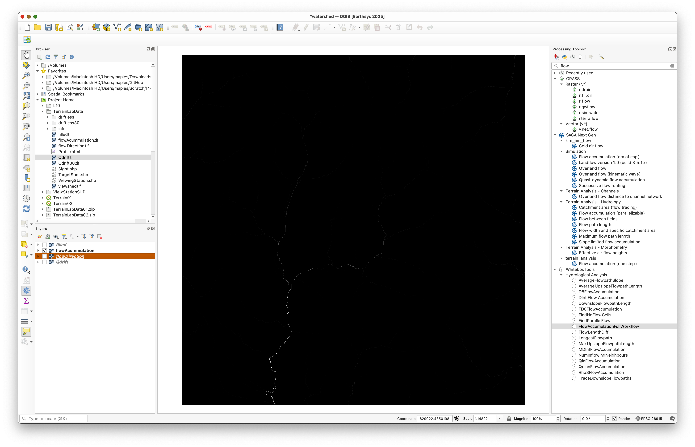

## Part 2: Inspect the Flow Accumulation Raster

The default display may not show the actual value range clearly.

1. Open the **Layer Styling** panel for `flowaccumulation`.
2. Expand the **Min / Max Value Settings** section.
3. Change the accuracy setting to **Actual (slower)**.

This should update the displayed maximum value to something closer to the real range of the raster.

> **Concept note:** Flow accumulation values count or estimate how many upstream cells drain through each cell. High values usually indicate likely stream channels or major drainage paths.
>
> The raster may not look meaningful at first because most cells have low accumulation values, while a small number of channel cells have very high values. Changing the min/max display settings does not alter the data. It only changes how QGIS stretches the values for visualization.

Use the actual-value option here:

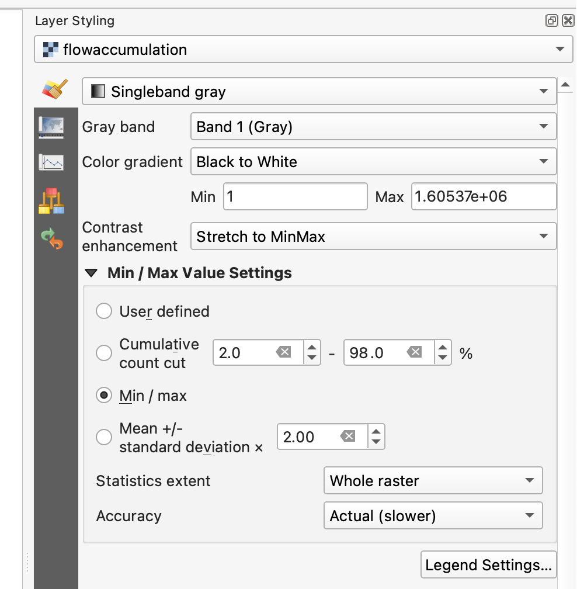

## Part 3: Reclassify Flow Accumulation to Approximate a Stream Network

Now turn the flow-accumulation raster into a simple stream raster by thresholding the values. The goal is to separate cells with enough upstream contributing area to be treated as stream cells from cells that are more likely to represent hillslopes.

1. Search for **Reclassify by table** in the QGIS raster analysis tools.
2. Use `flowaccumulation` as the input raster.
3. In the advanced parameters, check **Use no data when no range matches value**.
4. Open the reclassification table editor and add:

   | Row | Minimum | Maximum | Value |
   | --- | --- | --- | --- |
   | 1 | leave blank | `29999` | `0` |
   | 2 | `30000` | leave blank | `1` |

5. Save the output as `Streams.tif`.
6. Run the tool.

This should create a raster where cells meeting the threshold are classified as part of the modeled stream network.

> **Concept note:** The threshold is a modeling choice. A lower threshold will create more stream cells because smaller drainage paths are included. A higher threshold will create a smaller, more selective stream network because only cells with larger upstream contributing areas are included.
>
> In this lab, cells with flow accumulation values below `30000` are assigned `0`, and cells with values of `30000` or greater are assigned `1`. The value `1` represents the modeled stream network. The value `0` represents non-stream cells.

Open the reclassification table dialog like this:

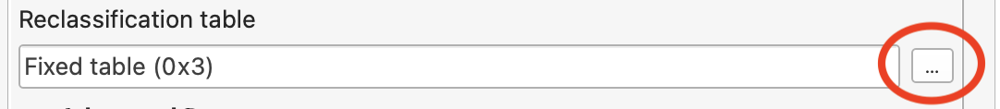

And enter the threshold table like this:

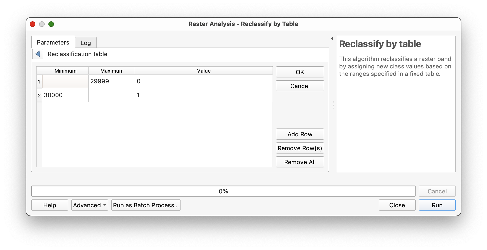

The resulting stream raster should contain only the modeled stream cells:

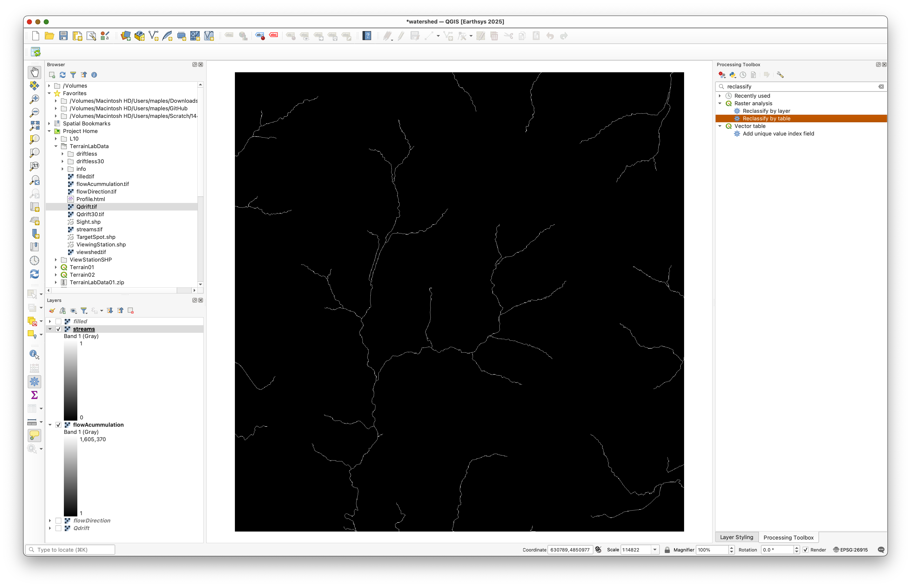

## Part 4: Create a Pour Point

Before delineating the watershed, create an outlet point on the modeled stream. This point is called a **pour point** because it marks the location where water leaves the watershed you want to delineate.

1. Use **Layer > Create Layer > New Shapefile Layer**.
2. Create a new **point** shapefile named `PourPoint.shp`.
3. Use the same CRS as the rest of the project.
4. Place the `Streams.tif` layer so it is visible beneath the new pour-point layer.
5. Start editing `PourPoint`.
6. Digitize a single point on, or as close as possible to, a stream cell in the lower part of the drainage network.
7. Save the edit and stop editing.

> **Concept note:** The watershed result depends strongly on outlet placement. If the point is not actually on the drainage network, the modeled watershed may not correspond to the stream system you intended.
>
> A pour point placed farther downstream will usually produce a larger watershed because it includes more upstream contributing area. A pour point placed farther upstream will usually produce a smaller watershed. This is why the point should be placed deliberately, not just anywhere on the map.

Create the new point shapefile like this:

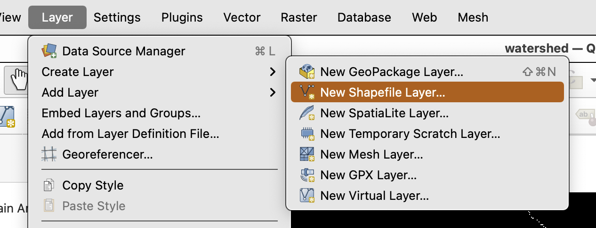

Then zoom to the lower-left drainage area and place the point on the stream network:

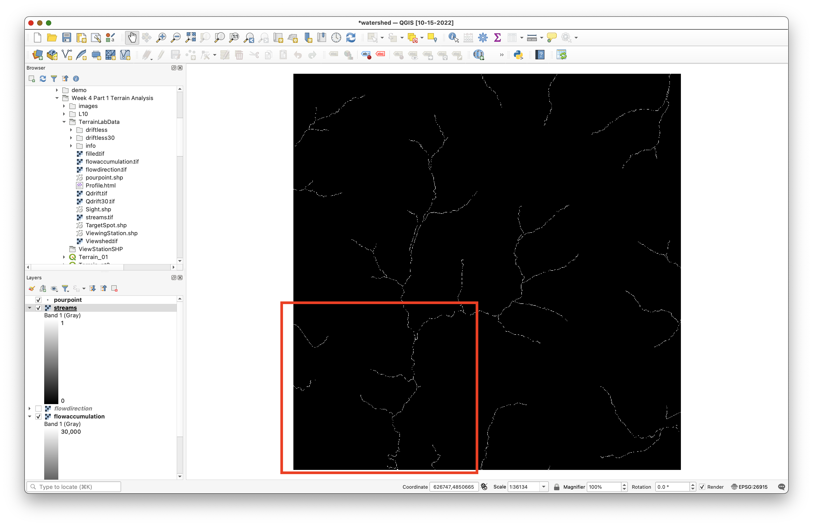

Place the point as close to the center of a stream cell as possible:

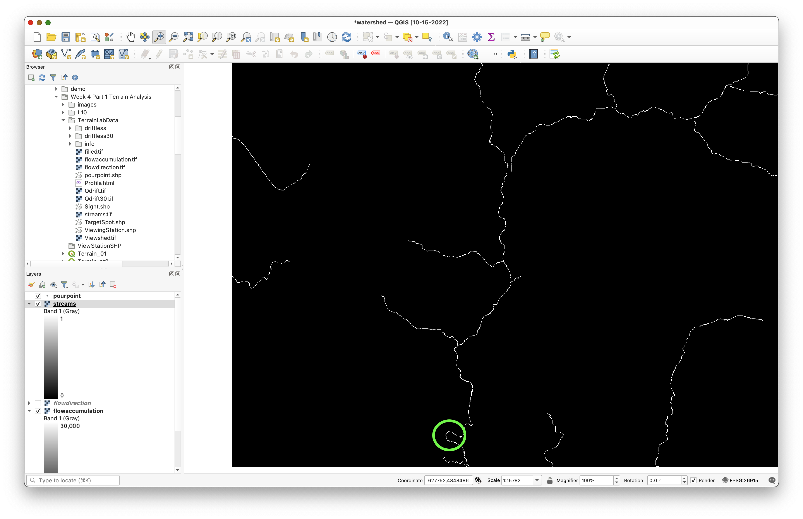

You will need to toggle editing and use the Add Point Feature tool:

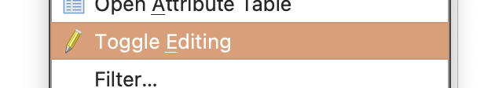

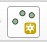

## Part 5: Snap the Pour Point to the Stream Network

To make sure the outlet is aligned correctly with the modeled drainage, snap it to the nearest high-flow cell.

1. Search for **SnapPourPoints** in **WhiteboxTools**.
2. Set:
   - **Input outlets file:** `PourPoint.shp`
   - **Flow accumulation raster:** `flowaccumulation`
   - **Snap distance:** `9`
3. Save the output as `SnappedPoint.shp`.
4. Run the tool.

Zoom in and compare the original pour point with the snapped point.

> **Concept note:** Snapping adjusts the vector pour point so it aligns with the center of the raster cell used by the watershed model. This matters because raster-based hydrologic analysis works cell by cell, so the outlet must be placed on the specific DEM-derived cell that represents the intended drainage location.
>
> The snap distance tells WhiteboxTools how far it is allowed to search for a better cell. Here, `9` means the tool can move the pour point within a 9-meter search distance. Because the DEM cell size is in meters, this keeps the point close to the location you chose while still allowing it to align with the raster grid.

Use settings like these:

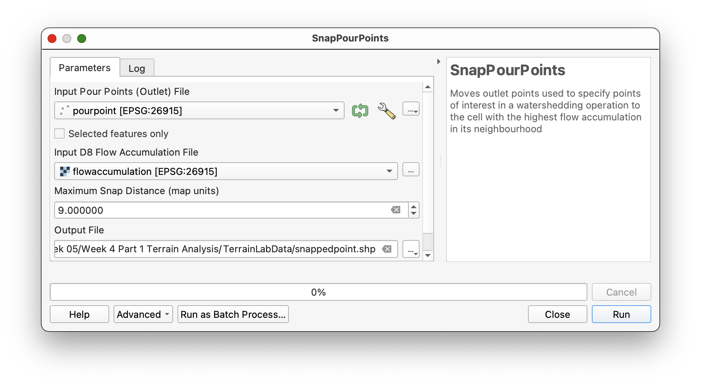

Then compare the original point and the snapped point:

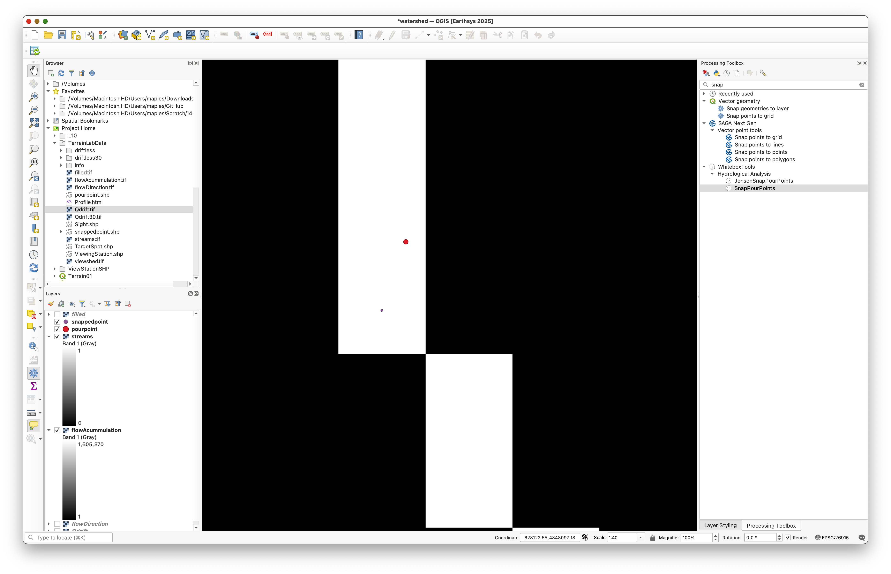

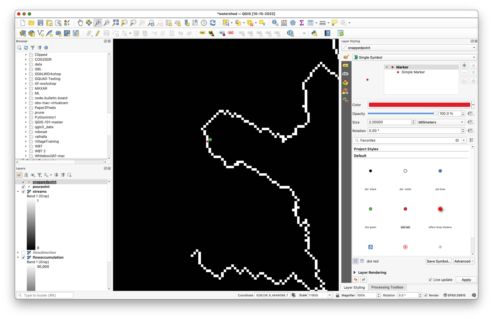

## Part 6: Delineate the Watershed

Now create the watershed draining to the snapped outlet.

1. Search for **Watershed** in **WhiteboxTools**.
2. Set:
   - **D8 pointer file:** `flowdirection`
   - **Input pour points:** `SnappedPoint.shp`
3. Save the output as `watershed.tif`.
4. Run the tool.

> **Concept note:** The Watershed tool uses the flow-direction raster to trace every cell that drains to the snapped pour point. The output watershed raster identifies the contributing area for that outlet. In other words, it answers the question: "Which cells send water to this point?"
>
> The **D8 pointer file** is another name for the flow-direction raster created earlier. It stores the downslope connection from each cell to its neighbor, so the Watershed tool can work backward from the outlet and identify all cells that eventually flow into it.

Use settings like these:

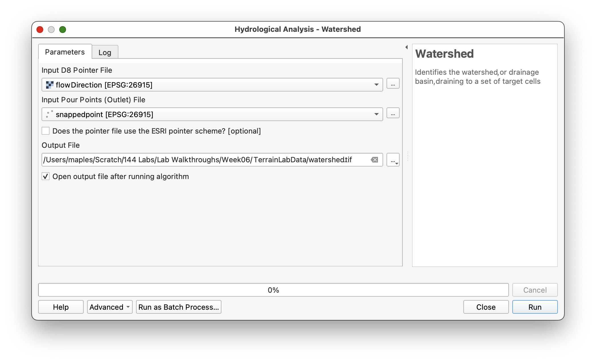

The result may look confusing at first because the default style is often a solid black raster. Change the style of `watershed.tif` immediately so you can confirm that it was created correctly.

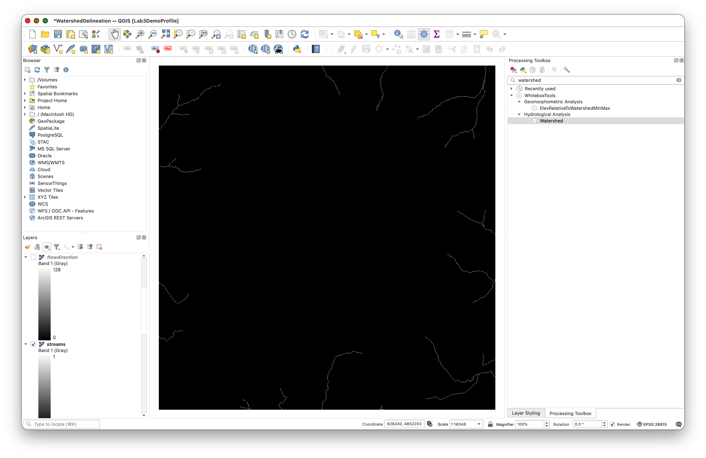

## Part 7: Style the Watershed Raster

The default grayscale styling is not especially helpful, so restyle the watershed similarly to the viewshed workflow.

1. Select the `watershed` layer.
2. Open the **Layer Styling** panel.
3. Change the render type to **Paletted/Unique values**.
4. Click **Classify**.
5. Change the watershed class to a color you can read clearly over the terrain.
6. Reduce its opacity so the DEM remains visible underneath.

> **Concept note:** Semi-transparent styling works well here because the watershed is an analytical overlay. You usually want to see both the watershed extent and the terrain context beneath it.
>
> The watershed raster is a result layer, not a photograph of the landscape. Styling it clearly helps you interpret the modeled drainage area while still seeing the DEM, hillshade, stream network, and pour point underneath.

Your styled watershed should look something like this:

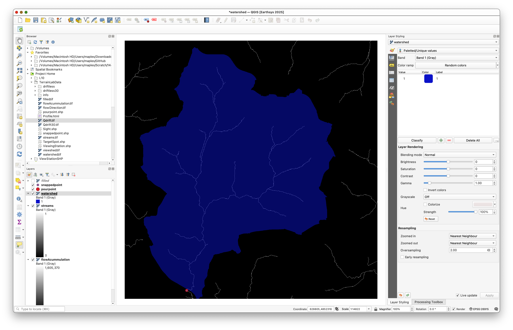

## Part 8: Convert the Stream Raster to Vector Lines

Now convert the reclassified stream raster into a vector stream network.

1. Search for **RasterStreamsToVector** in **WhiteboxTools**.
2. Set:
   - **Input streams file:** `Streams.tif`
   - **D8 pointer file:** `flowdirection`
3. Save the output as `StreamNet.shp`.
4. Run the tool.

Style the resulting vector streams so they are visible on top of the DEM and watershed.

> **Concept note:** Raster hydrology often produces raster intermediate outputs, but vector conversion can make the final stream network easier to symbolize and combine with other GIS layers.
>
> The `Streams.tif` layer stores the stream network as grid cells. The `StreamNet.shp` layer stores the same modeled network as line features. Line features are often easier to use in maps because they can be styled with line width and color, labeled, and displayed cleanly over other layers.

Use settings like these:

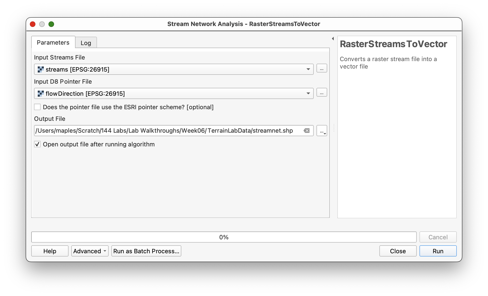

The vector stream output should appear as line features:

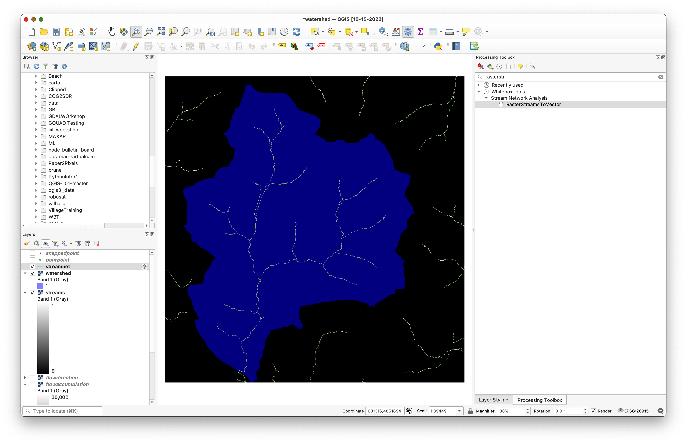

## Deliverable

Create and export a final layout showing:

- `Qdrift.tif` with hillshade or other useful terrain styling
- `watershed.tif` with transparency
- `SnappedPoint.shp`
- `StreamNet.shp`

Include:

- a title
- your name
- the date
- a scale bar
- a legend if it helps interpretation
