# Basic Remote Sensing with Google Earth Engine

> **Turn-in for grading:** This lab includes material that must be turned in for grading. Complete the required deliverables and submit them as instructed by the course.

## Overview

This lab introduces basic remote sensing with Sentinel-2 satellite imagery in Google Earth Engine. You will practice a repeatable workflow:

- choose an area of interest, or AOI
- load Sentinel-2 imagery
- filter imagery by date, bounds, and cloud metadata
- inspect image metadata in the Console and Data Catalog
- visualize one band combination at a time
- calculate one spectral index at a time
- interpret what the layer highlights
- adapt one example for an area of your own choosing

Each code block in this lab is independent. You can paste any one block into a blank Earth Engine script, click **Run**, open the **Layers** widget, and turn on the layers for that block.

## What You Should Understand After This Lab

By the end of this exercise, you should be able to explain:

- why satellite images are stored as multiple spectral bands
- how Sentinel-2 bands relate to visible, near infrared, and shortwave infrared light
- how to filter an `ee.ImageCollection` by date, bounds, and cloud metadata
- how to inspect dataset and image metadata in the Earth Engine Data Catalog and Console
- why true color, color infrared, urban SWIR, and geology SWIR composites emphasize different surfaces
- how a normalized difference index compares two parts of a target's spectral curve
- why normalization helps reduce the effect of overall brightness and illumination
- how to calculate and visualize one spectral index at a time
- how to adapt a sample index script for an area of your own choosing
- how to create and submit a Google Earth Engine **Get Link URL**

## Getting Ready

You will need:

- access to the [Google Earth Engine Code Editor](https://code.earthengine.google.com/)
- a Google Earth Engine account
- the ability to create, paste, run, save, and share scripts in the Code Editor

If needed, review the Week 00 [Logging in to Google Earth Engine](../week00/10_TURN_IN_logging_in_to_google_earth_engine.md) setup guide before continuing.

## Code Editor Tools You Will Use

As you work through the scripts, pay attention to these parts of the Earth Engine interface:

- **Search bar:** lets you search for datasets such as Sentinel-2 in the Data Catalog.
- **Docs tab:** shows function documentation for Earth Engine objects and methods.
- **Run:** executes the current script.
- **Save:** saves the script to your Earth Engine account.
- **Get Link:** creates a shareable URL for the script.
- **Console:** shows printed images, collections, metadata, charts, and messages from `print()`.
- **Inspector:** lets you click the map and read band or index values.
- **Layers:** lets you turn map layers on and off, change opacity, and compare outputs. You can click the lock icon on the Layers widget to keep it open while you compare layers.
- **Geometry tools:** let you draw points, lines, and polygons on the map.

> **Layers note:** The scripts in this lab add map layers with visibility turned off by default. After running each script, open the **Layers** widget, lock it open if helpful, then turn layers on one at a time to observe what each layer highlights.


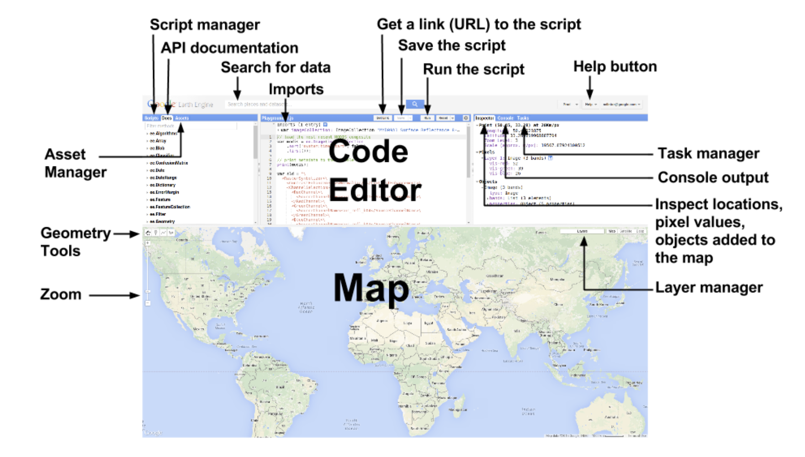

## Part 1: Find Sentinel-2 in the Data Catalog

Before writing code, look up the dataset in the Earth Engine Data Catalog.

1. Open the [Google Earth Engine Code Editor](https://code.earthengine.google.com/).
2. In the search bar, search for `Sentinel-2 SR Harmonized`.
3. Open the result named `COPERNICUS/S2_SR_HARMONIZED`.
4. Read the dataset description.
5. Find the **Bands** section.
6. Find the **Image Properties** section.

Record answers to these questions in your notes:

- What does the dataset represent?
- What organization or mission produces the data?
- Which bands represent blue, green, red, near infrared, and shortwave infrared?
- What image property describes cloudy pixels?
- What is the spatial resolution of bands `B2`, `B3`, `B4`, and `B8`?

> **Concept note:** Metadata is data about data. In remote sensing, metadata can describe when an image was acquired, how cloudy it is, which satellite captured it, what processing level it has, and what each band represents. Metadata helps you decide whether an image is appropriate before you analyze it.

## Sentinel-2 Band Reference

The scripts in this lab use the following Sentinel-2 bands:


| Band  | Common Name          | Wavelength Region | Typical Use                                       |
| ------- | ---------------------- | ------------------- | --------------------------------------------------- |
| `B2`  | Blue                 | Visible blue      | True color, water, haze, bare soil                |
| `B3`  | Green                | Visible green     | True color, vegetation, water                     |
| `B4`  | Red                  | Visible red       | True color, vegetation absorption                 |
| `B8`  | Near infrared        | NIR               | Vegetation vigor, biomass, water contrast         |
| `B11` | Shortwave infrared 1 | SWIR 1            | Moisture, built-up areas, bare soil, burn signals |
| `B12` | Shortwave infrared 2 | SWIR 2            | Geology, burned areas, dry soil, moisture         |

> **Concept note:** A healthy green plant often reflects strongly in near infrared and absorbs strongly in red. Water usually absorbs near infrared and shortwave infrared. Built surfaces, bare soil, rock, snow, and burned areas each have different spectral patterns. Remote sensing uses those differences.

## Part 2: Basic Script Overview

This first script shows the core Sentinel-2 pattern. It loads imagery over the Stanford campus, filters by date and cloud metadata, selects one image, prints metadata, and adds a true color layer.

Paste this into a blank Earth Engine script and run it.

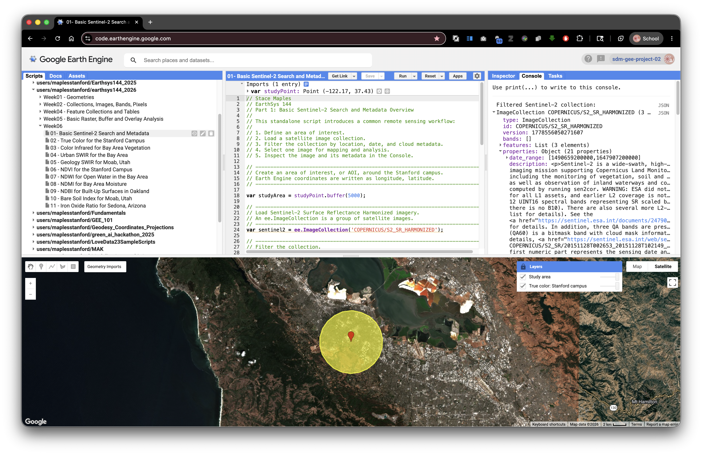

```javascript
// Stace Maples
// EarthSys 144
// Part 1: Basic Sentinel-2 Search and Metadata Overview
//
// This standalone script introduces a common remote sensing workflow:
//
// 1. Define an area of interest.
// 2. Load a satellite image collection.
// 3. Filter the collection by location, date, and cloud metadata.
// 4. Select one image for mapping and analysis.
// 5. Inspect the image and its metadata in the Console.

// ----------------------------------------------------------------------------
// Create an area of interest, or AOI, around the Stanford campus.
// Earth Engine coordinates are written as longitude, latitude.
// ----------------------------------------------------------------------------
var studyPoint = ee.Geometry.Point([-122.1697, 37.4275]);
var studyArea = studyPoint.buffer(5000);

// ----------------------------------------------------------------------------
// Load Sentinel-2 Surface Reflectance Harmonized imagery.
// An ee.ImageCollection is a group of satellite images.
// ----------------------------------------------------------------------------
var sentinel2 = ee.ImageCollection('COPERNICUS/S2_SR_HARMONIZED');

// ----------------------------------------------------------------------------
// Filter the collection.
//
// filterBounds() keeps images intersecting the AOI.
// filterDate() keeps images from the selected date range.
// ee.Filter.lt() keeps images with cloudiness below the selected percentage.
// ----------------------------------------------------------------------------
var filtered = sentinel2
  .filterBounds(studyArea)
  .filterDate('2023-06-01', '2023-09-30')
  .filter(ee.Filter.lt('CLOUDY_PIXEL_PERCENTAGE', 20));

// ----------------------------------------------------------------------------
// Sort from least cloudy to most cloudy, then select the first image.
// ----------------------------------------------------------------------------
var image = filtered
  .sort('CLOUDY_PIXEL_PERCENTAGE')
  .first();

// ----------------------------------------------------------------------------
// Print objects so you can inspect metadata in the Console.
// Expand the printed image to look for properties and band names.
// ----------------------------------------------------------------------------
print('Filtered Sentinel-2 collection:', filtered);
print('Selected image:', image);
print('Image acquisition date:', ee.Date(image.get('system:time_start')));
print('Cloudy pixel percentage:', image.get('CLOUDY_PIXEL_PERCENTAGE'));
print('Band names:', image.bandNames());

// ----------------------------------------------------------------------------
// True color uses red, green, and blue bands: B4, B3, B2.
// The min and max values control display only.
// ----------------------------------------------------------------------------
var trueColorVis = {
  bands: ['B4', 'B3', 'B2'],
  min: 0,
  max: 3000
};

// ----------------------------------------------------------------------------
// Add layers with visibility off by default.
// Open the Layers widget and turn them on when you are ready.
// ----------------------------------------------------------------------------
Map.centerObject(studyArea, 11);
Map.addLayer(image, trueColorVis, 'True color: Stanford campus', false);
Map.addLayer(studyArea, {color: 'yellow'}, 'Study area', false);
Map.setOptions('HYBRID');
```

After running the script, expand the printed image in the Console. Look for properties such as `CLOUDY_PIXEL_PERCENTAGE`, `MGRS_TILE`, `PROCESSING_BASELINE`, `SPACECRAFT_NAME`, and `system:time_start`.

## Part 3: Standalone Band Combination Blocks

A band combination assigns image bands to the red, green, and blue display channels on your screen. The underlying data do not change. Only the display changes.

Each block below is independent. Paste one block into a blank script, run it, open the **Layers** widget, lock the widget open if helpful, and turn on the layer.

### True Color: Bay Area and Stanford Campus

True color uses red, green, and blue bands. It is the most intuitive display for communication because it resembles human vision.

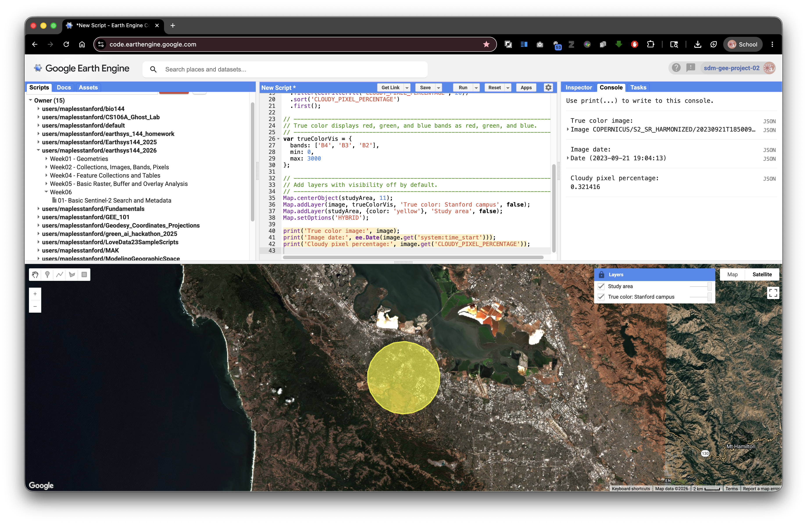

```javascript
// Stace Maples
// EarthSys 144
// Band Combination: True Color for the Stanford Campus
//
// This standalone script displays Sentinel-2 imagery in true color.

// ----------------------------------------------------------------------------
// Define a Stanford campus AOI.
// ----------------------------------------------------------------------------
var studyPoint = ee.Geometry.Point([-122.1697, 37.4275]);
var studyArea = studyPoint.buffer(5000);

// ----------------------------------------------------------------------------
// Load, filter, sort, and select one Sentinel-2 image.
// ----------------------------------------------------------------------------
var image = ee.ImageCollection('COPERNICUS/S2_SR_HARMONIZED')
  .filterBounds(studyArea)
  .filterDate('2023-06-01', '2023-09-30')
  .filter(ee.Filter.lt('CLOUDY_PIXEL_PERCENTAGE', 20))
  .sort('CLOUDY_PIXEL_PERCENTAGE')
  .first();

// ----------------------------------------------------------------------------
// True color displays red, green, and blue bands as red, green, and blue.
// ----------------------------------------------------------------------------
var trueColorVis = {
  bands: ['B4', 'B3', 'B2'],
  min: 0,
  max: 3000
};

// ----------------------------------------------------------------------------
// Add layers with visibility off by default.
// ----------------------------------------------------------------------------
Map.centerObject(studyArea, 11);
Map.addLayer(image, trueColorVis, 'True color: Stanford campus', false);
Map.addLayer(studyArea, {color: 'yellow'}, 'Study area', false);
Map.setOptions('HYBRID');

print('True color image:', image);
print('Image date:', ee.Date(image.get('system:time_start')));
print('Cloudy pixel percentage:', image.get('CLOUDY_PIXEL_PERCENTAGE'));
```

### Color Infrared: Bay Area Vegetation

Color infrared puts near infrared in the red display channel. Healthy vegetation often appears bright red because plants strongly reflect near infrared light.

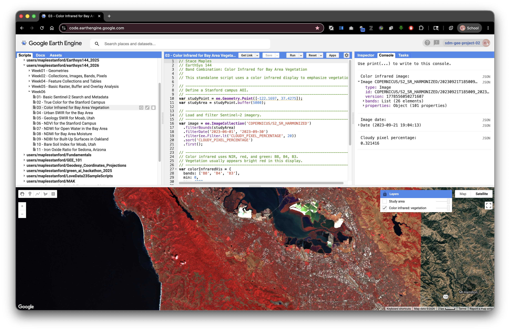

```javascript
// Stace Maples
// EarthSys 144
// Band Combination: Color Infrared for Bay Area Vegetation
//
// This standalone script uses a color infrared display to emphasize vegetation.

// ----------------------------------------------------------------------------
// Define a Stanford campus AOI.
// ----------------------------------------------------------------------------
var studyPoint = ee.Geometry.Point([-122.1697, 37.4275]);
var studyArea = studyPoint.buffer(5000);

// ----------------------------------------------------------------------------
// Load and filter Sentinel-2 imagery.
// ----------------------------------------------------------------------------
var image = ee.ImageCollection('COPERNICUS/S2_SR_HARMONIZED')
  .filterBounds(studyArea)
  .filterDate('2023-06-01', '2023-09-30')
  .filter(ee.Filter.lt('CLOUDY_PIXEL_PERCENTAGE', 20))
  .sort('CLOUDY_PIXEL_PERCENTAGE')
  .first();

// ----------------------------------------------------------------------------
// Color infrared uses NIR, red, and green: B8, B4, B3.
// Vegetation usually appears bright red in this display.
// ----------------------------------------------------------------------------
var colorInfraredVis = {
  bands: ['B8', 'B4', 'B3'],
  min: 0,
  max: 4000
};

Map.centerObject(studyArea, 11);
Map.addLayer(image, colorInfraredVis, 'Color infrared: vegetation', false);
Map.addLayer(studyArea, {color: 'yellow'}, 'Study area', false);
Map.setOptions('HYBRID');

print('Color infrared image:', image);
print('Image date:', ee.Date(image.get('system:time_start')));
print('Cloudy pixel percentage:', image.get('CLOUDY_PIXEL_PERCENTAGE'));
```

### Urban SWIR: Bay Area Urban Surfaces

Urban SWIR composites can help separate built surfaces, bare ground, vegetation, and water better than true color alone.

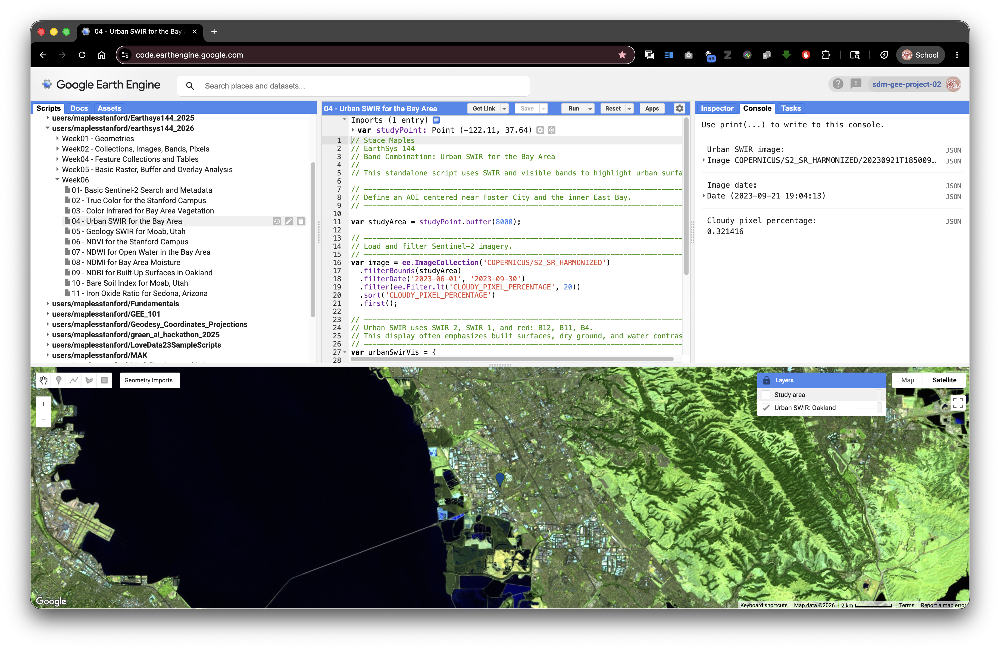

```javascript
// Stace Maples
// EarthSys 144
// Band Combination: Urban SWIR for the Bay Area
//
// This standalone script uses SWIR and visible bands to highlight urban surfaces.

// ----------------------------------------------------------------------------
// Define an AOI centered near Foster City and the inner East Bay.
// ----------------------------------------------------------------------------
var studyPoint = ee.Geometry.Point([-122.1697, 37.4275]);
var studyArea = studyPoint.buffer(8000);

// ----------------------------------------------------------------------------
// Load and filter Sentinel-2 imagery.
// ----------------------------------------------------------------------------
var image = ee.ImageCollection('COPERNICUS/S2_SR_HARMONIZED')
  .filterBounds(studyArea)
  .filterDate('2023-06-01', '2023-09-30')
  .filter(ee.Filter.lt('CLOUDY_PIXEL_PERCENTAGE', 20))
  .sort('CLOUDY_PIXEL_PERCENTAGE')
  .first();

// ----------------------------------------------------------------------------
// Urban SWIR uses SWIR 2, SWIR 1, and red: B12, B11, B4.
// This display often emphasizes built surfaces, dry ground, and water contrast.
// ----------------------------------------------------------------------------
var urbanSwirVis = {
  bands: ['B12', 'B11', 'B4'],
  min: 0,
  max: 4000
};

Map.centerObject(studyArea, 12);
Map.addLayer(image, urbanSwirVis, 'Urban SWIR: Oakland', false);
Map.addLayer(studyArea, {color: 'yellow'}, 'Study area', false);
Map.setOptions('HYBRID');

print('Urban SWIR image:', image);
print('Image date:', ee.Date(image.get('system:time_start')));
print('Cloudy pixel percentage:', image.get('CLOUDY_PIXEL_PERCENTAGE'));

```

### Geology SWIR: Moab, Utah

Geology composites work best in places where rock and soil are exposed. This example uses the Moab, Utah area because dry surfaces, bare rock, and sparse vegetation make SWIR differences easier to see.

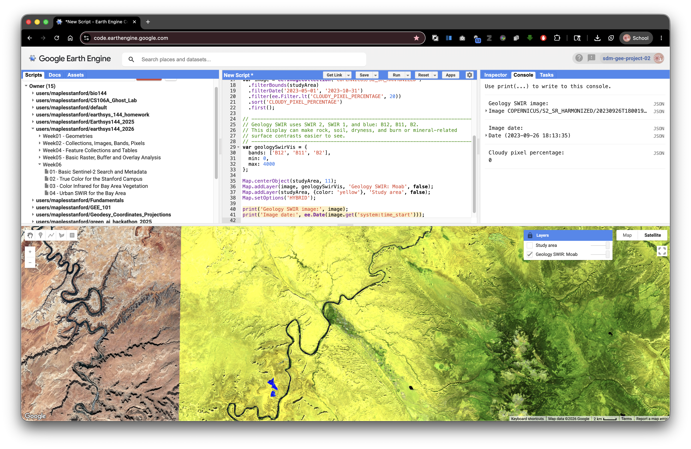

```javascript
// Stace Maples
// EarthSys 144
// Band Combination: Geology SWIR for Moab, Utah
//
// This standalone script uses SWIR bands to emphasize exposed rock and soil.

// ----------------------------------------------------------------------------
// Define an AOI near Moab, Utah.
// Dry landscapes with exposed rock are useful for geology-focused composites.
// ----------------------------------------------------------------------------
var studyPoint = ee.Geometry.Point([-109.5498, 38.5733]);
var studyArea = studyPoint.buffer(15000);

// ----------------------------------------------------------------------------
// Load and filter Sentinel-2 imagery.
// ----------------------------------------------------------------------------
var image = ee.ImageCollection('COPERNICUS/S2_SR_HARMONIZED')
  .filterBounds(studyArea)
  .filterDate('2023-05-01', '2023-10-31')
  .filter(ee.Filter.lt('CLOUDY_PIXEL_PERCENTAGE', 20))
  .sort('CLOUDY_PIXEL_PERCENTAGE')
  .first();

// ----------------------------------------------------------------------------
// Geology SWIR uses SWIR 2, SWIR 1, and blue: B12, B11, B2.
// This display can make rock, soil, dryness, and burn or mineral-related
// surface contrasts easier to see.
// ----------------------------------------------------------------------------
var geologySwirVis = {
  bands: ['B12', 'B11', 'B2'],
  min: 0,
  max: 4000
};

Map.centerObject(studyArea, 11);
Map.addLayer(image, geologySwirVis, 'Geology SWIR: Moab', false);
Map.addLayer(studyArea, {color: 'yellow'}, 'Study area', false);
Map.setOptions('HYBRID');

print('Geology SWIR image:', image);
print('Image date:', ee.Date(image.get('system:time_start')));
print('Cloudy pixel percentage:', image.get('CLOUDY_PIXEL_PERCENTAGE'));
```

## Part 4: Why Spectral Indices Work

Different materials reflect and absorb light differently across the electromagnetic spectrum. A plant, a lake, a concrete roof, a burn scar, and bare soil can have different spectral curves.

A spectral index uses band math to emphasize a specific contrast in those curves. Many indices use a normalized difference formula:

```text
(Band A - Band B) / (Band A + Band B)
```

The subtraction highlights the contrast between two wavelengths. The division by the sum normalizes that contrast.

Normalization helps because two pixels can be different in overall brightness for reasons that are not the target property. One pixel might be brighter because of slope, sun angle, haze, shadow, or overall reflectance. Dividing by the sum scales the contrast relative to the total reflected signal. This often makes the index more comparable across the image.

Most normalized difference indices produce values near `-1` to `1`:

- Values near `1` mean Band A is much larger than Band B.
- Values near `0` mean the bands are similar.
- Values near `-1` mean Band B is much larger than Band A.

> **Concept note:** Normalization does not make an index perfect. It helps isolate one quality of a target's spectral curve, but interpretation still depends on place, season, sensor, atmosphere, land cover, and thresholds.

## Common Spectral Indices in This Lab


| Index            | Formula with Sentinel-2 Bands                         | What It Often Highlights                 | Good Example Area                        |
| ------------------ | ------------------------------------------------------- | ------------------------------------------ | ------------------------------------------ |
| NDVI             | `(B8 - B4) / (B8 + B4)`                               | Green vegetation vigor                   | Bay Area and Stanford campus             |
| NDWI             | `(B3 - B8) / (B3 + B8)`                               | Open water                               | Bay Area shoreline and reservoirs        |
| NDMI             | `(B8 - B11) / (B8 + B11)`                             | Vegetation or soil moisture              | Bay Area vegetation or reservoir margins |
| NDBI             | `(B11 - B8) / (B11 + B8)`                             | Built-up or dry impervious surfaces      | Oakland or other urban Bay Area places   |
| NBR              | `(B8 - B12) / (B8 + B12)`                             | Burn signal and burned vegetation        | CZU Lightning Complex burn area          |
| BSI              | `((B11 + B4) - (B8 + B2)) / ((B11 + B4) + (B8 + B2))` | Bare soil and exposed ground             | Southwest dry landscapes such as Moab    |
| Iron Oxide Ratio | `B4 / B2`                                             | Iron-rich exposed rock and soil contrast | Southwest dry landscapes such as Sedona  |

> **Concept note:** A high or low index value does not automatically prove that a target is present. For example, NDBI may highlight some built-up surfaces, but it can also respond to bare soil or dry ground. Always compare the index with true color imagery, local knowledge, and other layers.

## Part 5: Example Index 1: NDVI for the Bay Area

NDVI, or Normalized Difference Vegetation Index, compares near infrared and red light. Healthy green vegetation usually reflects strongly in near infrared and absorbs strongly in red, so NDVI is often high where vegetation is vigorous.

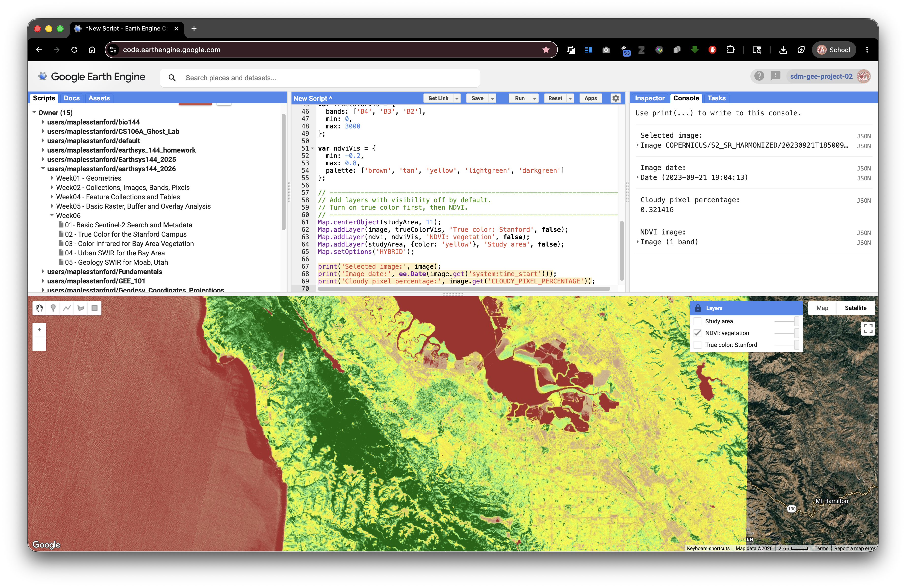

```javascript
// Stace Maples
// EarthSys 144
// Index Example 1: NDVI for the Stanford Campus
//
// This standalone script calculates NDVI from one Sentinel-2 image.
// NDVI highlights green vegetation vigor.

// ----------------------------------------------------------------------------
// Define an AOI around the Stanford campus.
// ----------------------------------------------------------------------------
var studyPoint = ee.Geometry.Point([-122.1697, 37.4275]);
var studyArea = studyPoint.buffer(5000);

// ----------------------------------------------------------------------------
// Load and filter Sentinel-2 imagery.
// ----------------------------------------------------------------------------
var image = ee.ImageCollection('COPERNICUS/S2_SR_HARMONIZED')
  .filterBounds(studyArea)
  .filterDate('2023-06-01', '2023-09-30')
  .filter(ee.Filter.lt('CLOUDY_PIXEL_PERCENTAGE', 20))
  .sort('CLOUDY_PIXEL_PERCENTAGE')
  .first();

// ----------------------------------------------------------------------------
// Convert scaled integer reflectance to approximate 0 to 1 reflectance.
// For normalizedDifference(), the scale factor cancels out, but converting
// makes the reflectance idea clearer for beginning students.
// ----------------------------------------------------------------------------
var reflectance = image.divide(10000);

// ----------------------------------------------------------------------------
// Calculate NDVI.
//
// B8 is near infrared.
// B4 is red.
// High NDVI often indicates healthy green vegetation.
// ----------------------------------------------------------------------------
var ndvi = reflectance
  .normalizedDifference(['B8', 'B4'])
  .rename('NDVI');

// ----------------------------------------------------------------------------
// Define true color and NDVI display settings.
// ----------------------------------------------------------------------------
var trueColorVis = {
  bands: ['B4', 'B3', 'B2'],
  min: 0,
  max: 3000
};

var ndviVis = {
  min: -0.2,
  max: 0.8,
  palette: ['brown', 'tan', 'yellow', 'lightgreen', 'darkgreen']
};

// ----------------------------------------------------------------------------
// Add layers with visibility off by default.
// Turn on true color first, then NDVI.
// ----------------------------------------------------------------------------
Map.centerObject(studyArea, 11);
Map.addLayer(image, trueColorVis, 'True color: Stanford', false);
Map.addLayer(ndvi, ndviVis, 'NDVI: vegetation', false);
Map.addLayer(studyArea, {color: 'yellow'}, 'Study area', false);
Map.setOptions('HYBRID');

print('Selected image:', image);
print('Image date:', ee.Date(image.get('system:time_start')));
print('Cloudy pixel percentage:', image.get('CLOUDY_PIXEL_PERCENTAGE'));
print('NDVI image:', ndvi);
```

After running the script, open the **Layers** widget and lock it open. Turn on true color first, then NDVI. Use the **Inspector** to compare NDVI values on lawns, trees, buildings, roads, water, and bare ground.

## Part 6: Additional Single-Index Blocks

Each block below is independent and calculates only one index. You can run each block by itself, or use it as a model when you adapt the assignment starter script.

To adapt one of these blocks, keep the overall structure and change only the parts that match your question:

- the `studyPoint` coordinates
- the `buffer()` distance
- the `filterDate()` start and end dates
- the index formula
- the visualization palette and value range

This structure is intentionally repetitive. Repetition helps you see that each index follows the same basic pattern, even when the bands, dates, places, and interpretation change.

### NDWI: Open Water in the Bay Area

NDWI compares green and near infrared. Open water often reflects relatively more green light and absorbs near infrared.

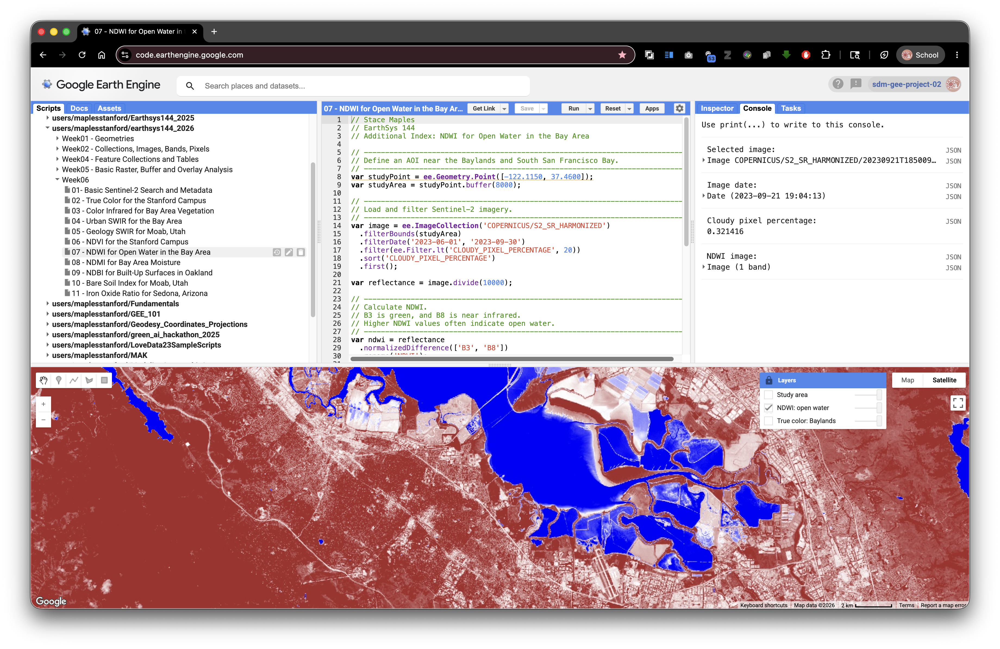

```javascript
// Stace Maples
// EarthSys 144
// Additional Index: NDWI for Open Water in the Bay Area

// ----------------------------------------------------------------------------
// Define an AOI near the Baylands and South San Francisco Bay.
// ----------------------------------------------------------------------------
var studyPoint = ee.Geometry.Point([-122.1150, 37.4600]);
var studyArea = studyPoint.buffer(8000);

// ----------------------------------------------------------------------------
// Load and filter Sentinel-2 imagery.
// ----------------------------------------------------------------------------
var image = ee.ImageCollection('COPERNICUS/S2_SR_HARMONIZED')
  .filterBounds(studyArea)
  .filterDate('2023-06-01', '2023-09-30')
  .filter(ee.Filter.lt('CLOUDY_PIXEL_PERCENTAGE', 20))
  .sort('CLOUDY_PIXEL_PERCENTAGE')
  .first();

var reflectance = image.divide(10000);

// ----------------------------------------------------------------------------
// Calculate NDWI.
// B3 is green, and B8 is near infrared.
// Higher NDWI values often indicate open water.
// ----------------------------------------------------------------------------
var ndwi = reflectance
  .normalizedDifference(['B3', 'B8'])
  .rename('NDWI');

var trueColorVis = {
  bands: ['B4', 'B3', 'B2'],
  min: 0,
  max: 3000
};

var ndwiVis = {
  min: -0.5,
  max: 0.5,
  palette: ['brown', 'white', 'blue']
};

Map.centerObject(studyArea, 12);
Map.addLayer(image, trueColorVis, 'True color: Baylands', false);
Map.addLayer(ndwi, ndwiVis, 'NDWI: open water', false);
Map.addLayer(studyArea, {color: 'yellow'}, 'Study area', false);
Map.setOptions('HYBRID');

print('Selected image:', image);
print('Image date:', ee.Date(image.get('system:time_start')));
print('Cloudy pixel percentage:', image.get('CLOUDY_PIXEL_PERCENTAGE'));
print('NDWI image:', ndwi);
```

### NDMI: Vegetation and Soil Moisture in the Bay Area

NDMI compares near infrared and shortwave infrared. It is often used to show moisture differences in vegetation or soil.

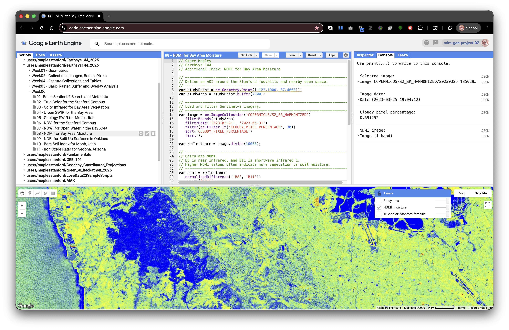

```javascript
// Stace Maples
// EarthSys 144
// Additional Index: NDMI for Bay Area Moisture

// ----------------------------------------------------------------------------
// Define an AOI around the Stanford foothills and nearby open space.
// ----------------------------------------------------------------------------
var studyPoint = ee.Geometry.Point([-122.1900, 37.4000]);
var studyArea = studyPoint.buffer(7000);

// ----------------------------------------------------------------------------
// Load and filter Sentinel-2 imagery.
// ----------------------------------------------------------------------------
var image = ee.ImageCollection('COPERNICUS/S2_SR_HARMONIZED')
  .filterBounds(studyArea)
  .filterDate('2023-03-01', '2023-05-31')
  .filter(ee.Filter.lt('CLOUDY_PIXEL_PERCENTAGE', 30))
  .sort('CLOUDY_PIXEL_PERCENTAGE')
  .first();

var reflectance = image.divide(10000);

// ----------------------------------------------------------------------------
// Calculate NDMI.
// B8 is near infrared, and B11 is shortwave infrared 1.
// Higher NDMI values often indicate more vegetation or soil moisture.
// ----------------------------------------------------------------------------
var ndmi = reflectance
  .normalizedDifference(['B8', 'B11'])
  .rename('NDMI');

var trueColorVis = {
  bands: ['B4', 'B3', 'B2'],
  min: 0,
  max: 3000
};

var ndmiVis = {
  min: -0.5,
  max: 0.5,
  palette: ['brown', 'yellow', 'lightgreen', 'blue']
};

Map.centerObject(studyArea, 12);
Map.addLayer(image, trueColorVis, 'True color: Stanford foothills', false);
Map.addLayer(ndmi, ndmiVis, 'NDMI: moisture', false);
Map.addLayer(studyArea, {color: 'yellow'}, 'Study area', false);
Map.setOptions('HYBRID');

print('Selected image:', image);
print('Image date:', ee.Date(image.get('system:time_start')));
print('Cloudy pixel percentage:', image.get('CLOUDY_PIXEL_PERCENTAGE'));
print('NDMI image:', ndmi);
```

### NDBI: Built-Up Surfaces in Oakland

NDBI compares shortwave infrared and near infrared. It can help highlight built-up or dry impervious surfaces, though bare soil may also respond strongly.

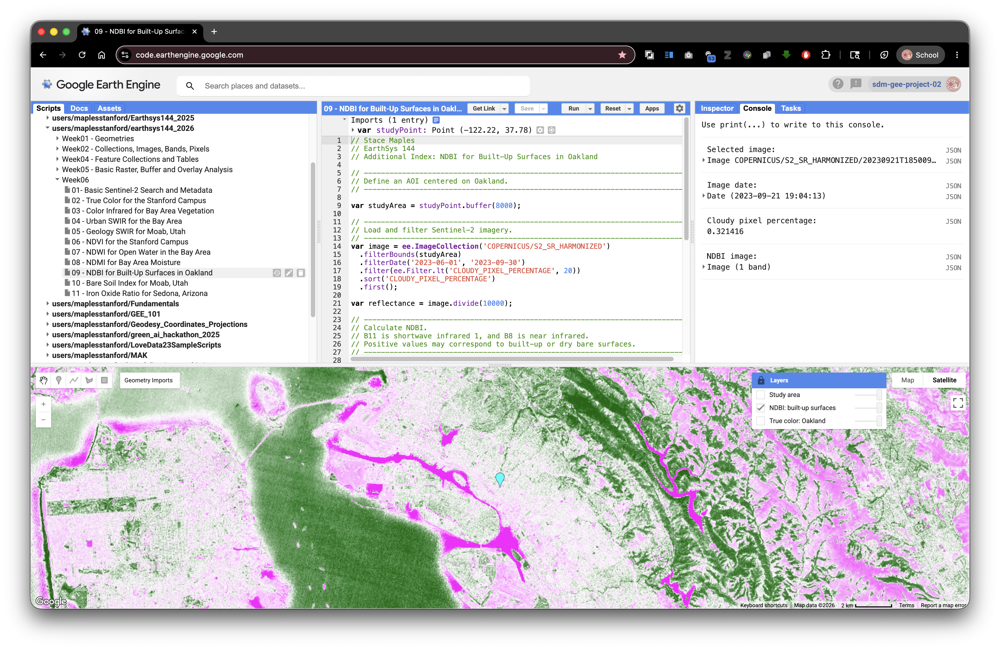

```javascript
// Stace Maples
// EarthSys 144
// Additional Index: NDBI for Built-Up Surfaces in Oakland

// ----------------------------------------------------------------------------
// Define an AOI centered on Oakland.
// ----------------------------------------------------------------------------
var studyPoint = ee.Geometry.Point([-122.2711, 37.8044]);
var studyArea = studyPoint.buffer(8000);

// ----------------------------------------------------------------------------
// Load and filter Sentinel-2 imagery.
// ----------------------------------------------------------------------------
var image = ee.ImageCollection('COPERNICUS/S2_SR_HARMONIZED')
  .filterBounds(studyArea)
  .filterDate('2023-06-01', '2023-09-30')
  .filter(ee.Filter.lt('CLOUDY_PIXEL_PERCENTAGE', 20))
  .sort('CLOUDY_PIXEL_PERCENTAGE')
  .first();

var reflectance = image.divide(10000);

// ----------------------------------------------------------------------------
// Calculate NDBI.
// B11 is shortwave infrared 1, and B8 is near infrared.
// Positive values may correspond to built-up or dry bare surfaces.
// ----------------------------------------------------------------------------
var ndbi = reflectance
  .normalizedDifference(['B11', 'B8'])
  .rename('NDBI');

var trueColorVis = {
  bands: ['B4', 'B3', 'B2'],
  min: 0,
  max: 3000
};

var ndbiVis = {
  min: -0.5,
  max: 0.5,
  palette: ['darkgreen', 'white', 'magenta']
};

Map.centerObject(studyArea, 12);
Map.addLayer(image, trueColorVis, 'True color: Oakland', false);
Map.addLayer(ndbi, ndbiVis, 'NDBI: built-up surfaces', false);
Map.addLayer(studyArea, {color: 'yellow'}, 'Study area', false);
Map.setOptions('HYBRID');

print('Selected image:', image);
print('Image date:', ee.Date(image.get('system:time_start')));
print('Cloudy pixel percentage:', image.get('CLOUDY_PIXEL_PERCENTAGE'));
print('NDBI image:', ndbi);
```

### BSI: Bare Soil in Moab, Utah

BSI uses four bands to compare SWIR plus red against NIR plus blue. It is useful in dry places where bare soil and exposed ground are common.

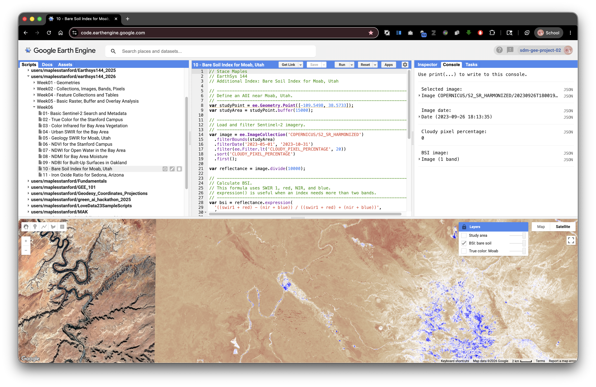

```javascript
// Stace Maples
// EarthSys 144
// Additional Index: Bare Soil Index for Moab, Utah

// ----------------------------------------------------------------------------
// Define an AOI near Moab, Utah.
// ----------------------------------------------------------------------------
var studyPoint = ee.Geometry.Point([-109.5498, 38.5733]);
var studyArea = studyPoint.buffer(15000);

// ----------------------------------------------------------------------------
// Load and filter Sentinel-2 imagery.
// ----------------------------------------------------------------------------
var image = ee.ImageCollection('COPERNICUS/S2_SR_HARMONIZED')
  .filterBounds(studyArea)
  .filterDate('2023-05-01', '2023-10-31')
  .filter(ee.Filter.lt('CLOUDY_PIXEL_PERCENTAGE', 20))
  .sort('CLOUDY_PIXEL_PERCENTAGE')
  .first();

var reflectance = image.divide(10000);

// ----------------------------------------------------------------------------
// Calculate BSI.
// This formula uses SWIR 1, red, NIR, and blue.
// expression() is useful when an index needs more than two bands.
// ----------------------------------------------------------------------------
var bsi = reflectance.expression(
  '((swir1 + red) - (nir + blue)) / ((swir1 + red) + (nir + blue))',
  {
    swir1: reflectance.select('B11'),
    red: reflectance.select('B4'),
    nir: reflectance.select('B8'),
    blue: reflectance.select('B2')
  }
).rename('BSI');

var trueColorVis = {
  bands: ['B4', 'B3', 'B2'],
  min: 0,
  max: 3000
};

var bsiVis = {
  min: -0.5,
  max: 0.5,
  palette: ['blue', 'white', 'tan', 'brown']
};

Map.centerObject(studyArea, 11);
Map.addLayer(image, trueColorVis, 'True color: Moab', false);
Map.addLayer(bsi, bsiVis, 'BSI: bare soil', false);
Map.addLayer(studyArea, {color: 'yellow'}, 'Study area', false);
Map.setOptions('HYBRID');

print('Selected image:', image);
print('Image date:', ee.Date(image.get('system:time_start')));
print('Cloudy pixel percentage:', image.get('CLOUDY_PIXEL_PERCENTAGE'));
print('BSI image:', bsi);
```

### Iron Oxide Ratio: Sedona, Arizona

The iron oxide ratio compares red and blue reflectance. It is not a normalized difference index, but it is a common geology-oriented band ratio for dry landscapes where exposed rock and soil are visible.

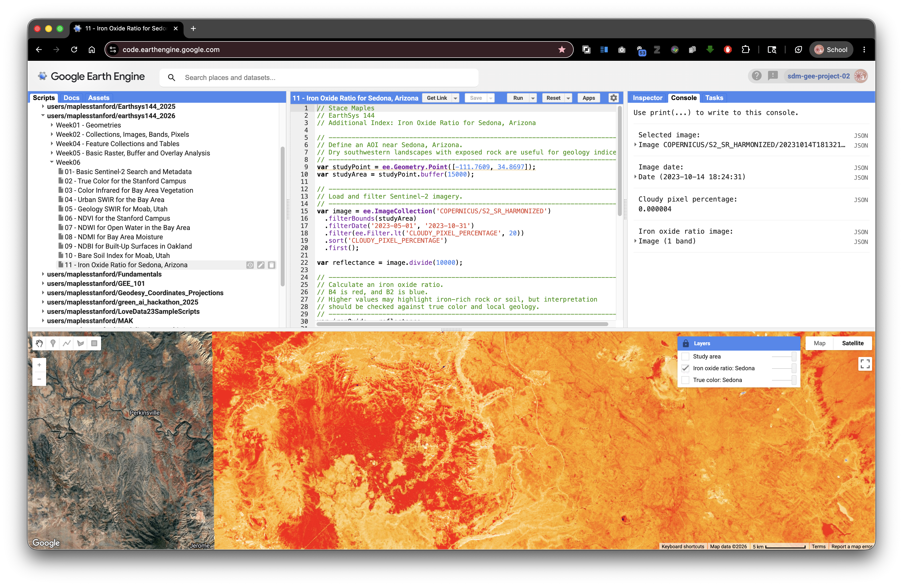

```javascript
// Stace Maples
// EarthSys 144
// Additional Index: Iron Oxide Ratio for Sedona, Arizona

// ----------------------------------------------------------------------------
// Define an AOI near Sedona, Arizona.
// Dry southwestern landscapes with exposed rock are useful for geology indices.
// ----------------------------------------------------------------------------
var studyPoint = ee.Geometry.Point([-111.7609, 34.8697]);
var studyArea = studyPoint.buffer(15000);

// ----------------------------------------------------------------------------
// Load and filter Sentinel-2 imagery.
// ----------------------------------------------------------------------------
var image = ee.ImageCollection('COPERNICUS/S2_SR_HARMONIZED')
  .filterBounds(studyArea)
  .filterDate('2023-05-01', '2023-10-31')
  .filter(ee.Filter.lt('CLOUDY_PIXEL_PERCENTAGE', 20))
  .sort('CLOUDY_PIXEL_PERCENTAGE')
  .first();

var reflectance = image.divide(10000);

// ----------------------------------------------------------------------------
// Calculate an iron oxide ratio.
// B4 is red, and B2 is blue.
// Higher values may highlight iron-rich rock or soil, but interpretation
// should be checked against true color and local geology.
// ----------------------------------------------------------------------------
var ironOxide = reflectance
  .select('B4')
  .divide(reflectance.select('B2'))
  .rename('Iron_Oxide_Ratio');

var trueColorVis = {
  bands: ['B4', 'B3', 'B2'],
  min: 0,
  max: 3000
};

var ironOxideVis = {
  min: 0.5,
  max: 2.5,
  palette: ['darkblue', 'white', 'orange', 'red']
};

Map.centerObject(studyArea, 11);
Map.addLayer(image, trueColorVis, 'True color: Sedona', false);
Map.addLayer(ironOxide, ironOxideVis, 'Iron oxide ratio: Sedona', false);
Map.addLayer(studyArea, {color: 'yellow'}, 'Study area', false);
Map.setOptions('HYBRID');

print('Selected image:', image);
print('Image date:', ee.Date(image.get('system:time_start')));
print('Cloudy pixel percentage:', image.get('CLOUDY_PIXEL_PERCENTAGE'));
print('Iron oxide ratio image:', ironOxide);
```

## Part 8: Your Turn: Choose One Index and One Area

For the assignment, adapt one of the standalone index scripts for an area of your own choosing.

Choose one index:

- **NDVI** for vegetation greenness or vegetation condition.
- **NDWI** for open water.
- **NDMI** for moisture in vegetation or soil.
- **NDBI** for built-up surfaces or urban contrast.
- **NBR** for burned-area signal.
- **BSI** for bare soil or exposed ground.
- **Iron Oxide Ratio** for exposed rock or soil contrast in dry landscapes.

Choose one study area:

- a park, campus, watershed, neighborhood, fire perimeter, reservoir, farm area, coastline, desert landscape, or other place you can explain
- an area small enough that you can visually inspect the result
- an area where your chosen index makes sense

You may create your study area in either of these ways:

- Change the longitude and latitude in `ee.Geometry.Point()` and keep the buffer.
- Use the Geometry tools in the Code Editor to draw your own polygon.

> **Concept note:** The index should match the question. NDVI is not the best tool for mapping buildings. NDBI is not the best tool for measuring open water. Remote sensing works best when the spectral contrast, the index, and the research question fit together.

## Starter Script for Your Own Area

This starter uses NDVI, but the **STEP 4** and **STEP 5** sections can be replaced with any of the index calculation and visualization patterns above.

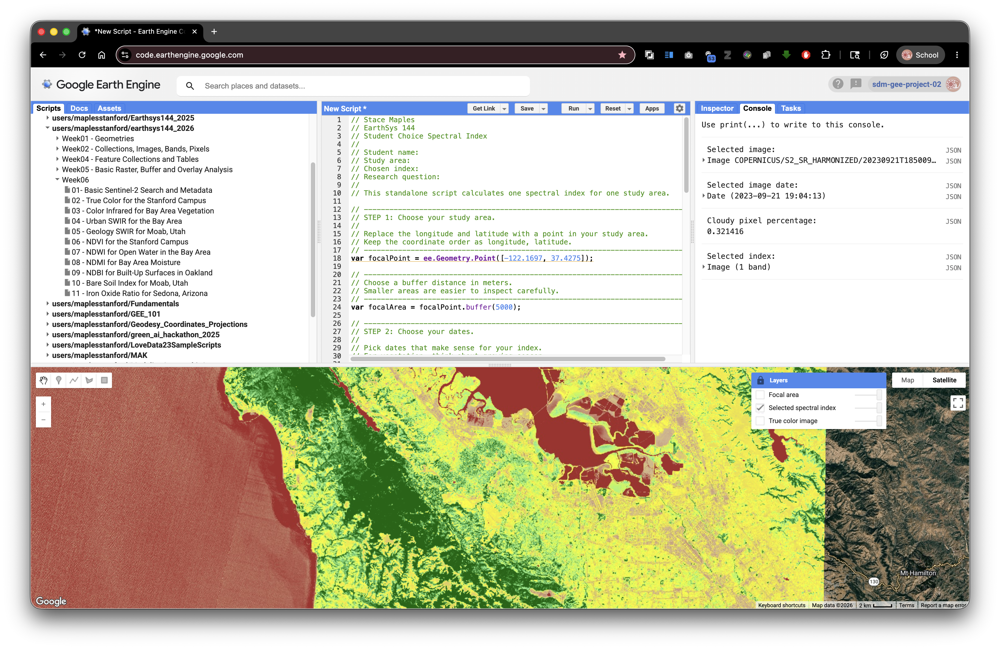

```javascript
// Stace Maples
// EarthSys 144
// Student Choice Spectral Index
//
// Student name:
// Study area:
// Chosen index:
// Research question:
//
// This standalone script calculates one spectral index for one study area.

// ----------------------------------------------------------------------------
// STEP 1: Choose your study area.
//
// Replace the longitude and latitude with a point in your study area.
// Keep the coordinate order as longitude, latitude.
// ----------------------------------------------------------------------------
var focalPoint = ee.Geometry.Point([-122.1697, 37.4275]);

// ----------------------------------------------------------------------------
// Choose a buffer distance in meters.
// Smaller areas are easier to inspect carefully.
// ----------------------------------------------------------------------------
var focalArea = focalPoint.buffer(5000);

// ----------------------------------------------------------------------------
// STEP 2: Choose your dates.
//
// Pick dates that make sense for your index.
// For vegetation, think about growing season.
// For water, think about wet and dry seasons.
// For burn signal, think about dates after a fire.
// For geology or bare soil, think about dry, cloud-free conditions.
// ----------------------------------------------------------------------------
var startDate = '2023-06-01';
var endDate = '2023-09-30';

// ----------------------------------------------------------------------------
// STEP 3: Load, filter, sort, and select one Sentinel-2 image.
// ----------------------------------------------------------------------------
var selectedImage = ee.ImageCollection('COPERNICUS/S2_SR_HARMONIZED')
  .filterBounds(focalArea)
  .filterDate(startDate, endDate)
  .filter(ee.Filter.lt('CLOUDY_PIXEL_PERCENTAGE', 20))
  .sort('CLOUDY_PIXEL_PERCENTAGE')
  .first();

var selectedReflectance = selectedImage.divide(10000);

// ----------------------------------------------------------------------------
// STEP 4: Calculate one chosen index.
//
// This starter calculates NDVI. Replace this block with another index if your
// question focuses on water, moisture, built-up land, burned area, or bare soil.
// ----------------------------------------------------------------------------
var selectedIndex = selectedReflectance
  .normalizedDifference(['B8', 'B4'])
  .rename('NDVI');

// ----------------------------------------------------------------------------
// STEP 5: Choose visualization settings for your selected index.
// ----------------------------------------------------------------------------
var selectedIndexVis = {
  min: -0.2,
  max: 0.8,
  palette: ['brown', 'tan', 'yellow', 'lightgreen', 'darkgreen']
};

// ----------------------------------------------------------------------------
// STEP 6: Display true color imagery and your selected index.
// ----------------------------------------------------------------------------
Map.centerObject(focalArea, 11);
Map.addLayer(
  selectedImage,
  {bands: ['B4', 'B3', 'B2'], min: 0, max: 3000},
  'True color image',
  false
);
Map.addLayer(selectedIndex, selectedIndexVis, 'Selected spectral index', false);
Map.addLayer(focalArea, {color: 'yellow'}, 'Focal area', false);
Map.setOptions('HYBRID');

// ----------------------------------------------------------------------------
// STEP 7: Print metadata and index information to the Console.
// ----------------------------------------------------------------------------
print('Selected image:', selectedImage);
print('Selected image date:', ee.Date(selectedImage.get('system:time_start')));
print('Cloudy pixel percentage:', selectedImage.get('CLOUDY_PIXEL_PERCENTAGE'));
print('Selected index:', selectedIndex);
```

After running your script, open the **Layers** widget and lock it open if you want to compare layers without reopening the menu. Turn on the true color image first, then turn on your selected index layer and compare what each layer highlights.

## What To Turn In

Submit a PDF that includes:

- your name
- the title of the lab
- the name and location of your study area
- the index you chose and why it fits your question
- the date range you used
- a screenshot of your selected spectral index layer
- a short interpretation of what high and low values appear to mean in your study area
- a Google Earth Engine **Get Link URL** to your saved script

To create the **Get Link URL**:

1. Click **Save** in the Earth Engine Code Editor.
2. Give your script a clear name.
3. Click **Get Link**.
4. Copy the generated URL.
5. Paste the URL into a Google Doc with the rest of your submission.
6. Export or download the Google Doc as a PDF.
7. Submit the PDF as instructed by the course.
