# Tobler's Hiker Function: Modeling Movement and Terrain-Based Distance

> **Turn-in for grading:** This lab includes material that must be turned in for grading. Complete the required deliverables and submit them as instructed by the course.

## Overview

In this lab, you will use existing Google Earth Engine code that implements Waldo Tobler's Hiker Function as a model for examining how topography affects human movement across a bare landscape.

Instead of measuring distance only in kilometers, you will model distance as **hours of walking time**. This lets you see how ridges, valleys, passes, and steep slopes stretch or compress geographic space.

You will take the code from this lesson, paste it into your own Google Earth Engine Code Editor, alter the origin point and model parameters, export the result, and create a final map layout in QGIS.

## What You Should Understand After This Lab

By the end of this exercise, you should be able to explain:

- how a DEM can be used to model movement across terrain
- how slope can be derived from elevation
- how Tobler's Hiker Function converts slope into estimated walking speed
- how a raster cost surface represents friction across geographic space
- why cumulative cost distance differs from straight-line distance
- how walking-time isochrones show areas reachable within a time threshold
- how to modify existing Earth Engine code for a new place and purpose
- how to export an Earth Engine raster and use it in a QGIS layout
- how to submit both a final map and a Google Earth Engine **Get Link URL**

> **Concept note:** Modeling geographic space means creating a simplified representation of a real-world process. Here, the process is walking. The model does not know about trails, vegetation, roads, weather, private property, or fatigue. It focuses on one important factor: slope.

## How You Will Complete This Lab

In this lab, you will accomplish two things.

First, you will practice **modeling geographic space** through successive geoprocessing of spatial data. The goal is to represent a phenomenon, human movement, and its relationship to geographic space.

Second, you will practice adapting existing code. This is common in research and analysis: you often begin with code from another source, then alter it to perform a task you care about.

The workflow is:

1. Review the starter imports and model structure.
2. Paste and run the Tobler model in Google Earth Engine.
3. Inspect the analytic layers.
4. Change the origin point to another part of the world.
5. Adjust the walking-hours parameter.
6. Export the modeled walking-time zones.
7. Create a QGIS layout.
8. Submit your final map and Earth Engine Get Link URL.

## Starting Your Script

Once the imports are loaded into your **Google Earth Engine Code Editor**, save the script to your own Earth Engine scripts repository:

1. Click **Save**.
2. Choose **Save a Copy**.
3. Save it to your `default` repository.
4. Give the script a clear name.

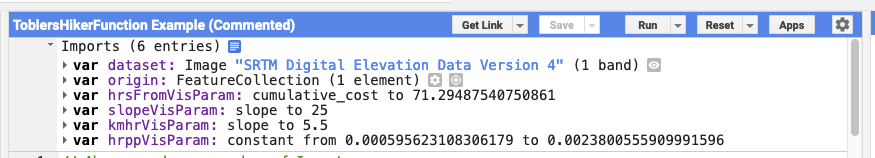

## The Imports

At the top of the script window, you will see prepared imports:

- `dataset` holds the SRTM Digital Elevation Model, an image with one band called `elevation`.
- `origin` is a `FeatureCollection` with a single point feature. You will alter this feature later.
- `hrsFromVisParam` is a dictionary containing visualization parameters for the `hrsFrom` layer.
- `slopevis` is a dictionary containing visualization parameters for the `slope` layer.
- `kmhrVisParam` is a dictionary containing visualization parameters for the `speedDEM` layer.
- `hrppVisParam` is a dictionary containing visualization parameters for the `toblerTime` layer.

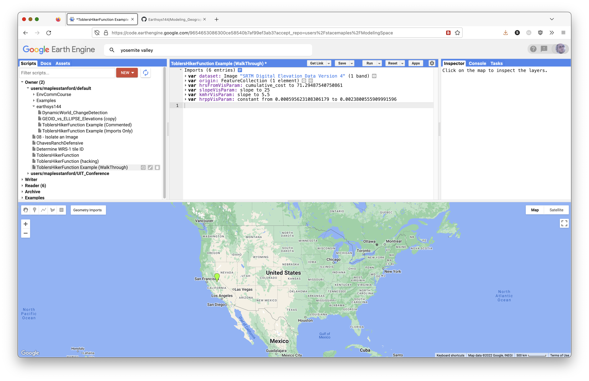

> **Concept note:** In Earth Engine, imports are objects created through the Code Editor interface and inserted above your script. They are still part of the script environment, so later code can refer to names such as `dataset` and `origin`.

## How To Use the Code Blocks

From this point, you will read an explanation, then paste the related JavaScript into the Code Editor. The code blocks in this lesson are **sequential**, so paste them in the order presented.

Most comments appear before the active code they explain. Read the comments. They are part of the lab.

Some lines are commented out with `//`. These are usually optional test layers. You can remove the `//` to test a layer, run the script, then add the `//` back before continuing.

Save your script often.

Look for the copy icon in each code block to copy the full block more easily.


## Set the Map Options

### Set the Basemap

First, set the basemap for the model. Here it is set to `TERRAIN`. It can also be set to:

- `ROADMAP`
- `SATELLITE`
- `HYBRID`
- `TERRAIN`

```javascript
// Set the basemap for the model.
// TERRAIN is useful here because it makes ridges, valleys, and slope easier to see.
Map.setOptions('TERRAIN');
```

### Center the Map on an Object

The next code block centers the map on the `origin` FeatureCollection, which currently has a single point feature.

You can edit the zoom level. In Google map zoom levels, `0` shows the world and `22` is close to house scale.

```javascript
// Center the map on the origin FeatureCollection.
// The number 9 is the zoom level. Larger numbers zoom in closer.
Map.centerObject(origin, 9);
```

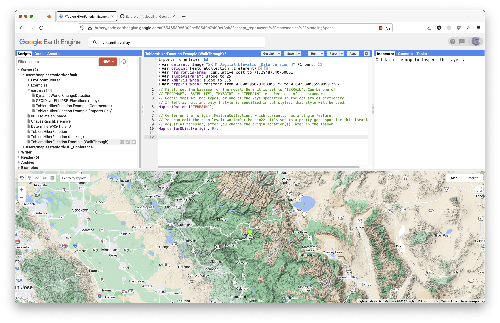

## Complete Model Script

The script below is the full model in one block. It uses the same model steps explained in the sequential sections below, but with the course header and beginner comments already cleaned up.

Paste this script into the Code Editor after the imports, or use it to check your sequential work.

```javascript
// Stace Maples
// EarthSys 144
// Tobler's Hiker Function: Movement Modeling in Google Earth Engine
//
// This script models how terrain changes travel time across a landscape.
// Instead of asking only "how far away is this place?", we ask
// "how long would it take to walk there?"
//
// The script uses Tobler's Hiker Function to estimate walking speed from slope.
// Flat or gentle terrain is easier to cross. Steep terrain is slower to cross.

// ----------------------------------------------------------------------------
// Part 1: Load the DEM, origin point, and visualization settings
// ----------------------------------------------------------------------------

// Load the SRTM 90-meter digital elevation model, or DEM.
// A DEM is a raster where each pixel stores an elevation value.
var dataset = ee.Image("CGIAR/SRTM90_V4"),
  // Create a starting point for the movement model.
  // This point can be edited later in the Earth Engine Geometry Imports panel.
  origin = /* color: #98ff00 */ee.FeatureCollection(
    [ee.Feature(
      ee.Geometry.Point([-119.58035651742242, 37.74237892779974]),
      {
        "DUM": 1,
        "system:index": "0"
      })]),
  // Visualization parameters control how layers are drawn on the map.
  // They do not change the underlying analysis values.
  slopevis = {"min": 0, "max": 60, "palette": ["green", "yellow", "red"]},
  hrsFromVisParam = {"min": 0, "max": 96, "palette": ["ffffff", "fdd49e", "fdbb84", "fc8d59", "d7301f", "7f0000"]},
  kmhrVisParam = {"opacity": 1, "bands": ["slope"], "min": 0.2204210745253552, "max": 5.036742124615245, "palette": ["060606", "ffffff"]},
  hrppVisParam = {"opacity": 1, "bands": ["constant"], "min": 0.000595623108306179, "max": 0.004712466148282336, "palette": ["10b306", "fbff00", "ff1f08"]};

// ----------------------------------------------------------------------------
// Part 2: Select elevation and calculate slope
// ----------------------------------------------------------------------------

// Select the elevation band from the SRTM DEM.
// Earth Engine images can contain multiple bands, so select() tells Earth
// Engine which band we want to use.
var elevation = dataset.select('elevation');

// Calculate slope in degrees from the elevation raster.
// Slope is the first terrain variable needed for Tobler's Hiker Function.
var slope = ee.Terrain.slope(elevation);

// Create a comparison image where every pixel has a slope of 0.
// This lets us compare terrain-based movement against movement on flat ground.
var flatSlope = ee.Image.constant(0);

// ----------------------------------------------------------------------------
// Part 3: Define Tobler's Hiker Function
// ----------------------------------------------------------------------------

// Tobler's Hiker Function estimates walking speed from slope:
//
// Walking velocity (km/h) =
// 6 * exp(-3.5 * abs(tan((slope_degrees * 3.14159) / 180) + 0.05))
//
// https://en.wikipedia.org/wiki/Tobler%27s_hiking_function
// https://www.osti.gov/servlets/purl/1311302
//
// The function below accepts a slope image and returns a walking-speed image.
var toblerSpeed = function(image) {
  // Convert slope from degrees to radians.
  // Trigonometric functions such as tan() expect radians.
  var radians = image
    .multiply(3.14159)
    .divide(180.0);

  // Apply Tobler's Hiker Function.
  //
  // tan() turns the slope angle into a steepness measure.
  // add(0.05) adds baseline walking friction.
  // abs() treats uphill and downhill the same in this simplified model.
  // multiply(-3.5) and exp() make steep slopes slow movement dramatically.
  // multiply(6.0) expresses the result as kilometers per hour.
  var toblerSpeed = radians
    .tan()
    .add(0.05)
    .abs()
    .multiply(-3.5)
    .exp()
    .multiply(6.0);

  return toblerSpeed;
};

// ----------------------------------------------------------------------------
// Part 4: Calculate walking speed and time cost
// ----------------------------------------------------------------------------

// Apply Tobler's function to the real terrain slope.
var speedDEM = toblerSpeed(slope);

// Apply Tobler's function to the flat comparison surface.
var speedFlat = toblerSpeed(flatSlope);

// Convert walking speed to hours per pixel for the real terrain.
// Faster pixels cost less time to cross. Slower pixels cost more time to cross.
var toblerTime = ee.Image.constant(.003)
  .divide(speedDEM);

// Convert walking speed to hours per pixel for the flat comparison surface.
var flatTime = ee.Image.constant(.003)
  .divide(speedFlat);

// ----------------------------------------------------------------------------
// Part 5: Rasterize the origin point
// ----------------------------------------------------------------------------

// cumulativeCost() requires an image as its source.
// This step converts the origin FeatureCollection into an image.
//
// To change the origin point:
// 1. Click Reset so the model does not run while you move the point.
// 2. Click the current point and delete it.
// 3. Zoom and pan to a new location.
// 4. Change the basemap to Map > Terrain to find topographically interesting places.
// 5. Hover over the Geometry Imports widget and click the origin layer until the crosshair activates.
// 6. Click a new location, then click Exit in the Geometry Imports widget.
// 7. Run the script again.
//
// Adding more than one point is possible, but it can reduce performance.
var originImage = origin.reduceToImage({
  properties: ['DUM'],
  reducer: ee.Reducer.first()
});

// ----------------------------------------------------------------------------
// Part 6: Calculate cumulative travel time
// ----------------------------------------------------------------------------

// Accumulate travel-time cost outward from the origin across real terrain.
// Each output pixel stores modeled walking time from the origin.
var hrsFrom = toblerTime.cumulativeCost(originImage, 60000);

// Accumulate travel-time cost outward from the origin across flat terrain.
// This creates a baseline model where slope does not affect movement.
var hrsFlat = flatTime.cumulativeCost(originImage, 60000);

// ----------------------------------------------------------------------------
// Part 7: Define walking-time zones
// ----------------------------------------------------------------------------

// Define how many hours of walking count as one travel day.
// Change this value to increase or reduce the number of walking hours per day.
var daysWalk = 8;

// Create true/false rasters for 1-day, 2-day, and 3-day walking zones.
// lt() means "less than". Pixels inside the threshold become true.
var onedayWalk = hrsFrom.lt(daysWalk);
var twodayWalk = hrsFrom.lt(daysWalk * 2);
var threedayWalk = hrsFrom.lt(daysWalk * 3);
var threedayFlat = hrsFlat.lt(daysWalk * 3);

// ----------------------------------------------------------------------------
// Part 8: Add analysis layers to the map
// ----------------------------------------------------------------------------

// Add analytic layers with visibility turned off by default.
// Open the Layers widget to toggle these layers on when you want to inspect them.
Map.addLayer(slope, slopevis, 'slope', 0);
Map.addLayer(speedDEM, kmhrVisParam, 'km/hr', 0);
Map.addLayer(toblerTime, hrppVisParam, 'Hours per Pixel', 0);
Map.addLayer(hrsFrom, hrsFromVisParam, 'Hours from Origin', 0);

// Add the walking-time zones with opacity.
// Layer order matters: layers later in the code draw on top of earlier layers.
// updateMask() hides pixels outside each reachable zone.
Map.addLayer(threedayFlat.updateMask(threedayFlat), {min: 0, max: 1, palette: 'green'}, '3 days on Flat', 1, 0.5);
Map.addLayer(threedayWalk.updateMask(threedayWalk), {min: 0, max: 1, palette: 'red'}, '3 days from Origin', 1, 0.5);
Map.addLayer(twodayWalk.updateMask(twodayWalk), {min: 0, max: 1, palette: 'orange'}, '2 days from Origin', 1, 0.5);
Map.addLayer(onedayWalk.updateMask(onedayWalk), {min: 0, max: 1, palette: 'yellow'}, '1 day from Origin', 1, 0.5);

// ----------------------------------------------------------------------------
// Part 9: Set up the map view
// ----------------------------------------------------------------------------

// Use the terrain basemap so ridges, valleys, and steep slopes are easier to see.
Map.setOptions('TERRAIN');

// Convert the flat 3-day walking zone to vectors.
// This is an optional supporting layer for later export or inspection.
var flatBounds = threedayFlat.reduceToVectors({
  scale: 10,
  geometryType: 'polygon',
  eightConnected: false,
  bestEffort: true,
  tileScale: 2
});

// Center the map on the origin point.
Map.centerObject(origin, 9);

// ----------------------------------------------------------------------------
// Part 10: Prepare optional export layers
// ----------------------------------------------------------------------------

// Get the current map bounds as GeoJSON.
// This can be used as an export region if you export the result.
var mapBounds = Map.getBounds({asGeoJSON: true});
print(mapBounds);

// Create a single image from the walking-time zones.
// This layer is added to the map with visibility turned off by default.
var walkingTimesDataset = ee.Image.constant(5).subtract(threedayFlat.add(threedayWalk).add(twodayWalk).add(onedayWalk)).abs();
Map.addLayer(walkingTimesDataset, {min: 0, max: 5}, 'Export Dataset', 0);

// The export block is commented out.
// Remove the /* and */ if you want to export the walking-time zones as a
// GeoTIFF image where 1 is in one day's walk and 0 is outside.
/*
Export.image.toDrive({
  image: walkingTimesDataset,
  description: 'walkingTimeZones',
  fileNamePrefix: 'ToblerWalkingTimeZones',
  region: mapBounds,
  scale: 150
});
*/
```

### Define the Hours-from-Origin Visualization Parameters

Before you test the `hrsFrom` layer later in the model, define its visualization parameters. This prevents an error when `hrsFromVisParam` is used in a `Map.addLayer()` call.

```javascript
// Define how the hours-from-origin layer should draw on the map.
// This does not change the analysis values in hrsFrom.
// It only tells Earth Engine how to color the layer for visual inspection.
var hrsFromVisParam = {
  min: 0,
  max: 24,
  palette: ['ffffff', 'fdd49e', 'fdbb84', 'fc8d59', 'd7301f', '7f0000']
};
```

## Begin Producing the Analytic Layers of Your Model

The sections below explain the model piece by piece. If you pasted the complete script above, use these sections to understand what the code is doing. If your instructor asks you to build the model sequentially, paste these blocks one at a time.

### Select the Elevation Band from the SRTM Collection

Declare a variable called `elevation` and give it the `elevation` band selected from the `dataset` that contains the SRTM collection. You can see the selectable bands by looking at the [SRTM data catalog entry](https://developers.google.com/earth-engine/datasets/catalog/CGIAR_SRTM90_V4).

```javascript
// Select the elevation band from the SRTM DEM.
// A DEM is a raster where each pixel stores an elevation value.
var elevation = dataset.select('elevation');

// Optional test layer:
// Map.addLayer(elevation, {min: 0, max: 3000}, 'elevation');
```

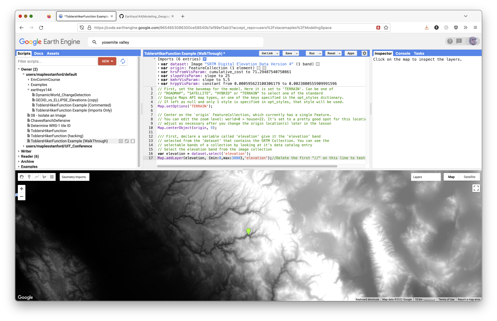

### Calculate Slope from an Image

Calculate the slope of the elevation image in degrees. This is the first analytic step in the model.

```javascript
// Calculate slope from the DEM.
// ee.Terrain.slope() returns slope in degrees.
var slope = ee.Terrain.slope(elevation);

// Optional test layer:
// Map.addLayer(slope, slopevis, 'slope');
```

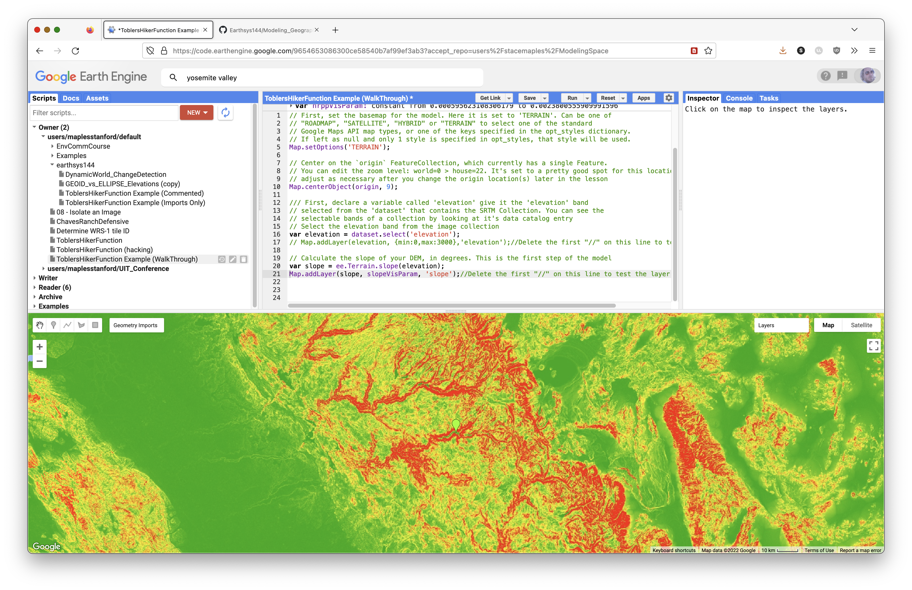

### Prepare a Baseline Image for Comparison

Create a flat slope image. This lets you compare movement across the real DEM to movement across a flat surface without slope friction.

```javascript
// Create a flat slope image.
// Every pixel has a slope value of 0.
var flatSlope = ee.Image.constant(0);
```

> **Concept note:** The flat surface is a control model. It helps you see how much the real terrain changes movement compared with a world where all directions are equally easy to cross.

### Implement Tobler's Hiker Function

Tobler's Hiker Function is an exponential model of theoretical hiking speed based on slope.

Walking velocity:

```text
Walking Velocity (km/h) = 6 * exp(-3.5 * abs(tan((slope_degrees * 3.14159) / 180) + 0.05))
```

You can read more here:

- https://en.wikipedia.org/wiki/Tobler%27s_hiking_function
- https://www.osti.gov/servlets/purl/1311302

```javascript
// Create a Tobler function that accepts any slope image.
var toblerSpeed = function(image) {
  // Convert slope from degrees to radians for trigonometry.
  var radians = image
    .multiply(3.14159)
    .divide(180.0);

  // Apply Tobler's Hiker Function to estimate walking speed in km/hr.
  var toblerSpeed = radians
    .tan()
    .add(0.05)
    .abs()
    .multiply(-3.5)
    .exp()
    .multiply(6.0);

  return toblerSpeed;
};
```

### Pass Your Slope Images to `toblerSpeed()`

Now pass both slope layers, `slope` and `flatSlope`, to `toblerSpeed()`.

```javascript
// Calculate walking speed from the real slope surface.
var speedDEM = toblerSpeed(slope);

// Calculate walking speed from the flat comparison surface.
var speedFlat = toblerSpeed(flatSlope);

// Optional test layer:
// Map.addLayer(speedDEM, kmhrVisParam, 'speedDEM');
```

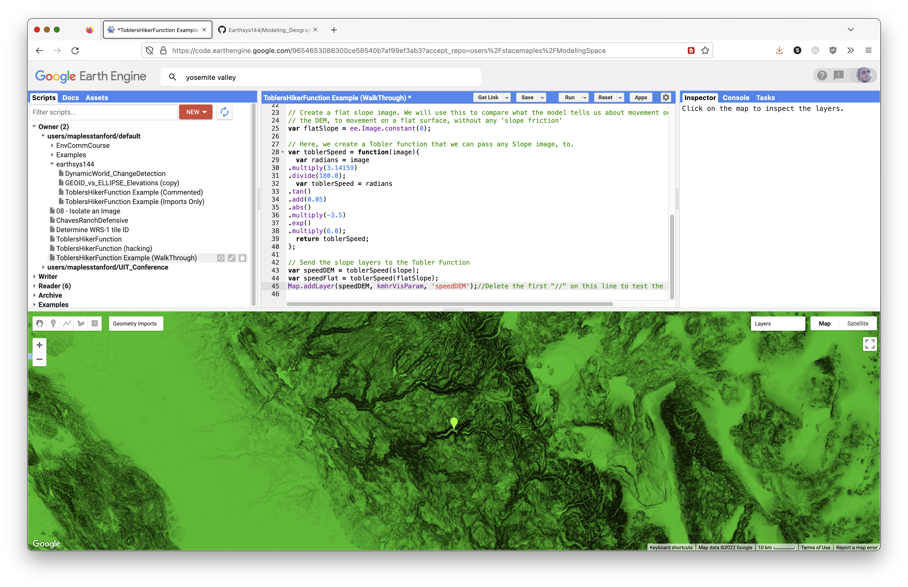

### Convert Speed to Cost Per Pixel

Next, convert `km/hr` to `hrs/px`, or hours per pixel. This tells us how many hours each pixel costs to cross.

```javascript
// Convert walking speed to hours per pixel for the real terrain.
var toblerTime = ee.Image.constant(0.003)
  .divide(speedDEM);

// Optional test layer:
// Map.addLayer(toblerTime, hrppVisParam, 'toblerTime');
```

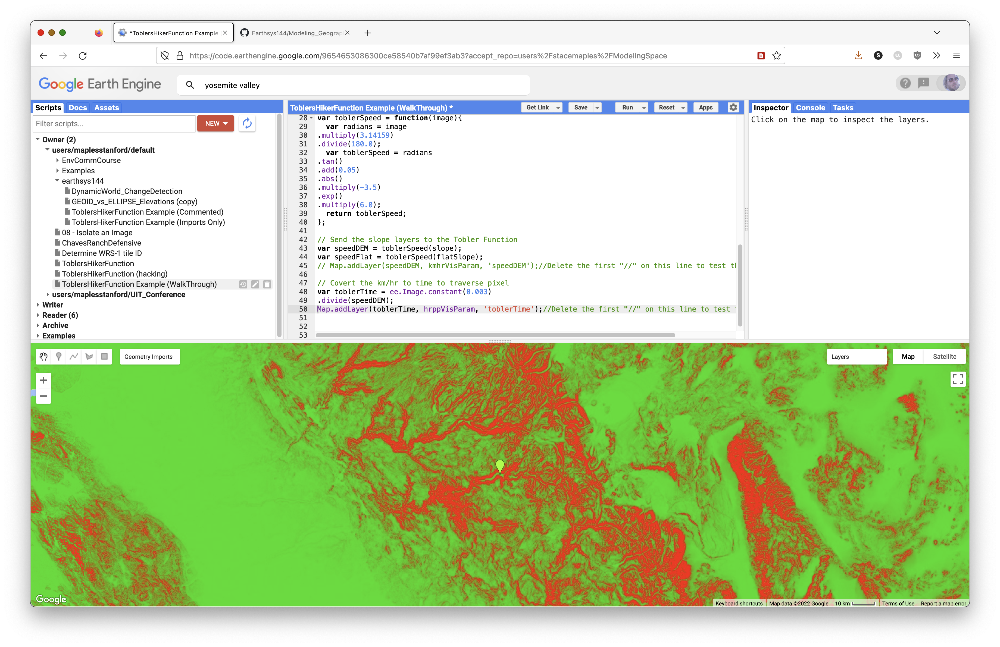

Convert the flat walking speed to hours per pixel as well.

```javascript
// Convert walking speed to hours per pixel for the flat comparison image.
var flatTime = ee.Image.constant(0.003)
  .divide(speedFlat);
```

### Prepare the Origin Point

It is necessary to rasterize the `origin` points, because [`cumulativeCost()`](https://developers.google.com/earth-engine/guides/image_cumulative_cost) requires an image input.

Here, [`reduceToImage()`](https://developers.google.com/earth-engine/apidocs/ee-featurecollection-reducetoimage) converts the `origin` FeatureCollection into an image.

```javascript
// Rasterize the origin point.
// cumulativeCost() needs an image source, not a vector point.
var originImage = origin.reduceToImage({
  properties: ['DUM'],
  reducer: ee.Reducer.first()
});
```

### Use `cumulativeCost()` to Create an Hours-from-Origin Layer

The [`cumulativeCost()`](https://developers.google.com/earth-engine/guides/image_cumulative_cost) function accumulates cost away from the source image.

```javascript
// Accumulate travel-time cost away from the origin on real terrain.
var hrsFrom = toblerTime.cumulativeCost(originImage, 60000);

// Accumulate travel-time cost away from the origin on flat terrain.
var hrsFlat = flatTime.cumulativeCost(originImage, 60000);

// Optional test layer:
// Map.addLayer(hrsFrom, hrsFromVisParam, 'Hours from Origin');
```

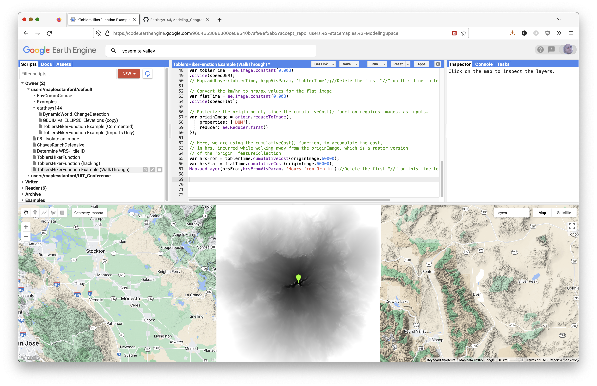

> **Concept note:** Cumulative cost does not simply draw circles around the origin. It expands through the lower-cost parts of the landscape first. Valleys and gentle slopes become corridors; steep slopes become barriers.

### Select Pixels Within N Hours of the Origin

Now select only pixels within 1, 2, and 3 walking days of the origin. You can adjust the walking day length depending on your assumption about how many hours a person can walk in one day.

The resulting layers represent walking-time isochrones.

```javascript
// Define the number of walking hours in one travel day.
var daysWalk = 8;

// Select pixels less than each walking-time threshold.
// lt() means "less than" and returns true/false pixels.
var onedayWalk = hrsFrom.lt(daysWalk);
var twodayWalk = hrsFrom.lt(daysWalk * 2);
var threedayWalk = hrsFrom.lt(daysWalk * 3);
var threedayFlat = hrsFlat.lt(daysWalk * 3);
```

> **Terminology note:** These layers are more accurately **isochrones**, or equal-time zones. Some older lab language called them "isohyets," but isohyets usually refer to equal rainfall.

### Add the Analytic Layers to the Map

Add the analytic layers with visibility off by default. Use the **Layers** widget to toggle layers on when you want to inspect them.

```javascript
// Add analytic layers to the map, toggled off by default.
Map.addLayer(slope, slopevis, 'slope', 0);
Map.addLayer(speedDEM, kmhrVisParam, 'km/hr', 0);
Map.addLayer(toblerTime, hrppVisParam, 'Hours per Pixel', 0);
Map.addLayer(hrsFrom, hrsFromVisParam, 'Hours from Origin', 0);
```

### Add the Modeled Walking-Time Layers

Add the walking-time areas with opacity. The order of the code is the order rendered on the map. The `updateMask()` function makes the `0` values transparent so only reachable pixels are drawn.

```javascript
// Add walking-time isochrones to the map.
// updateMask() hides the 0 values in these binary layers.
Map.addLayer(threedayFlat.updateMask(threedayFlat), {min: 0, max: 1, palette: 'green'}, '3 days on Flat', 1, 0.5);
Map.addLayer(threedayWalk.updateMask(threedayWalk), {min: 0, max: 1, palette: 'red'}, '3 days from Origin', 1, 0.5);
Map.addLayer(twodayWalk.updateMask(twodayWalk), {min: 0, max: 1, palette: 'orange'}, '2 days from Origin', 1, 0.5);
Map.addLayer(onedayWalk.updateMask(onedayWalk), {min: 0, max: 1, palette: 'yellow'}, '1 day from Origin', 1, 0.5);
```

## Test and Troubleshoot the Script

Save your script and run it.

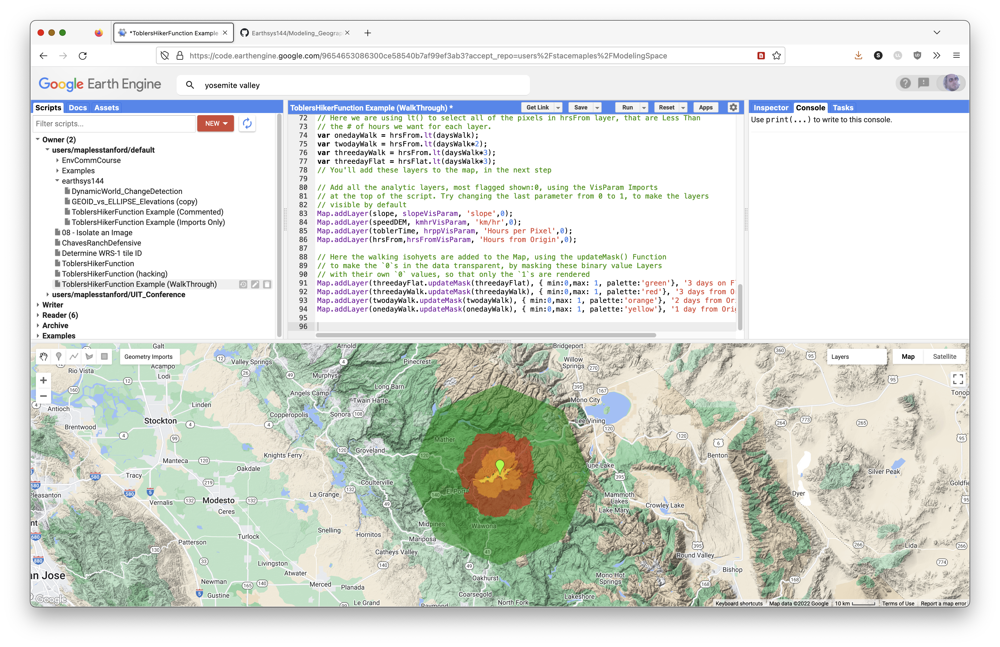

When troubleshooting, look for icons in the left margin of the Code Editor. These often provide messages about what the interpreter thinks is wrong.

In general:

- Check that each statement ends with a semicolon `;`.
- Check that comments are actually commented.
- Check that you pasted code blocks in the correct order.
- Check that variable names match exactly, including capitalization.
- If you ask for help, include the Get Link URL for the version of the script you want help with.

## To Turn In: Preparations

Once you have successfully run the script, it is time to make it do what you want it to do.

You will edit the code so the model focuses on another part of the world.

## Change the Origin Point to Model Movement Somewhere Else

The model currently points to the Yosemite Valley area in California. Choose another topographically interesting place in the world.

To change the origin point after running the model successfully:

1. Save your script.
2. Click **Reset** so the model does not run while you move to a new location.

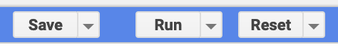

3. Click the current point and delete it.
4. Zoom and pan to a new location.
5. Change the basemap widget to **Map > Terrain** to find topographically interesting locations.
6. Hover over the Geometry Imports widget.
7. Click the `origin` layer until the crosshair icon activates.

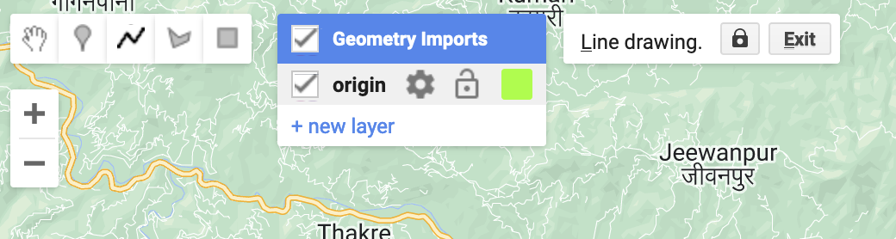

8. Click with the crosshair in a new location.
9. Click **Exit** in the Geometry Imports widget to save the new location.

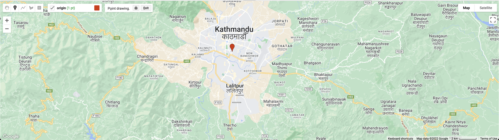

10. Run the script to see the new results.

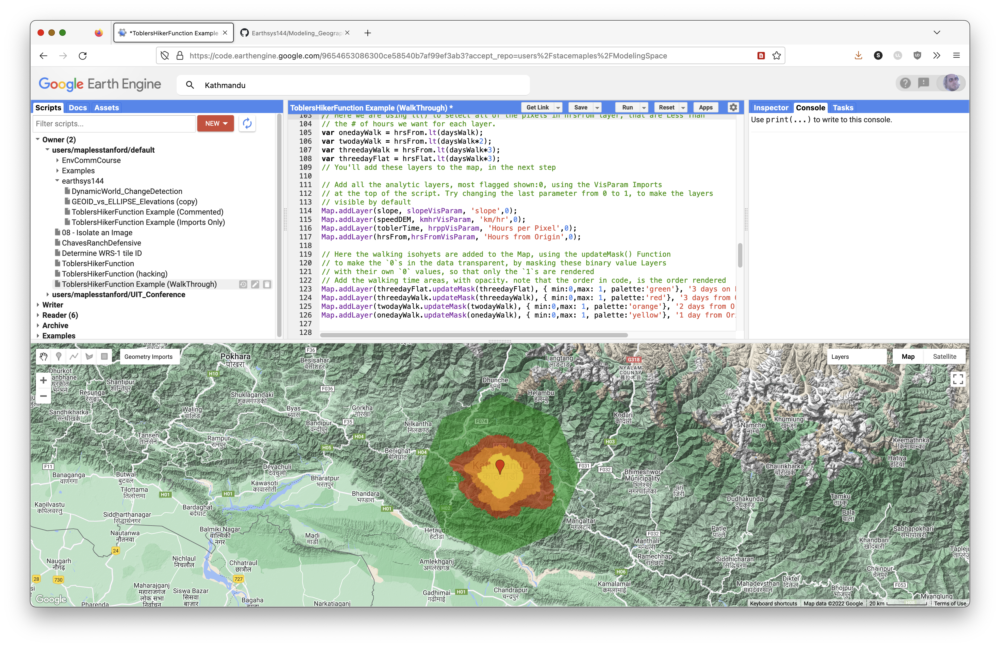

Adding more than one point is possible, but it can reduce performance dramatically.

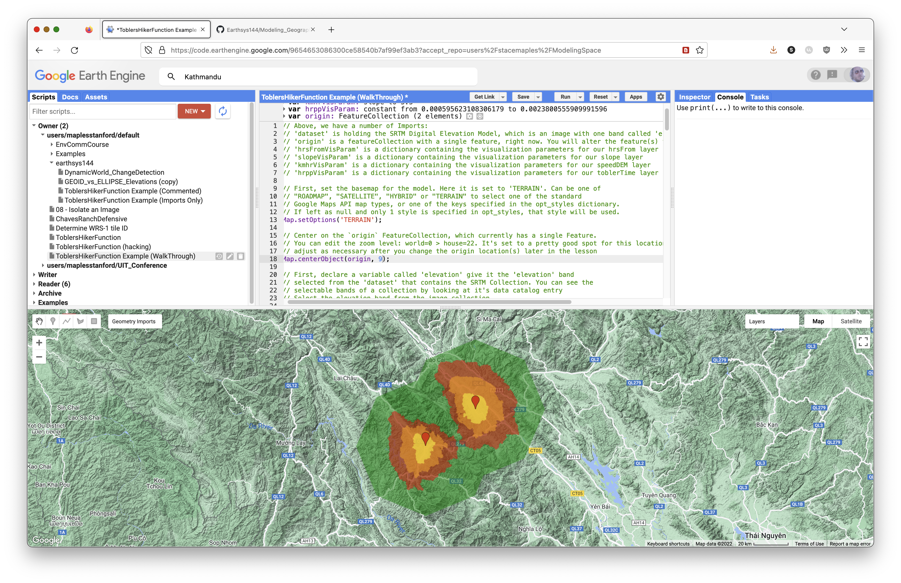

Save your script often.

## Exporting Your Modeled Layers as a Dataset

The next steps prepare and export the resulting layers as a single GeoTIFF image.

### Flatten Your Layers into a Single Layer Using Band Math

Use this code to flatten the walking-time layers into a single image with five values. The formula subtracts the combined layers from `5` and uses [`abs()`](https://developers.google.com/earth-engine/apidocs/ee-image-abs), or absolute value, to remove the negative sign.

```javascript
// Create a single dataset from the walking-time layers.
var collapseIsochrones = ee.Image.constant(5)
  .subtract(threedayFlat.add(threedayWalk).add(twodayWalk).add(onedayWalk))
  .abs();

// Optional test layer:
// Map.addLayer(collapseIsochrones, {min: 0, max: 5}, 'collapsed isochrones');
```

### Remap the Values

The next step uses [`remap()`](https://developers.google.com/earth-engine/apidocs/ee-image-remap) to change the background value from `5` to `0`.

```javascript
// Pixel values to replace.
var fromList = [1, 2, 3, 4, 5];

// Replacement values.
// Here, the background value 5 becomes 0.
var toList = [1, 2, 3, 4, 0];
```

Use `remap()` with the lists above to replace the values in the output dataset.

```javascript
// Replace pixel values in the collapseIsochrones image.
var walkingTimesDataset = collapseIsochrones.remap({
  from: fromList,
  to: toList,
  bandName: 'constant'
});
```

### Test the `walkingTimesDataset`

Add the dataset to the map, toggle it on in the **Layers** widget, and use the **Inspector** to confirm the values:

- `1`: One-day walk
- `2`: Two-day walk
- `3`: Three-day walk
- `4`: Three days on flat terrain
- `0`: Background

```javascript
// Add the walkingTimesDataset, toggled off by default.
Map.addLayer(walkingTimesDataset, {min: 0, max: 5}, 'Export Dataset', 0);
```

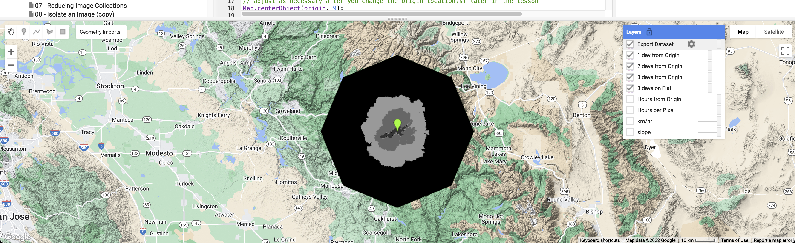

## Export the `walkingTimesDataset` to Google Drive

The next code exports the `walkingTimesDataset` layer to a GeoTIFF in the top-level folder of the Google Drive associated with your Earth Engine account. You will download this GeoTIFF and display it in QGIS for your final layout.

### Get the Bounds of the Current Map View

First, get the bounds of the current map view. If you cannot see your entire `walkingTimesDataset`, adjust the `Map.centerObject()` zoom level until the layer fits in the map view.

```javascript
// Get the bounds of the current map view for export.
var mapBounds = Map.getBounds({asGeoJSON: true});
```

### Send the Dataset to the Tasks Panel

The code below creates an export task. After running it, open the **Tasks** tab and start the export.

```javascript
Export.image.toDrive({
  image: walkingTimesDataset,
  description: 'YosemiteCAwalkingTimeZones',
  fileNamePrefix: 'Yosemite_CA_ToblerWalkingTimeZones',
  region: mapBounds,
  scale: 150
});
```

Once you run the script with the export code, the **Tasks** tab will flash. Click it and start the export task. Return to the **Tasks** tab to check progress. The export may take several minutes.

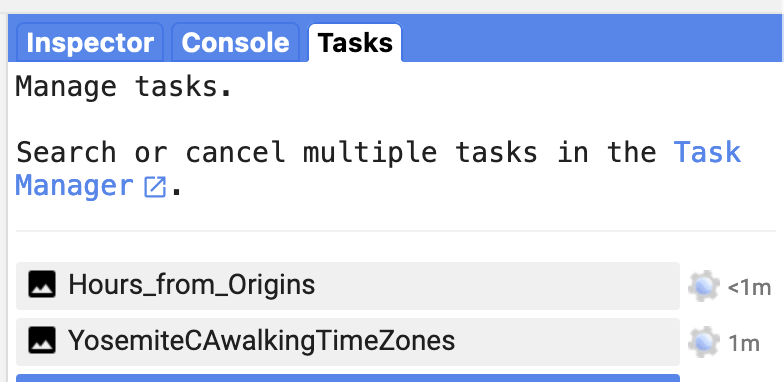

> **Concept note:** Always specify export scale. Scale controls output pixel size. A smaller scale value creates finer pixels and can take much longer to process.

## Exporting Other Layers with the Export Code

If you want to export another layer, such as `slope` or `hrsFrom`, copy the export code and change the `image`, `description`, and `fileNamePrefix` values.

Example export for `hrsFrom`:

```javascript
Export.image.toDrive({
  image: hrsFrom,
  description: 'Hours_from_Origins',
  fileNamePrefix: 'Yosemite_CA_hrsFromOrigins',
  region: mapBounds,
  scale: 30
});
```

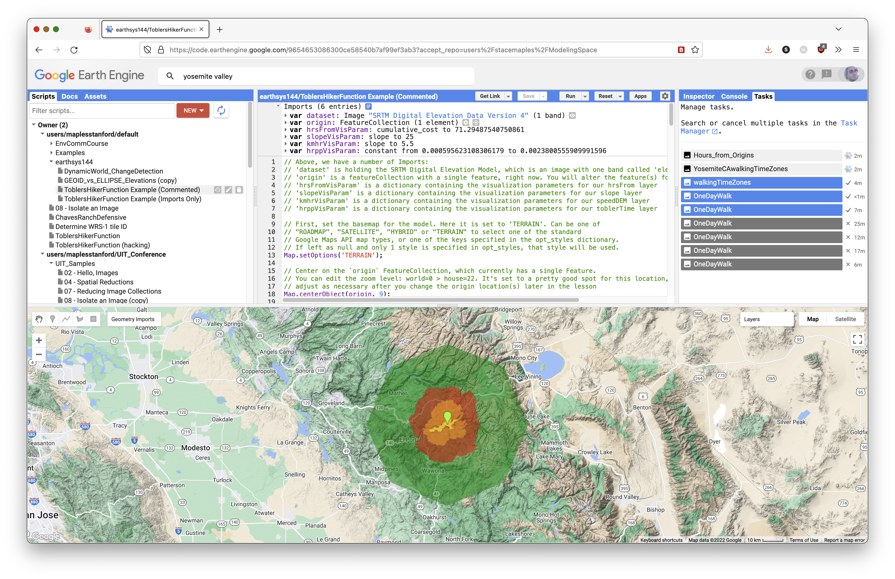

## To Turn In: Finishing Up

Once the export has successfully run and the data are in Google Drive:

1. Download `walkingTimesDataset` from Google Drive to your computer.
2. Create a new QGIS project.
3. Add `walkingTimesDataset` to the project.
4. Add an appropriate basemap.
5. Style the `walkingTimesDataset` layer appropriately.

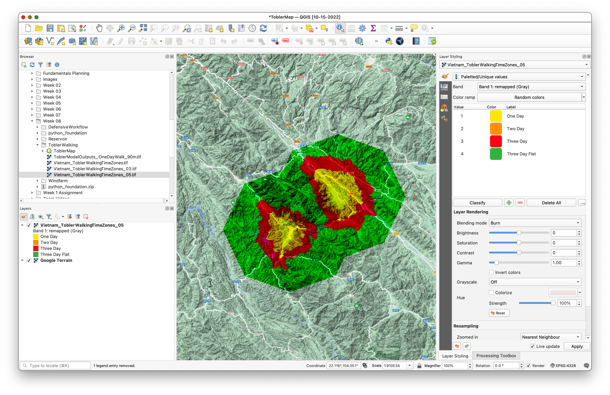

In the image above, the Google Terrain basemap is used and `walkingTimesDataset` is styled with `Paletted/Unique values`. The blending mode is set to `Burn`. Values of `0` have been removed from the styling classes with the remove selected row tool.


If you exported additional layers, you may add them to your map, but that is optional.

Create a QGIS layout of your **Tobler's Hiker Model**. Add appropriate map elements:

- title
- date
- your name
- map CRS
- legend
- scale bar
- explanatory text

Your explanatory text should describe Tobler's Hiker Function in general and describe any changes you made to the model, including the new location and number of walking hours per day.

Export your QGIS map layout to PDF or PNG.

Submit:

- your final QGIS map layout as PDF
- a Google Earth Engine **Get Link URL** to the final version of your script

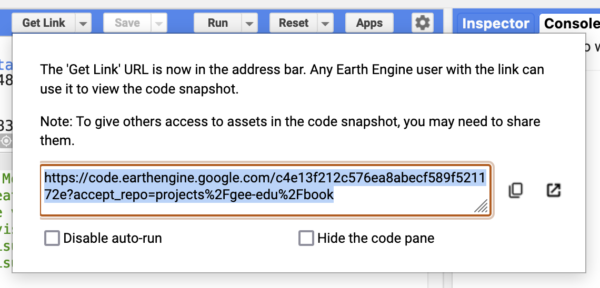

## Reference

- Tobler, W. (1993). "Three Presentations on Geographical Analysis and Modeling."
- https://en.wikipedia.org/wiki/Tobler%27s_hiking_function
