# Sampling and Interpolation with QGIS

> **Turn-in for grading:** This lab includes material that must be turned in for grading. Complete the required deliverables and submit them as instructed by the course.

## Overview

This lab introduces sampling strategies and spatial interpolation methods in QGIS. Instead of using raster data as-is, you will **create** new raster surfaces from point samples using three different interpolation techniques.

You will work with a digital elevation model (DEM) of southeast Arizona to:

1. create sample point layers using systematic, random, and stratified sampling strategies
2. extract elevation values at those sample points
3. interpolate new raster surfaces from the samples using Inverse Distance Weighting (IDW), Nearest Neighbor, and Spline methods
4. compare the interpolated surfaces to the original DEM to understand the strengths and limitations of each method

> **Concept note:** Sampling and interpolation are fundamental to converting sparse point measurements (like weather stations or survey points) into continuous raster surfaces that cover an entire area. The method you choose affects how smooth the output is, how well it honors the original sample values, and how it represents areas between samples.

## What You Should Understand After This Lab

By the end of this exercise, you should be able to explain:

- the difference between systematic, random, and stratified sampling strategies and when to use each
- how interpolation methods like IDW, Nearest Neighbor, and Spline create raster surfaces from point data
- why stratification can be useful when sampling density matters in some regions more than others
- how filtering operations like majority filtering generalize raster data
- how to compare interpolated surfaces to original data to assess interpolation quality

## Getting Ready

You will need:

- [ChirDEM.tif](https://raw.githubusercontent.com/mapninja/Earthsys144/master/data/ChirDEM.tif), a GeoTIFF containing the elevation data for this exercise
- QGIS with Processing Toolbox and GDAL tools available
- SAGA tools for SAGA-based processing steps. SAGA must be installed separately and configured through the QGIS **Processing Saga NextGen Provider** plugin. If you have not set this up yet, complete the Week 00 guide for [Installing SAGA 9.2 for QGIS Processing](../week00/08_installing_saga_for_qgis.md).

> **Background:** The concepts and workflows in this exercise are covered in Chapter 12 (Spatial Estimation) and Chapter 10 (Raster Analysis) of the GIS Fundamentals textbook.

### Download the Data

[Download ChirDEM.tif](https://raw.githubusercontent.com/mapninja/Earthsys144/master/data/ChirDEM.tif)

This file is a GeoTIFF containing the digital elevation model for southeast Arizona (30-meter resolution, NAD83 UTM Zone 12N projection).

### Project Setup

1. Create a new folder for this lab on your computer.
2. Place `ChirDEM.tif` in that folder.
3. Create a new QGIS project in that same folder and save it as `sampling_interpolation.qgz`.
4. You will create all output layers (sample points, interpolated rasters, etc.) in this project folder.

## Data for This Exercise

The main data layer is:

- `ChirDEM.tif`: A digital elevation model of southeast Arizona at 30-meter resolution, in NAD83 UTM Zone 12N projection (EPSG:26912)

You will create multiple output layers in this lab, including sample point layers, interpolated raster surfaces, and a stratification layer based on slope classification.

## Part 1: Preparing the DEM and Creating a Base Hillshade

We’ll start by adding the DEM and creating visualization layers to help us understand the terrain variation.

1. Start QGIS, add the DEM from southeast Arizona, _ChirDEM_, and apply a color scheme to highlight topography in the DEM. Note the variation in topography—where there is significant change and where there is little change.
2. Open **Processing > Toolbox** and search for **Hillshade**.
3. Use **Raster > Terrain Analysis > Hillshade** to create a hillshade with:
   - **Solar altitude (vertical angle):** `25 degrees`
   - **Azimuth:** `315`
4. Browse and name the output: `Hillshade`

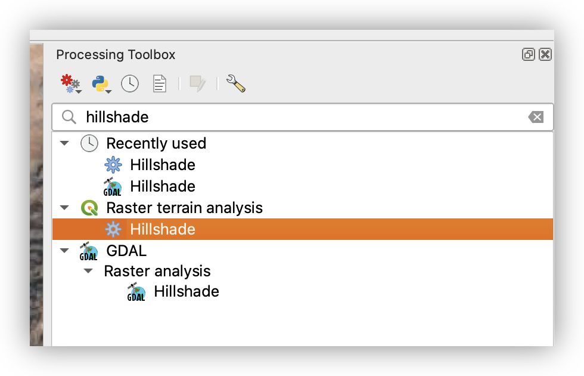

5. When finished, place the `Hillshade` underneath the `ChirDEM` in the layers panel.
6. Set the `ChirDEM` **Rendering** to **Multiply** in the Layer Styling panel to blend the hillshade with the elevation colors.

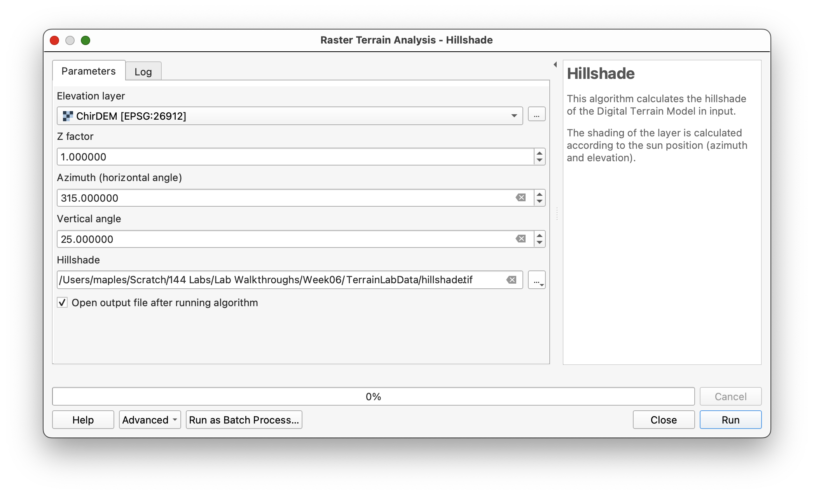

> **Workflow note:** Hillshades help visualize terrain detail by showing the interplay of light and shadow. Placing the DEM above a hillshade using Multiply blending combines color information with shading for a richer visualization.

## Organizing Your Layers into Groups

To keep your work organized as you create multiple interpolation outputs, you will group related layers in the Layers panel. This lab will involve four different interpolation approaches, each with a related set of data layers.

6. **Select both the DEM and hillshade in the Layers panel** (shift-click on PC, cmd-click on Mac), **then right-click and select “Group Selected”** from the dropdown.
7. **Rename** this group: `Original`

As you create layers for each interpolation method, select appropriate layers and group them with logical names. Suggested group names:

- `Original`
- `Inverse Distance`
- `Nearest Neighbor`
- `Spline Stratified`

If a layer ends up in the wrong group, right-click and select **Move Out of Group**.

> **Workflow note:** Organizing your layers into groups from the start makes it easier to manage the many intermediate outputs you will create and to prepare your final map layout.

**Final Output Layout:** Your maps will be arranged in a landscape orientation with four side-by-side map frames, one for each interpolation method. Each frame should display the interpolated surface, its hillshade, and contours, arranged consistently across all four maps.

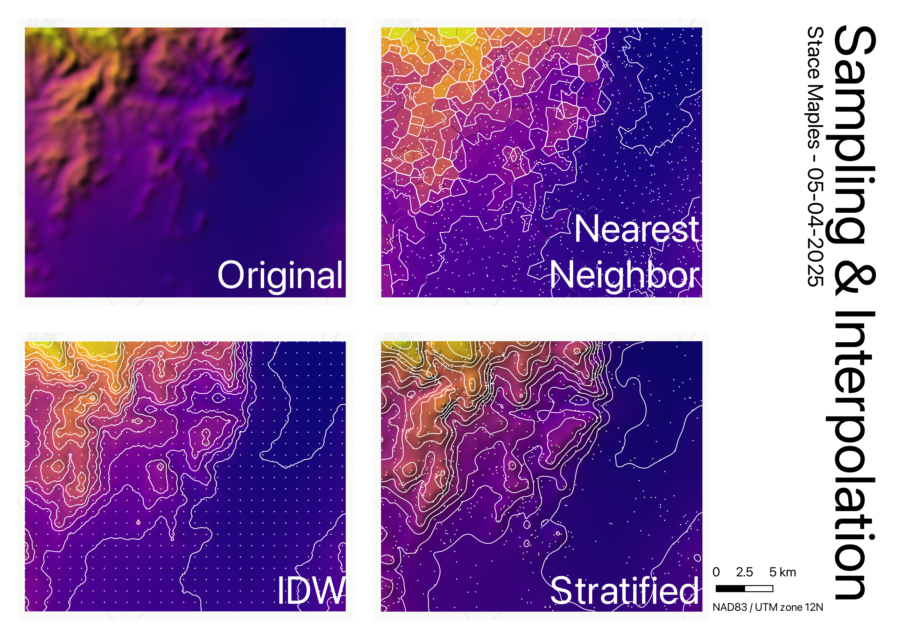

## Part 2: Systematic Sampling and IDW Interpolation

In this part, you will create a regular grid of sample points evenly spaced across the DEM, extract elevation values at those points, and then use Inverse Distance Weighting (IDW) interpolation to create a continuous raster surface from those samples.

> **Concept note:** Systematic sampling creates an evenly spaced grid of sample points, which is useful for uniform coverage and is easy to implement. However, it can miss important variation if spatial features align poorly with the grid direction.

### Creating a Regular Grid of Sample Points

1. Open **Vector > Research Tools > Regular Points** (or search for **Regular Points** in the Processing Toolbox).
2. Set the **input extent** by clicking the options button and selecting **Calculate from layer**, using the `ChirDEM` layer.
3. Set the **point spacing/count** to `1000` meters.
4. Check **Use point spacing** to specify that you want points 1000 meters apart.
5. Specify an output coordinate system if it is not already set to `EPSG:26912` (the CRS of `ChirDEM`).
6. Browse and save the output as **SystematicGrid1000m.shp**.

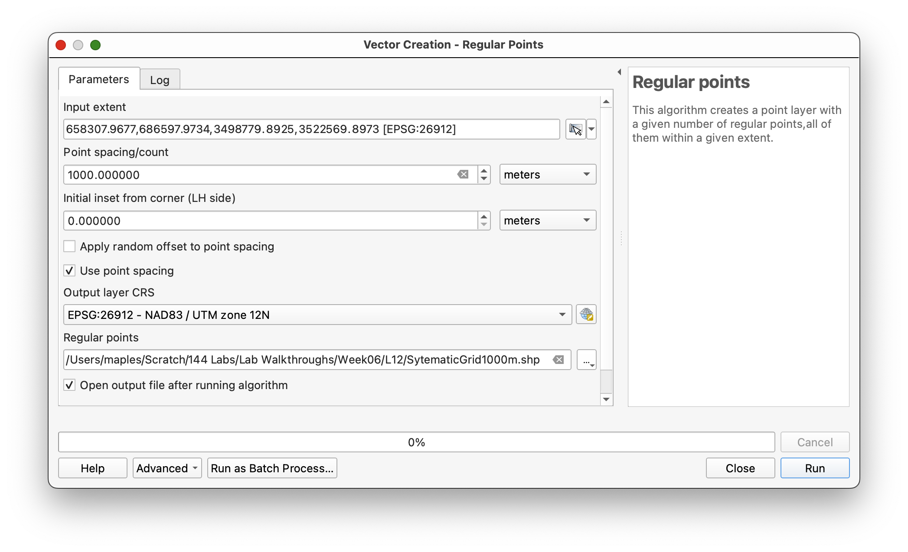

A regular grid of points should be displayed on your screen. If not, navigate to the file you created and add it to the project.

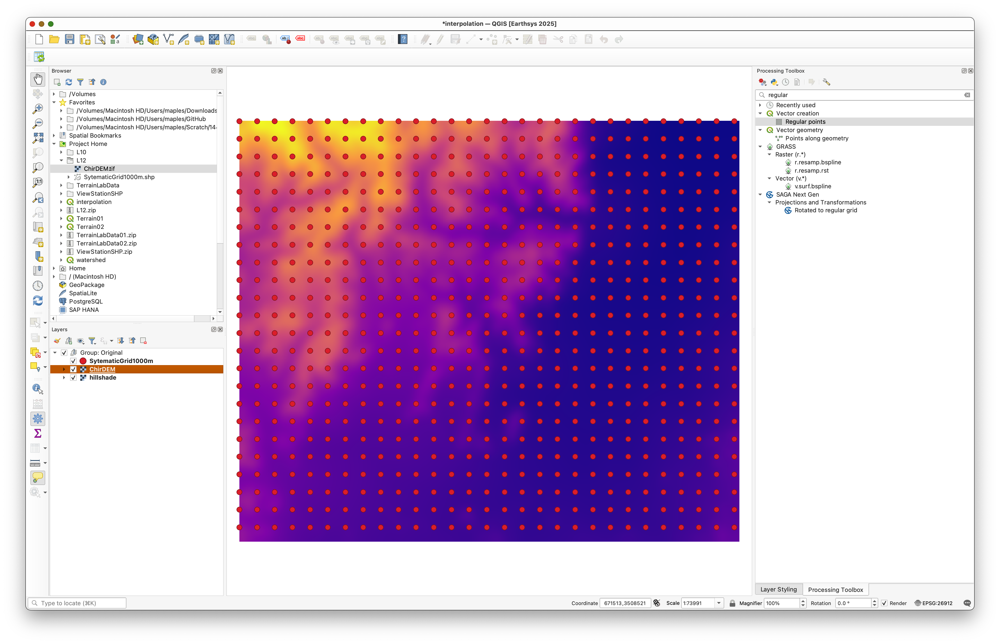

> **Concept note:** A 1000-meter spacing creates approximately 1000 sample points across the study area, providing uniform coverage without specifying a point count directly. This regular spacing ensures unbiased sampling across all terrain types.

### Extracting Elevation Values at Sample Points

Next, you will sample the elevation values from the DEM at each grid point location.

1. Return to the **Processing Toolbox** and open **Raster > Analysis > Sample raster values**.
2. Specify:
   - **Input layer:** `SystematicGrid1000m`
   - **Raster layer to sample:** `ChirDEM`
   - **Output point features:** `Elevation1000mGrid`
   - **Output column prefix:** `SAMPLE_`

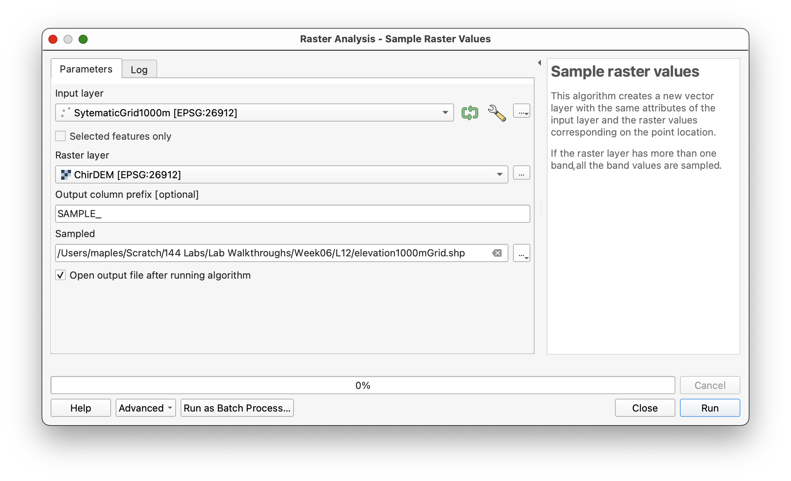

This generates a point layer with an added attribute column containing the sampled elevation value below each point:

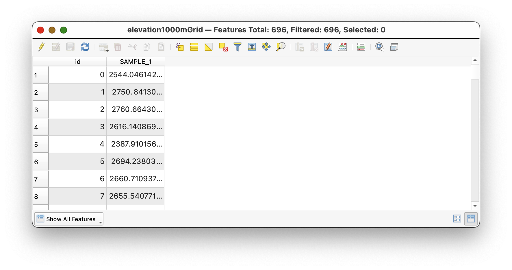

Open the attribute table and inspect the `SAMPLE_1` column, which now contains elevation values extracted from the DEM.

> **Workflow note:** The column prefix (`SAMPLE_`) is prepended to the raster band number to create column names. Since `ChirDEM` has one band, the result is `SAMPLE_1`.

### Interpolating a Surface with Inverse Distance Weighting (IDW)

Now you will create a new raster surface by interpolating from these sample points using IDW, which weights nearby points more heavily than distant ones.

1. Return to the **Processing Toolbox** and search for **GRID: Inverse distance to a Power**.

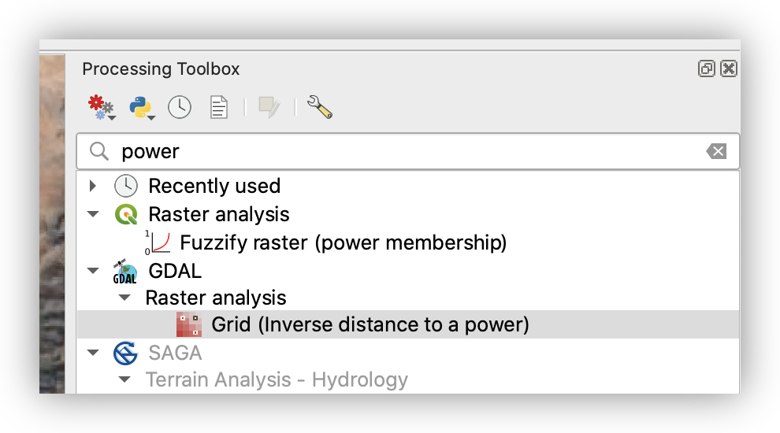

2. Specify:
   - **Point layer:** `Elevation1000mGrid`
   - **Weighting power:** `2`
   - **Smoothing:** `1`
   - **Search ellipse radii (X and Y):** `1000` meters for both
   - **Maximum number of data points to use:** `12`
   - **Minimum number of data points to use:** `1`
3. Open **Advanced Parameters** and set:
   - **Z value field:** `SAMPLE_1` (the elevation values column)
4. For the output raster cell size, paste this into **Additional command-line parameters [optional]**:

```
-tye 3498779.8925000000745058  3522569.8972999998368323 -txe 658307.9677000000374392  686597.9734000000171363 -outsize 943 793
```

These parameters specify the output extent and dimensions (943 × 793 pixels) to match the original DEM’s 30-meter cell size. See the [GDAL Grid documentation](https://gdal.org/programs/gdal_grid.html) for more details.

5. Browse and name the **Interpolated (IDW) Output:** `IDWsysP2_12`
6. Run the tool.

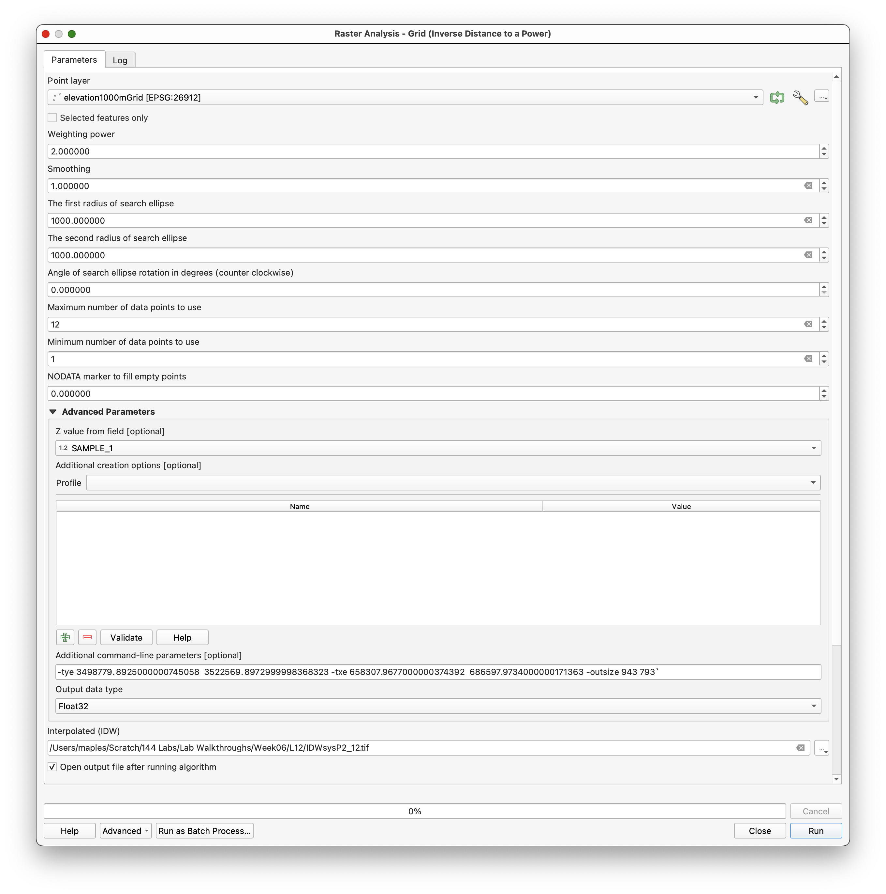

> **Concept note:** IDW interpolation calculates each output cell value as a weighted average of nearby sample points. The weighting power (2 in this case) controls how much closer points are favored—higher values make distant points matter even less. The search radius limits which points contribute to each cell, creating the characteristic “pattern” you see where nearby sample points create local influence zones.

The resulting map shows clear pattern marks where sample points and search ellipses interact:

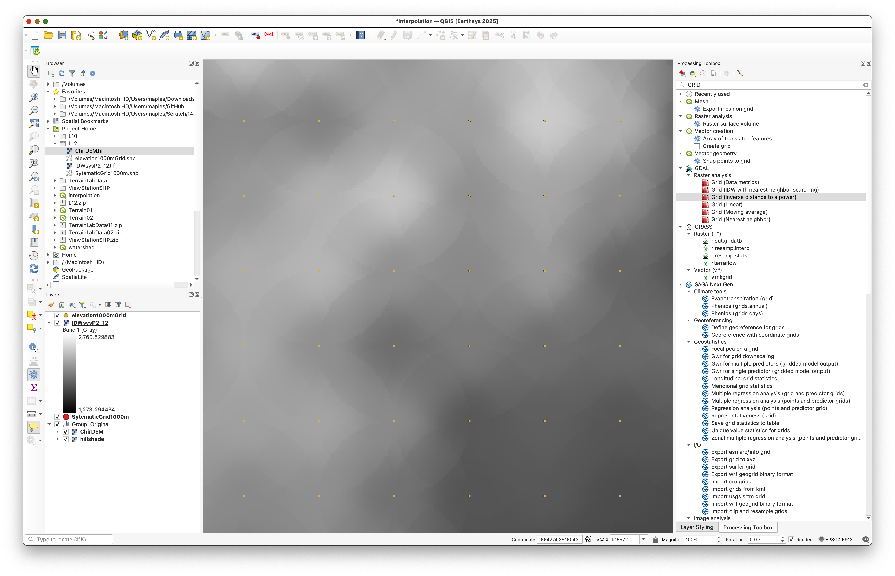

### Styling the IDW Surface

Now apply the same color scheme used for the original DEM to the interpolated surface so they are visually comparable.

1. Return to your **Original group** and right-click on the `ChirDEM` layer.
2. Select **Styles > Copy Style**.
3. Right-click on your `IDWsysP2_12` layer and select **Styles > Paste Style** to apply the same color ramp and classification.

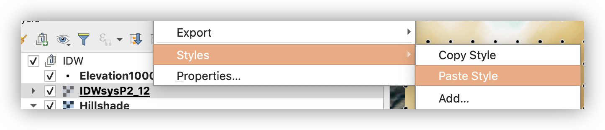

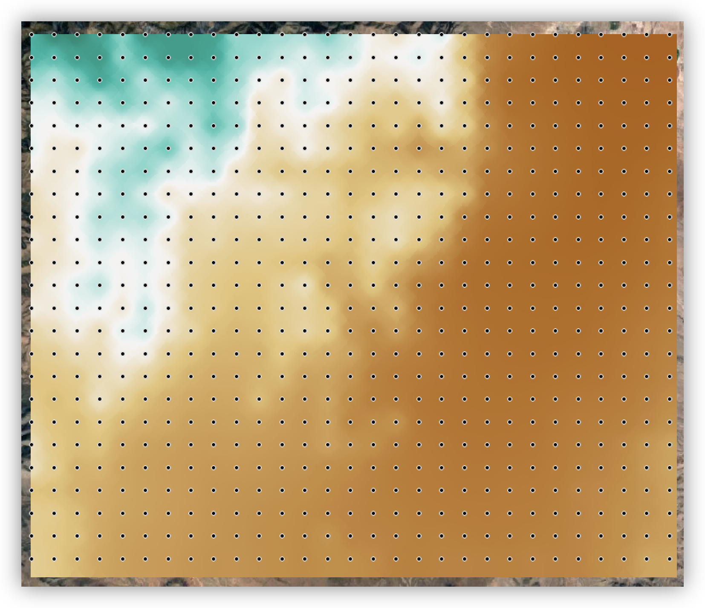

### Creating Contours from the Interpolated Surface

Contours help visualize the shape of the interpolated surface and make it easier to compare across methods.

1. Open **Main Menu > Raster > Extraction > Contour**.
2. Specify:
   - **Input layer:** `IDWsysP2_12`
   - **Interval:** `100` (meters, matching the DEM's coordinate system units)
   - **Contours output:** Browse and save as `IDW100mContours.shp`

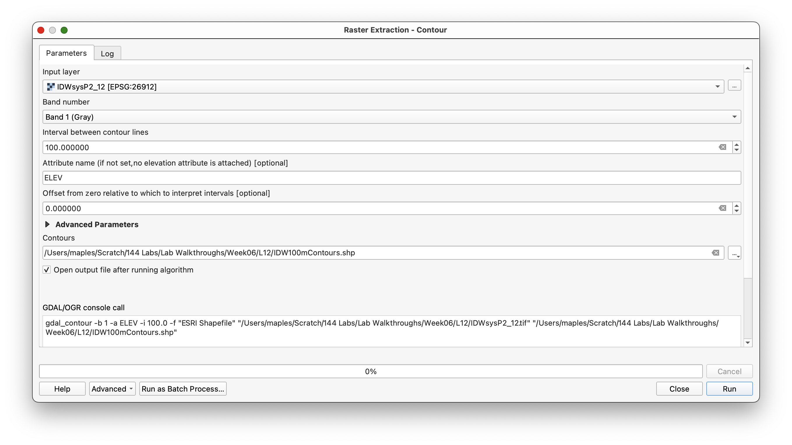

3. As you did with the original DEM, use **Raster > Terrain Analysis > Hillshade** to create an `IDWHillshade` layer using the same parameters (Azimuth 315, Elevation 25).
4. **Group** the `IDWsysP2_12`, `IDWHillshade`, and `IDW100mContours` layers in a group named `Inverse Distance`.
5. Arrange the layers so that your hillshade is positioned between the interpolated raster and the contours, similar to the image below (colors may vary):

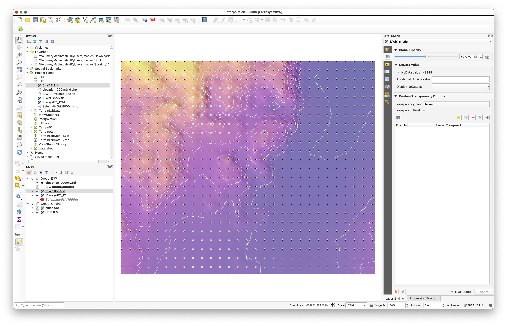

## Part 3: Random Sampling and Nearest Neighbor Interpolation

In this part, you will create a random sample of points, extract elevation values, and use Nearest Neighbor interpolation, which produces a distinctly different result from IDW.

> **Concept note:** Random sampling avoids the artificial grid pattern of systematic sampling and is good when you want unbiased point placement. However, random samples can accidentally cluster in some areas and leave gaps in others, which affects interpolation quality.

### Creating Random Sample Points

1. Open **Vector > Research Tools > Random Points in Extent**.
2. Set the **Input extent** by clicking **... > Calculate from Layer** and selecting `ChirDEM`.
3. Specify:
   - **Number of points:** `1000`
   - **Minimum distance:** `60 meters` (to prevent clustering)
   - **Maximum number of search attempts:** `200`
4. Browse and save the output as **Random1000Points.shp**.

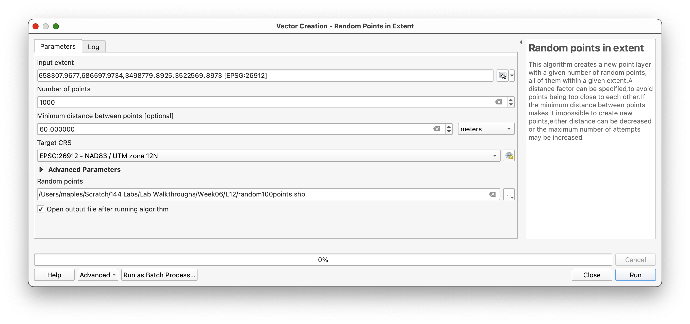

5. Now extract elevation values from the DEM at these random points using **Processing Toolbox > Raster > Analysis > Sample raster values**.
6. Name the output **Random1000Elevation**.

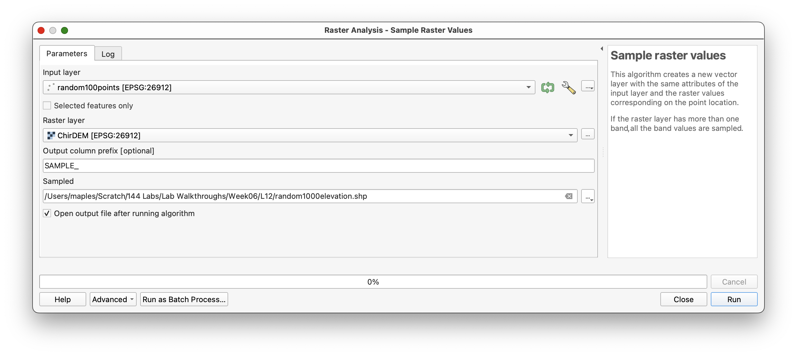

> **Workflow note:** The minimum distance parameter ensures points don’t cluster too tightly, which would create redundant samples. This improves spatial coverage while still preserving randomness.

### Nearest Neighbor Interpolation

Nearest Neighbor interpolation creates a stepped surface where each raster cell takes the value of the single nearest sample point. This produces output similar to Voronoi polygons and is useful when you want to preserve original sample values without smoothing.

1. Search the **Processing Toolbox** for **Grid (Nearest Neighbor)** under **GDAL > Raster Analysis**.
2. Specify:
   - **Point layer:** `Random1000Elevation`
   - **First and second search ellipses:** `1000` meters
   - **Z value field:** `SAMPLE_1`
3. Paste the same command-line parameters into **Additional command-line parameters [optional]**:

```
-tye 3498779.8925000000745058  3522569.8972999998368323 -txe 658307.9677000000374392  686597.9734000000171363 -outsize 943 793
```

4. Browse and name the output: **NNfromRandom1000.tif**
5. Run the tool.

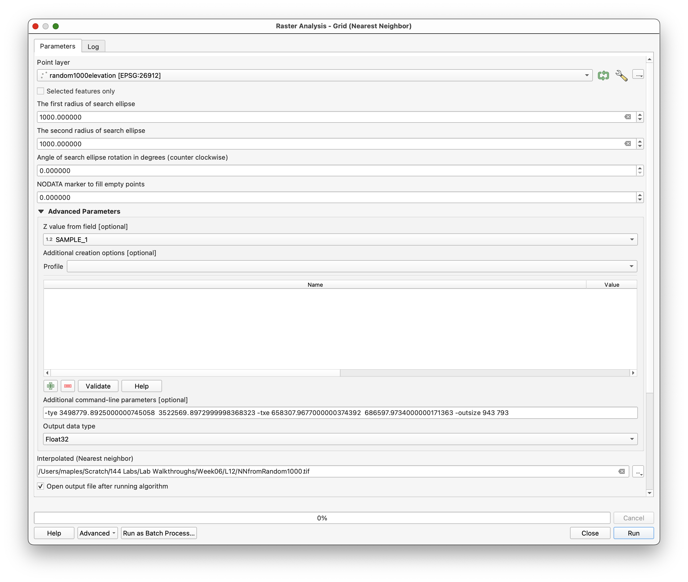

> **Concept note:** Nearest Neighbor is a deterministic method—each cell always takes the value of its nearest point. Unlike IDW, which blends values from multiple neighbors, Nearest Neighbor creates discrete zones of constant elevation, making it useful when you have authoritative point measurements that should not be smoothed or averaged.

### Styling and Visualizing Nearest Neighbor Results

1. Copy the style from your original `ChirDEM` layer and paste it onto `NNfromRandom1000.tif`, just as you did for the IDW result.
2. Create contour lines from the Nearest Neighbor surface using **Raster > Extraction > Contour** with an interval of `100` meters.
3. Create an `NNHillshade` layer using **Raster > Terrain Analysis > Hillshade** with Azimuth 315 and Elevation 25.

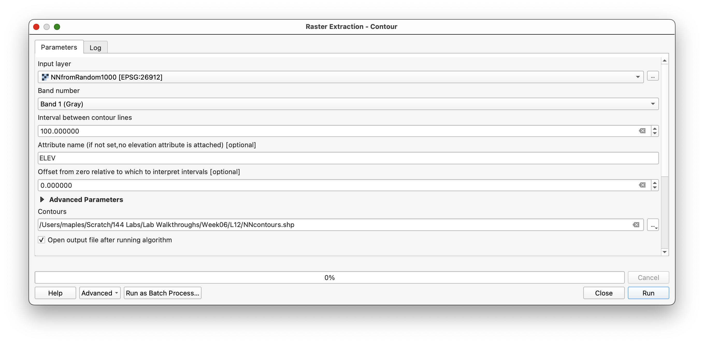

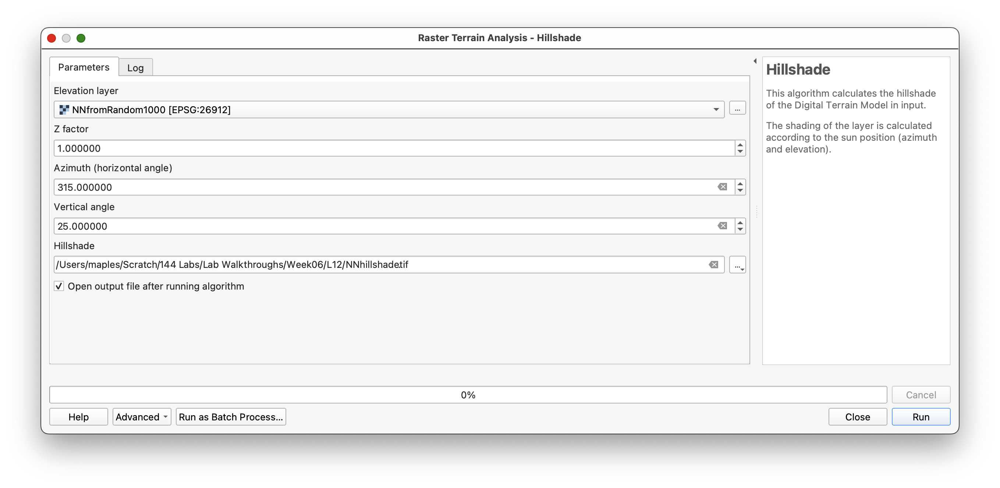

4. Create a **Nearest Neighbor group** in the Layers panel containing the sample points, contours, and interpolated raster layers.

Your results should resemble the figure below. Note that since the sampling is random, your exact map will differ:

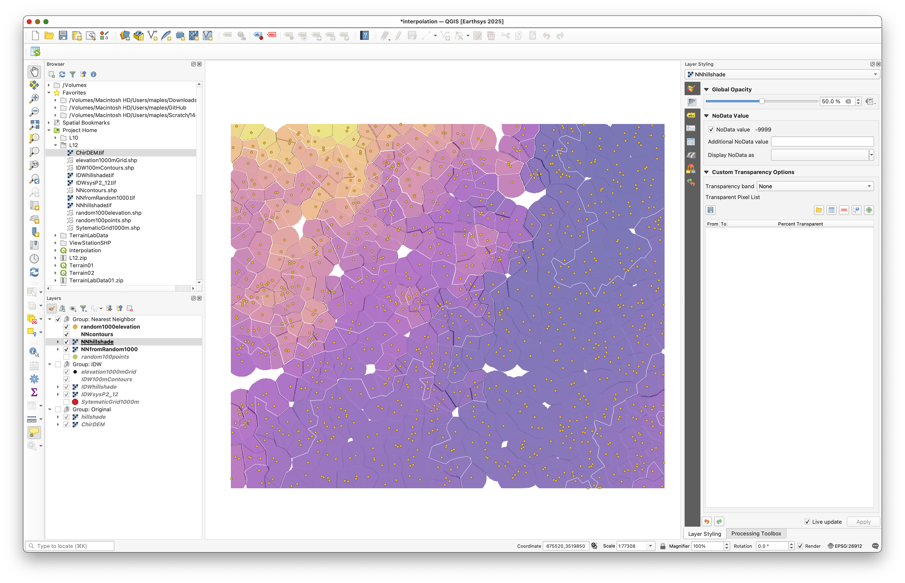

## Part 4: Stratified Random Sampling and Spline Interpolation

In this part, you will implement a more sophisticated sampling strategy: stratified random sampling. Instead of sampling uniformly across the landscape, you will **increase sampling density in steep areas** where terrain variation is greatest. You will then use Spline interpolation, which creates a smooth surface that may not pass exactly through all sample points but produces continuous curvature.

> **Concept note:** Stratified sampling is useful when different parts of your study area have different importance or variability. By stratifying on slope, you sample more densely where terrain is complex and less densely where it is simple. This is more efficient than uniform sampling for capturing important variation.

### Step 1: Calculate Slope

Begin by deriving a slope layer from the DEM. Your strata boundaries will be based on slope classes.

1. Open **Processing Toolbox > Raster > Analysis > Slope**.
2. Use `ChirDEM` as the input.
3. Use the default settings (slope output in degrees).
4. Browse and save the output as **SlopeDegrees**.

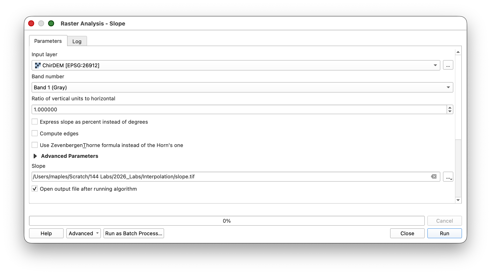

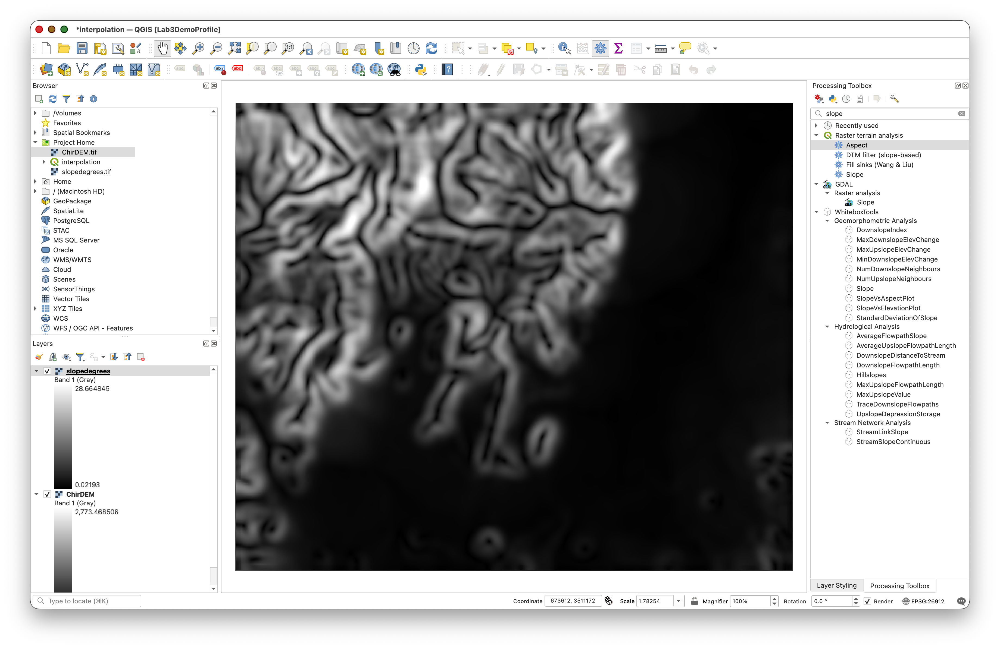

> **Concept note:** Slope represents the rate of elevation change and is derived from the DEM. Steeper slopes indicate terrain where elevation changes rapidly over short distances. In this lab, slope becomes the criterion for stratification—we will sample more densely in steep areas.

### Step 2: Reclassify Slope into Strata

Convert continuous slope values into three discrete classes representing flat, intermediate, and steep terrain.

1. Open **Processing Toolbox > Raster > Analysis > Reclassify by table**.
2. Use the **Slope** Layer as your Input.****
3. Click the **...** button next to the **Reclassification table** to define your classes.
4. Click **Add Row** to create `3` rows.
5. Define three classes:
   - `NoValue to 1.5` (flat) as Class `1`
   - `1.5 to 18` (intermediate) as Class `2`
   - `18 and NoValue` (steep) as Class `3`

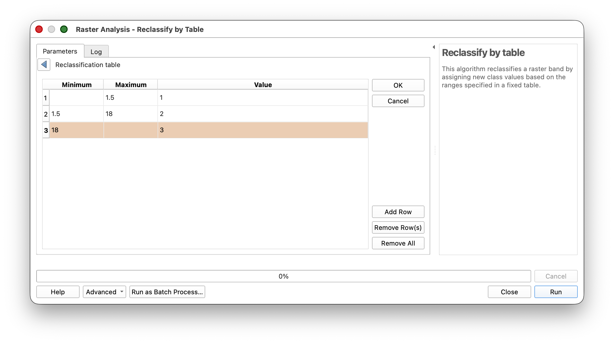

These thresholds were chosen to create reasonably balanced classes. In a real workflow, you would select thresholds based on domain knowledge—for example, slopes above which construction is infeasible, or elevations where a particular resource is unlikely to be found.

5. Browse and save the output as **ReclassSlope**.

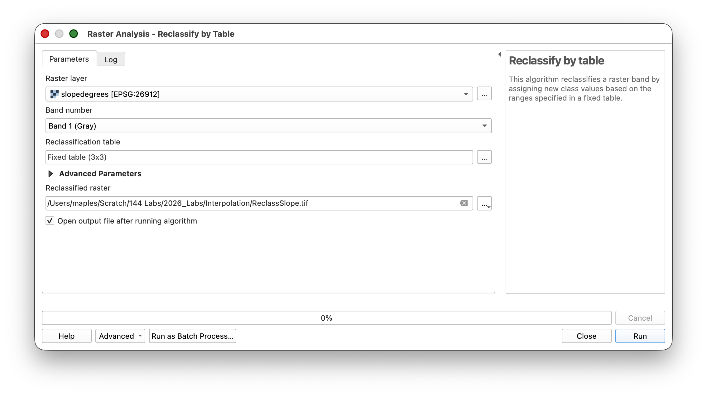

Your reclassified layer should look similar to this:

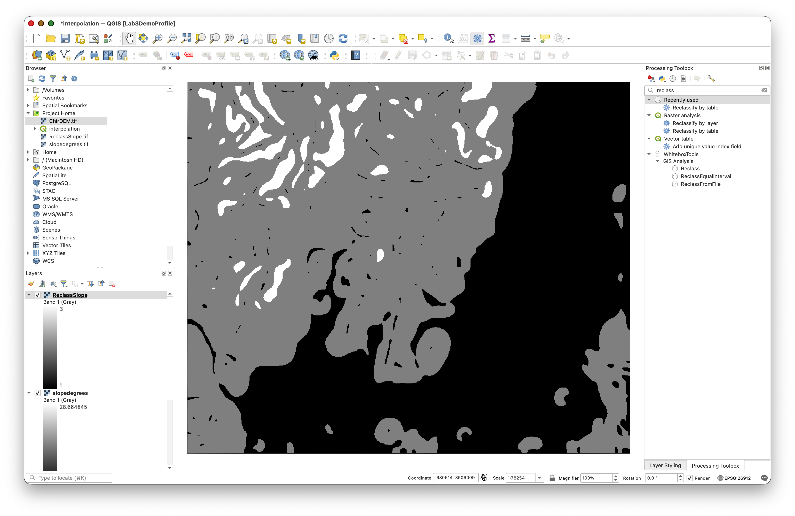

> **Workflow note:** Reclassification reduces complexity by converting many continuous values into a small number of meaningful categories. This simplification is essential for stratification because it defines the population of each stratum.

### Step 3: Apply Majority Filtering to Generalize Strata

Before creating sampling zones, generalize the reclassified slope to remove isolated single cells or long thin areas that would complicate stratified sampling.

1. Open **Processing Toolbox > Whitebox Tools > MajorityFilter**.
2. Specify:
   - **Input**: ReclassSlope
   - **Filter X-Dimension**: 10
3. Browse and save the output as **ReclassSlopeMajority**

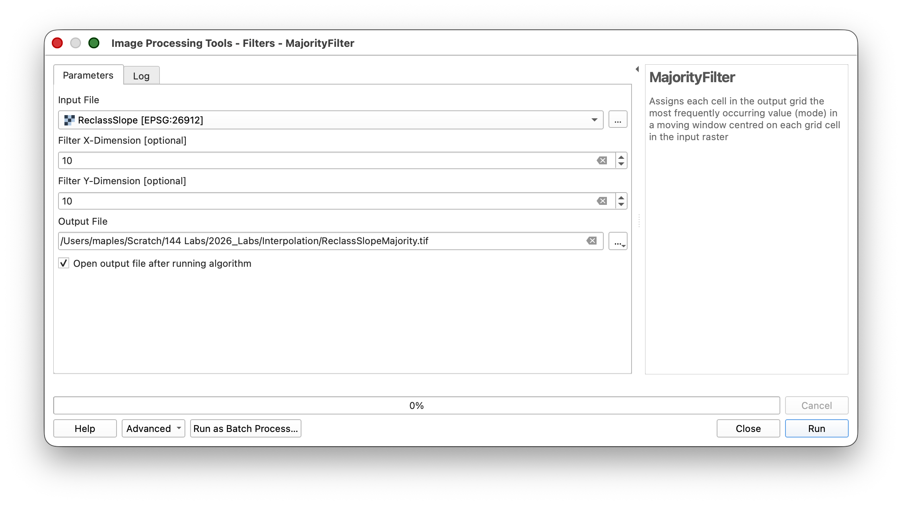

Toggle between the reclassified and majority-filtered layers to see how the filter removes small isolated zones:

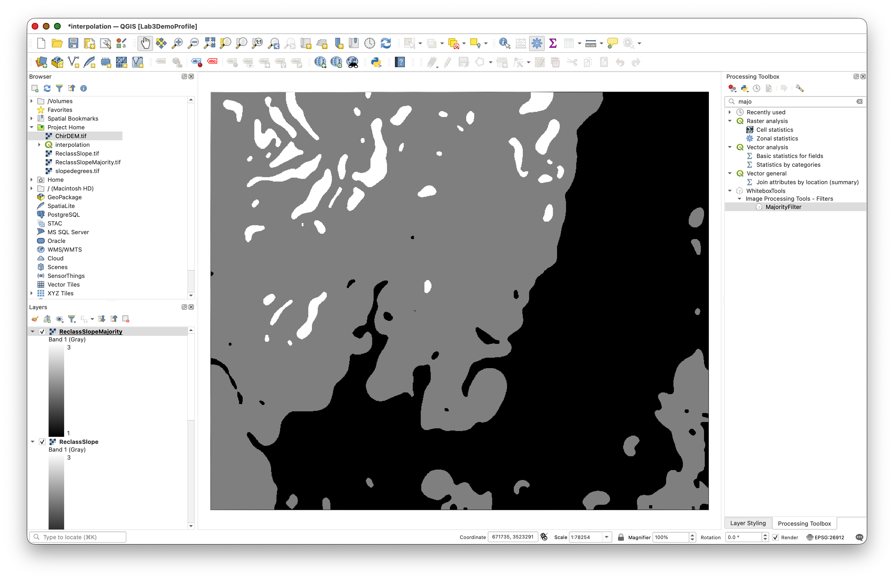

> **Concept note:** A majority filter applies a local rule: for each raster cell, if more than half of the cells in a circular neighborhood belong to a particular class, assign that class to the center cell. This generalizes small, isolated patches and creates larger, more contiguous strata suitable for polygon-based sampling.

### Step 4: Convert Raster Strata to Vector Polygons

Convert the generalized raster strata to a vector polygon layer that will define your sampling zones.

1. Open **Raster Conversion > Polygonize**.
2. Use **ReclassSlopeMajority** as input.
3. Use the default settings.
4. Browse and save the **output vector polygons** as **STRATA.shp**.

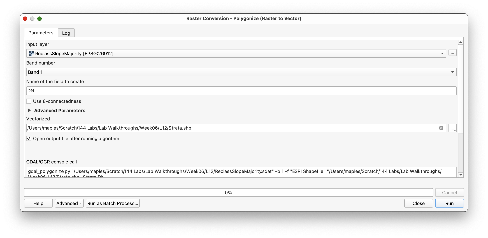

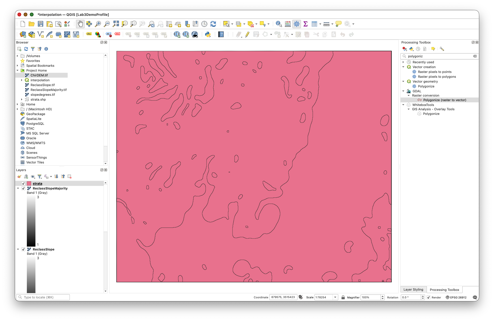

### Step 5: Calculate Polygon Areas and Determine Samples per Polygon

Now you will use the area of each polygon to calculate how many sample points should fall within it, proportional to both its size and the desired sampling density for its stratum.

The sampling logic is:

- **Flat areas (Class 1):** 10% of 1000 = 100 points
- **Intermediate areas (Class 2):** 65% of 1000 = 650 points
- **Steep areas (Class 3):** 25% of 1000 = 250 points

These proportions reflect the assumption that steep areas warrant denser sampling to capture their complexity.

#### Calculating Individual Polygon Areas

1. Open the attribute table for the `STRATA` layer.
2. Toggle editing mode.
3. Add a new field of type **Decimal (Real)** named `SqKm`.
4. Use the **Field Calculator** to populate this field with polygon areas in square kilometers:

$area / 1000000

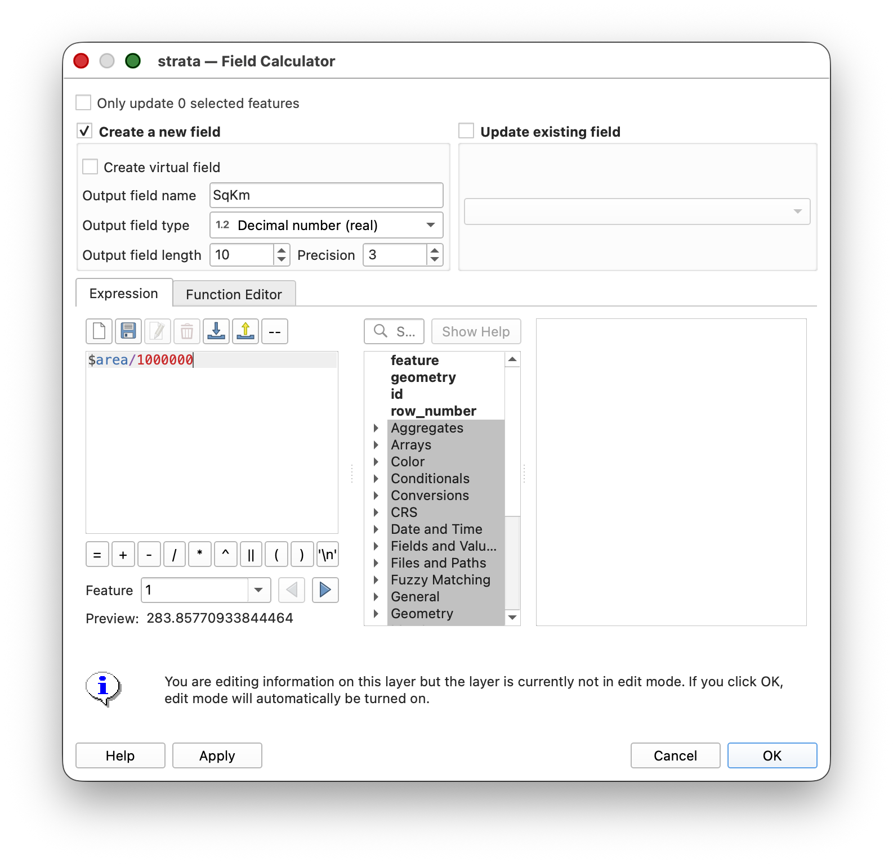

#### Computing Total Area per Stratum

You now need to find the total area for each class (flat, intermediate, steep) to use as a denominator in the sampling calculation.

1. Open the attribute table for the `STRATA` layer.
2. Select all polygons for one stratum class using **Select features using an expression**:

```
"DN" = 1
```

(Repeat for classes 2 and 3 separately.)

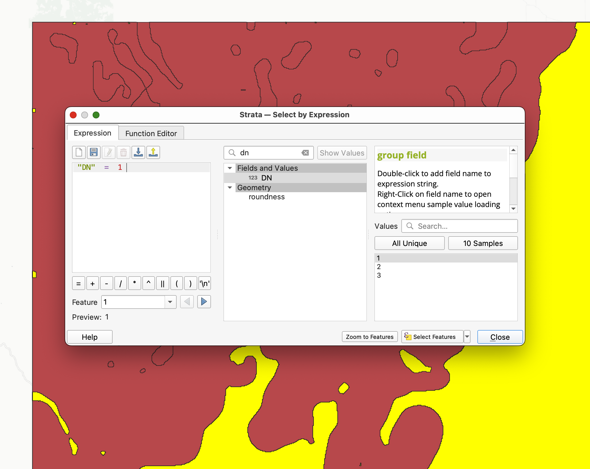

3. Open **Vector > Analysis > Basic Statistics for Fields**.
4. Check the box for **Selected features only**.
5. Select the `SqKm` field and look at the **SUM** to get the total area for that class.

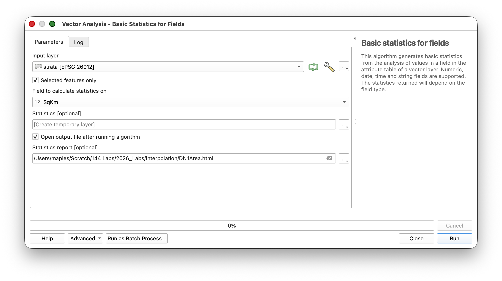

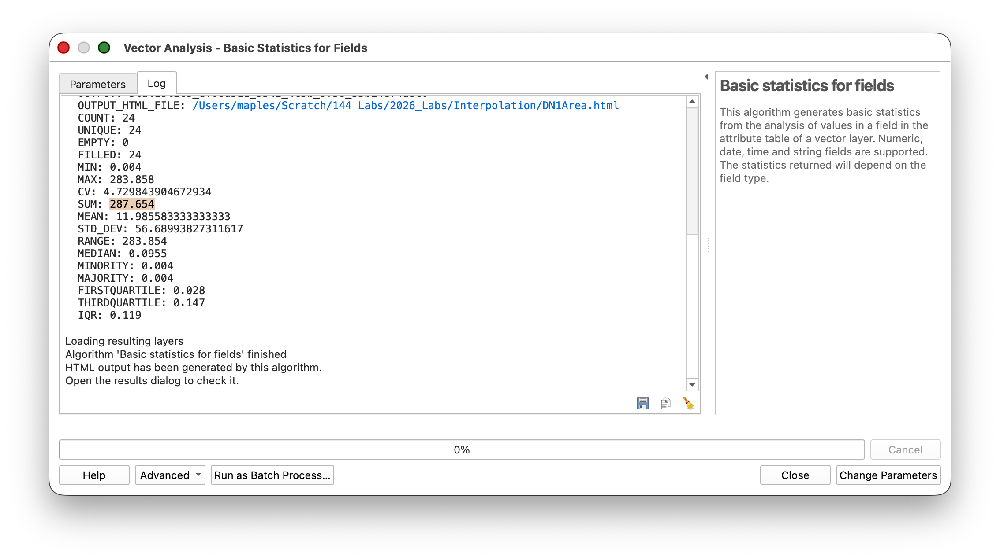

You should arrive at Area SUMs close to:

- **Flat (DN = 1):** approximately 287 square kilometers
- **Intermediate (DN = 2):** approximately 357 square kilometers
- **Steep (DN = 3):** approximately 25 square kilometers

(Your numbers may differ slightly depending on your earlier parameters.)

> **Workflow note:** This approach uses feature selection to compute statistics on a subset. It lets you find the total area for each stratum without manually summing individual polygons.

#### Calculating Sample Count per Polygon

Now add a field that calculates how many sample points should be placed in each polygon based on its area relative to its stratum.

1. Open the attribute table for the `STRATA` layer and add a new **Long integer** field named **samp_num**.
2. Select all polygons for one stratum class, using **Select features using an epression:**
   `"DN"=1`
   (Repeat for classes 2 and 3 seperately.)
3. Use the **Field Calculator** to caluculate the number of samples for each polygon into a new field (for the first calculation, then use "Update") called `SampleNum`. For each stratum, use a formula like:

   - **DN = 1 (flat):** `100 * "SqKm" / 287`
   - **DN = 2 (intermediate):** `650 * "SqKm" / 357`
   - **DN = 3 (steep):** `250 * "SqKm" / 25`

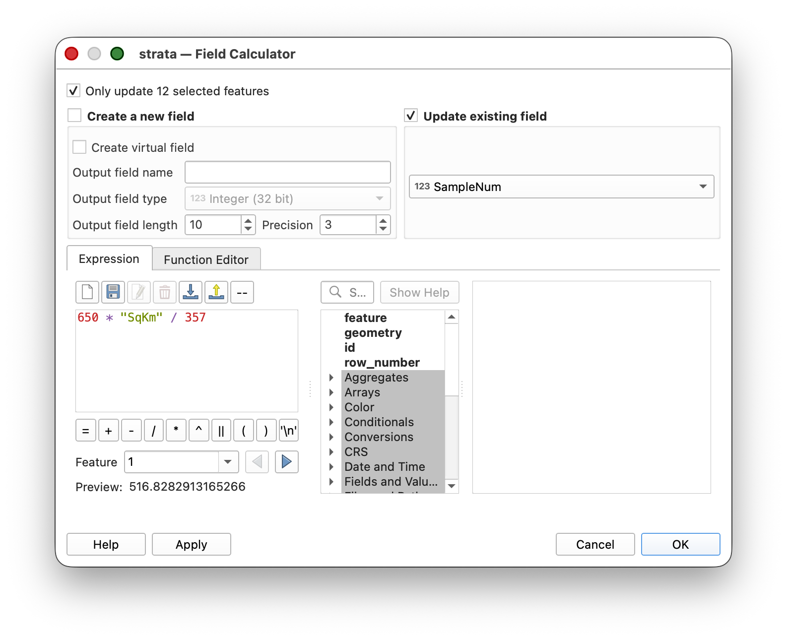

3. Calculate each formula separately for each class. After each calculation, select the next class and recalculate.
4. Save your edits and toggle editing off.

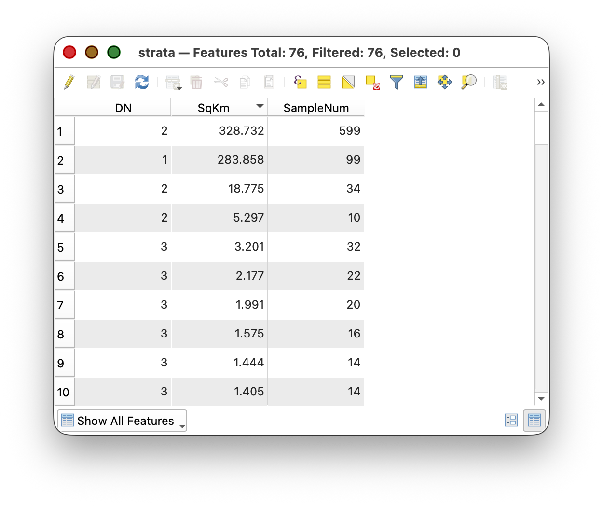

> **Concept note:** This calculation distributes the target number of samples (100, 650, or 250 depending on class) proportionally across the polygons in each stratum based on their area. Larger polygons within a stratum get more samples; smaller ones get fewer, or none at all.

### Step 6: Generate Stratified Random Points

Now create the stratified random sample using the `samp_num` field to determine point density within each polygon.

1. Open **Vector > Research Tools > Random Points in Polygons**.
2. Set **Input polygon layer** to `STRATA`.
3. For the **Number of points for each feature** option, click the button on the right end of the field.
4. From the dropdown, select **Field type > samp_num** to use the field you just calculated.

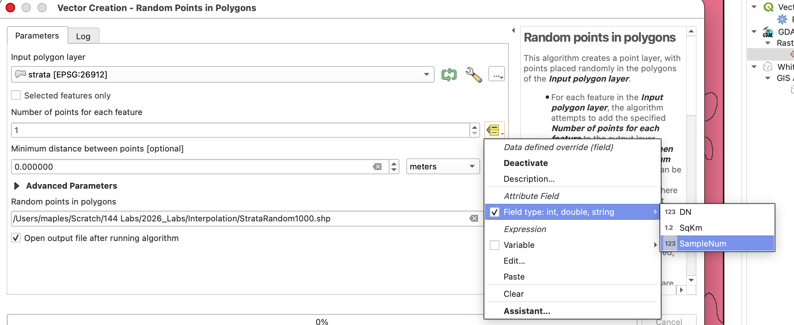

5. Browse and save the **Output random points in polygons** as **StrataRandom1000.shp**

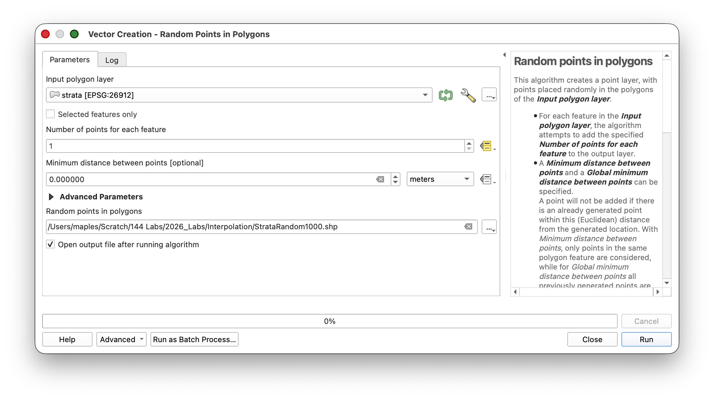

This generates a point layer with higher sampling density in the steeper areas (where `samp_num` is larger) and lower density in flatter areas:

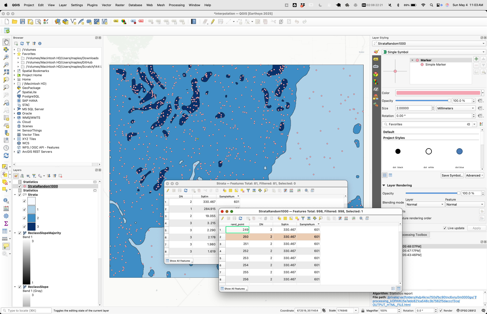

> **Workflow note:** To add colors to your map, change the `STRATA` layer's symbology to **Categorized** using **DN** as the value field. This helps visualize which strata are being sampled more densely.

### Step 7: Extract Elevation Values from Stratified Samples

As before, sample the elevation values from the DEM at these stratified random points:

1. Open **Processing Toolbox > Raster > Analysis > Sample raster values**.
2. Specify:
   - **Input layer:** `StrataRandom1000`
   - **Raster layer to sample:** `ChirDEM`
   - **Output point features:** `StratRandElevationSamples`
   - **Output column prefix:** `SAMPLE_`

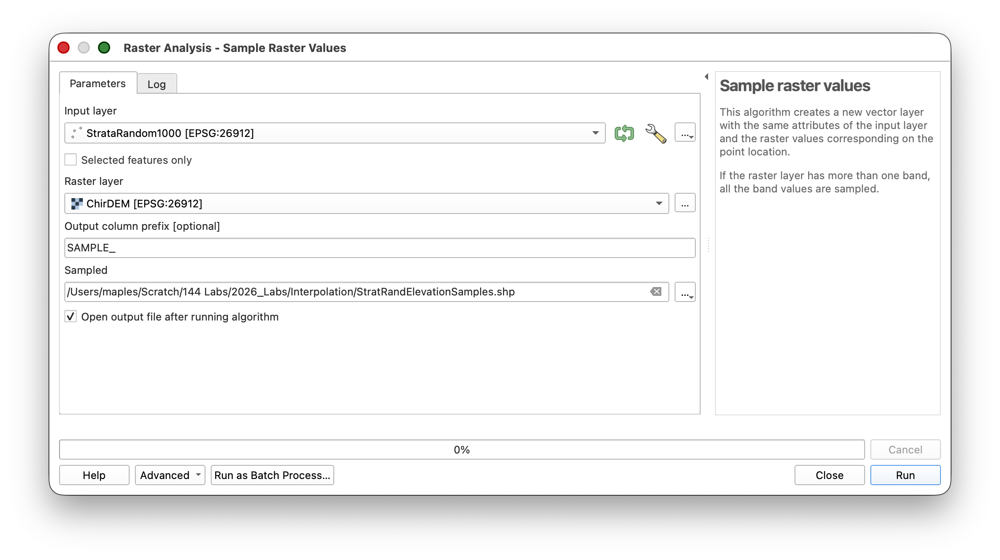

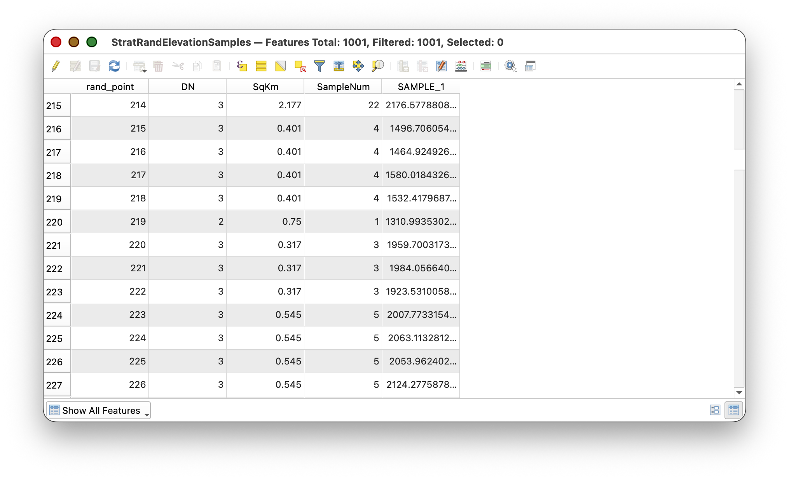

### Step 8: Spline Interpolation

Spline interpolation creates a smooth continuous surface that minimizes overall curvature. Unlike IDW or Nearest Neighbor, splines are constrained to produce a mathematically smooth function, which can produce unrealistic values between sample points.

1. Open **Processing Toolbox > SAGA > Raster Creation > Multi-level b-spline**.
2. Specify:
   - **Input points:** `StratRandElevationSamples`
   - **Attributes:** `SAMPLE_1` (the elevation field)
   - **Output extent:** Calculate from layer > `ReclassSlopeMajority`
   - **Cellsize:** `30`
   - **Refinement:** `[1] Yes`
   - **Threshold error:** `default`
   - **Maximum level:** `11`

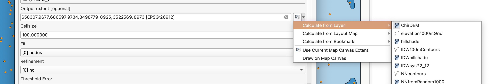

3. Browse and name the **Output grid:** **SplineStratRand**.

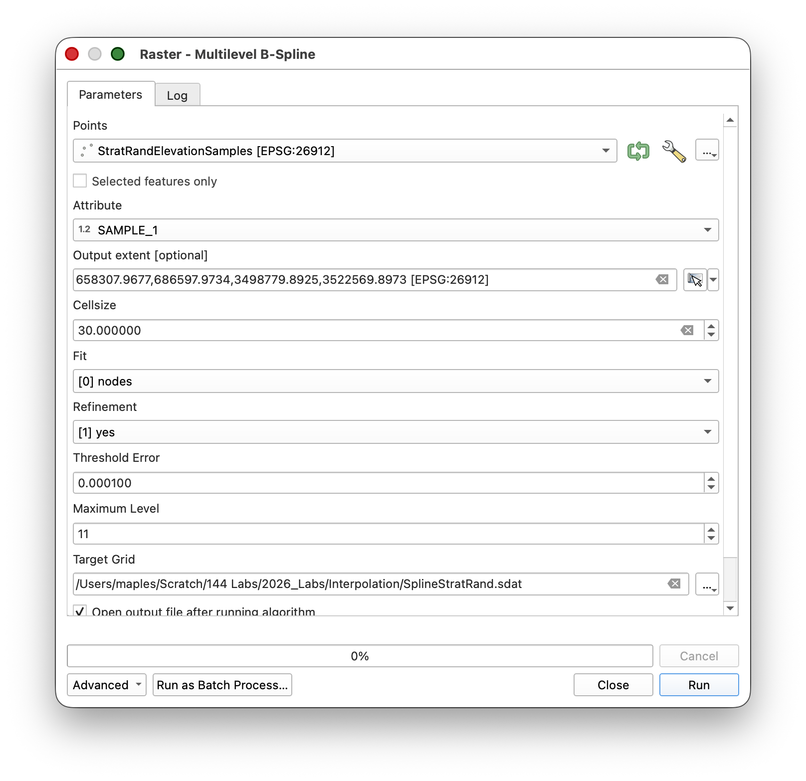

4. Run the tool.

> **Concept note:** B-spline interpolation (Multi-level b-spline) fits a smooth function through the sample points by minimizing curvature. It does not necessarily pass exactly through every sample point, but it produces a continuous, smooth surface without the sharp discontinuities of Nearest Neighbor or the localized patterns of IDW.

### Step 9: Finishing the Spline Layer

Now complete the spline surface by adding supporting layers and organizing them:

1. Calculate contours from the `SplineStratRand` surface using **Raster > Extraction > Contour** with an interval of `100` meters.
2. Create a `SplineHillshade` layer using **Raster > Terrain Analysis > Hillshade** with Azimuth 315 and Elevation 25.
3. Copy the color style from your original `ChirDEM` layer and paste it onto the `SplineStratRand` layer.
4. **Group** the spline layers (`SplineStratRand`, `SplineHillshade`, and contours) in the Layers panel under a group named **Spline Stratified**.

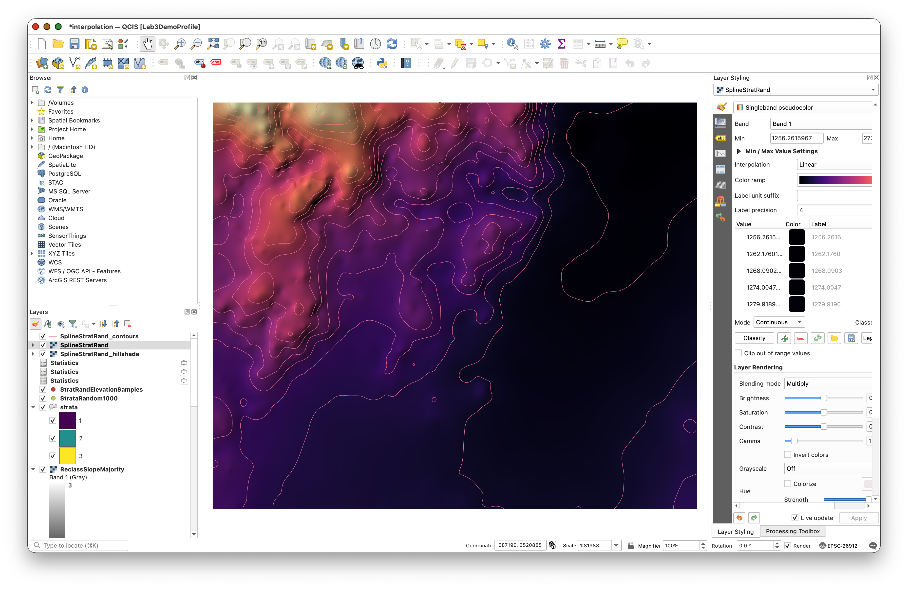

## Final Deliverable: Comparison Map Layout

You now have four complete interpolation results:

1. **Original** (the source DEM)
2. **Inverse Distance** (systematic sampling + IDW interpolation)
3. **Nearest Neighbor** (random sampling + Nearest Neighbor interpolation)
4. **Spline Stratified** (stratified random sampling + Spline interpolation)

Create a final map layout that displays all four methods side by side for visual comparison.

> **Concept note:** Comparing interpolation methods visually helps you understand their characteristics. IDW shows radial patterns around sample points. Nearest Neighbor produces discrete zones. Spline creates smooth transitions. Stratified sampling focuses effort where variation is greatest. No single method is universally best—choice depends on your data, sample density, and application.

### Layout Instructions

1. Set your print canvas to **landscape** orientation.
2. Create four map frames arranged side by side, one for each group (Original, Inverse Distance, Nearest Neighbor, Spline).
3. For each frame:
   - **Locked** (check the Lock Item box in Item Properties so you don't accidentally move it while working on others)
   - **Locked layers** (check the Lock Layers option in Layer Properties)
4. Arrange the layers within each frame consistently using this order from bottom to top:
   - Hillshade (bottom)
   - DEM or interpolated raster (set to Multiply blend mode)
   - Contours (stroke width: 1 point)
   - Sample points (size: 0.4 points, top layer)

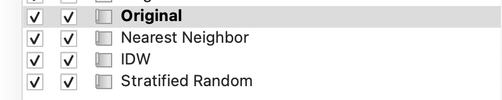

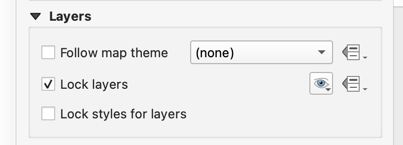

#### Styling Tips

You can easily copy and apply consistent styling across methods:

1. Right-click on a layer you want to copy the style from.
2. Select **Styles > Copy Style > All Style Categories**.
3. Right-click on the layer you want to style and select **Styles > Paste Style > All Style Categories**.

This ensures that all four maps use the same color ramp and classification for the elevation surface, making them directly comparable:

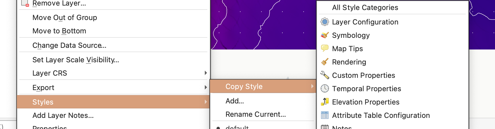


### Map Document Requirements

Include on your final map layout:

- Clear titles for each of the four map frames identifying the sampling method and interpolation technique
- A scale bar
- A north arrow
- Your name and the lab submission date
- A brief legend explaining the color ramp and any other symbology used

Export and submit your layout as a **PDF**.

> **Workflow note:** Locking items and layers prevents accidental changes as you refine the layout. This is especially important when working with multiple map frames.
