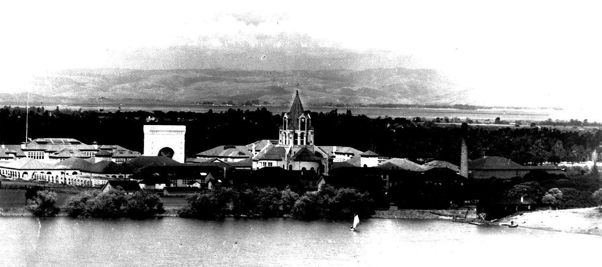
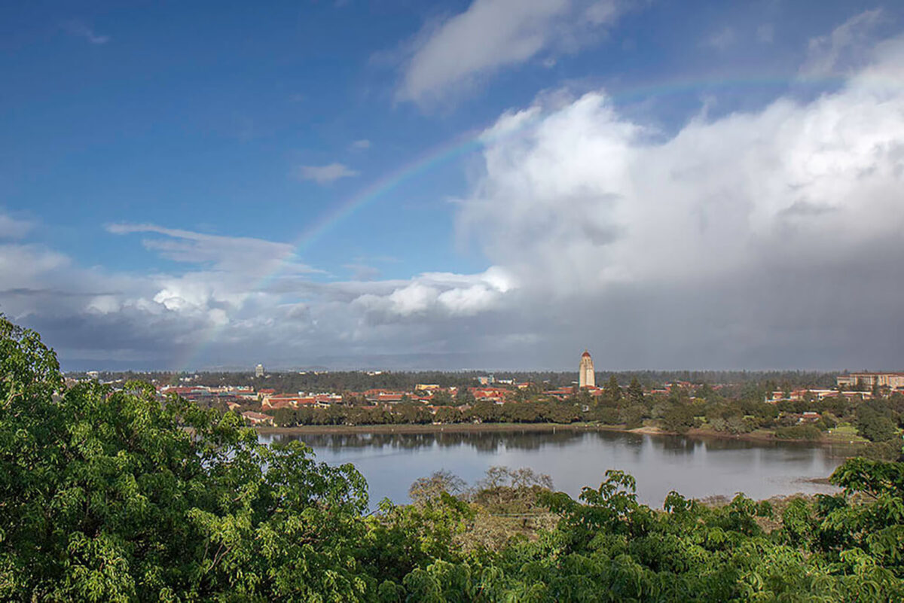

# Introducing Planet.com Satellite Imagery

This workshop introduces Planet.com imagery through a Python notebook that uses the official Planet SDK. The notebook is designed for Google Colab and focuses on a small area of interest around Lake Lagunita so that students can see the full search, ordering, download, and visualization workflow without needing a large study area.

Notebook: [`data/planet_SDK_101_LakeLagunita.ipynb`](../data/planet_SDK_101_LakeLagunita.ipynb)

<a target="_blank" href="https://colab.research.google.com/github/mapninja/Earthsys144/blob/f99ca2d9a922e383d2f6158d47fa5c8f893b3716/data/planet_SDK_101_LakeLagunita.ipynb">
  
</a>

Source AOI: [`data/lakelagunita.geojson`](../data/lakelagunita.geojson)



The notebook uses two photographs from `data/images/` to give ground-level context for the satellite workflow: a historical view of Lake Lagunita and a recent rainy-season view from February 2023. Together, they help students connect what a satellite records from above to visible conditions on the ground.

## What You Should Understand

By the end of the notebook, you should be able to:

- Explain the difference between searching for available imagery and ordering downloadable raster files.
- Authenticate to Planet in Colab with Secret Manager.
- Load and visualize a GeoJSON area of interest.
- Use Planet SDK filters for AOI, date range, and metadata such as `clear_percent`.
- Inspect Planet scene metadata before choosing imagery.
- Map scene footprints to understand image coverage.
- Sort scenes by quality and reduce a set of candidate scenes to scenes that add useful AOI coverage.
- Build an Orders API request with clipping, NDVI band math, and compositing tools.
- Monitor an order, download completed files, and visualize the resulting GeoTIFFs.

## Before You Start

You will need:

- A Google Colab session.
- Access to a Planet account and a Planet API key.
- The notebook file `data/planet_SDK_101_LakeLagunita.ipynb`.
- The AOI file `data/lakelagunita.geojson`.

In Colab, open Secret Manager and create a secret named `PL_API_KEY`. Paste your Planet API key as the secret value, then enable notebook access for the notebook.

Do not paste your Planet API key directly into a markdown cell, code cell, screenshot, or shared notebook output. API keys are private credentials.

## Code Highlights

### Installing

The first code cell installs the packages needed for the workshop:

- `planet` for the official Planet SDK.
- `rasterio` for reading downloaded GeoTIFF files.
- `folium` for interactive maps.
- `shapely` for polygon overlap calculations.
- `matplotlib` for raster visualization.
- `nest_asyncio` so asynchronous SDK calls work cleanly in Colab.

### Importing

The import section separates standard Python tools from geospatial and Planet-specific tools. Pay special attention to these Planet SDK imports:

```python
from planet import Auth, OrdersClient, Session, data_filter, order_request, reporting
```

These objects handle authentication, search filters, order creation, order monitoring, and order downloads.

### Authenticating

The notebook reads the API key from Colab Secret Manager:

```python
API_KEY = userdata.get("PL_API_KEY")
```

It then stores the key in environment variables so the Planet SDK can use it without printing the key.

### Testing

The testing section runs a small SDK search before the main workflow. This helps confirm that the API key works and that Colab can communicate with Planet before students spend time debugging later cells.

### AOI With Visualization

The notebook loads `data/lakelagunita.geojson`, extracts the first polygon geometry, and maps it with Folium. This introduces the AOI as both a data object and a visible search boundary.



This recent photograph is especially useful for the AOI section because it shows why the 2022-2023 rainy season is an interesting search window. The GeoJSON AOI gives Planet a precise search boundary, while the photo helps students imagine the surface conditions they are trying to observe from satellite imagery.

### Search

The search section uses SDK filter helper functions instead of manually writing a REST API request. It keeps the source notebook's main search settings:

- Item type: `PSScene`
- Start date: December 10, 2022
- End date: September 30, 2023
- AOI: Lake Lagunita GeoJSON polygon

### Report Results and Metadata

The reporting cells print scene IDs, acquisition dates, `clear_percent`, and `cloud_cover` values. The metadata section also prints the available metadata keys so students can see what fields Planet provides and what fields might be useful for filtering or sorting.

### Footprints Visualization

The notebook converts search results into a GeoJSON FeatureCollection of scene footprints. Students then map those footprints over the AOI to see that a satellite scene usually covers a much larger area than the study site.

### Filtering: AOI, Date, and Clouds

The notebook adds a metadata filter:

```python
clear_percent_filter = data_filter.range_filter("clear_percent", gt=80)
```

This keeps scenes where Planet estimates that more than 80 percent of the scene is clear.

### Sorting Quality

The notebook sorts filtered scenes by `clear_percent`, from highest to lowest. This teaches students that filtering and sorting are different operations: filtering removes records, while sorting ranks the records that remain.

### Reducing to Coverage

The notebook groups scenes into roughly 30-day windows and selects scenes that add new AOI coverage. This keeps the order smaller and helps students connect scene footprints to practical ordering decisions.

### Creating an Order

The order-building function turns selected scene IDs into a Planet Orders request. It uses `order_request.product()` for the imagery product and `order_request.build_request()` for the final order dictionary.

### Tools: Clip and Band Math

The notebook includes three Planet Orders tools:

- `clip` trims imagery to the Lake Lagunita AOI.
- `band_math` calculates a scaled NDVI band.
- `composite` merges scenes in each order group.

The NDVI expression uses near infrared and red bands:

```python
(b4-b3)/(b4+b3)*100+100
```

The multiplication and addition scale NDVI into an 8-bit output range that is easier to store and display.

### Ordering, Monitoring, and Downloading

The notebook includes a safety switch:

```python
SUBMIT_ORDERS = False
```

Students can run the search, filtering, and order-preview cells without submitting real orders. When they are ready and have confirmed the order request, they can change the value to `True`.

The ordering function creates the order, waits for completion with the SDK, and downloads the finished files into a local folder.

### Visualization

The final visualization cells search for downloaded `composite.tif` files, open them with `rasterio`, and display the scaled NDVI outputs with Matplotlib.

## Suggested Student Workflow

1. Open the notebook in Colab.
2. Add the Planet API key to Secret Manager as `PL_API_KEY`.
3. Run installation, import, authentication, and testing cells.
4. Load and map the Lake Lagunita AOI.
5. Run the base search and inspect the result count.
6. Add the `clear_percent` filter and compare result counts.
7. Map scene footprints and inspect metadata.
8. Review the reduced scene groups and order request preview.
9. Change `SUBMIT_ORDERS` only when ready to submit real Planet orders.
10. Download and visualize the completed NDVI composites.

## Submission Guidance

If this workshop is assigned for submission, export a PDF that includes:

- The notebook title.
- A screenshot of the AOI map.
- The number of scenes returned by the AOI/date search.
- The number of scenes returned after the `clear_percent` filter.
- A screenshot or printed preview of one order request.
- A short note explaining why the notebook uses a safety switch before submitting orders.
