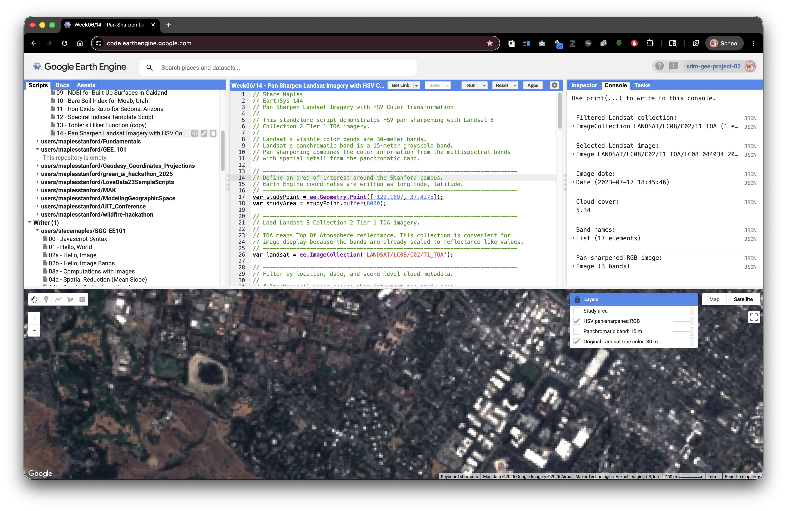

# Pan-Sharpen Landsat Imagery with HSV Color Transformation

> **Turn-in for grading:** This lab includes material that must be turned in for grading. Complete the required deliverables and submit them as instructed by the course.

## Overview

This lab introduces pan sharpening with Landsat imagery in Google Earth Engine. Pan sharpening is a remote sensing technique that combines:

- a lower-resolution multispectral color image
- a higher-resolution panchromatic grayscale band

The goal is to create an image that keeps the color information from the multispectral bands while borrowing spatial detail from the panchromatic band.

In this lab, you will use Landsat 8 Collection 2 Tier 1 TOA imagery. The true color bands are 30-meter bands, while the panchromatic band is a 15-meter band. You will use an HSV color transformation to replace the brightness, or value, part of the color image with the sharper panchromatic band.

## What You Should Understand After This Lab

By the end of this exercise, you should be able to explain:

- what pan sharpening is and why it is used
- why a panchromatic band can have finer spatial resolution than multispectral bands
- how RGB color can be converted to HSV color
- why HSV pan sharpening replaces the value channel but keeps hue and saturation
- why pan-sharpened images are best treated as visualization products
- how to compare the original and pan-sharpened Landsat images in the Layers widget

## Getting Ready

You will need:

- access to the [Google Earth Engine Code Editor](https://code.earthengine.google.com/)
- a Google Earth Engine account
- the ability to create, paste, run, save, and share scripts in the Code Editor

If needed, review the Week 00 [Logging in to Google Earth Engine](../week00/10_TURN_IN_logging_in_to_google_earth_engine.md) setup guide before continuing.

## Concept: What Is Pan Sharpening?

Some satellite sensors collect different kinds of imagery at different spatial resolutions. Landsat 8 and Landsat 9 collect visible multispectral bands at 30-meter resolution, but they also collect a panchromatic band at 15-meter resolution.

The panchromatic band is grayscale. It does not store separate red, green, and blue color information. Instead, it measures a broader range of visible light in one sharper band.

Pan sharpening uses that sharper grayscale information to improve the apparent detail of a color image.

> **Concept note:** A pan-sharpened image can look sharper, but it is not the same as collecting all color bands at 15-meter resolution. Pan sharpening is a visualization and image-fusion technique. Be careful about using pan-sharpened imagery for quantitative spectral analysis.

## Concept: Why HSV?

RGB color describes an image with red, green, and blue channels. HSV describes color differently:

- **Hue:** the basic color, such as red, green, blue, or yellow
- **Saturation:** how intense or muted the color is
- **Value:** how bright or dark the color is

HSV pan sharpening works like this:

1. Start with a true color RGB image.
2. Convert RGB to HSV.
3. Keep hue and saturation from the color image.
4. Replace value with the sharper panchromatic band.
5. Convert HSV back to RGB.

This preserves much of the color impression from the original multispectral image while using the panchromatic band to add sharper brightness detail.



## Exercise: Pan Sharpen Landsat over the Stanford Campus

This script is standalone. Paste it into a blank Earth Engine script, click **Run**, open the **Layers** widget, lock it open if helpful, and turn on the layers one at a time.

```javascript
// Stace Maples
// EarthSys 144
// Pan Sharpen Landsat Imagery with HSV Color Transformation
//
// This standalone script demonstrates HSV pan sharpening with Landsat 8
// Collection 2 Tier 1 TOA imagery.
//
// Landsat's visible color bands are 30-meter bands.
// Landsat's panchromatic band is a 15-meter grayscale band.
// Pan sharpening combines the color information from the multispectral bands
// with spatial detail from the panchromatic band.

// ----------------------------------------------------------------------------
// Define an area of interest around the Stanford campus.
// Earth Engine coordinates are written as longitude, latitude.
// ----------------------------------------------------------------------------
var studyPoint = ee.Geometry.Point([-122.1697, 37.4275]);
var studyArea = studyPoint.buffer(8000);

// ----------------------------------------------------------------------------
// Load Landsat 8 Collection 2 Tier 1 TOA imagery.
//
// TOA means Top Of Atmosphere reflectance. This collection is convenient for
// image display because the bands are already scaled to reflectance-like values.
// ----------------------------------------------------------------------------
var landsat = ee.ImageCollection('LANDSAT/LC08/C02/T1_TOA');

// ----------------------------------------------------------------------------
// Filter by location, date, and scene-level cloud metadata.
//
// filterBounds() keeps scenes that intersect the study area.
// filterDate() keeps scenes from the selected date range.
// CLOUD_COVER is a metadata property stored on each Landsat image.
// ----------------------------------------------------------------------------
var filtered = landsat
  .filterBounds(studyArea)
  .filterDate('2023-06-01', '2023-09-30')
  .filter(ee.Filter.lt('CLOUD_COVER', 20));

// ----------------------------------------------------------------------------
// Sort from least cloudy to most cloudy, then select the first scene.
// ----------------------------------------------------------------------------
var image = filtered
  .sort('CLOUD_COVER')
  .first();

// ----------------------------------------------------------------------------
// Select Landsat true color bands.
//
// Landsat 8 band names:
// B4 = red
// B3 = green
// B2 = blue
// B8 = panchromatic
// ----------------------------------------------------------------------------
var rgb = image.select(['B4', 'B3', 'B2']);
var pan = image.select('B8');

// ----------------------------------------------------------------------------
// Define display settings for the original 30-meter true color image.
// These settings affect display only. They do not alter the stored image values.
// ----------------------------------------------------------------------------
var rgbVis = {
  bands: ['B4', 'B3', 'B2'],
  min: 0.02,
  max: 0.30,
  gamma: 1.2
};

// ----------------------------------------------------------------------------
// Prepare the RGB image for HSV conversion.
//
// rgbToHsv() expects RGB values in a comparable 0 to 1 range.
// The unitScale() step stretches the display range into 0 to 1.
// The clamp() step keeps values below 0 or above 1 from causing display issues.
// resample('bicubic') tells Earth Engine to interpolate the 30-meter RGB bands
// smoothly when they are displayed or analyzed at the panchromatic scale.
// ----------------------------------------------------------------------------
var panProjection = pan.projection();

var rgbScaled = rgb
  .unitScale(0.02, 0.30)
  .clamp(0, 1)
  .resample('bicubic')
  .reproject({
    crs: panProjection
  });

// ----------------------------------------------------------------------------
// Prepare the panchromatic band for use as the HSV value channel.
//
// The panchromatic band also needs to be scaled to a 0 to 1 range.
// This lets it act like brightness in the HSV image.
// ----------------------------------------------------------------------------
var panScaled = pan
  .unitScale(0.02, 0.35)
  .clamp(0, 1)
  .reproject({
    crs: panProjection
  });

// ----------------------------------------------------------------------------
// Convert the scaled RGB image to HSV.
//
// The output has three bands:
// hue, saturation, and value.
// ----------------------------------------------------------------------------
var hsv = rgbScaled.rgbToHsv();

// ----------------------------------------------------------------------------
// Build a pan-sharpened HSV image.
//
// We keep hue and saturation from the original color image.
// We replace value with the sharper panchromatic band.
// ----------------------------------------------------------------------------
var panSharpenedHsv = ee.Image.cat([
  hsv.select('hue'),
  hsv.select('saturation'),
  panScaled.rename('value')
]);

// ----------------------------------------------------------------------------
// Convert the HSV image back to RGB.
//
// The result is a pan-sharpened RGB visualization image.
// It should show sharper edges and texture than the original RGB display.
// ----------------------------------------------------------------------------
var panSharpenedRgb = panSharpenedHsv
  .hsvToRgb()
  .rename(['red', 'green', 'blue']);

// ----------------------------------------------------------------------------
// Add layers with visibility off by default.
// Open the Layers widget and turn them on one at a time.
// ----------------------------------------------------------------------------
Map.centerObject(studyArea, 12);
Map.addLayer(image, rgbVis, 'Original Landsat true color: 30 m', false);
Map.addLayer(panScaled, {min: 0, max: 1}, 'Panchromatic band: 15 m', false);
Map.addLayer(panSharpenedRgb, {min: 0, max: 1}, 'HSV pan-sharpened RGB', false);
Map.addLayer(studyArea, {color: 'yellow'}, 'Study area', false);
Map.setOptions('HYBRID');

// ----------------------------------------------------------------------------
// Print metadata to the Console.
// Expand the selected image to inspect properties and band information.
// ----------------------------------------------------------------------------
print('Filtered Landsat collection:', filtered);
print('Selected Landsat image:', image);
print('Image date:', ee.Date(image.get('system:time_start')));
print('Cloud cover:', image.get('CLOUD_COVER'));
print('Band names:', image.bandNames());
print('Pan-sharpened RGB image:', panSharpenedRgb);
```

## What To Look For

Use the **Layers** widget carefully:

1. Turn on `Original Landsat true color: 30 m`.
2. Turn it off.
3. Turn on `Panchromatic band: 15 m`.
4. Turn it off.
5. Turn on `HSV pan-sharpened RGB`.
6. Compare the original and pan-sharpened layers by toggling them back and forth.

Look for:

- sharper road edges
- sharper building edges
- clearer shoreline or reservoir edges
- crisper field, campus, or neighborhood patterns
- color shifts introduced by the pan-sharpening process

> **Concept note:** Pan sharpening can make an image easier to interpret visually, but it can also introduce artifacts or color changes. Use it when sharper visual interpretation is helpful, and use the original spectral bands when you need quantitative band values or spectral indices.

## Try It Somewhere Else

Change the `studyPoint` coordinates and date range to test another place. Good areas for comparison include:

- a dense urban neighborhood
- an agricultural area with field boundaries
- a coastline or reservoir edge
- a mountain town with roads and forest edges

Keep the study area fairly small so you can inspect visual detail carefully.
