# TURN IN - Creating and Hosting a Web Map with MapLibre and Google Sheets JSONP

Adapted from: [https://labs.mapbox.com/education/impact-tools/sheet-mapper/](https://labs.mapbox.com/education/impact-tools/sheet-mapper/)

## Overview

In this exercise, you will create a live-updating web map that displays point locations from a public Google Sheet. This setup is useful because a Google Sheet can sit between a simple data-entry form and a public web map. For example, you can create a Google Form for collecting field observations, have each form submission automatically write a new row to a Google Sheet, and have your web map read from that sheet. When the sheet updates, the map updates the next time the page loads.

That pattern is powerful for lightweight data collection and public communication. You do not need to build a database, write a server application, or manually rebuild the map after each new submission. As long as the sheet has usable `longitude` and `latitude` fields, the map can turn spreadsheet rows into web map points.

The older version of this lab used the Google Sheets CSV download link and `csv2geojson`. This version uses the Google Sheets `gviz` JSONP response instead.

JSONP is useful here because many Google Sheets CSV download links work when you click them in a browser, but are blocked when JavaScript tries to read them from a different website. The JSONP approach lets a simple static web page read a public Google Sheet without a proxy server.

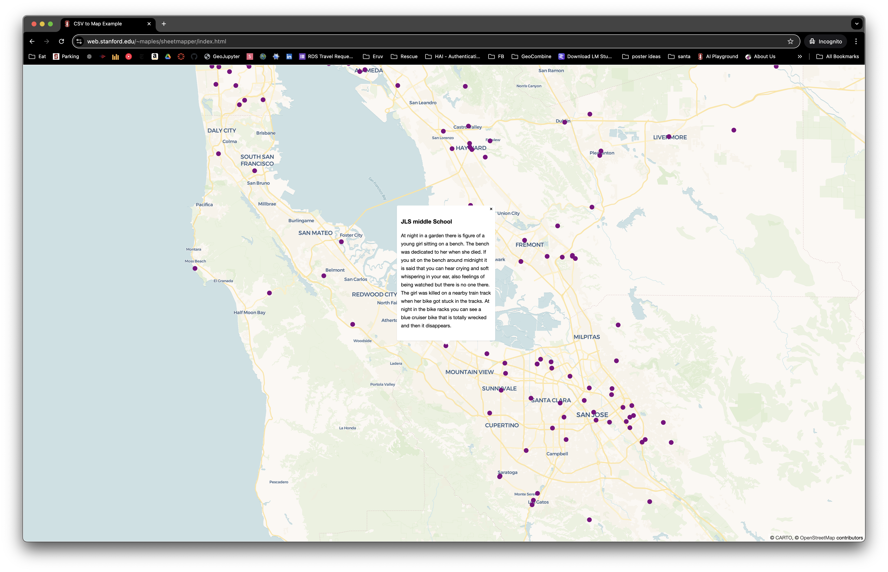

> **Concept note:** A web map is usually made from several pieces working together: an HTML page, JavaScript libraries, a basemap, and one or more data sources. In this lab, the Google Sheet acts as the data source, and MapLibre GL JS draws the interactive map in the browser.

## What You Should Understand After This Lab

By the end of this exercise, you should be able to explain:

- how a public Google Sheet can act as a simple web map data source
- how a Google Form can feed a Google Sheet that then feeds a web map
- why the sheet needs longitude and latitude columns
- how a Google Sheets `gviz` JSONP URL lets JavaScript retrieve public spreadsheet data
- how spreadsheet rows are converted into GeoJSON point features
- how MapLibre GL JS displays points and popups in a browser
- how GitHub Pages or Stanford AFS can host a simple static web map

## Getting Ready

You will need a **code editor**, also called a **plain-text editor**, to write and edit your HTML and JavaScript. This is required.

Do **not** use a document editor such as Microsoft Word, Google Docs, Pages, or LibreOffice Writer for your `index.html` file. Document editors are designed for formatted writing, not code. They can add hidden formatting characters, curly quotation marks, automatic spacing, and other invisible changes that break HTML and JavaScript.

Your file must be saved as plain text with the exact file name `index.html`. A code editor helps you do this correctly and also highlights different parts of the code so errors are easier to notice.

### Plain-text Editors

All of these editors support code editing:

- [Sublime Text](https://www.sublimetext.com/) is a lightweight editor that opens quickly and has a simple interface. It is a good choice if you want a focused tool for editing a single HTML file.
- [Visual Studio Code](https://code.visualstudio.com/) is a full-featured code editor with file browsing, syntax highlighting, extensions, and built-in tools. It is a good choice if you expect to keep working with web files, notebooks, or programming projects.
- [Notepad++](https://notepad-plus-plus.org/downloads/) is a Windows-only plain-text and code editor. It is a good alternative to Notepad because it shows code structure more clearly and avoids the formatting problems of document editors.

### Templates and Data

- [JSONP index.html template](../data/index_jsonp_template.html): this is the starter HTML file for the lab. You will copy this code into your own `index.html`, then replace the placeholder Google Sheet ID and sheet name with your own values.
- [Sample data spreadsheet `haunted_places`](https://docs.google.com/spreadsheets/d/1rPYpMp01hEPUJPfKH1nBWFjGcYNMeGraoVFKoOGtOGQ/edit?usp=sharing): this public Google Sheet provides example point data with `longitude`, `latitude`, `location`, and `description` columns. You can duplicate it for practice or use it as a model for your own spreadsheet.
- [Live map demo](https://web.stanford.edu/~maples/earthsys144/week07/index_jsonp.html): this is a working example of the finished map. Use it to preview the expected result before you begin editing your own file.

### Tools We'll Use

- [Google Sheets](https://docs.google.com/spreadsheets/u/0/) to create and store your point data
- A plain-text editor to edit the HTML file
- [MapLibre GL JS](https://maplibre.org) to draw the interactive web map
- Stanford's AFS web server or GitHub Pages to publish your static web map

> **Concept note:** A static website is a website made from files that can be served directly, such as `index.html`, CSS, JavaScript, and images. It does not require a custom database or server-side application, which is why GitHub Pages and AFS can host this kind of map.

## Create Data in Google Sheets

1. For this exercise, you can [duplicate the sample sheet](https://docs.google.com/spreadsheets/d/1rPYpMp01hEPUJPfKH1nBWFjGcYNMeGraoVFKoOGtOGQ/edit?usp=sharing).

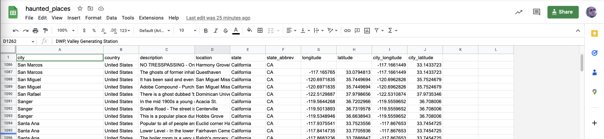

2. You may use the sample data, or create your own sheet from scratch.
3. Your sheet must include these exact column names:
   - `longitude`
   - `latitude`
4. To use the template popup code without changes, your sheet should also include:
   - `location`
   - `description`

> **Why these columns matter:** Longitude and latitude are the coordinates that place each row on the map. The popup code uses `location` and `description` because those are easy fields to display when a user clicks a point.

## Make Your Table Public

Your web map can only read your Google Sheet if the sheet is public enough for visitors to access.

1. Click the **Share** button.
2. Change the sharing setting so that **Anyone on the internet with the link can view**.


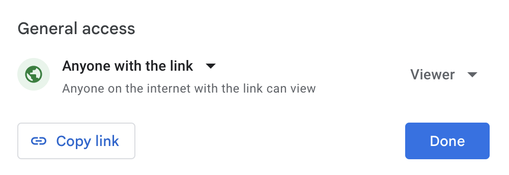

> **Concept note:** Your JavaScript code can only retrieve spreadsheet data if the sheet is public enough for the browser to access. If the sheet is private, the web map cannot read it for visitors who are not signed in with permission.

## Find Your Google Sheet ID and Sheet Name

The JSONP template needs two pieces of information: the spreadsheet ID and the sheet tab name.

### Find the Sheet ID

Look in the URL bar of your browser. The spreadsheet ID is the long string between `/d/` and `/edit`.

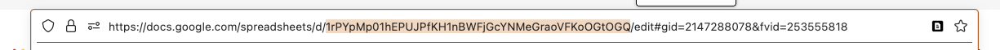

Example:

```text
https://docs.google.com/spreadsheets/d/1rPYpMp01hEPUJPfKH1nBWFjGcYNMeGraoVFKoOGtOGQ/edit?usp=sharing
```

In that URL, the sheet ID is:

```text
1rPYpMp01hEPUJPfKH1nBWFjGcYNMeGraoVFKoOGtOGQ
```

### Find the Sheet Name

Look at the tab name at the bottom of the Google Sheet.

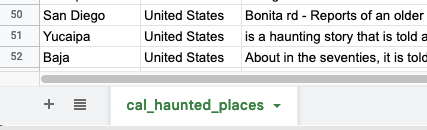

In the sample sheet, the sheet name is:

```text
cal_haunted_places
```

## Start Coding

1. Open your plain-text editor.
2. Create a file called `index.html`.
3. Copy the contents of [index_jsonp_template.html](../data/index_jsonp_template.html) into your new `index.html` file.
4. Save the file.

The rest of this lab explains the four main sections of the template:

1. Make the map.
2. Call the Google Sheet.
3. Create the points.
4. Create minimal popups.

## The HTML Head

The `<head>` section loads MapLibre GL JS and the MapLibre CSS file. These are the only external code libraries needed in this version.

```html
<head>
    <meta charset="utf-8">
    <title>Google Sheet JSONP Map Template</title>
    <!-- Load MapLibre GL JS, the JavaScript library that draws the interactive map. -->
    <script src="https://unpkg.com/maplibre-gl@2.4.0/dist/maplibre-gl.js"></script>
    <!-- Load MapLibre's CSS so the map controls and popups display correctly. -->
    <link href="https://unpkg.com/maplibre-gl@2.4.0/dist/maplibre-gl.css" rel="stylesheet" />
    <style>
        /* Make the page fill the whole browser window. Without this, the map div has no useful height. */
        body, html { margin: 0; padding: 0; height: 100%; }

        /* Place the map over the full page so the user sees only the interactive map. */
        #map { position: absolute; top: 0; bottom: 0; width: 100%; }
    </style>
</head>
```

> **Why this is simpler than the old version:** This version does not load jQuery or `csv2geojson`. Google sends structured table data through JSONP, and the template converts that table directly into GeoJSON.

## Step 1: Make the Map

The first JavaScript section creates the MapLibre map object.

```javascript
// STEP 1: MAKE THE MAP
// MapLibre creates the interactive web map inside the <div id="map"></div>.
var map = new maplibregl.Map({
    container: 'map',
    style: 'https://basemaps.cartocdn.com/gl/voyager-gl-style/style.json',
    center: [-122.411, 37.785],
    zoom: 8
});
```

The important settings are:

- `container`: the HTML element where the map will appear
- `style`: the basemap style URL
- `center`: the starting map center in `[longitude, latitude]` order
- `zoom`: the starting zoom level

### Change the Basemap Style

To change the basemap, replace the `style` URL.

```javascript
style: 'https://basemaps.cartocdn.com/gl/voyager-gl-style/style.json',
```

Basemaps you can try:

- [Dark Matter](https://basemaps.cartocdn.com/gl/dark-matter-gl-style/style.json)  
  `https://basemaps.cartocdn.com/gl/dark-matter-gl-style/style.json`
- [Positron](https://basemaps.cartocdn.com/gl/positron-gl-style/style.json)  
  `https://basemaps.cartocdn.com/gl/positron-gl-style/style.json`
- [Voyager](https://basemaps.cartocdn.com/gl/voyager-gl-style/style.json)  
  `https://basemaps.cartocdn.com/gl/voyager-gl-style/style.json`

## Step 2: Call the Google Sheet

This section creates a `<script>` tag that asks Google Sheets for the public sheet data.

```javascript
// STEP 2: CALL THE GOOGLE SHEET
// Wait for the basemap to load before adding spreadsheet data.
map.on('load', function () {
    // This URL uses Google Sheets gviz JSONP, not the CSV download.
    // JSONP loads data with a script tag, which avoids the CORS issue that blocks many CSV downloads.
    // Paste your spreadsheet ID after /d/ and paste your sheet tab name after sheet=.
    var sheetScript = document.createElement('script');
    sheetScript.src = 'https://docs.google.com/spreadsheets/d/PASTE_YOUR_SHEET_ID_HERE/gviz/tq?tqx=out:json;responseHandler:handleGoogleSheetData&sheet=PASTE_YOUR_SHEET_NAME_HERE';
    document.head.appendChild(sheetScript);
});
```

Replace:

- `PASTE_YOUR_SHEET_ID_HERE` with your Google Sheet ID
- `PASTE_YOUR_SHEET_NAME_HERE` with your sheet tab name

Keep the rest of the URL exactly the same. Only replace the spreadsheet ID placeholder and the sheet name placeholder.

> **Concept note:** JSONP works by loading data as a script. The `responseHandler:handleGoogleSheetData` part tells Google to call a function named `handleGoogleSheetData` after the sheet data loads. This pattern comes from the older Google Visualization API / Google Charts data-query system, not the newer Google Sheets API. For reference, see Google's documentation for the [Chart Tools Datasource Protocol](https://developers.google.com/chart/interactive/docs/dev/implementing_data_source), [Data Queries](https://developers.google.com/chart/interactive/docs/queries), and the [Visualization API Query Language](https://developers.google.com/chart/interactive/docs/querylanguage).

## Step 3: Create the Points

Google's response is a table. MapLibre draws GeoJSON. This section converts each spreadsheet row into a GeoJSON point.

```javascript
// Google calls this function after the sheet data loads.
function handleGoogleSheetData(response) {
    // Store the column names from the first row of the Google Sheet.
    var columns = response.table.cols.map(function (column) {
        return column.label;
    });

    // STEP 3: CREATE THE POINTS
    // Turn each spreadsheet row into one GeoJSON point.
    var features = response.table.rows.map(function (row) {
        var props = {};

        // Copy each cell into props using its spreadsheet column name.
        columns.forEach(function (columnName, index) {
            if (!columnName) return;
            props[columnName] = row.c[index] ? row.c[index].v : null;
        });

        // MapLibre expects point coordinates as numbers in [longitude, latitude] order.
        return {
            type: 'Feature',
            geometry: {
                type: 'Point',
                coordinates: [Number(props.longitude), Number(props.latitude)]
            },
            properties: props
        };
    });

    // GeoJSON is the standard web map format MapLibre uses for vector features.
    var geojson = {
        type: 'FeatureCollection',
        features: features
    };
```

The key line is:

```javascript
coordinates: [Number(props.longitude), Number(props.latitude)]
```

MapLibre expects coordinates in longitude, latitude order. This is the opposite of the way people often say coordinates out loud.

## Draw the Points on the Map

After the code creates GeoJSON, it adds the data to the map.

```javascript
    // Add the GeoJSON as a map source. Sources hold data.
    map.addSource('sheet-points', {
        type: 'geojson',
        data: geojson
    });

    // Add a circle layer to draw the source data. Layers control appearance.
    map.addLayer({
        id: 'points',
        type: 'circle',
        source: 'sheet-points',
        paint: {
            'circle-radius': 6,
            'circle-color': 'purple'
        }
    });
```

To change how the points look, edit:

```javascript
'circle-radius': 6,
'circle-color': 'purple'
```

For more on customizing circle markers, see the [MapLibre circle layer documentation](https://maplibre.org/maplibre-style-spec/layers/#circle).

## Step 4: Create Minimal Popups

This section creates simple popups when a user clicks a point.

```javascript
    // STEP 4: CREATE MINIMAL POPUPS
    // When a point is clicked, show values from the location and description columns.
    map.on('click', 'points', function (e) {
        var props = e.features[0].properties;
        var html = `<h3>${props.location}</h3><p>${props.description}</p>`;

        new maplibregl.Popup()
            .setLngLat(e.lngLat)
            .setHTML(html)
            .addTo(map);
    });
```

The popup uses the `location` and `description` columns:

```javascript
var html = `<h3>${props.location}</h3><p>${props.description}</p>`;
```

If your sheet uses different column names, change `props.location` and `props.description` to match your columns.

The final lines change the mouse cursor when the user hovers over a point:

```javascript
    // Make the cursor change over points so users know the points can be clicked.
    map.on('mouseenter', 'points', function () {
        map.getCanvas().style.cursor = 'pointer';
    });
    map.on('mouseleave', 'points', function () {
        map.getCanvas().style.cursor = '';
    });
}
```

## Publish and Test Your Web Map

Because this version uses Google Sheets JSONP, it avoids the most common CORS problem from the CSV download workflow. You still need to publish the page to test it the same way your audience will see it.

After each code change:

1. Save your `index.html`.
2. Upload or commit the new version.
3. Refresh the published page.
4. Open the browser developer console if the points do not appear.

## Publish Your Map with Your AFS Web Space

You can use Secure File Transfer Protocol (SFTP) to publish your `index.html` page to your Stanford AFS web hosting space.

### Download the SecureFX Client

[https://uit.stanford.edu/software/scrt_sfx](https://uit.stanford.edu/software/scrt_sfx)

### Instructions for Installing and Licensing SecureFX Client

- [SecureFX for Mac](https://uit.stanford.edu/software/scrt_sfx)
- [SecureFX for Windows](https://uit.stanford.edu/software/scrt_sfx)

## Using SecureFX to Move Files to Your AFS Space

The screenshot below shows the Mac version of SecureFX. The left side shows files on your computer, and the right side shows folders and files in your remote AFS space. You can drag and drop files from one side to the other.

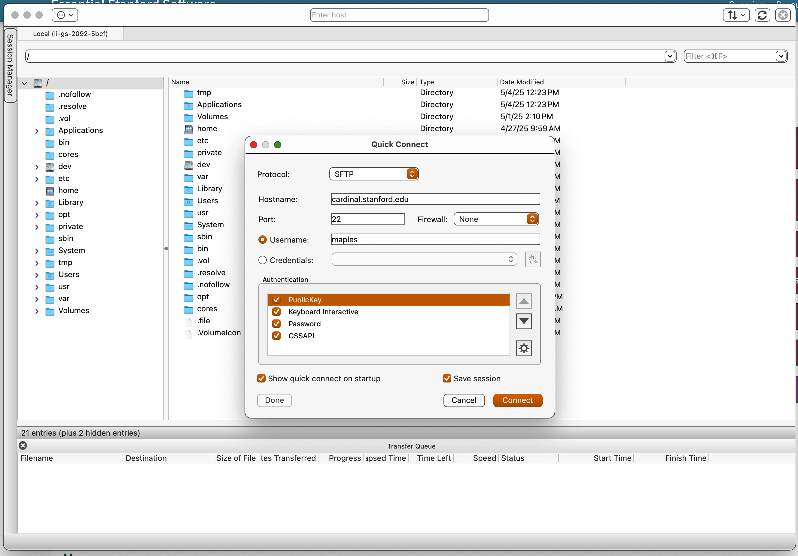

1. Connect to `cardinal.stanford.edu` and log in with your SUNetID and password.
2. Browse into your `WWW` folder and create a new folder called `sheetmapper`.

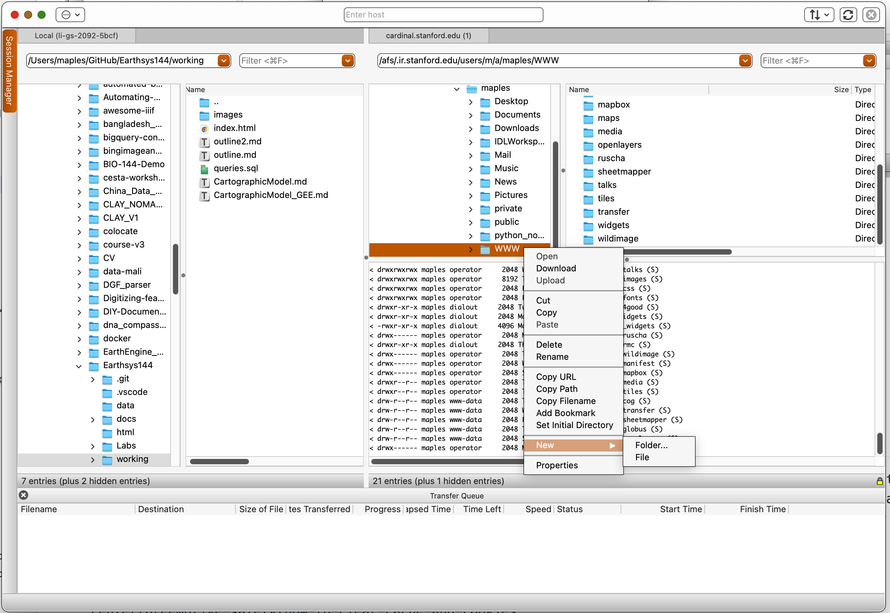

3. Find your `index.html` file on your local computer and drag it into the `sheetmapper` folder.

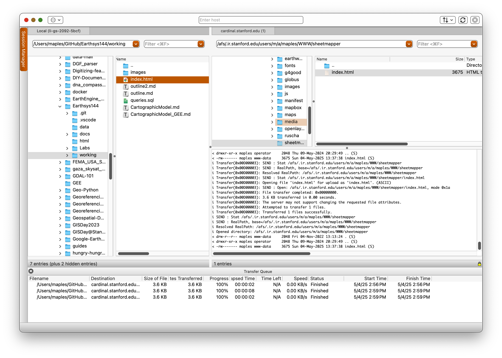

4. Test your sheetmapper page by replacing `SUNETID` with your own SUNetID:

```text
http://web.stanford.edu/~SUNETID/sheetmapper/index.html
```

## If AFS Does Not Work For You

GitHub Pages can also publish this type of simple web map.

## Publish Your Map with GitHub Pages

1. Create a GitHub account if you do not have one.
2. Create a new [GitHub repository](https://help.github.com/articles/create-a-repo/).

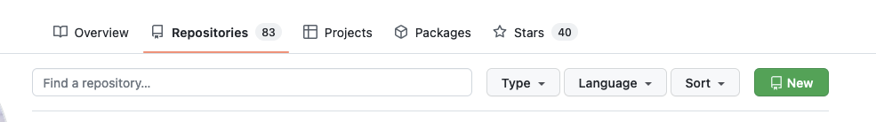

3. Name the repository for your map.
4. Make it public.
5. Initialize the repository with a README.

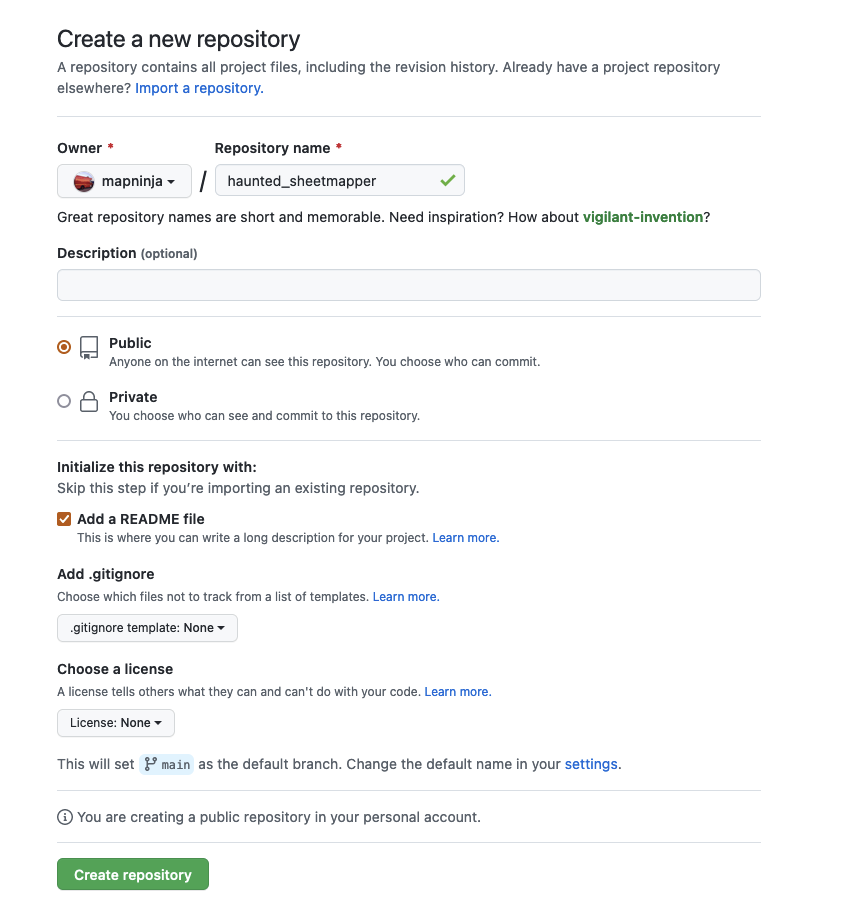

6. Upload your `index.html` file, or create a new file called `index.html` and paste in your edited code.
7. Commit the file.

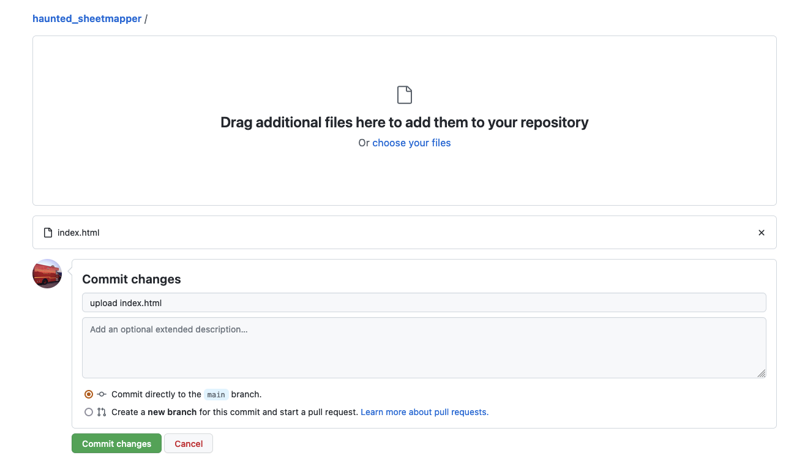

8. Enable GitHub Pages by going to **Settings > Pages** for your repository.
9. Change the branch from **None** to **main** and save.
10. After a minute or two, GitHub will publish a URL like:

```text
https://YOUR-GITHUB-NAME.github.io/YOUR-REPO-NAME/
```

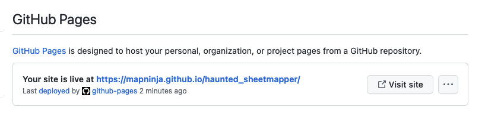

## Troubleshooting

**The basemap appears, but no points appear**

- Confirm the Google Sheet is public.
- Confirm the sheet ID is pasted after `/d/`.
- Confirm the sheet name is pasted after `sheet=`.
- Confirm your sheet has columns named `longitude` and `latitude`.
- Open the browser developer console and look for JavaScript errors.

**The popups say undefined**

- Confirm your sheet has columns named `location` and `description`.
- If your columns have different names, update the popup line:

```javascript
var html = `<h3>${props.location}</h3><p>${props.description}</p>`;
```

**The map opens locally but not after publishing**

- Confirm your file is named exactly `index.html`.
- Confirm it was uploaded or committed to the correct folder.
- Hold **Shift** and refresh the browser page.

## Deliverable

Submit the following for grading:

1. The live URL for your hosted `index.html` page.


