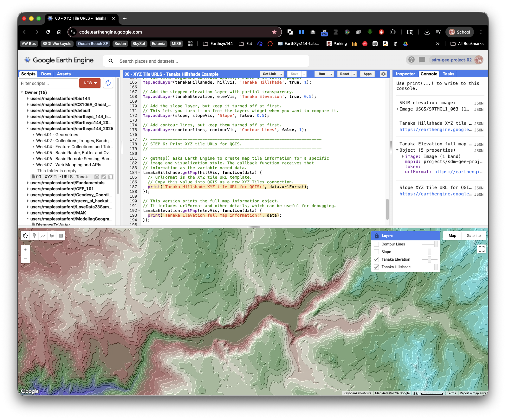
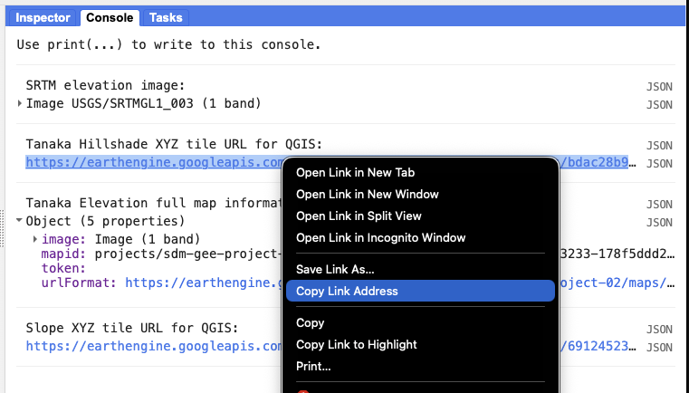

# TURN IN - Getting XYZ Tiles from Google Earth Engine

## Overview

In this lab, you will create a visualization in Google Earth Engine, print an **XYZ tile URL** for that visualization, and add the tile URL to **QGIS**.

This workflow is useful when you want to view an Earth Engine layer alongside other GIS data without exporting a GeoTIFF first. Earth Engine does the processing in the cloud, then sends QGIS small map image tiles for the area and zoom level you are viewing.

> **Concept note:** XYZ tiles are small map images requested with a URL pattern containing `{z}`, `{x}`, and `{y}`. The `{z}` value is the zoom level, `{x}` is the tile column, and `{y}` is the tile row. QGIS fills in those values automatically as you pan and zoom.

## What You Should Understand After This Lab

By the end of this exercise, you should be able to explain:

- what an XYZ tile URL is
- why web maps and GIS clients request map tiles instead of one giant image
- how Earth Engine turns an image visualization into temporary map tiles
- how visualization parameters control the colors that appear in QGIS
- why an Earth Engine tile URL is useful for viewing but not the same as downloading analysis data

## Getting Ready

You will need:

- access to the Google Earth Engine Code Editor
- QGIS installed on your computer
- a dataset from the [Google Earth Engine Data Catalog](https://developers.google.com/earth-engine/datasets)

If you are still setting up Earth Engine, return to the course login and setup lab before starting this exercise.

Use the Data Catalog sample script and the Code Editor launch button as your starting point.

## Part 1: Choose a Dataset from the Google Earth Engine Data Catalog

1. Open the Google Earth Engine Data Catalog:

   [https://developers.google.com/earth-engine/datasets](https://developers.google.com/earth-engine/datasets)
2. Choose a dataset that interests you.

   Good beginner choices include:

   - elevation datasets, such as SRTM
   - Landsat imagery
   - Sentinel-2 imagery
   - land cover datasets
   - climate or environmental layers
3. Open the dataset page.
4. Look for the sample script on the dataset page.
5. Click **Open in Code Editor** or **Launch in Code Editor**.
6. Run the sample script once.

Before changing anything, make sure the sample visualization appears in the Code Editor map.

The Data Catalog is not only a list of datasets. It also gives you a starting script, band names, scale, date range, provider information, and suggested visualization parameters. For beginners, starting from the catalog sample is safer than guessing how a dataset is structured.

## Part 2: Understand the Tile URL Workflow

Earth Engine scripts often use `Map.addLayer()` to show a layer in the Code Editor. That is useful for viewing the map inside Earth Engine.

For QGIS, we need one extra step: we ask Earth Engine for the map tile information behind a visualization. The method that does this is:

```javascript
var mapId = image.getMapId(visualizationParameters);
print(mapId.tile_fetcher.url_format);
```

The printed tile URL template is the XYZ tile URL. It contains the `{z}`, `{x}`, and `{y}` placeholders that QGIS needs.

> **Important limitation:** Earth Engine tile URLs are temporary viewing links. They are useful for class demonstrations, quick comparison, and visual exploration in QGIS. They are not a permanent public tile service and they are not the same as exporting data for analysis.

## Part 3: Example Earth Engine Script

The script below creates terrain visualizations from the SRTM elevation dataset near Yosemite National Park. You can use this example if you want a known working script before adapting your own Data Catalog sample.



Copy the full script into a new Earth Engine Code Editor script and run it.

```javascript
/*
EarthSys 144
Getting XYZ Tiles from Google Earth Engine

Objective:
This script demonstrates how to create a terrain visualization in Google
Earth Engine and print an XYZ tile URL that can be added to QGIS.

This example uses:
1. A simplified Tanaka-style hillshade to highlight terrain features.
2. A slope layer to show terrain steepness.
3. Contour lines to show elevation intervals.

Skills being taught:
- Loading an elevation dataset from the Earth Engine Data Catalog.
- Creating terrain visualizations from a Digital Elevation Model, or DEM.
- Setting visualization parameters for map display.
- Printing an Earth Engine XYZ tile URL for use in QGIS.
*/

// ---------------------------------------------------------------------
// STEP 1: Load the SRTM elevation dataset.
// ---------------------------------------------------------------------

// This dataset is the Shuttle Radar Topography Mission, or SRTM.
// It provides near-global elevation data at about 30-meter resolution.
// In Earth Engine, ee.Image() loads a single raster image dataset.
var dataset = ee.Image('USGS/SRTMGL1_003');

// Select the elevation band from the dataset.
// A band is one layer of pixel values inside a raster image.
// Here, each pixel stores elevation in meters.
var elevation = dataset.select('elevation');

// Print the dataset so you can inspect it in the Console.
// This helps you confirm the band names and metadata.
print('SRTM elevation image:', dataset);

// ---------------------------------------------------------------------
// STEP 2: Create terrain derivative layers.
// ---------------------------------------------------------------------

// Calculate slope from elevation.
// Slope describes how steep the ground is at each pixel.
// ee.Terrain.slope() returns slope in degrees.
var slope = ee.Terrain.slope(elevation);

// Create a traditional hillshade.
// Hillshade simulates how terrain would look with light shining on it.
// The azimuth value, 315, means light comes from the northwest.
// The elevation angle, 45, means the light is halfway above the horizon.
var hill = ee.Terrain.hillshade(elevation, 315, 45);

/*
Contour Line Generation:

Contour lines connect places with the same elevation. They are useful
because they turn a continuous elevation surface into readable elevation
intervals.

The code below creates contour intervals every 200 meters from 0 to 6000
meters. It smooths the elevation slightly before finding each contour so
the output is less noisy.
*/

// Create a list of contour levels: 0, 200, 400, and so on up to 6000.
var lines = ee.List.sequence(0, 6000, 200);

// Map over each contour level and create one contour image for that level.
var contourlines = lines.map(function(line) {
  // Smooth the elevation image to make contours less jagged.
  var smoothedElevation = elevation.convolve(ee.Kernel.gaussian(5, 3));

  // Subtract the current contour elevation from the DEM.
  // Values near zero are where the DEM crosses that contour level.
  var differenceFromContour = smoothedElevation.subtract(ee.Image.constant(line));

  // zeroCrossing() identifies where the raster crosses zero.
  // Multiplying by the contour value gives the line its elevation value.
  var mycontour = differenceFromContour
    .zeroCrossing()
    .multiply(ee.Image.constant(line))
    .toFloat();

  // Mask the image so only the contour pixels draw on the map.
  return mycontour.mask(mycontour);
});

// Convert the list of contour images into an ImageCollection and mosaic it.
// A mosaic combines many images into one display image.
contourlines = ee.ImageCollection(contourlines).mosaic();

/*
Tanaka-style Hillshade:

The Tanaka method is a cartographic terrain style that emphasizes stepped
elevation bands and illumination. This simplified version first rounds
elevation down to 100-meter intervals, then calculates hillshade from that
simplified surface.

The result is not the only way to make Tanaka contours, but it is a useful
beginner-friendly demonstration of how changing the input surface changes
the appearance of terrain.
*/

// Convert continuous elevation into 100-meter steps.
// divide(100) changes meters into hundreds of meters.
// floor() rounds values down.
// multiply(100) converts the values back to meters.
var tanakaElevation = elevation.divide(100).floor().multiply(100);

// Calculate hillshade from the simplified elevation surface.
var tanakaHillshade = ee.Terrain.hillshade(tanakaElevation, 315, 45);

// ---------------------------------------------------------------------
// STEP 3: Set the map view.
// ---------------------------------------------------------------------

// Center the map near Yosemite National Park, California.
// The first number is longitude, the second is latitude, and the third is zoom.
Map.setCenter(-119.604, 37.743, 12);

// ---------------------------------------------------------------------
// STEP 4: Define visualization parameters.
// ---------------------------------------------------------------------

// Visualization parameters tell Earth Engine how to turn pixel values into colors.
// The hillshade values range from dark to bright, so a black-to-white palette works.
var hillVis = {
  min: 0,
  max: 255,
  palette: ['black', 'white']
};

// This elevation palette assigns colors to different elevation ranges.
// Lower elevations are blue and green, while higher elevations become lighter.
var elevVis = {
  min: 400,
  max: 3600,
  palette: ['blue', 'green', 'brown', 'beige', 'forestgreen', 'cyan', 'white']
};

// This slope palette uses green for gentle slopes, yellow for moderate slopes,
// and red for steep slopes.
var slopeVis = {
  min: 0,
  max: 40,
  palette: ['green', 'yellow', 'red']
};

// This contour style draws contour lines in white.
var contourVis = {
  min: 0,
  max: 5000,
  palette: ['white']
};

// ---------------------------------------------------------------------
// STEP 5: Add layers to the Earth Engine map.
// ---------------------------------------------------------------------

// Add the simplified Tanaka hillshade layer.
// The fourth argument controls whether the layer is visible when the map loads.
// The fifth argument controls opacity, where 1 is fully opaque.
Map.addLayer(tanakaHillshade, hillVis, 'Tanaka Hillshade', true, 1);

// Add the stepped elevation layer with partial transparency.
Map.addLayer(tanakaElevation, elevVis, 'Tanaka Elevation', true, 0.5);

// Add the slope layer, but keep it turned off at first.
// This lets you turn it on from the Layers widget when you want to compare it.
Map.addLayer(slope, slopeVis, 'Slope', false, 0.5);

// Add contour lines, but keep them turned off at first.
Map.addLayer(contourlines, contourVis, 'Contour Lines', false, 1);

// ---------------------------------------------------------------------
// STEP 6: Print XYZ tile URLs for QGIS.
// ---------------------------------------------------------------------

// getMapId() asks Earth Engine to create map tile information for a specific
// image and visualization style. The returned object includes a tile URL
// template that QGIS can use for XYZ tiles.
var tanakaHillshadeMap = tanakaHillshade.getMapId(hillVis);
print('Tanaka Hillshade XYZ tile URL for QGIS:', tanakaHillshadeMap.tile_fetcher.url_format);

// This version prints the full map information object.
// It includes the tile fetcher and other details, which can be useful for debugging.
var tanakaElevationMap = tanakaElevation.getMapId(elevVis);
print('Tanaka Elevation full map information:', tanakaElevationMap);

// This prints a tile URL for the slope visualization.
// Use this if you prefer to view slope in QGIS instead of hillshade.
var slopeMap = slope.getMapId(slopeVis);
print('Slope XYZ tile URL for QGIS:', slopeMap.tile_fetcher.url_format);
```

## Part 4: Adapt the Pattern to Your Chosen Dataset

Now return to the dataset you have chosen from the Data Catalog. Here, we'll use the NOAA CFSv2 Harmonized 6-Hour Forecast page in the Earth Engine Data Catalog as an example:

https://developers.google.com/earth-engine/datasets/catalog/NOAA_CFSV2_FOR6H_HARMONIZED

The page includes this sample script:

```javascript
var dataset = ee.ImageCollection('NOAA/CFSV2/FOR6H_HARMONIZED')
                  .filter(ee.Filter.date('2018-03-01', '2018-03-14'));
var temperatureAboveGround = dataset.select('Temperature_height_above_ground');
var visParams = {
  min: 220.0,
  max: 310.0,
  palette: ['blue', 'purple', 'cyan', 'green', 'yellow', 'red'],
};
Map.setCenter(-88.6, 26.4, 1);
Map.addLayer(temperatureAboveGround, visParams, 'Temperature Above Ground');
```

To add the `getMapId()` function to your chosen script, use the following steps:

1. Identify the image or image collection being displayed.
3. Identify the visualization parameters, particularly the name of the variable holding the parameters.

   In this sample, the visualization parameters are held in `visParams`.
4. Identify the line that adds the layer to the map.

   In this sample, it is:

   ```javascript
   Map.addLayer(temperatureAboveGround, visParams, 'Temperature Above Ground');
   ```
5. Add a `getMapId()` block after the `Map.addLayer()` line.

   Replace `temperatureAboveGround` and `visParams` with the names used in your script:

   ```javascript
   var temperatureMap = temperatureAboveGround.getMapId(visParams);
   print('XYZ tile URL for QGIS:', temperatureMap.tile_fetcher.url_format);
   ```
6. Run the script.
7. In the **Console**, find the printed URL.
8. Copy the full tile URL template.



> **Troubleshooting note:** If your Data Catalog sample uses an `ImageCollection`, it may need to be filtered, sorted, mosaicked, or reduced to a single `Image` before `getMapId()` works. Look for the variable that is actually passed into `Map.addLayer()`. That is usually the object you should use with `getMapId()`.

## Part 5: Add the Earth Engine Tile URLs to QGIS

1. Open QGIS.
2. Open the **Browser** panel.

   If you do not see it, go to **View > Panels > Browser**.
3. In the Browser panel, find **XYZ Tiles**.
4. Right-click **XYZ Tiles** and choose **New Connection**.
5. Give the connection a clear name, such as:

   `Earth Engine Tanaka Hillshade`
6. Paste the Earth Engine tile URL template into the **URL** field.
7. Click **OK**.
8. Double-click the new XYZ tile connection to add it to your QGIS map.
9. Pan and zoom to the area you viewed in Earth Engine.
10. If the layer does not appear, right-click the layer and choose **Zoom to Layer** only if QGIS can detect an extent. If that does not help, manually zoom to the same place you used in Earth Engine.
11. Create a QGIS Print Layout to produce a cartographic presentation of your Earth Engine layer(s):

    - Choose `Project > New Print Layout` (or use the Layout Manager and create a new layout).
    - Add a `Map` item showing the Earth Engine XYZ layer(s) in the correct order.
    - Add standard cartographic elements: title, scale bar, north arrow, and any short explanatory labels needed to make the layout understandable.
    - Do **not** include a legend unless you have added your own vector layers that need one. Legends are not required for Earth Engine XYZ image tiles because QGIS does not automatically know the class breaks or color meanings inside a rendered image tile.
    - Add a text box (label) to the layout and paste the full Earth Engine XYZ tile URL(s) you used. Ensure the pasted URLs are complete and copyable (do not truncate them).
    - If you used a hillshade layer with opacity, record the opacity value in the layout (for example: "Hillshade opacity: 0.5").
    - Export the layout as a PDF (`Layout > Export as PDF`) and include it in your submission.

## Part 6: Compare Earth Engine and QGIS

Once the tile layer appears in QGIS, compare it with another layer:

1. Add a QGIS basemap, such as OpenStreetMap or another available XYZ basemap.
2. Move the Earth Engine tile layer above the basemap.
3. Adjust the layer opacity from the **Layer Styling** panel.
4. Pan and zoom to test whether QGIS requests new tiles from Earth Engine.
5. Think about what is being transferred:

   - QGIS is not downloading the original raster dataset.
   - QGIS is displaying rendered image tiles.
   - The colors are controlled by the Earth Engine visualization parameters.
   - The tile URL may stop working after the Earth Engine map token expires.

> **Concept note:** A rendered tile layer is excellent for visual comparison, cartographic context, and quick exploration. It is not appropriate when you need the original pixel values for measurement, classification, raster calculator work, or statistical analysis in QGIS. For those tasks, export the data from Earth Engine instead.

## Deliverable

Submit the following as a PDF:

1. The name and URL of the Earth Engine Data Catalog dataset you selected.
2. Your Earth Engine **Get Link** URL for the script you ran.
3. All printed Earth Engine XYZ tile URLs copied from the Console. Note: the example script in this guide prints multiple XYZ tile URLs (for example, a Tanaka-style hillshade and a stepped elevation layer). If you use that example in QGIS, create XYZ connections for BOTH URLs, add them to your project, place the hillshade layer above the elevation layer, and set the hillshade layer opacity (Layer Properties → Transparency) to around 0.5 so the combined visual effect matches the example.
4. A QGIS Print Layout exported as a PDF that demonstrates a proper cartographic presentation. The layout must include at minimum: a title, north arrow, scale bar, appropriate map extent, and the visible Earth Engine layer(s) with the correct layer order and opacity settings. A legend is **not required** for the Earth Engine XYZ image tile layer(s).

   - In the same layout, add a text box (label) and paste ALL Earth Engine XYZ tile URL(s) you used. The pasted URLs must be human-readable and complete so an instructor can copy them.
   - If you used multiple XYZ URLs (e.g., hillshade + elevation), ensure the layout shows the layers in the order used and documents the hillshade opacity (for example: "Hillshade opacity: 0.5").
   - If you want to explain the colors, add a short text note describing what the visualization shows rather than trying to force QGIS to create a legend for the XYZ tile.

## Common Problems

### The Console does not print a URL

Check that you ran the script and that your `getMapId()` block uses the same image variable and visualization variable used by `Map.addLayer()`.

### QGIS says the tile URL is invalid

Make sure you copied the full tile URL template, including `{z}`, `{x}`, `{y}`, and any token or query text at the end of the URL.

### The layer worked earlier but does not work now

Earth Engine tile URLs are temporary. Return to the Code Editor, run the script again, print a new tile URL template, and update the QGIS XYZ Tiles connection.

### The colors in QGIS are not what I expected

Change the visualization parameters in Earth Engine, run the script again, and copy the new tile URL. QGIS is displaying the rendered tiles Earth Engine creates from those visualization settings.
