# TURN IN BONUS LAB - Tree Labeling in QGIS

> **Required Week 07 turn-in and bonus opportunity:** This lab is required for the Week 07 lab. Students will randomly select 20 candidate grid cells and complete tree labels in the first 4 suitable cells in both the postfire and prefire imagery. Students may then continue labeling additional suitable grid cells as bonus work. Each additional completed grid cell beyond the required 4, with both postfire and prefire labels, earns 1 extra credit point, up to 10 extra credit points for the quarter.

> **Note:** To make sure you are viewing the most recent version of this lab guide, hold **Shift** and click the browser refresh button.

> **Turn-in for grading:** Submit this lab on Canvas when you complete the required Week 07 labeling work. If you complete bonus grid cells, include them in the same submission.

## Introduction

This lab introduces you to the QGIS interface through a hands-on tree crown annotation project. You'll learn essential QGIS skills while creating valuable training data by digitizing individual tree crowns from high-resolution aerial imagery.

**What you'll be doing:**
You'll use Google Earth Engine to create temporary XYZ tile URLs for high-resolution NAIP (National Agriculture Imagery Program) imagery from before and after five major 2020 California fires. You will add those tile URLs to QGIS, organize them into prefire and postfire layer groups, randomly select 20 candidate grid cells, inspect them in the imagery, and label trees in both postfire and prefire imagery for the first 4 cells that contain forest cover without structures, roads, or other human-built infrastructure. After the required 4 cells, you may continue labeling additional suitable cells for extra credit.

**Why this matters:**
The data you create will be used to train machine learning models for automated tree detection and counting. Accurate tree crown delineation is fundamental to forest inventory, wildfire risk assessment, and ecosystem monitoring. This workflow teaches you core GIS skills while contributing to real research applications.

## Learning Objectives

By the end of this lab, you will be able to:

- Navigate the QGIS interface and use essential navigation tools
- Work with layers, including reordering, toggling visibility, and exploring metadata
- Use Google Earth Engine to create temporary XYZ tile URLs for NAIP imagery
- Add Earth Engine XYZ tile services to QGIS
- Query attribute tables and select features based on spatial location
- Use geoprocessing tools to create a random sample of candidate grid cells
- Create and edit shapefile layers for new spatial labels
- Use a docked attribute table to move systematically through sampled grid cells
- Digitize rectangular tree labels from aerial imagery
- Export spatial data in GeoJSON format with proper naming conventions


---

## Getting Started

### Download and Extract the Project Package

Download the `mortalitree.zip` file from the course repository data folder:

[Download mortalitree.zip](../data/mortalitree.zip)

This package contains the QGIS project structure and vector data you need for the labeling workflow. It does **not** include local NAIP imagery files or VRT imagery references. You will add the imagery yourself by creating Google Earth Engine XYZ tile URLs in the next section.

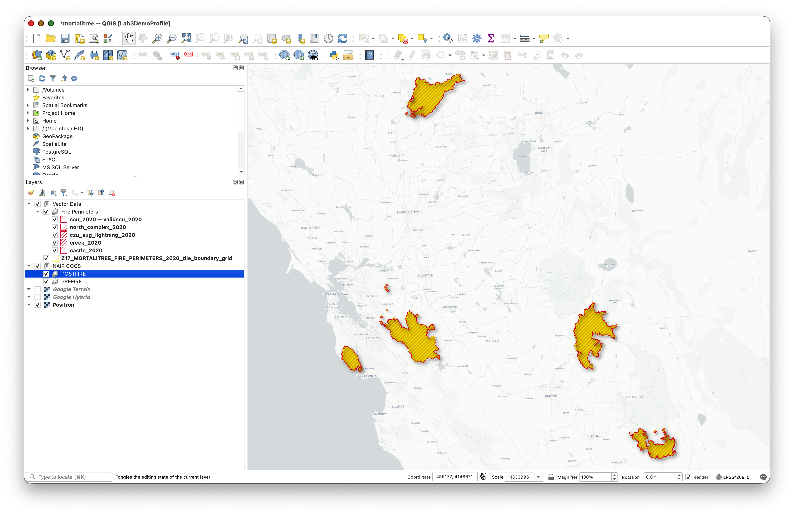

**What's included in the .zip file:**

- Pre-configured QGIS project file: `mortalitree.qgs`
- Vector data layers, including:
  - `castle_2020` (Castle Fire perimeter)
  - `creek_2020` (Creek Fire perimeter)
  - `czu_aug_lightning_2020` (CZU August Lightning Complex perimeter)
  - `north_complex_2020` (North Complex perimeter)
  - `scu_2020` (SCU Lightning Complex perimeter)
  - `Z17_MORTALITREE_FIRE_PERIMETERS_2020_tile_boundary_grid` (XYZ tile grid)
- `MORTALITREE_FIRE_PERIMETERS_2020`
- Basemap layers, such as `Google Hybrid` and `Google Terrain`
- Prepared layer groups for organizing the imagery you will add:
  - `PREFIRE - NAIP 2020 Earth Engine Tiles`
  - `POSTFIRE - NAIP 2022 Earth Engine Tiles`
- Pre-built folder structure following GIS best practices
- A ready-to-open QGIS project with the vector layers, basemaps, and imagery groups already organized

**Extract the .zip file:**

1. Download `mortalitree.zip`
2. Extract it to your Documents folder (or another location you can easily access)

### What's in the Data Folder

Inside the extracted `mortalitree/data/` folder you'll find:

- **Tile boundary grid:** `Z17_MORTALITREE_FIRE_PERIMETERS_2020_tile_boundary_grid`
- **Fire perimeter layers:** `castle_2020`, `creek_2020`, `czu_aug_lightning_2020`, `north_complex_2020`, and `scu_2020`
- **Combined fire perimeter layer:** `MORTALITREE_FIRE_PERIMETERS_2020`

**Important:** Never modify or delete the original files in the extracted `data/` folder. These are your source data. Save your new working layers and final outputs in clearly named files so they are easy to find later

> **Why is the imagery not already in the package?** NAIP imagery is very large. Instead of downloading or packaging those files, you will ask Earth Engine to serve temporary map tiles to QGIS. This keeps the project package smaller and gives you practice connecting a cloud-based imagery service to desktop GIS.

### Create NAIP Tile URLs in Google Earth Engine

Instead of downloading NAIP imagery or configuring QGIS to read cloud-hosted GeoTIFFs directly, you will use Google Earth Engine as a temporary tile server. Earth Engine will mosaic the California NAIP imagery for 2020 and 2022, create RGB and color-infrared visualizations, and print four XYZ tile URLs that QGIS can request as you pan and zoom.

> **Concept note:** An XYZ tile URL is a web address pattern with `{z}`, `{x}`, and `{y}` placeholders. QGIS automatically replaces those placeholders with a zoom level, tile column, and tile row. This lets QGIS request only the small map images needed for your current view.

> **Important limitation:** Earth Engine tile URLs are temporary viewing links. If your QGIS layers stop drawing later, return to Earth Engine, run the script again, copy the new URLs, and update the QGIS XYZ connections.

1. Open the Google Earth Engine Code Editor:

   [https://code.earthengine.google.com/](https://code.earthengine.google.com/)
2. Create a new script.
3. Copy and paste the full script below.
4. Click **Run**.
5. Wait for the Console to print four URL lines:

   - `NAIP RGB XYZ URL (2020)`
   - `NAIP IRG XYZ URL (2020)`
   - `NAIP RGB XYZ URL (2022)`
   - `NAIP IRG XYZ URL (2022)`
6. Keep the Earth Engine tab open. You will copy these URLs into QGIS in the next section.

```javascript
/*
EarthSys 144
NAIP RGB and IRG XYZ Tile URLs for QGIS

Objective:
This script creates temporary Earth Engine XYZ tile URLs for California
NAIP imagery from 2020 and 2022. You will copy the printed URLs into QGIS
so you can view prefire and postfire imagery while digitizing tree labels.

Datasets used:
1. TIGER/2018/States provides U.S. state boundaries. We use it to select
   California and clip the imagery to the state boundary.
2. USDA/NAIP/DOQQ provides high-resolution aerial imagery from the National
   Agriculture Imagery Program. NAIP usually includes red, green, blue, and
   near-infrared bands.

Why two visualizations?
RGB shows imagery in natural color, similar to what your eyes would see.
IRG uses near-infrared, red, and green bands. Healthy vegetation often appears
bright in the near-infrared band, so this view can make trees easier to see.
*/

// --------------------------------------------------------------------
// STEP 1: Create a California boundary.
// --------------------------------------------------------------------

// Load a FeatureCollection of U.S. state boundaries.
// A FeatureCollection is a table of geographic features.
var states = ee.FeatureCollection('TIGER/2018/States');

// Filter the state table to the single feature whose NAME is California.
// The geometry() call extracts the polygon shape so we can use it for clipping.
var california = states.filter(
  ee.Filter.eq('NAME', 'California')
).geometry();

// Center the Earth Engine map on California at a statewide zoom level.
Map.centerObject(california, 6);

// --------------------------------------------------------------------
// STEP 2: Define a helper function for each NAIP year.
// --------------------------------------------------------------------

function buildNaipLayer(year) {
  // Create the first day of the requested year.
  var start = ee.Date.fromYMD(year, 1, 1);

  // Create the first day of the next year.
  // Filtering from start to end gives all NAIP images from that calendar year.
  var end = start.advance(1, 'year');

  // Load NAIP images, keep only images that intersect California and the
  // selected year, mosaic them into one display image, and clip to California.
  var naip = ee.ImageCollection('USDA/NAIP/DOQQ')
    .filterBounds(california)
    .filterDate(start, end)
    .mosaic()
    .clip(california);

  // RGB visualization uses red, green, and blue bands for natural color.
  var rgbVis = {
    bands: ['R', 'G', 'B'],
    min: 0,
    max: 255
  };

  // IRG visualization uses near-infrared, red, and green bands.
  // This is often called color infrared, or CIR, imagery.
  var irgVis = {
    bands: ['N', 'R', 'G'],
    min: 0,
    max: 255
  };

  // Add preview layers to the Earth Engine map.
  // The final false keeps them turned off until you choose to view them.
  Map.addLayer(naip, rgbVis, 'NAIP RGB ' + year, true);
  Map.addLayer(naip, irgVis, 'NAIP IRG ' + year, true);

  // Convert each visualization into an Earth Engine map tile object.
  // getMap() returns the URL pattern that QGIS needs for XYZ tiles.
  var rgbMap = naip.visualize(rgbVis).getMap({});
  var irgMap = naip.visualize(irgVis).getMap({});

  // Print the tile URLs in the Console.
  // Copy each urlFormat value exactly, including the {z}, {x}, and {y} parts.
  print('================================================');
  print('NAIP RGB XYZ URL (' + year + '):');
  print(rgbMap.urlFormat);

  print('NAIP IRG XYZ URL (' + year + '):');
  print(irgMap.urlFormat);
}

// --------------------------------------------------------------------
// STEP 3: Build the prefire and postfire imagery layers.
// --------------------------------------------------------------------

// For this lab, 2020 is the prefire imagery year.
buildNaipLayer(2020);

// For this lab, 2022 is the postfire imagery year.
buildNaipLayer(2022);
```

### Add the Earth Engine Tile URLs to QGIS

You will add four tile services to QGIS: 2020 RGB, 2020 IRG, 2022 RGB, and 2022 IRG. The 2020 layers are the prefire imagery, and the 2022 layers are the postfire imagery.

1. Open QGIS.
2. Go to **Project > Open** (or press `Ctrl+O` / `Cmd+O`).
3. Navigate to your extracted `mortalitree` folder.
4. Select the QGIS project file `mortalitree.qgs` and **Open**.
5. In the **Browser** panel, find **XYZ Tiles**.
6. Right-click **XYZ Tiles** and choose **New Connection...**
7. Add the first connection:


   | Setting | Value                                                      |
   | --------- | ------------------------------------------------------------ |
   | Name    | `NAIP 2020 RGB - Earth Engine`                             |
   | URL     | Paste the`NAIP RGB XYZ URL (2020)` value from Earth Engine |

   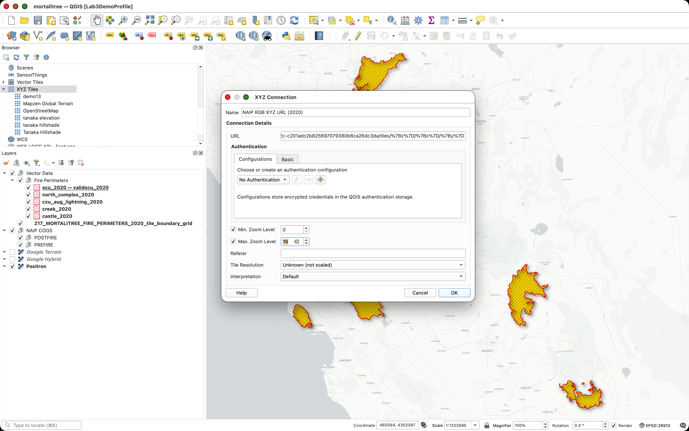
8. Click **OK**.
9. Repeat the same process for the other three URLs:


| QGIS connection name           | Earth Engine Console URL  |
| -------------------------------- | --------------------------- |
| `NAIP 2020 IRG - Earth Engine` | `NAIP IRG XYZ URL (2020)` |
| `NAIP 2022 RGB - Earth Engine` | `NAIP RGB XYZ URL (2022)` |
| `NAIP 2022 IRG - Earth Engine` | `NAIP IRG XYZ URL (2022)` |

11. Double-click each new XYZ connection to add it to your QGIS project.

> **Why use both RGB and IRG?** RGB imagery is often easier to interpret because it looks familiar. IRG imagery can make vegetation stand out more clearly because healthy vegetation reflects strongly in near-infrared light. You can switch between them while deciding whether a grid cell contains trees.

### Organize the NAIP Tile Layers in QGIS

Before you begin random selection and labeling, make sure the imagery is organized so you can quickly switch between years and band combinations. The project package should already include empty prefire and postfire imagery groups. If you do not see them, create them using the steps below.

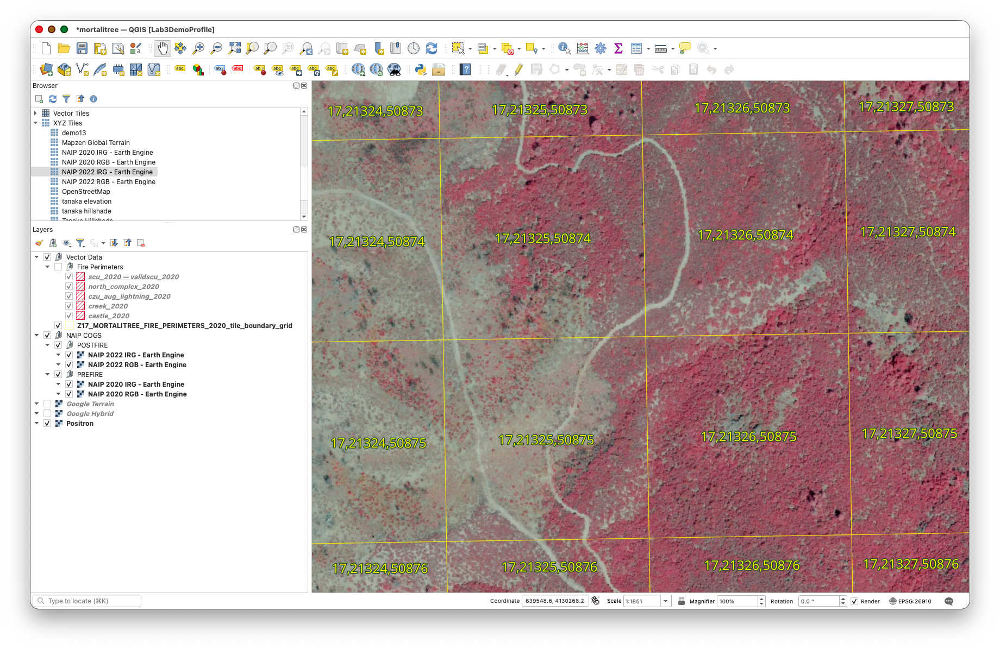

1. Look in the **Layers** panel for these groups:

   ```
   PREFIRE - NAIP 2020 Earth Engine Tiles
   ```

   ```
   POSTFIRE - NAIP 2022 Earth Engine Tiles
   ```
2. If either group is missing, right-click in an open area of the **Layers** panel and choose **Add Group**. If your QGIS version shows this option in a layer-panel menu instead, use that menu.
3. Create the missing group or groups using the exact names shown above.
4. Drag these layers into the **PREFIRE - NAIP 2020 Earth Engine Tiles** group:

   - `NAIP 2020 RGB - Earth Engine`
   - `NAIP 2020 IRG - Earth Engine`
5. Drag these layers into the **POSTFIRE - NAIP 2022 Earth Engine Tiles** group:

   - `NAIP 2022 RGB - Earth Engine`
   - `NAIP 2022 IRG - Earth Engine`

   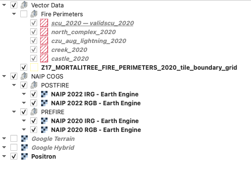
6. When inspecting a grid cell, turn on only one or two imagery layers at a time
7. Save the QGIS project so the tile connections and groups remain part of your lab workspace.

> **Performance note:** Earth Engine is creating these map tiles for display. If you turn on all four statewide tile layers while zoomed far out, QGIS may feel slow. Zoom to the grid-cell level first, then turn on the imagery you need.

## Part 1: Confirm and Explore the Project

### Step 1: Confirm the Project and Imagery Layers

You should now have the `mortalitree.qgs` project open and four Earth Engine NAIP tile layers added to it.

The project should show the tile boundary grid, the five fire perimeter layers, your prefire and postfire Earth Engine imagery groups, and the Google Hybrid and Google Terrain basemaps in the Layers Panel.

**Try this:**

- Use your mouse wheel to zoom in and out
- Use **Zoom to Layer** on the grid layer or one fire perimeter layer to see the project extent again
- Hold spacebar and drag to pan around the map
- Zoom to a fire area, turn on one NAIP tile layer, and notice how the imagery refreshes as you navigate and change scales

### Step 2: Explore the Layers Panel

The Layers Panel (usually on the left side) shows all layers in your project. Let's explore how it works:

**Layer Management:**

1. **To Reorder Layers:** Click and drag layers up or down

   - Layers higher in the list appear on top in the map
   - Try moving the grid layer above and below the imagery layer
   - See how this affects visibility
2. **To Toggle Layer Visibility:** Click the checkbox next to each layer name

   - Turn the grid layer off and on
   - Notice how you can see the imagery without the grid overlay
3. **Layer Properties:** Right-click any layer and select **Properties**

   - Explore the different tabs (Source, Symbology, etc.)
   - Don't make changes yet—just observe what's available

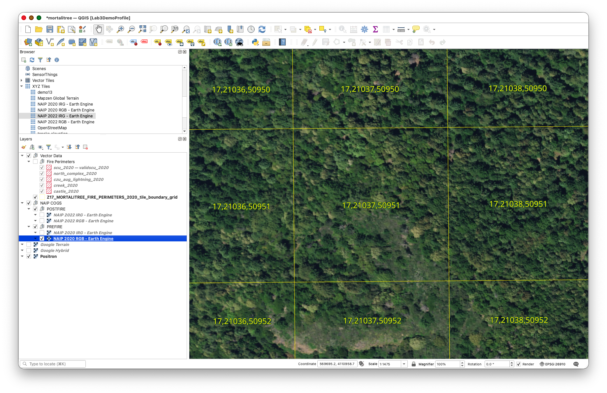

## Part 2: Working with Attributes and Selections

### Step 3: Open and Explore the Attribute Table

Every vector layer has an attribute table containing information about each feature:

1. Right-click `Z17_MORTALITREE_FIRE_PERIMETERS_2020_tile_boundary_grid` in the Layers Panel
2. Select **Open Attribute Table**
3. Examine the table structure:
   - Each row represents one grid cell
   - Columns contain attributes like tile coordinates (X, Y, Z)

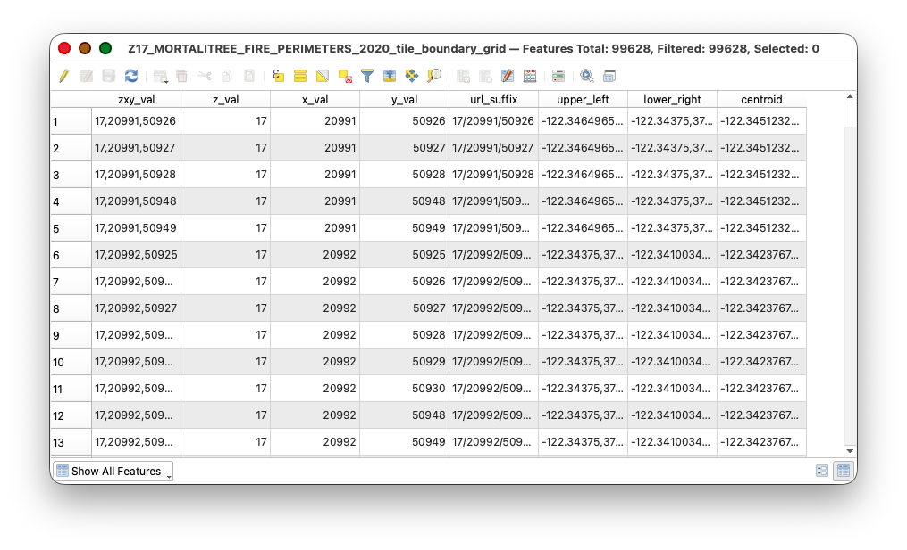

**Understanding the Grid:**

- **Z:** Zoom level (should be 17)
- **X:** Tile column number
- **Y:** Tile row number
- These **Z/X/Y** values follow the Web Mercator tiling scheme used by web maps

## Part 3: Fire Assignment, Select by Location, and Random Selection

### Step 4: Find Your Assigned Fire

To distribute the class evenly across the five 2020 fire areas, each student has been assigned one fire. Your assignment is listed by `SUNETID`.

1. Open the fire assignment table on Canvas:

   [Fire assignment table on Canvas](https://canvas.stanford.edu/courses/224871/files?preview=17185814)
2. Sign in with your Stanford account if Canvas prompts you.
3. Find your SUNETID in the `sunetid` column.
4. Write down both values listed for your row:
   - `assigned_fire`
   - `perimeter_layer`

For example, if your row lists `Creek Fire` and `creek_2020`, you will use the `creek_2020` fire perimeter layer to select your grid cells.

> **Why do this?** If everyone sampled from the full grid, many students might accidentally work in the same fire area. Assigning fires by last-name roster order spreads the labeling work across Castle, Creek, CZU August Lightning Complex, North Complex, and SCU Lightning Complex.

### Step 5: Extract Grid Cells for Your Assigned Fire by Location

Now you will use your assigned fire perimeter to create a new grid layer that contains only the grid cells that intersect that fire. This is called an **extract by location** operation because QGIS writes a new output layer based on the spatial relationship between two input layers.

1. In the **Layers** panel, turn on:
   - `Z17_MORTALITREE_FIRE_PERIMETERS_2020_tile_boundary_grid`
   - your assigned fire perimeter layer, such as `castle_2020`
2. Go to **Processing > Toolbox**.
3. In the Processing Toolbox search bar, type `extract by location`.
4. Open **Extract by location**.
5. Configure the tool:
   - **Extract features from:** `Z17_MORTALITREE_FIRE_PERIMETERS_2020_tile_boundary_grid`
   - **Where the features (geometric predicate):** check `intersect`
   - **By comparing to the features from:** your assigned `perimeter_layer`
   - **Extracted (location):** save the output in your extracted `mortalitree/data/` folder using a fire-specific name
6. Click **Run**.
7. Make sure **Open output file after running algorithm** is checked, or add the output layer manually after the tool finishes.

If you are assigned the Castle Fire, use:

```text
Z17_castle_2020_grid.shp
```

For other assigned fires, use the same pattern:

| Assigned perimeter layer | Output grid layer name |
| --- | --- |
| `castle_2020` | `Z17_castle_2020_grid.shp` |
| `creek_2020` | `Z17_creek_2020_grid.shp` |
| `czu_aug_lightning_2020` | `Z17_czu_aug_lightning_2020_grid.shp` |
| `north_complex_2020` | `Z17_north_complex_2020_grid.shp` |
| `scu_2020` | `Z17_scu_2020_grid.shp` |

You should now have a new grid layer containing only grid cells in and around your assigned fire perimeter. Turn off the original full grid layer so you can focus on your assigned fire grid.

> **Why use Extract by location?** The grid layer does not have to store a fire name in every row. QGIS can compare the grid cell polygons to the assigned fire perimeter polygon and write a new layer containing only the cells that overlap that perimeter.

### Step 6: Randomly Select 20 Candidate Grid Cells

Now you will randomly select 20 candidate grid cells from your assigned fire grid. You will not label all 20 cells for the required part of the lab. You will inspect them in order and label the first 4 cells that meet the suitability rules. If you want to earn extra credit, you may keep working through the sample after those first 4 suitable cells.

1. Go to **Processing > Toolbox**.
2. In the Processing Toolbox search bar, type `random selection`.
3. Open **Random selection**.
4. Configure the tool:
   - **Input layer:** your extracted fire grid layer, such as `Z17_castle_2020_grid`
   - **Method:** `Number of selected features`
   - **Number of selected features:** `20`
5. Click **Run**.

You should now see 20 selected grid cells within your assigned fire area.

> **Why do this?** Random selection spreads the work across your assigned fire area. You are selecting more candidate cells than you will label because some random cells may contain roads, buildings, water, bare ground, or other features that are not useful for this tree-labeling task.

### Step 7: Export the Selected Grid Cells to a New Layer

Now export those 20 selected grid cells to a new working layer.

1. Right-click your extracted fire grid layer, such as `Z17_castle_2020_grid`.
2. Choose **Export > Save Selected Features As...**
3. Make sure the **Save only selected features** option is enabled.
4. Save the layer in your extracted project folder as:

   ```
   sunetid_mortalitree_sample_grid.shp
   ```
5. Leave the default CRS unless QGIS prompts you to choose otherwise.
6. Click **OK**.

   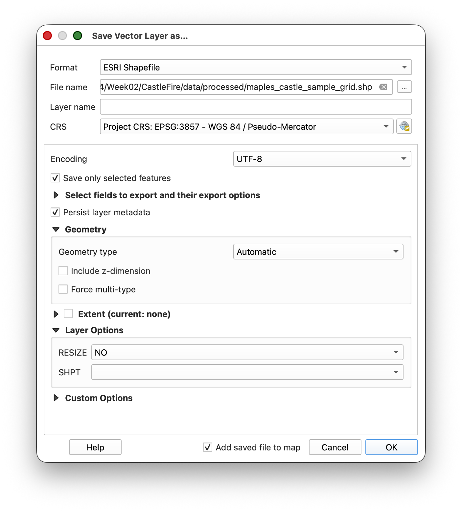

**Tip & Trick:** Copy the style from the assigned fire grid layer and paste it to the sample grid, then turn off the assigned fire grid layer.

1. Right-click your extracted fire grid layer and choose **Styles > Copy Style**.

   
2. Right-click `sunetid_mortalitree_sample_grid` and choose **Styles > Paste Style**.

   
3. Turn off your extracted fire grid layer.

### Step 8: Dock the Attribute Table Below the Map and Use It to Navigate

You will use the exported sample grid as your working unit layer.

1. Open the attribute table for `sunetid_mortalitree_sample_grid`.
2. If it opens in a separate window, dock it below the map panel by dragging it by the title bar until it snaps into the interface.

   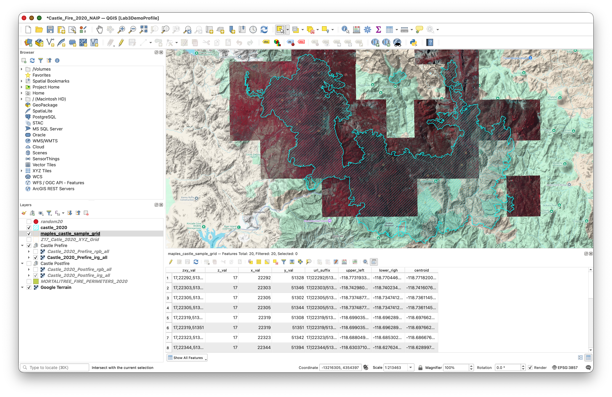
3. Use the attribute table tools to:

   - select a feature
   - zoom to the selected feature
   - move to the next feature

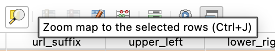


This lets you work through the sampled grid cells systematically instead of hunting around visually.

---

## Part 4: Create and Edit the Label Layers

### Step 9: Create the Postfire Label Layer

Create a new empty shapefile for your first set of labels.

1. Go to **Layer > Create Layer > New Shapefile Layer**.
2. Configure the layer:
   - **File name:** `sunetid_mortalitree_postfire_labels.shp`
   - **Geometry type:** Polygon
   - **CRS:** `WGS 84 (EPSG:4326)`
3. Click **OK**.

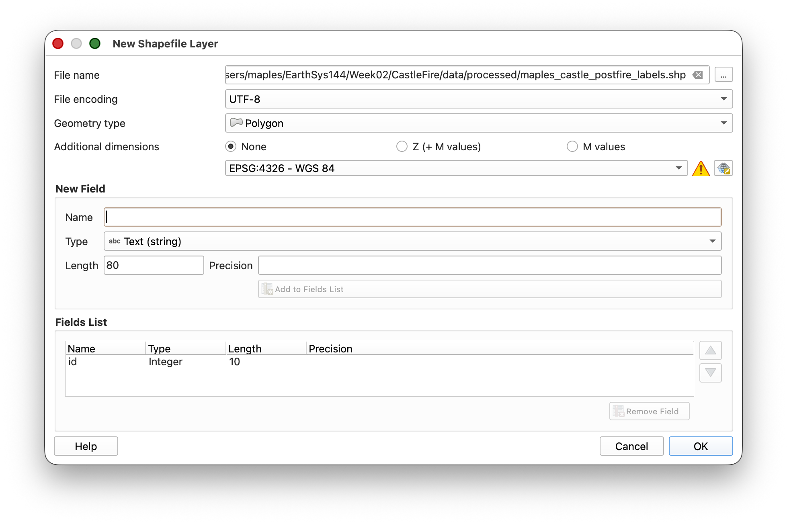

### Step 10: Get Ready to Edit

Before you start drawing labels, adjust the digitizing settings so QGIS uses the rectangle tool you need for this exercise.

1. Go to **QGIS > Settings** on Mac, or **Settings** on Windows.
2. Open **Options**.
3. In the Options dialog, go to **Map Tools > Digitizing**.
4. Enable **Suppress attribute form pop-up after feature creation**.
5. Click **Advanced** at the bottom of the Options panel.
6. Click **I will be careful**.
7. Expand `digitizing > shape-map-tools > current`.
8. Copy this text:

   ```
   rectangle-from-center-and-a-point
   ```
9. Paste that text into the **Value** box for the `current` setting.

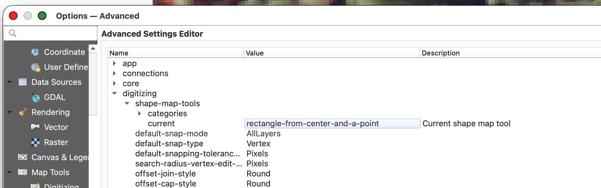

10. Click **OK** to save the setting.

> **Why do this?** This tells QGIS to use a rectangle-based polygon drawing workflow, which makes your tree labels faster and more consistent.

### Step 11: Start Editing the Postfire Label Layer

1. Make sure the **POSTFIRE - NAIP 2022 Earth Engine Tiles** imagery group is visible.
2. Toggle between the `NAIP 2022 RGB - Earth Engine` and `NAIP 2022 IRG - Earth Engine` layers to decide which one is easier to interpret. You can switch between them while labeling if that helps.
3. Select `sunetid_mortalitree_postfire_labels` in the Layers Panel.
4. Open the layer's styling and set:
   - **Fill:** Transparent
   - **Stroke:** a color that contrasts clearly with the imagery you are using
5. Click **Toggle Editing**.

### Step 12: Label Trees in the Postfire Imagery

Now begin the main labeling task.

1. In the docked attribute table for `sunetid_mortalitree_sample_grid`, select the first sampled grid cell and zoom to it.
2. Inspect that cell in the **postfire** imagery.
3. Only choose grid cells that meet all of the following conditions:
   - It should have trees in it.
   - It should have no buildings, houses, or other structures.
   - It should have no roads, parking lots, cleared pads, or other obvious human-built infrastructure.
   - It should have NAIP imagery available in both the prefire and postfire layers.
4. If the cell meets those conditions, label the trees by drawing rectangles around them using **Add Polygon Feature**.
5. If the cell does not meet those conditions, skip it and move to the next sampled grid cell.
6. Save your edits periodically.
7. Continue through the random sample in order until you have labeled trees in the first **4 suitable grid cells**.
8. For bonus credit, you may continue labeling additional suitable grid cells beyond the required 4. Each additional suitable grid cell must include both postfire and prefire labels before it can count for extra credit.

**Labeling guidance:**

- Keep the rectangles simple and consistent.
- Work one tree at a time.
- If a sampled cell has no trees or contains roads, buildings, or other human-built infrastructure, move on to the next sampled cell.
- Save often.

> **Important concept:** In this exercise, your rectangles are labels for tree locations, not precise canopy outlines.

### Step 13: Save Your Work Frequently

While digitizing:

1. Click **Save Layer Edits** regularly.
2. Do not wait until the end of the session to save.

### Step 14: Create the Prefire Label Layer by Copying the Postfire Layer

Once you have finished labeling the first 4 suitable grid cells in the postfire imagery:

1. Right-click `sunetid_mortalitree_postfire_labels`.
2. Choose **Save Features As...**
3. Save a copy as:

   ```
   sunetid_mortalitree_prefire_labels.shp
   ```
4. Add the new layer to the project if QGIS does not do this automatically.

This copied layer gives you a starting point for the prefire labels, since trees visible after the fire were also present before the fire.

### Step 15: Finish the Prefire Tree Labels

Now switch to the prefire imagery and finish the second label layer.

1. Turn on the **PREFIRE - NAIP 2020 Earth Engine Tiles** imagery group.
2. Start editing `sunetid_mortalitree_prefire_labels`.
3. Return to the same 4 sampled grid cells you already worked on.
4. Keep the copied tree labels that already match visible trees.
5. Add rectangles for any additional trees visible in the prefire imagery.
6. Save edits regularly.
7. When finished, stop editing and save the layer.

### Bonus Labeling Option

After you complete the required 4 suitable grid cells in both the postfire and prefire imagery, you may continue labeling additional suitable grid cells from your random sample.

- Each additional suitable grid cell beyond the required 4 earns 1 extra credit point.
- To count for extra credit, an additional grid cell must include both postfire labels and prefire labels.
- You may earn up to 10 extra credit points total for the quarter through this bonus labeling work.
- These points can effectively replace a lower grade, or simply make up for points lost on another submission.

### Step 16: Export Both Label Layers to GeoJSON

When both shapefiles are complete, export each one to GeoJSON.

1. Right-click `sunetid_mortalitree_postfire_labels`.
2. Choose **Export > Save Features As...**
3. Set:

   - **Format:** `GeoJSON`
   - **File name:** `sunetid_mortalitree_postfire_labels.geojson`
   - **CRS:** `EPSG:4326`
4. Save it in an `outputs` folder inside your extracted `mortalitree` project folder. If there is not already an `outputs` folder, create one.
5. Repeat the same process for `sunetid_mortalitree_prefire_labels`, exporting it as:

   ```
   sunetid_mortalitree_prefire_labels.geojson
   ```

---

## Part 5: Final Submission

### What to Submit

When you are done:

1. Confirm that both files exist in your `outputs` folder:
   - `sunetid_mortalitree_postfire_labels.geojson`
   - `sunetid_mortalitree_prefire_labels.geojson`
2. Compress those two GeoJSON files into a single `.zip` file.
3. Upload that `.zip` file to the assignment on Canvas.

### Final Checklist

- [ ] You ran the Earth Engine script and copied the 2020 and 2022 NAIP RGB and IRG tile URLs
- [ ] You added the four Earth Engine XYZ tile services to QGIS
- [ ] You organized the imagery into prefire 2020 and postfire 2022 layer groups
- [ ] You found your assigned fire in the fire assignment table posted on Canvas
- [ ] You used Extract by location to create a fire-specific grid layer, such as `Z17_castle_2020_grid.shp`
- [ ] You randomly selected 20 candidate grid cells from your fire-specific grid layer
- [ ] You exported the selected grid cells to `sunetid_mortalitree_sample_grid.shp`
- [ ] You used the docked attribute table to move through the grid cells
- [ ] You created `sunetid_mortalitree_postfire_labels.shp` in `EPSG:4326`
- [ ] You inspected the random sample in order and labeled the first 4 suitable grid cells
- [ ] You skipped sampled cells with structures, roads, or other human-built infrastructure
- [ ] You copied that work to `sunetid_mortalitree_prefire_labels.shp`
- [ ] You finished the prefire labels using the prefire imagery
- [ ] If you completed bonus cells, each additional cell beyond the required 4 includes both postfire and prefire labels
- [ ] You exported both final layers to GeoJSON
- [ ] You zipped the two GeoJSON files and uploaded them to Canvas

### Validation Notes

Your labels will be reviewed as part of a machine learning validation workflow. The goal is consistency and completeness within the 4 required suitable grid cells you worked on, plus any additional bonus grid cells you choose to complete.

---

## Conclusion

Through this lab, you used QGIS 3.44.7 to:

- bring temporary Earth Engine XYZ tile services into QGIS
- organize prefire and postfire NAIP imagery for interpretation
- use a fire perimeter to select grid cells by location
- randomly select candidate grid cells within an assigned fire area
- export a working subset of grid cells
- navigate spatial work systematically with the attribute table
- create and edit shapefile-based label layers
- label trees in both postfire and prefire imagery
- export final training labels to GeoJSON for submission

These are foundational GIS data creation skills and an important introduction to how image interpretation becomes structured training data.

### Next Steps

- Keep your QGIS project file and working layers
- Review any feedback on label consistency when the assignment is graded
- Practice this workflow, since we will keep building on spatial data creation skills

### Troubleshooting Common Issues

**Selection tools not working:**

- Make sure you selected the grid layer before running the random selection tool
- Confirm that the grid layer has selected features before exporting the sample grid

**Can't edit/digitize:**

- Make sure **Toggle Editing** is on
- Confirm you are editing the label layer, not the sample grid layer

**Need to delete a rectangle:**

- Select the feature
- Press `Delete`
- Save your edits

**Unsure which imagery to use:**

- Use the **postfire** imagery for `sunetid_mortalitree_postfire_labels`
- Use the **prefire** imagery for `sunetid_mortalitree_prefire_labels`

**Earth Engine imagery stops drawing:**

- Return to the Earth Engine Code Editor
- Run the NAIP tile URL script again
- Copy the new URL values into the matching QGIS XYZ tile connections

---

## Additional Resources

- QGIS Documentation: [docs.qgis.org](https://docs.qgis.org)
- NAIP Imagery Information: [USDA NAIP Program](https://www.fsa.usda.gov/programs-and-services/aerial-photography/imagery-programs/naip-imagery/)
- GeoJSON Specification: [geojson.org](https://geojson.org)
- Web Mercator Tile Scheme: [Slippy Map Tilenames](https://wiki.openstreetmap.org/wiki/Slippy_map_tilenames)

If you encounter issues not covered in the troubleshooting section, consult the course forum or office hours!
