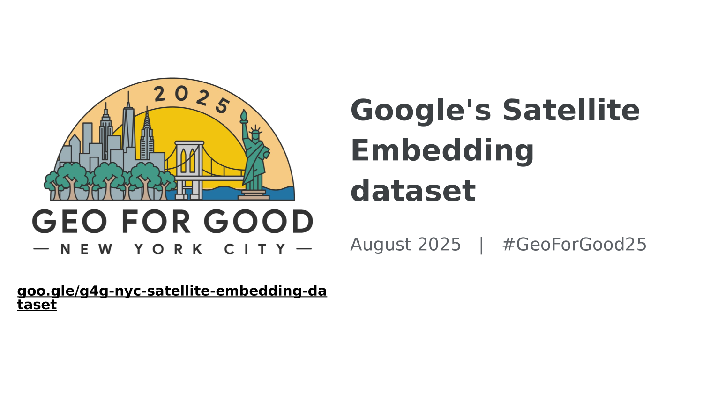
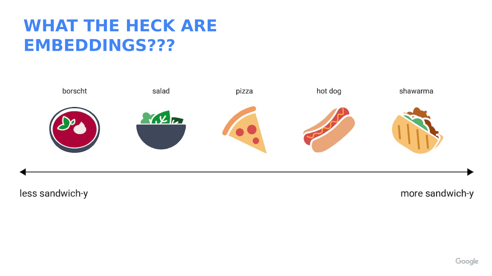
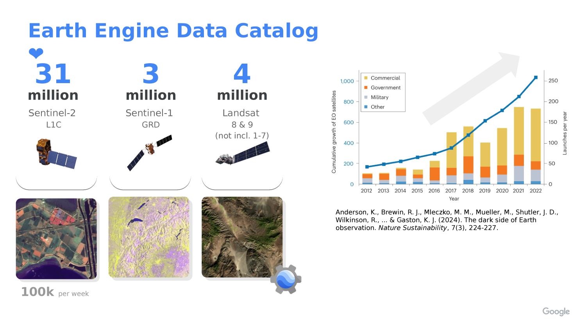
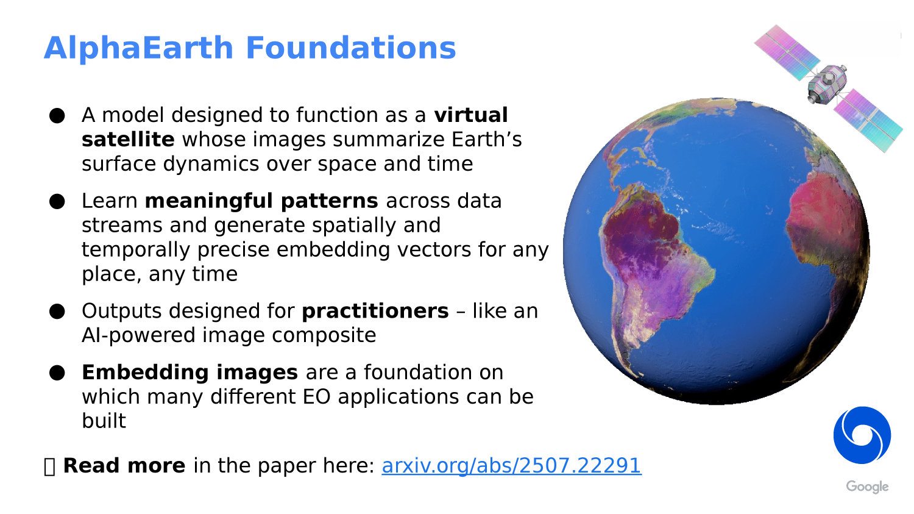
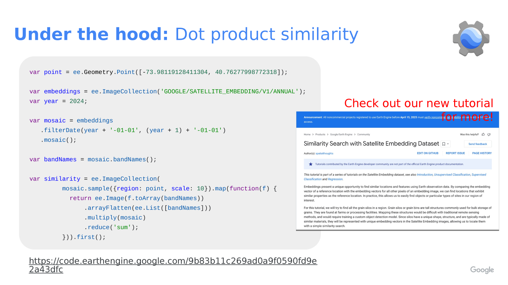

# The AlphaEarth Embedding Database in Google Earth Engine

> **Attribution note:** This lab is adapted from the course slide deck `alphaearth.html`, which explains AlphaEarth Foundations, embeddings, and the Google Earth Engine embedding collection.



## What You Should Understand

This lab introduces one of the most interesting ideas in modern spatial analysis: an embedding is a learned feature vector, not a raw measurement.

By the end of this lab, you should understand that:

1. The AlphaEarth dataset stores each location as a 64-band embedding image.
2. Each band is one axis in a 64-dimensional feature space.
3. Similar places have embeddings that point in similar directions.
4. A dot product can be used to measure similarity between one reference location and many other pixels.
5. The Earth Engine embedding collection is already analysis-ready, so you can use it like any other image collection.

> **Concept Note:**
> An embedding is a compact numeric summary of a place. It is not the same as a satellite band like red, near-infrared, or temperature. Instead, it is a learned description built from many kinds of input data.



> **Concept Note:**
> The AlphaEarth Embedding dataset was created by AlphaEarth Foundations using a very large multimodal training set. According to the course slide deck, the model was trained on more than 3 billion image frames from about 5 million sites worldwide, with two time periods per site for about 10 million total training videos.

> **Concept Note:**
> The slide deck also explains that the training data included many different inputs, such as Sentinel-2, Landsat, Sentinel-1, ALOS PALSAR, elevation, GEDI, ERA5-Land, GRACE, NLCD, Wikipedia text linked to GBIF records, and CDL. The goal was to learn a general representation of Earth surface conditions from many data sources.



## Getting Ready

Open a new script in the Earth Engine Code Editor:

- [Earth Engine Code Editor](https://code.earthengine.google.com/)

In this lab you will:

1. Load the annual AlphaEarth embedding collection.
2. Choose one reference point.
3. Extract the embedding vector at that point.
4. Compare that vector to every other pixel in the annual mosaic.
5. Display the similarity map.

The code below uses an example location near Stanford, but you can replace the coordinates with any place you want to study.

> **Concept Note:**
> The AlphaEarth dataset is already organized as an annual image collection. That means you do not need to preprocess raw imagery first. You can treat it like a normal Earth Engine collection and focus on the analysis question.

## Why Embeddings Matter

Embeddings are useful because they turn many complicated inputs into a smaller set of numbers that still preserve useful pattern information.

The slide deck describes AlphaEarth Foundations as a kind of assimilation and featurization system. That means it combines spatial and temporal context to produce a summary of surface conditions over time.

The model uses:

1. A spatial field of view of about 1.28 by 1.28 kilometers.
2. A full year of imagery to summarize each output period.
3. Attention and convolutional processing to blend context into the final embedding.

That helps the model produce an annual embedding image that captures both location and seasonal behavior.



> **Concept Note:**
> Because embeddings are learned features, the meaning of each band is not something like “red reflectance” or “soil moisture.” The bands only make sense as a vector together.

> **Concept Note:**
> In this lab, the dot product is acting like a similarity score. Since the embeddings are unit-length, values closer to `1` mean the vectors are more aligned, values near `0` mean they are more unrelated, and values below `0` point in opposite directions.



## Step 1: Choose a Reference Location

Start by defining the place you want to use as your reference point.

```javascript
// STEP 1: Choose a place to compare against the rest of the dataset.
// This example point is near Stanford, but you can change the coordinates later.
var queryPoint = ee.Geometry.Point([-122.1871905211044, 37.420953782194104]);

// STEP 2: Pick the year you want to study.
// The AlphaEarth embedding collection is annual, so changing this number changes the year.
var year = 2024;

// STEP 3: Center the map on the point so the study location is easy to find.
Map.centerObject(queryPoint, 11);
Map.addLayer(queryPoint, {color: 'black'}, 'query point');
Map.setOptions('SATELLITE');
```

> **Concept Note:**
> We begin with one reference point because similarity is easiest to understand when you compare one place to many places.

## Step 2: Load the Annual Embedding Collection

Now load the annual AlphaEarth embedding collection and build a one-year mosaic.

```javascript
// STEP 4: Load the AlphaEarth annual embedding image collection.
// Each image in this collection represents one year of learned embeddings.
var embeddings = ee.ImageCollection('GOOGLE/SATELLITE_EMBEDDING/V1/ANNUAL');

// STEP 5: Filter the collection to the year we want and combine it into one image.
// `mosaic()` merges the yearly tiles into a single image for the study year.
var mosaic = embeddings
  .filterDate(year + '-01-01', (year + 1) + '-01-01')
  .mosaic();

// STEP 6: Save the band names so we can reuse them in the vector math below.
// AlphaEarth embeddings have 64 bands.
var bandNames = mosaic.bandNames();

// STEP 7: Print the band names and count so students can confirm the structure.
print('Embedding band names', bandNames);
print('Number of embedding bands', bandNames.length());
```

> **Concept Note:**
> The slide deck describes the Earth Engine AlphaEarth collection as an analysis-ready dataset with annual, 10-meter embeddings and over 1.4 trillion embeddings per year. In practice, that means you can use the collection directly in Earth Engine without building the embeddings yourself.

## Step 3: Sample the Reference Embedding Vector

Next we pull out the 64-band embedding vector for the reference point.

```javascript
// STEP 8: Sample the embedding image at the reference point.
// This gives us the 64 numbers that describe the location in embedding space.
var queryFeature = ee.Feature(
  mosaic.sample({
    region: queryPoint,
    scale: 10,
    numPixels: 1,
    geometries: true
  }).first()
);

// STEP 9: Convert the sampled feature properties into a 64-band constant image.
// Each band in the new image holds one value from the reference embedding vector.
var queryVector = ee.Image.constant(
  bandNames.map(function(bandName) {
    // Look up the sampled value for one embedding band.
    return ee.Number(queryFeature.get(ee.String(bandName)));
  })
).rename(bandNames);

// STEP 10: Display the reference vector values in the console for inspection.
print('Reference embedding vector', queryFeature);
```

> **Concept Note:**
> We convert the sampled feature into an image because Earth Engine image math works well when both inputs have the same band structure.

## Step 4: Compute Similarity With a Dot Product

The dot product compares the reference embedding to every other embedding in the mosaic.

```javascript
// STEP 11: Multiply the reference vector by every pixel in the annual mosaic.
// Then sum across all 64 bands to get a single similarity score per pixel.
var similarity = mosaic.multiply(queryVector)
  .reduce(ee.Reducer.sum())
  .rename('similarity');

// STEP 12: Display the similarity map.
// Values closer to 1 mean the pixels are more like the reference location.
Map.addLayer(
  similarity,
  {palette: ['000004', '2C105C', '711F81', 'B63679', 'EE605E', 'FDAE78', 'FCFDBF', 'FFFFFF'], min: -1, max: 1},
  'similarity'
);
```

> **Concept Note:**
> Because the embeddings are unit-length, the dot product behaves like cosine similarity. That is why we can treat the result as a “how similar is this place?” map.

## Step 5: Highlight Highly Similar Locations

Sometimes it helps to convert the similarity map into a simple yes/no mask.

```javascript
// STEP 13: Choose a similarity threshold.
// Pixels above this value will be treated as strongly similar to the reference point.
var threshold = 0.85;

// STEP 14: Turn the similarity image into a binary mask.
// `gte()` means "greater than or equal to".
var similarityMask = similarity.gte(threshold);

// STEP 15: Display only the pixels above the threshold.
// `selfMask()` hides the zero values so the map is easier to read.
Map.addLayer(
  similarityMask.selfMask(),
  {palette: ['red']},
  'similarity above threshold'
);
```

> **Concept Note:**
> Thresholding is a teaching choice, not a universal rule. A different threshold will show a different set of “similar” places.

## Step 6: Try a Different Point

One of the best ways to learn from embeddings is to compare more than one place.

```javascript
// STEP 16: Optional second point for experimentation.
// Change this location to see how a different reference place changes the output.
var secondPoint = ee.Geometry.Point([-121.0028491471539, 37.613864769234134]);

// STEP 17: Draw the second point so it is easy to see on the map.
Map.addLayer(secondPoint, {color: 'yellow'}, 'second point');
```

> **Concept Note:**
> If you choose a new reference point, the similarity map will change because the comparison vector is different. That is the main idea behind embedding search.

## What This Teaches

This lab teaches a general pattern you can reuse in other Earth Engine projects:

1. Choose a reference location.
2. Load an analysis-ready image collection.
3. Sample a feature vector from one location.
4. Compare that vector to many other pixels with a vector operation.
5. Turn the result into a map you can interpret visually.

The main takeaway is that embeddings let you search for places that “feel” similar across many data sources, even when the raw inputs are very complex.
