# [DRAFT] Hands-on with the Unified GDAL CLI and GDALG Pipelines

> **Draft status:** This lab is actively being converted from the classic GDAL/OGR command set to the newer unified `gdal` CLI. Some examples still show the old workflow as a reference point while the new screenshots and command patterns are added.

For a good overview of why the unified CLI matters, see Kablamo’s write-up: [*GDAL Evolved - A guide to the new unified CLI*](https://engineering.kablamo.com.au/posts/gdal-evolved/).

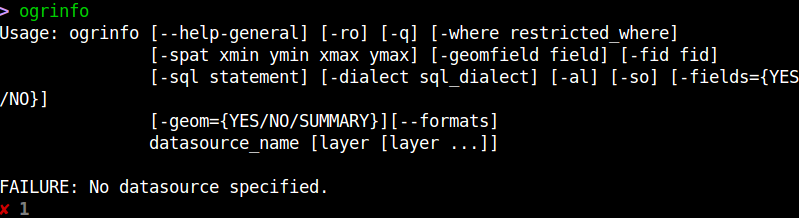

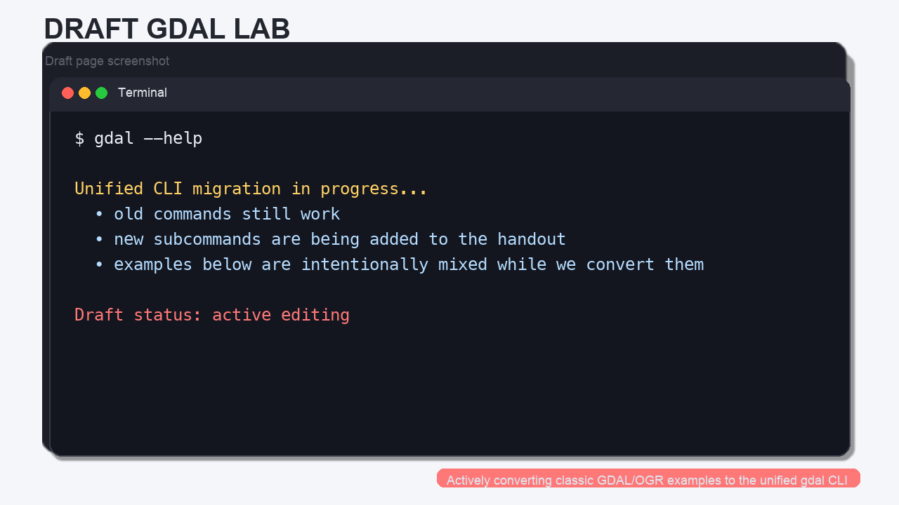

## What Changed in Modern GDAL?

The old workflow used separate top-level tools such as `ogrinfo`, `gdalinfo`, `ogr2ogr`, `gdal_translate`, and `gdalwarp`. Those commands still exist, but the newer GDAL line is built around a single `gdal` entry point with raster and vector subcommands.

That means you can now think in a more consistent way:


| Older command    | Modern`gdal` equivalent |
| ------------------ | ------------------------- |
| `ogrinfo`        | `gdal vector info`      |
| `gdalinfo`       | `gdal raster info`      |
| `ogr2ogr`        | `gdal vector convert`   |
| `gdal_translate` | `gdal raster convert`   |
| `gdalwarp`       | `gdal raster reproject` |

> **Concept note:** the new CLI is still evolving, so if a subcommand behaves differently than you expect, check `--help` and the current GDAL documentation.

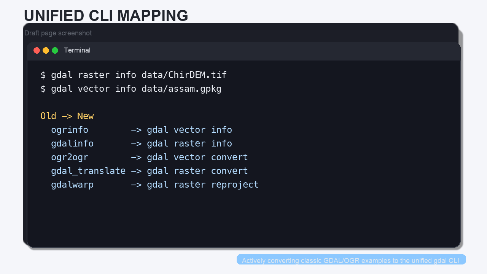

The biggest new idea for this lab is the **pipeline** model:

- `gdal vector pipeline` chains vector steps.
- `gdal raster pipeline` chains raster steps.
- Both can be serialized as a `.gdalg.json` file so the workflow can be reopened later like a dataset.

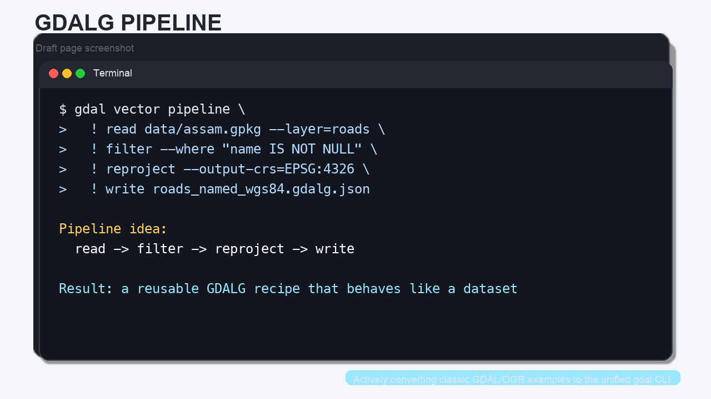

## Meet the Data

The original workshop used Austin-area demo data to teach the concepts visually.
We will keep those images in the lab as teaching aids, but the hands-on commands below use local datasets that already live in this repository:

- [`data/assam.gpkg`](../data/assam.gpkg) — a GeoPackage with multiple vector layers
- [`data/ChirDEM.tif`](../data/ChirDEM.tif) — a GeoTIFF DEM

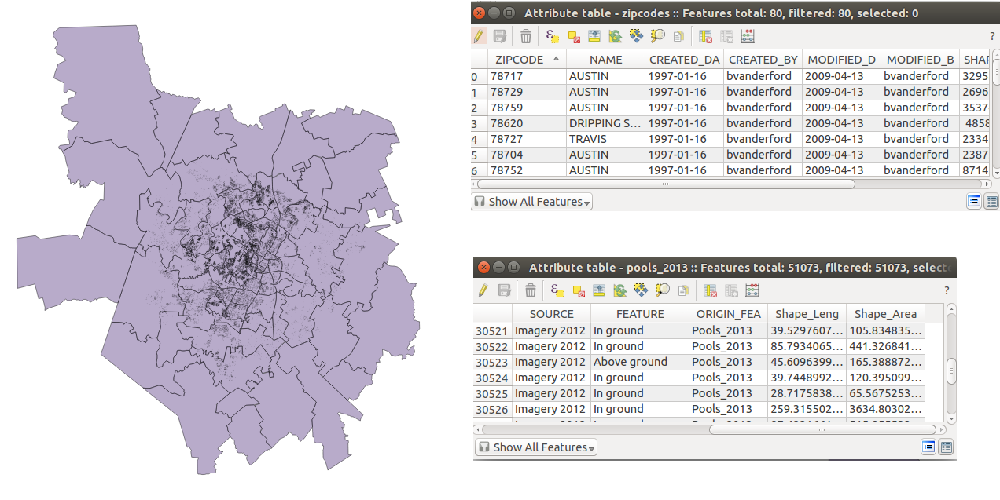

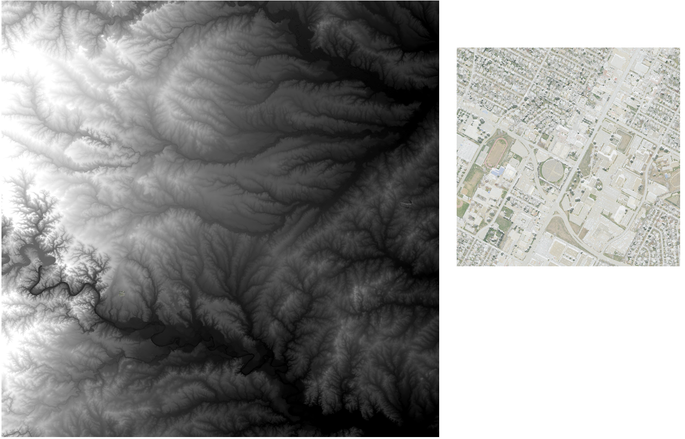

## Step 1: Inspect the Data

The first thing to learn is how to ask GDAL what it is looking at.

```bash
# Vector metadata: layers, feature counts, geometry types, and fields.
gdal vector info data/assam.gpkg

# Raster metadata: size, CRS, bands, and raster statistics.
gdal raster info data/ChirDEM.tif
```

> **Concept note:** in the old workshop, `ogrinfo` and `gdalinfo` were the first commands students learned. The modern `gdal vector info` and `gdal raster info` commands do the same kind of discovery, but the command family is clearer.

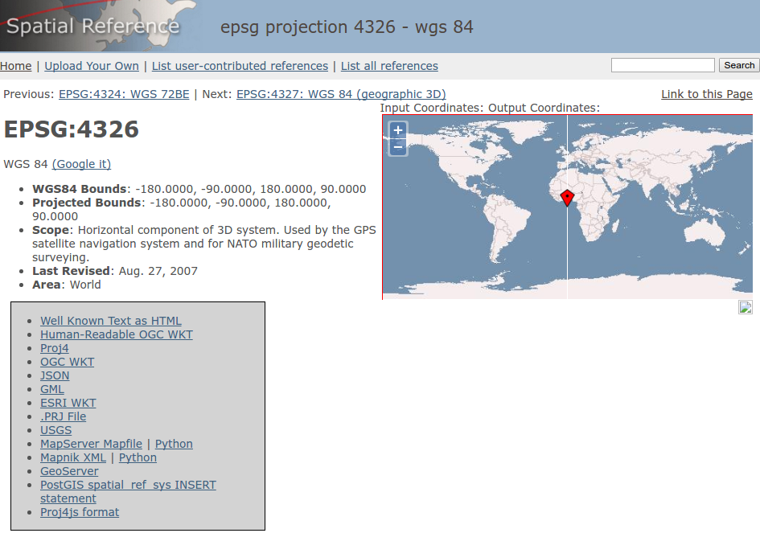

When you inspect the GeoPackage, notice that it contains multiple layers. In this lab, the most useful ones are:

- `boundary`
- `roads`
- `protected_regions`
- `water_polygons`
- `water_polylines`

When you inspect the DEM, note the raster size and the projected coordinate system. That projection matters when you later convert, scale, or reproject the raster.

## Step 2: Select, Filter, and Convert Vector Data

One of the most useful things GDAL can do is move a layer into a more convenient format.

### 2a. Select a Smaller Set of Fields

Sometimes you do not want every attribute column.

```bash
# Keep only the fields you care about from the roads layer.
gdal vector select data/assam.gpkg assam_roads_subset.gpkg name,fclass \
  --input-layer roads \
  --overwrite
```

This is the modern equivalent of the old “copy the layer, but with fewer fields” workflow.

### 2b. Filter Features

```bash
# Keep only roads that already have a name.
gdal vector filter data/assam.gpkg assam_named_roads.gpkg \
  --input-layer roads \
  --where "name IS NOT NULL" \
  --overwrite
```

That is a very common preprocessing step before sharing a layer or building a pipeline.

### 2c. Convert to GeoJSON

```bash
# Convert one layer from the GeoPackage to GeoJSON.
gdal vector convert data/assam.gpkg assam_roads.geojson \
  --input-layer roads \
  --format=GeoJSON \
  --overwrite
```

The original workshop used a shapefile-to-GeoJSON example to show how quickly GDAL can change formats. The command above is the same idea, just using the modern CLI.

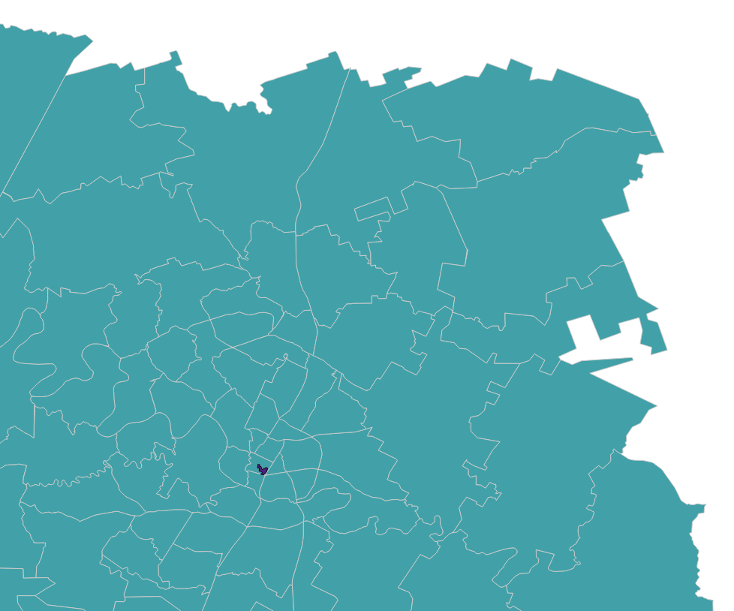

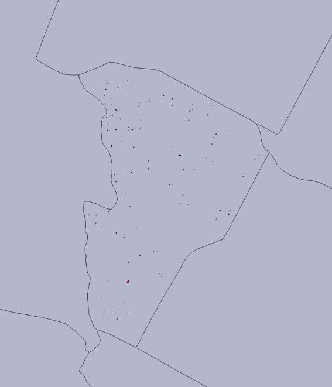

> **Concept note:** converting a dataset is often the first step in making it easier to inspect, share, or publish. A “modern” vector workflow often starts with `select`, `filter`, or `convert`, not with a desktop GIS.

## Step 3: Convert and Reproject Raster Data

The raster side of the house follows the same pattern.

### 3a. Make a Cloud-Friendly Copy

```bash
# Make a modern GeoTIFF-derived output (COG) from the DEM.
gdal raster convert data/ChirDEM.tif chir_dem_cog.tif \
  --format=COG \
  --co COMPRESS=LZW \
  --overwrite
```

### 3b. Reproject the Raster

```bash
# Reproject the DEM to WGS84.
gdal raster reproject data/ChirDEM.tif chir_dem_wgs84.tif \
  --output-crs=EPSG:4326 \
  --overwrite
```

The older workshop used `gdalwarp -t_srs EPSG:4326 ...` for this same job. The new command makes the purpose clearer: **reproject a raster dataset**.

### 3c. Make a Simple Display Version

```bash
# Scale floating-point elevation values to a Byte preview.
gdal raster scale data/ChirDEM.tif chir_dem_preview.tif \
  --datatype=Byte \
  --input-min=1261.1 \
  --input-max=2779.6 \
  --output-min=0 \
  --output-max=255 \
  --overwrite
```

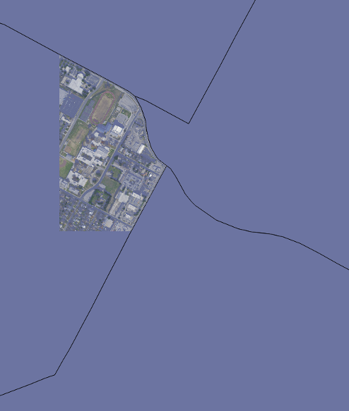

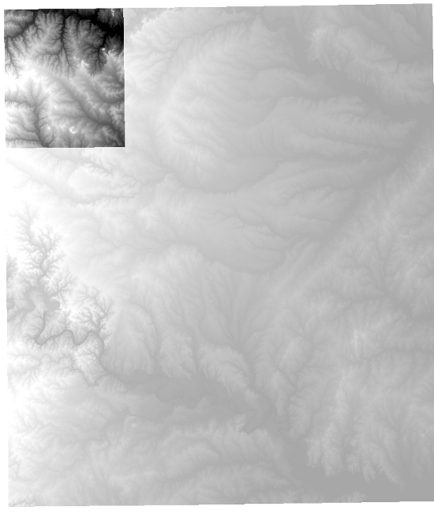

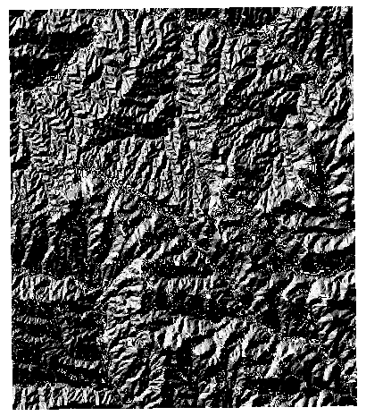

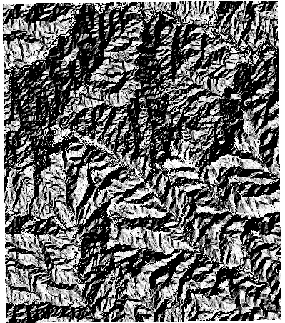

> **Concept note:** the old workshop moved from “data inspection” to “data conversion” and then to “reprojection.” That sequence still makes sense, but the modern `gdal` command family makes it easier to remember which commands belong to raster work and which belong to vector work.

## Step 4: Build a Vector Pipeline

Pipelines are the newest part of the workflow. Instead of running one command, saving the output, and then running the next command, you chain steps together.

```bash
# A vector pipeline that:
# 1. reads the GeoPackage
# 2. keeps only named roads
# 3. reprojects them to WGS84
# 4. writes a GDALG recipe that can be reopened later
gdal vector pipeline \
  ! read data/assam.gpkg --layer=roads \
  ! filter --where "name IS NOT NULL" \
  ! reproject --output-crs=EPSG:4326 \
  ! write roads_named_wgs84.gdalg.json \
  --overwrite
```

What this does:

1. `read` opens the input dataset.
2. `filter` removes features that do not match the condition.
3. `reproject` changes the coordinate reference system.
4. `write` stores the pipeline as a reusable GDALG file.

You can now treat `roads_named_wgs84.gdalg.json` like a dataset:

```bash
# The GDALG file can be opened later just like any other vector dataset.
gdal vector info roads_named_wgs84.gdalg.json
```

> **Concept note:** a GDALG file is not just an output file. It is a serialized recipe for how to produce or stream a dataset on demand.

## Step 5: Build a Raster Pipeline

Raster pipelines work the same way.

```bash
# A raster pipeline that:
# 1. reads the DEM
# 2. reprojects it to WGS84
# 3. writes a GDALG recipe
gdal raster pipeline \
  ! read data/ChirDEM.tif \
  ! reproject --output-crs=EPSG:4326 \
  ! write chir_dem_wgs84.gdalg.json \
  --overwrite
```

If you want to use the streamed dataset later, just point another GDAL command at the `.gdalg.json` file:

```bash
# Open the streamed dataset through the GDALG driver.
gdal raster info chir_dem_wgs84.gdalg.json
```

> **Concept note:** the GDALG driver makes a pipeline behave like a regular input dataset. That is the key idea behind “pipeline as a reusable product.”

## Step 6: Connect the Modern CLI to the Old Workshop Mental Model

The original workshop taught a very practical sequence:

1. inspect data
2. convert data
3. reproject data
4. combine steps into repeatable workflows

That sequence still applies. The main change is that the modern `gdal` command family makes the steps easier to organize and the pipelines easier to reuse.

If you remember only a few things from this lab, remember these:

- `gdal vector info` and `gdal raster info` are your first stop.
- `gdal vector convert` and `gdal raster convert` replace most “copy/translate” tasks.
- `gdal vector reproject` and `gdal raster reproject` are the modern CRS tools.
- `gdal vector pipeline` and `gdal raster pipeline` let you chain those steps.
- `.gdalg.json` files let you save a workflow as a reusable recipe.
